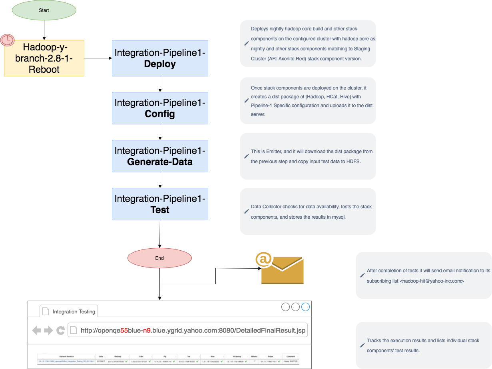
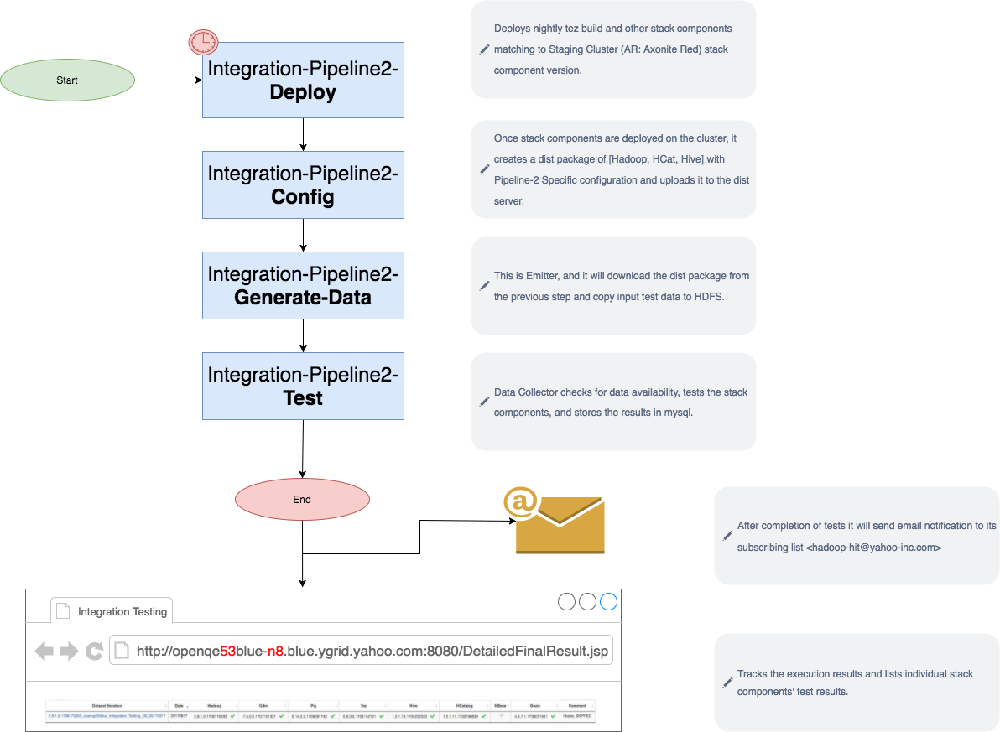
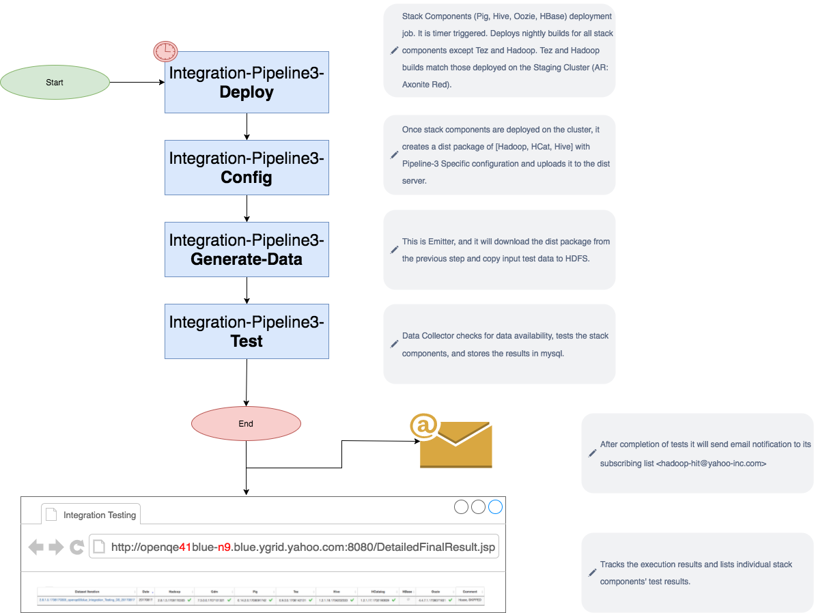

# Create/ update diagrams

These diagrams are currently used at [Integration Testing [2017]](https://yahoo.jiveon.com/docs/DOC-140642) on yahoo.jiveon.com community.

## Tool for building diagrams

Use [draw.io](https://www.draw.io/) - a free tool. Use it offline on -
- Chrome Browser using [Draw.io Desktop](https://chrome.google.com/webstore/detail/drawio-desktop/pebppomjfocnoigkeepgbmcifnnlndla) plugin, or 
- Download it from [download.draw.io](https://download.draw.io/) for your PC or phone. 

## Update existing diagrams
- Launch the app
- Choose "Open Existing Diagram >" or "File > Open >"
- Select the xml file you want to edit.
- After editing, save the xml file
- Export the PNG image of the existing diagram (File > Export as > PNG)

## Source reporsitory

See code for integration tests on [git.corp.yahoo.com/.../hadooptest/.../htf-common/src/test/java/.../stackIntegration](https://git.corp.yahoo.com/HadoopQE/hadooptest/tree/master/hadooptest/htf-common/src/test/java/hadooptest/gdm/regression/stackIntegration)

## Output Images
#### Pipeline 1 (Stack Components: Hadoop)

#### Pipeline 2 (Stack Components: Tez)

#### Pipeline 3 (Stack Components: Pig, Hive, Oozie, HBase)

