============
Architecture
============

In this chapter, we'll first look at the physical architecture of HBase and then 
examine the logical architecture and how it applies to the physical components.
Finally, we'll discuss in more detail HBase's data model and storage mechanism.

Physical
========

Components
----------

Before we look at the larger picture of the HBase architecture, let's first provide an
overview of the main components of HBase:

- **HDFS** - the Hadoop file system that is used for data storage.
- **RegionServer** - t is responsible for serving and managing regions. 
- **Zookeeper** - manages the distributed coordination service. This includes tracking of 
  region servers, where the root region is hosted, and more. Notifies the master and
  region servers when changes occur.
- **Master** - is responsible for handling load balancing of regions 
  across region servers, to unload busy servers, and move regions to less occupied ones. 
  The master is not part of the actual data storage or retrieval path. It negotiates load 
  balancing and maintains the state of the cluster, but never provides any data services 
  to either the region servers or the clients, and is therefore lightly loaded in practice. 
  In addition, it takes care of schema changes and other metadata operations, such as 
  creation of tables and column families.

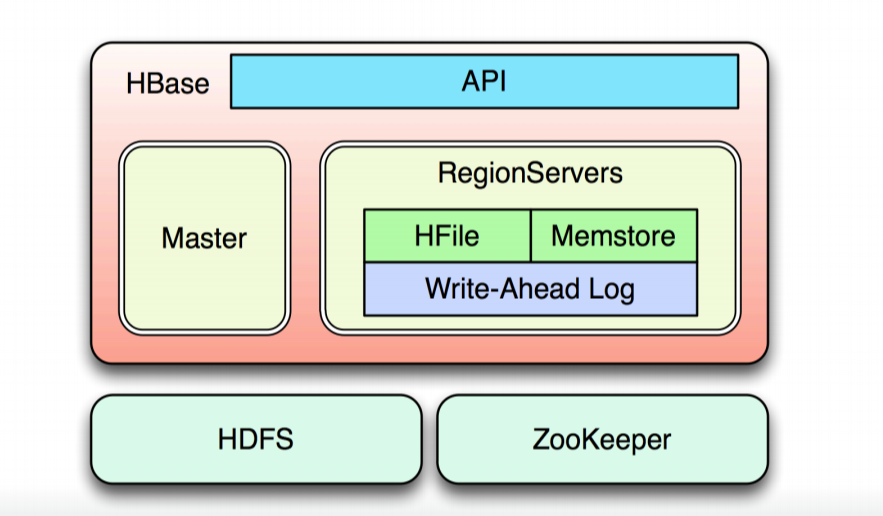

Cluster Members
---------------

The diagram **HBase Cluster Members** below provides a general view of how the the Regionservers
are using HDFS to store data, report back to the Master, and how the Zookeeper manages
the coordination of the distributed clusters. The diagram also shows that the Master 
gets updates from the Zookeeper cluster.

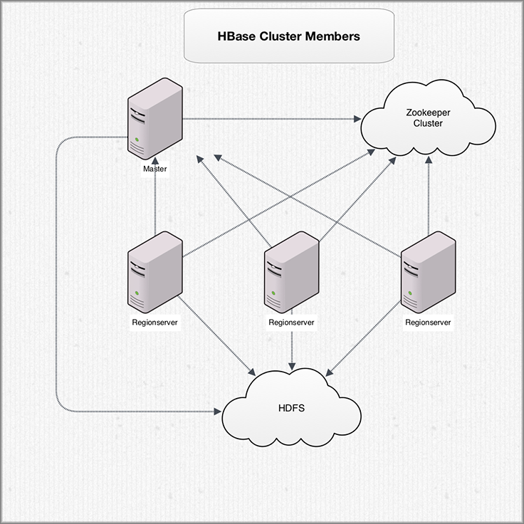

..  RegionServers collocate with the HDFS DataNodes. This enables data locality 
    for the data served by the RegionServers, at least in the common case. Region assignment, 
    DDL operations, and other book-keeping facilities are handled by the HBase Master process. 
    It uses Zookeeper to maintain live cluster state. When accessing data, clients communicate 
    with HBase RegionServers directly. That way, Zookeeper and the Master process don’t 
    bottle-neck data throughput. No persistent state lives in Zookeeper or the Master. 
    HBase is designed to recover from complete failure entirely from data persisted durably to 
    HDFS. Any questions so far?

Distribution and Data Path
--------------------------

We've looked at the components of HBase and have a general idea of how data is stored and
the distributed clusters are managed, but we have omitted an important aspect in the
first diagram: HBase clients.

From the diagram below, you can see that HBase clients communicate with the Region Servers, 
but you also see a couple of new lower-level components that play an important role
in the distribution of data. In a distributed cluster, a RegionServer runs on **Data Nodes**,
which are responsible for storing HDFS blocks. The **Name Node** is responsible for 
maintaining the filesystem metadata.

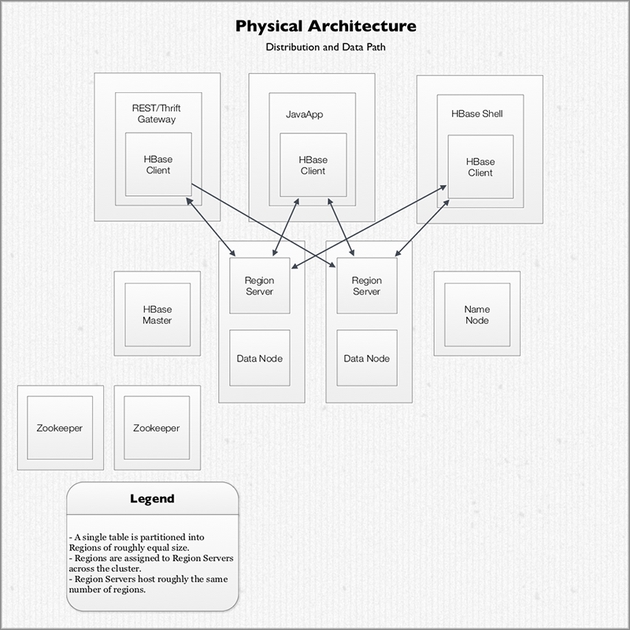

What the diagram doesn't show is the master-slave relationship between the components and
servers. In HBase, the masters are the HDFS NameNode and the HBase Master, and the slaves 
are HDFS Data Nodes and HBase RegionServers. 

Filesystems
-----------

The most common (and default) filesystem used with HBase is HDFS, but you are not locked 
into HDFS because HBase has a pluggable architecture, so you can replace HDFS with any 
other supported system. In fact, you could go as far as implementing your own 
filesystem—-maybe even on top of another database. 

The diagram below shows the Region Servers using three different types of file types and
how HDFS is accessed through a DataNode to fetch data from disk.

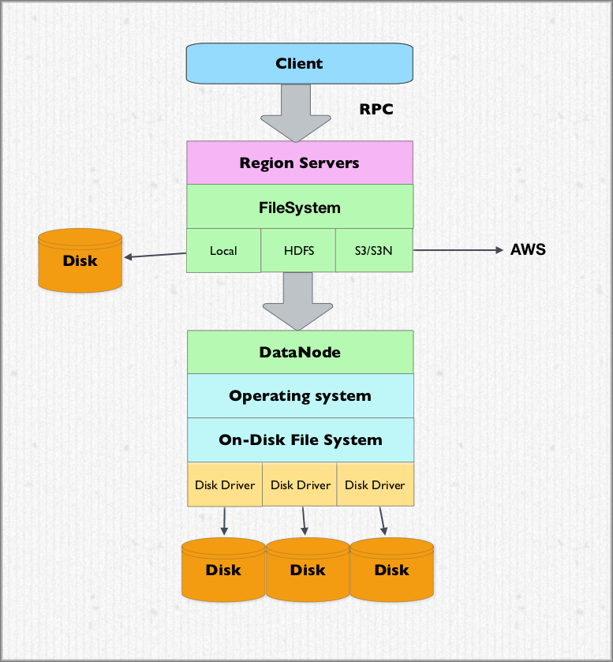

Accessing Filesystems
#####################

To access filesystems, you use a URI scheme-like syntax, where the scheme is the filesystem.
For example, to access the HDFS, the local filesystem, or Amazon's Simple Storage Service (S3),
you would use the following:

- ``hdfs://<name-node>:<port>/<path>``
- ``file:///<path>``
- ``s3://<bucket-name>`` || ``s3n://<bucket-name>``

Storage Mechanism
=================

Overview
--------

We're now going to discuss how data is actually accessed from and written to storage. 
It is important to know that storage in HBase comes in two forms: write-ahead logs (WAL)
and HFiles for storage. The files are primarily handled 
by the HRegionServers. In certain cases, the HMaster will also have to perform low-level 
file operations. You may also notice that the actual files are divided into blocks when 
stored within HDFS. This is also one of the areas where you can configure the system to 
handle larger or smaller data records better. More on that in HFile Format later.

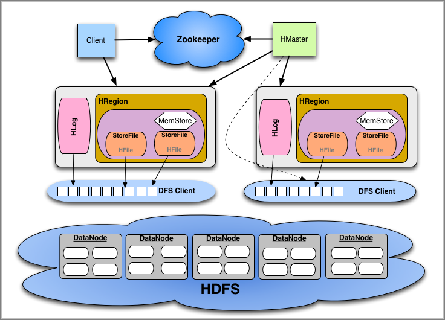

In the diagram below, you once again see the Region Server that we've been discussing, but 
this time, we're looking at what is contained in the Region Server. The Region Server
contains multiple HRegion or regions, a WAL (HLog), and a BlockCache. HStore or store
holds the MemStore and the HFile. The MemStore acts as a buffer for 

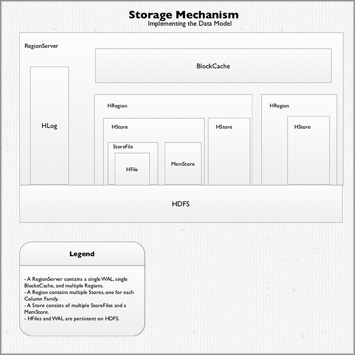

Reading Data
------------

The general flow of when a client attempts to fetch data is to first contact the 
ZooKeeper ensemble (a separate cluster of ZooKeeper nodes) to get the server name
(i.e., hostname) that hosts the ``-ROOT-`` region. With this information, the client
can then query the region server to get the server name that hosts the ``.META.`` table
that contains the requested row key. Once the client gets the name of the ``.META.`` 
server, it can then retrieve the server name that has the region containing the row key. 
The client caches this information as well and contacts the HRegionServer hosting that 
region directly. Through this process, the client learns where to get rows without needing 
to query the .META. server again. 

The diagram below illustrates the process we just covered from the client contacting
the Zookeeper Ensemble to the last step of caching the location of the server with the 
requested row keys.

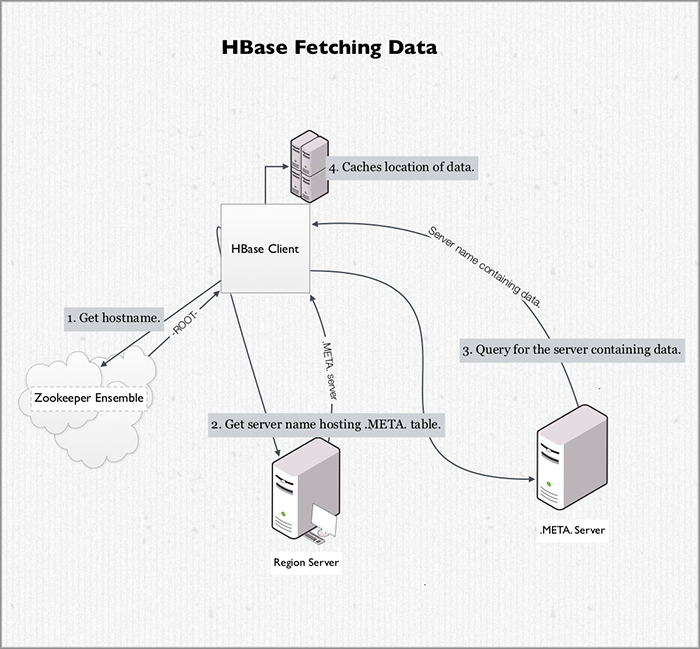

Write-Ahead Log (WAL)
---------------------

The region servers store data in memory until enough is collected to warrant a flush to 
disk to avoid creating too many very small files. While residing in memory, the data
is volatile, meaning it could be lost if the server loses power. This is 
a likely occurrence when operating at large scale. To solve this issue, HBase uses 
write-ahead logging, so each update (also called an “edit”) is written to a log, and only 
if the update has succeeded is the client informed that the operation has succeeded. The 
server then has the liberty to batch or aggregate the data in memory as needed.

Writing Data
------------

To write data, the client issues an write request (``HTable.put(Put)``) to the 
HRegionServer. The HRegionServer sends the the details to the matching HRegion instance.
Data is first written to the WAL (using the HLog class). After the data is
written to the WALL, the data is placed into the MemStore. When the MemStore is full,
the data is flushed to disk. The HRegionServer writes the data to a new HFile located
in HDFS. The HRegionServer also caches the last written sequence number to keep track
of what is persistent. 

The diagram below shows the steps taken when writing data. As discussed, the data
is written to the WAL and stored in the MemStore before being written to file.

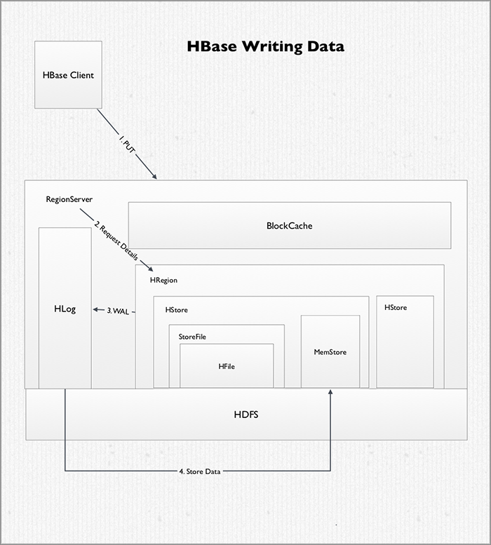

HFile
------

HFile lies at the lowest level of HBase's architecture.The actual storage files are 
implemented by the `HFile class <http://hbase.apache.org/apidocs/org/apache/hadoop/hbase/io/hfile/HFile.html>`_, 
which was specifically created to store HBase’s data efficiently. They are based on Hadoop’s 
`TFile class <http://hadoop.apache.org/docs/current/api/org/apache/hadoop/io/file/tfile/TFile.html>`_
and mimic the SSTable format used in Google’s Bigtable architecture. 

The files contain a variable number of blocks, where the only fixed ones are the file 
info and trailer blocks as shown in the diagram below. The trailer has the pointers to the 
other blocks and is written after the data has been persisted to the file, finalizing the 
now immutable data store. The index blocks record the offsets of the data and meta blocks. 
Both the data and the meta blocks are actually optional. But considering how HBase uses 
the data files, you will almost always find at least data blocks in the store files.

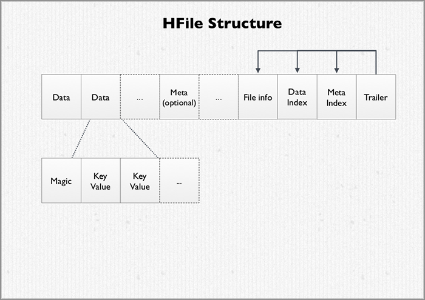

HBase has a configurable root directory in the HDFS but the default is ``/hbase``. You 
can simply use the DFS tool of the Hadoop command-line tool to look at the various files 
HBase stores.

Logical
=======

Overview
--------

In the logical architecture exposed by HBase, data stored in a table (*BigTable*) is located 
by its *rowkey*. The rowkey is like a primary key from a relational database. Records in HBase 
are stored in sorted order according to rowkey. This is a fundamental tenant of HBase and 
is also a critical semantic used in HBase schema design. The HBase schema is designed 
to optimize the use of rowkeys.

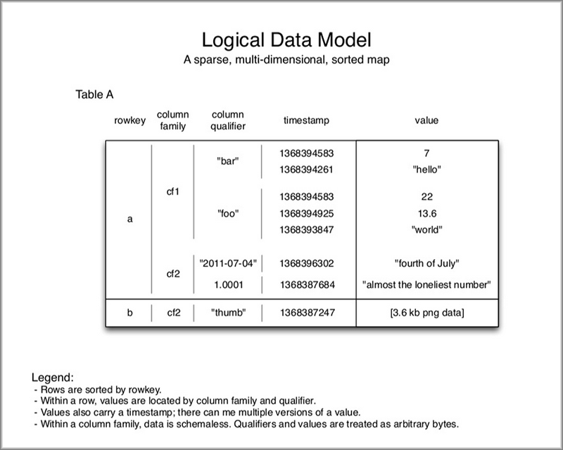

We've looked at Regions and RegionServers as components of the physical architecture
of HBase earlier, but now let's turn our attention to how data (rows in a table) is 
logically structured and distributed in these components. As you can see from the diagram 
below, rows of the tables are divided into Regions. These Regions are then assigned to 
the worker machines in the RegionServers (cluster). 

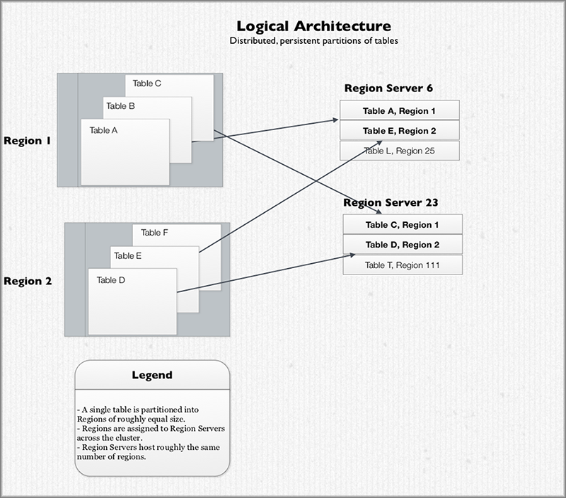

The assignment and distribution of Regions to RegionServers is automatic. You can
manually manage Regions--HBase will let you do that--but this is not common. When data is 
inserted into a Region and the Region’s size reaches a threshold, the Region is split 
along a rowkey boundary into two child Regions. Rows are never divided 
and a Region always hosts an entire row. 

Tables
------

As we've seen, tables are divided across Regions. It's also important to understand the 
differences between HBase tables and relational tables. HBase provides no indices over 
arbitrary columns, no joins, and no multi-row transactions. Moreover, If you want to query 
for a row based on it’s column value, you’d better maintain a secondary index for that
or be prepared for a full table scan.

HBase is "column family oriented." Data is stored physically into column family groups,
so key-values for a given column family are stored together in the same set of 
files. This is not the same as a columnar database, so don’t let the similar names confuse 
you.

Notice in the diagram below that each row is basically a linked list, ordered by column 
family and then column name. This is also how the data is stored on disk. The missing columns 
for a row are free because no space on disk is pre-allocated to a null column. This is 
why it's reasonable to have rows have hundreds or thousands of columns in HBase tables.

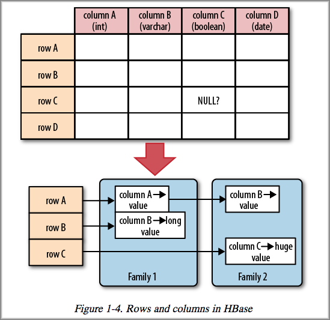

.. Storage Mechanism
.. -----------------

   RegionServers encapsulate the storage machinery in HBase. As you saw in the architectural 
   diagram, they’re collocated with the HDFS DataNode for data locality. Every RegionServer 
   has two components shared across all contained Regions: the HLog and the BlockCache. 
   HLog, also called the Write-ahead log, or WAL, is what provides HBase with data durability 
   in the face of failure. Every write to HBase is recorded in the HLog, written to HDFS. 
   The BlockCache is the portion of memory where HBase caches data read off of disk between 
   reads. It’s also a major source of operational headache for HBase when configured to be 
   too large. If you hear about HBase GC configuration woes, they stem largely from this 
   component.

   As you saw earlier, RegionServers host multiple Regions. A Region consists of multiple 
   "Stores." Each Store is corresponds to a column family from the logical model. Remember 
   that business of HBase being a column family oriented database? These Stores provide that 
   physical isolation. A Store consists of multiple StoreFiles plus a MemStore. Data resident 
   on disk is managed by the StoreFiles and is maintained in the HFile format. The MemStore 
   accumulates edits and once filled is flushed to disk, creating new HFiles. An astute 
   observer will notice that this structure is basically a Log-Structured Merge Tree with the 
   MemStore acting as C0 and StoreFiles as C1.

   Okay, so now that we understand the essential data architecture, what does that tell us 
   about using HBase? For what kinds of workloads is HBase well suited? I’m going to dance 
   around this question a little bit and say “it depends on how you configure it.” In general 
   though, HBase is designed for large datasets, large enough to span multiple hundreds of 
   machines. The distributed architecture means it does well with lots of concurrent clients. 
   It’s key-value storage machinery make it decent for handling sparse datasets. The lack of 
   joins means it’s best for denormalized schema with loosely-coupled records.

.. [HBase for Architects Presentation] http://www.n10k.com/blog/hbase-for-architects/
