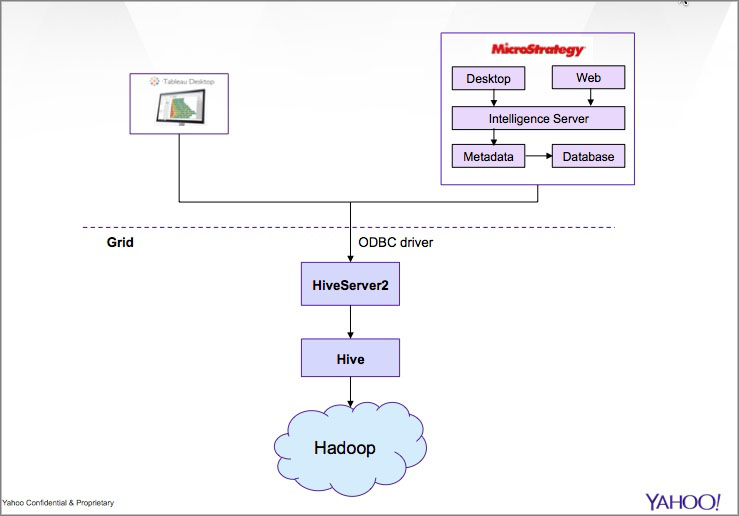

======================================
Business Intelligence (BI) / Analytics
======================================

.. _bi-overview:

Overview
========

You can use business intelligence (BI) and data analytics tools such as
`Tableau <http://www.tableausoftware.com/>`_ and `MicroStrategy <https://www.microstrategy.com/us/>`_ 
with data on Hadoop. These tools access grid data with Hive through
the `Hortonworks Hive ODBC driver <http://hortonworks.com/wp-content/uploads/2013/04/Hortonworks-Hive-ODBC-Driver-User-Guide.pdf>`_. 

For those who are not familiar with Tableau and MicroStrategy, please read the next section that
discusses the differences and strengths of each so you can use the tool that best meets your needs.
If you know which tool is right for you, continue to :ref:`Visualizing Data and Ad Hoc Reporting With Tableau <getting_started-tableau>` or :ref:`Standard Reporting With MicroStrategy <gs_bi-ms>`.

.. _bi_overview-components:

Grid Stack for BI
-----------------

The diagram below shows how client software such as MicroStrategy and Tableau use the
ODBC driver to communicate with HiveServer2, which in turn, forwards queries to Hive
that ultimately are executed as MapReduce functions on Hadoop. 

.. _bi-tableau_ms:

MicroStrategy Versus Tableau 
============================

The general rule is to use MicroStrategy for standardized reporting
or Tableau for visualizing data. The decision to use one over the 
other isn't quite that simple, but we hope you feel confident about making a decision after 
reading the strengths and weaknesses (from user feedback) of each listed below.

.. _tableau_ms-ms:

MicroStrategy
-------------

**Strengths**

- Great for reporting that has stabilized (not changing much over time).
- Drill-down/through is great for facilitating an interactive discussion with business leaders.
- Report-sharing helps keep the data on the back-end, reducing the emailing of large Excel files.
- Allows for programmatic usage through a Web service API.
- Supports standard reporting.
- Provides access through a Web interface.
- Developer suite for generating reports.
- The license is inexpensive, and Yahoo has six thousand developer licenses.

**Weaknesses**

- Requires greater technical knowledge, and the process of 
  creating a new view is clumsy and time-consuming.
- Provides no capability of combining grid data with data outside the grid.
- Learning to use MicroStrategy is more difficult.

.. _tableau_ms-tableau:

Tableau 
-------

**Strengths**

- Lets you quickly make sense of millions of rows of data through visualization. 
- Does an excellent job of recognizing facts and dimensions in de-normalized data files 
  (say CSV or Excel) as well as connecting to larger databases. 
- The learning curve is low, especially if you are comfortable 
  with Excel Pivot Tables or something similar.
- Allows for ad hoc reporting.

**Weaknesses**

- For broader enterprise needs, such as data security and segmentation, heavy duty 
  report customization, or data transformation, Tableau is a less comprehensive tool than 
  MicroStrategy. 
- The license for using Tableau is expensive.
- You can only use Tableau through the desktop application.

.. _bi-ms:

Standard Reporting With MicroStrategy
=====================================

**Audience:** Developers, Administrators, and Architects

The following shows you how to start using the MicroStrategy to access Yahoo grid data, either through
the Web interface or the `MicroStrategy Analytics Desktop <https://www.microstrategy.com/us/free/desktop>`_. 
Most people use the Web interface because it's accessible from any OS and no software 
installation is required. **Administrators** and **architects**, however, will need to use the 
MicroStrategy Analytics Desktop, which can be run locally or remotely.

The Web interface requires no installation and can be accessed from any OS. The
desktop software has more features, but requires `Windows 7 <http://windows.microsoft.com/en-us/windows7/products/system-requirements>`_ 
(Yahoo corporate Win7 64-bit image), installation of software, and making sure that the desktop 
version matches the version of the MicroStrategy Server.

.. _bi_ms-req_se:

Requesting a Service Engineer (SE) to Set Up the MicroStrategy Server
---------------------------------------------------------------------

Write to mstr-admin@yahoo-inc.com to get the MicroStrategy Server license and software.
The MicroStrategy Admininstration team will ask you for information about your request and 
then give you instructions as to the next steps after they have set up the MicroStrategy 
Server.

.. 

   - ACL to access data set on grid:
     - host
     - physical location
     - port 
   - Provide username/password
   - MicroStrategy Client Format Web interface, local desktop application, or remote desktop application
   - Specify the database that you want to access
   - (Optional) Specify the queue (cost center) used for your team.

.. _bi_ms-use:

.. TBD: Thiruvel is going to send me a link to the ODBC driver, review the documentation.
   
..

   The process of setting up the MicroStrategy Server is fairly complicated, so we 
   recommend working with a SE to help you. Once the MicroStrategy
   Server has been set up, the service engineer will provide you with a URI to the Web
   interface or for MicroStrategy Analytics Desktop to use.

..

   After your request is processed, the SEs will send you one of the following based
   on the format that you wanted:

   - URL to the MicroStrategy Web interface or the remote console
   - Link to the binary of the MicroStrategy Analytics Desktop to install locally. The installation
   comes with a script that will help you configure the application. 

   To learn how to use MicroStrategy, see the `MicroStrategy Analytics Desktop: User Guide <http://www.microstrategy.com/Strategy/media/downloads/free/analytics-desktop_user-guide.pdf>`_
   and the `MicroStrategy Suite: Quick Start Guide <https://www.microstrategy.com/Strategy/media/downloads/free/MicroStrategy-Suite-Quick-Start-Guide.pdf>`_.

.. _bi-setup_server:

Setting Up the MicroStrategy Server
===================================

**Audience:** Service Engineers

This following sections provide a general guideline for service engineers (SE) setting up 
MicroStrategy Server for users. 

We'll be going over the following:

- :ref:`Requirements <ms_setup_server-reqs>`
- :ref:`Get a Paranoid Review <ms_setup-paranoid>`
- :ref:`Configure Kerberos <gs_ms-setup-kerberos>`
- :ref:`Install/Configure the ODBC Driver <gs_ms-setup-odbc>`
- :ref:`Request Access to the Grid Cluster and HiveServer2 <gs_ms-setup-access>`
- :ref:`Install/Configure the MicroStrategy Server <gs_ms-install>`
 
.. note:: When you decide to use a different grid, you will again need to set up a 
          MicroStrategy Server that runs in the same colo has the grid instance.

.. _ms_setup_server-reqs: 

Requirements
------------

- Red Hat Enterprise Linux (RHEL) 6.4 or greater (64-bit) in the same colo.

.. _ms_setup-paranoid:

Get a Paranoid Review
---------------------

All data sets that will be accessed must be reviewed by a Paranoid.

To request a paranoid review:

#. Go to `yo/paranoidreview <http://twiki.corp.yahoo.com/view/Paranoidyahoos/SecurityRequest>`_.
#. From the **Security Request** page, select **Service->Project Support** and **Project Type->Product/Platform**.
#. Enter a project ID and a summary.
#. Click **Send to Bugzilla**. 

.. _ms-setup-kerberos:

Configure Kerberos
------------------
 
Users working with MicroStrategy from the Web interface or the desktop software 
authenticate with their username and password. The MicroStrategy Server, however,
requires  Kerberos to communicate with HiveServer2. To do this, a keytab representing
a UNIX headless user must be set up. The headless user will act as a proxy,
so that the MicroStrategy Server can then act on the user's behalf to access 
Hive through the HiveServer2.

#. You need to ensure that the Kerberos settings on the MicroStrategy Server are 
   identical to the settings on the requested cluster. Ideally, copy ``/etc/krb5.conf`` from 
   the appropriate cluster’s gateway to the MicroStrategy Server host.

#. Create a keytab for the Kerberos principal to be used by the MicroStrategy Server. 
   (File a ticket with SE on the ``BZ`` colo, if required.) 

#. Copy the keytab file to MicroStrategy Server host, and make it readable (only) 
   by the Unix-account that MicroStrategy Server will use.

#. Run ``kinit -kt <path_to_keytab> <MicroStrategy Server_principal>`` before connecting to 
   HiveServer2. If you want to keep the MicroStrategy Server running, you will need to run the
   command above in a cron job at least twice per day.

.. _ms-setup-odbc:

Install the ODBC Driver
-----------------------

Install the Hive ODBC Driver on the MicroStrategy Server using the instructions below.

#. Install the dependency ``cyrus-sasl``. (On a 32-bit machine one has to install 
   ``cyrus-sasl.i386`` with ``sudo yum install cyrus-sasl.i386``.)
#. Install the  yinst package for your environment. If your application is 32-bit, 
   you should install `hive_odbc_native_32 <http://dist.corp.yahoo.com/by-package/hive_odbc_native_32/>`_. 
   The driver for 64-bit is unavailable right now.
#. Add ``/home/y/lib/hive_odbc_native_32/Linux-i386-32`` (in case of 32-bit driver) to ``LD_LIBRARY_PATH``.
#. Once the driver is installed, you will need to configure it.

.. _ms_odbc-config:

Configure the ODBC Driver
#########################

#. In your home directly, create an ``.odbc.ini`` file with the following::

      [ODBC]
      - Specify any global ODBC configuration here such as ODBC tracing.
      
      [ODBC Data Sources]
      Sample Hive DSN 32=Hive ODBC Driver 32-bit
      
      [Sample Hive DSN 32]
      
      - Description: DSN Description.
      - This key is not necessary and is only to give a description of the data source.
      Description=Hive ODBC Driver (32-bit) DSN
      
      - Driver: The location where the ODBC driver is installed to.
      Driver=/home/y/lib/hive_odbc_native_32/Linux-i386-32/libhortonworkshiveodbc32.so
      
      - The DriverUnicodeEncoding setting is only used for SimbaDM
      - When set to 1, SimbaDM runs in UTF-16 mode.
      - When set to 2, SimbaDM runs in UTF-8 mode.
      -DriverUnicodeEncoding=2
      
      - Values for HOST, PORT, HS2HostFQDN, and HS2KrbServiceName should be set here.
      - They can also be specified on the connection string.
      - PORT information can be obtained from http://twiki.corp.yahoo.com/view/Grid/GridPortNumbers
      HOST=gsbl90047.blue.ygrid.yahoo.com
      PORT=50514
      Schema=default
      DefaultStringColumnLength=255
      RowsFetchedPerBlock=500
      FastSQLPrepare=0
      UseNativeQuery=0
      HiveServerType=2
      HS2AuthMech=1
      HS2HostFQDN=gsbl90047.blue.ygrid.yahoo.com
      HS2KrbServiceName=hive
      HS2KrbRealm=YGRID.YAHOO.COM

#. In your home directory, create a ``.hortonworks.hiveodbc.ini`` file with the content below.
   (Be sure to use the appropriate paths/host/principals for your environment.)

   .. code-block:: bash

      [Driver]

      -- - Note that this default DriverManagerEncoding of UTF-32 is for iODBC.
      -- - unixODBC uses UTF-16 by default.
      -- - If unixODBC was compiled with -DSQL_WCHART_CONVERT, then UTF-32 is the correct value.
      -- - SimbaDM can be used with UTF-8 or UTF-16.
      --   The DriverUnicodeEncoding setting will cause SimbaDM to run in UTF-8 when set to 2 or UTF-16 when set to 1.

      -- When using MicroStrategy, please set DriverManagerEncoding=UTF-8.
      -- Otherwise, string properties will not be reported correctly. (They will seem to be reported only as single-characters.)
      DriverManagerEncoding=UTF-8
      DSILogging=0
      ErrorMessagesPath=/home/y/lib/hive_odbc_native_32/hiveodbc/ErrorMessages

      -- - Uncomment the ODBCInstLib corresponding to the Driver Manager being used.
      -- - Note that the path to your ODBC Driver Manager must be specified in LD_LIBRARY_PATH (LIBPATH for AIX).
      -- - Note that AIX has a different format for specifying its shared libraries.

      - Generic ODBCInstLib
      -   iODBC
      -ODBCInstLib=libiodbcinst.so

      -   SimbaDM / unixODBC
      - We'll be using unixODBC. Thus, encoding above is also set to UTF-16
      ODBCInstLib=libodbcinst.so

      - AIX specific ODBCInstLib
      -   iODBC
      -ODBCInstLib=libiodbcinst.a(libiodbcinst.so.2)

      -   SimbaDM
      -ODBCInstLib=libodbcinst.a(odbcinst.so)
 
      -   unixODBC
      -ODBCInstLib=libodbcinst.a(libodbcinst.so.1)

   
#. Your drive should be installed and configured at this point. You'll need to install
   the ``unixODBC`` and connect to the HiveServer2 in the next sections.

   .. note:: Custom Configuration
         
             To use a custom configuration for ``.odbc.ini`` and ``.hortonworks.hiveodbc.ini`` 
             instead of using the files in the ``$HOME`` directory, the driver must provide 
             the following environment variables to override these:
         
             - **ODBCINI** - Use a custom ``odbc.ini`` file: ``isql`` will attempt to check for 
               write-access to ``$ODBCINI``, and hence, if you are testing with ``isql``, ensure the 
               file is in a writable location. Applications like MicroStrategy might not have 
               this limitation.
             - **SIMBAINI** - Use a custom ``hortonworks.hiveodbc.ini`` file.

.. _ms_odbc-install:

Install unixODBC
################

Before installing ``unixODBC`` with the instructions below, verify that the requested data 
sets (see :ref:`Get a Paranoid Review <ms_setup-paranoid>`) are accessible by unixODBC.

#. Download the `unixODBC source code <http://www.unixodbc.org/download.html>`_.
#. Untar the tarball and change to the directory created.
#. To build a 32-bit app, run the following: 

   ``$ CFLAGS="-m32 $CFLAGS" ./configure && make clean && make && sudo make install`` 

   For 64-bit unixODBC applications, remove the ``CFLAGS`` statement above as 64-bit 
   applications are built by default.

   .. note:: If ``gcc`` isn't installed, install it with ``sudo yum install gcc``.

#. Great, ``unixODBC`` is now installed, and all there is left to do is to use ``isql`` to 
   connect to HiveServer2.

.. _ms_odbc-hiveserver2:

Connect to HiveServer2
######################

#. Obtain a Kerberos ticket-granting ticket::

      $ kinit <username>@Y.CORP.YAHOO.COM
#. Use ``isql`` to execute Hive commands from the text file ``hive.sql``::

      $ isql -v "Sample Hive DSN 32" < hive.sql

.. note:: When connecting with MicroStrategy, do not use the ``mstrodbcadx`` command to 
          test the connection with HiveServer2. There seems to be a bug in ``mstrodbcadx`` 
          that replaces the driver path in the DSN definition (in ``odbc.ini``) with an 
          example path.

.. _ms-setup-access:

Request Access to the Grid Cluster and HiveServer2
--------------------------------------------------

For existing headless accounts, you do not need to request access and can instead 
continue on to :ref:`Install/Configure MicroStrategy Server <gs_ms-install>`.

For new headless accounts, use the forms below to request access for both
the user account (headless account):

- http://supportshop.cloud.corp.yahoo.com/ydrupal/?q=grid-services-request (**User Account** tab)

If you are working outside of the ``ygrid`` network but in the same colo (most users),
you need the proper ACL settings to access port 50515 on HiveServer2 nodes on the 
cluster (e.g., on KryptoniteRed, HiveServer2 can be accessed through ``kryptonitered-hs2.ygrid.vip.bf1.yahoo.com``).
In this case, you must file tickets to Grid SE to get access to HiveServer2 and 
Kerberos.

#. `File a Grid SE ticket <http://bug.corp.yahoo.com/enter_bug.cgi?product=kryptonite&component=Access>`_.
- See  `Bug -4387583 <http://bug.corp.yahoo.com/show_bug.cgi?id=4387583>`_ as an 
  example about how to request an update to a grid IP address.
- See `Siebel:1-1748453741 <http://eportal.corp.yahoo.com/ticket.php?srnumber=1-1748453741>`) 
  as an example of how to add a service (``YSS::BF1::GRIDCLIENT_LAUNCHER_PROD GRID::BF1::GRIDGW``).
- See `Bug -4148680&mark=15-c15 <http://bug.corp.yahoo.com/show_bug.cgi?id=4148680&mark=15-c15>`_ 
  as an example of how  to request access to Corporate KDC's (Destination macro: ``GRID::CRE1::CORP_KDC``).

.. note:: Because ACL changes are only pushed on certain days of the week, we
          require three to four days of lead time.)

For more information, see `Rules on using Launchers <http://twiki.corp.yahoo.com/view/Grid/RulesLauncherUsage-Rules_on_using_Launchers>`_.

.. _ms-install:

Install/Configure the MicroStrategy Server
------------------------------------------

- Request MicroStrategy Server from mstr-admin@yahoo-inc.com. (You'll need to know what version to install).
- Modify the MicroStrategy Server ``odbc.ini`` to include the definition for the ODBC driver. 
  This entry should be as specified in the ``odbc.ini``.  Please use the respective 
  ``HOST`` names for the appropriate grid.

As this is just a sample, you will most likely need to modify the values given for the 
configurations below::

     [demo]
     Driver=/usr/lib/hive/lib/native/Linux-i386-32/libhortonworkshiveodbc32.so
     Description=DataDirect 7.1 Apache Hive Wire Protocol
     HOST=kryptonitered-hs2-noenc.ygrid.vip.bf1.yahoo.com
     PORT=50515
     Schema=my_super_duper_database
     ArraySize=16384
     DefaultLongDataBuffLen=1024
     EnableDescribeParam=0
     LoginTimeout=30
     LogonID=
     MaxVarcharSize=2147483647
     Password=
     RemoveColumnQualifiers=0
     StringDescribeType=12
     TransactionMode=0
     UseCurrentSchema=0
     HS2AuthMech=1
     HS2HostFQDN=kryptonitered-hs2.ygrid.vip.bf1.yahoo.com
     HS2KrbServiceName=hive
     HS2KrbRealm=YGRID.YAHOO.COM
     HiveServerType=2
- Run the following command in a cron job: ``kinit  -kt <path_to_keytab> <MicroStrategy Server_principal>``.
- Using the MicroStrategy Web interface and MicroStrategy Analytics Desktop, test that the 
  data sets are now accessible by the MicroStrategy Server.

.. _getting_started-tableau:

Visualizing Data and Ad Hoc Reporting With Tableau
==================================================

**Audience:** Developers, Administrators, and Architects

In this section, you'll be learning how to set up your system, install Tableau, and connect 
Tableau to Hive. What you won't be learning is how to use Tableau. See the 
`Tableau Quick Start Guides <http://www.tableausoftware.com/support/manuals/quickstart>`_
to learn how to use the software.

.. _tableau-reqs:

Requirements
------------

- `Windows 7 <http://windows.microsoft.com/en-us/windows7/products/system-requirements>`_ 
  (Yahoo corporate Win7 64-bit image)

.. _tableau-setup:

Setting Up
----------

.. _tableau_setup-auth:

1. Request HiveServer2 Authorization
####################################

To access HiveServer2, you must be part of the privileged **hsuser** group by completing
the following steps.

#. In this tutorial, we'll be using the Kryptonite Red grid (KR), so the VIP URL that
   you'll be using is ``kryptonitered-hs2.ygrid.vip.bf1.yahoo.com``. If you plan on using
   other grid VIPs, see :ref:`Grid VIP URLs/Ports <gs_appendix-grid_vips>` to find
   the applicable URL and port.

#. Request authorization to HiveServer2 by clicking the **Hive Server 2** tab on the 
   `Grid Services Request Forms <http://supportshop.cloud.corp.yahoo.com/ydrupal/?q=grid-services-request>`_ 
   and following the instructions on the form shown below.
 
   .. image:: images/grid_services_req_form.jpg
      :height: 398 px
      :width: 800 px
      :scale: 95%
      :alt:  Grid Services Request Form
      :align: left
   

   .. note:: Submitting this request forms a contract between the individual and Yahoo. 

   The requesting user is required to read the document "Yahoo's Policy for Use of Tableau 
   Tool with Hadoop Services", which is available through the form. Special note should be 
   taken to the section on "Disciplinary Actions for Tableau Tool Violations" regarding 
   accessing PII data. Agreeing to the terms of usage on the form will create a Bugzilla 
   ticket that will track the status of your request.
   At this time HiveServer2 authorization will only be granted to select business units.

.. _tableau_setup-install:

2. Install MIT Kerberos Software
################################

#. `Download the installer for 64-bit system <http://twiki.corp.yahoo.com:8080/?url=http%3A%2F%2Fweb.mit.edu%2Fkerberos%2Fdist%2Fkfw%2F4.0%2Fkfw-4.0.1-amd64.msi&SIG=1208b47ak>`_. 
#. Run the installer by clicking the file and choosing the **Typical** install as shown below.

   .. image:: images/kerberos_setup.jpg
      :height: 394 px
      :width: 506 px
      :scale: 95%
      :alt:  Kerberos Install and Setup
      :align: left
   
#. When prompted by dialog **User Account Control** seen below, click **Yes**.
   (Ignore any warnings thrown by anti-virus software.) 

   .. image:: images/user_control_permission.jpg
      :height: 260 px
      :width: 466 px
      :scale: 95%
      :alt:  Kerberos Permissions
      :align: left

#. To set up Kerberos configuration file:

   - Obtain a sample `krb5.conf <http://twiki.corp.yahoo.com/pub/Grid/HiveServer2BITools/krb5.conf>`_
     configuration file for your Kerberos setup. 
     (When working on your own  obtain ``/etc/krb5.conf`` from the appropriate cluster's 
     gateway.)
   - Change to ``C:\ProgramData\MIT\Kerberos5``. This is normally a hidden directory. 
     (Consult your Windows documentation if you wish to view and use this hidden directory.)
   - From **Explorer**, you'll see an empty file named ``krb5.ini``. This file is read-only. 
   - Right-click the file and open its **Properties**.
   - From the **Properties** window, select the **Security** tab. 
   - From the **Security** tab, select **Users**  and click **Edit** to change permissions.
   - From the **Security** dialog, select **Users** again and check the checkbox for 
     **Full Control** to give yourself write access.
   - Copy the contents of ``krb5.conf`` to overwrite those of the ``krb5.ini`` file
     and restore the permissions of ``krb5.ini`` so that it is again just read-only.

#. To set up the Kerberos credential cache:

   #. Create a writable directory ``C:\temp``. (You can use any directory name.)
   #. Click the Windows **Start** menu.
   #. Right-click **Computer** and click **Properties**.
   #. From the **Properties** dialog, click **Advanced system settings** as shown here.

      .. image:: images/kerberos_adv_setting.jpg
         :height: 597 px
         :width: 797 px
         :scale: 85%
         :alt:  Kerberos Advanced Settings
         :align: left
   
   #. From the **System Properties** dialog shown below, click **Environment Variables…**.

      .. image:: images/system_settings.jpg
         :height: 473 px
         :width: 423 px
         :scale: 90%
         :alt:  Kerberos Advanced Settings
         :align: left
   #. From the **Environment Variables** dialog, click **New…** for **System variables**.
   #. From the **New System Variable** dialog shown below, enter the variable name **KRB5CCNAME**
      and the variable value **FILE:\temp\krb5cache** as shown below:

      .. image:: images/new_user_variable.jpg
         :height: 151 px
         :width: 354 px
         :scale: 100%
         :alt:  Kerberos Advanced Settings
         :align: left
   #. Click **OK** to save the variable.
   #. Confirm that the variable is listed in the **System variables** list.
   #. Click **OK** to close **Environment Variables**.
   #. Click **OK** to close **System Properties**.

#. Restart your computer to ensure **MIT Kerberos for Windows** uses the new settings.
#. Use the **MIT Kerberos Ticket Manager** to obtain a ticket for the principal that will 
   be connecting to Hive 0.10. Enter your principal and Windows/Exchange password as shown 
   in the figure below.

   - Your principal is ``{your_corp_id}@Y.CORP.YAHOO.COM``, if you're on the ``Y`` domain.
   - Your principal is ``{your_corp_id}@DS.CORP.YAHOO.COM``, if you're still on ``DS`` domain.

   .. image:: images/kerberos_get_ticket.jpg
      :height: 225 px
      :width: 568 px
      :scale: 95%
      :alt:  Kerberos Get Ticket
      :align: left

#. On your Windows host, click **Start > All Programs > Control Panel > Network and Internet > Network and Sharing Center**.
#. Click **Change adapter settings** in the left panel seen below.

   .. image:: images/adapter_sharing.jpg
      :height: 682 px
      :width: 800 px
      :scale: 95%
      :alt:  Kerberos: Change Adapter Settings
      :align: left

#. Right-click your currently active connection (either **Local Area Connection** or 
   **Wireless Network Connection** depending on how you're connected) and 
   select **Properties**. (Click **Yes** in the **User Account Control** dialog window.)
#. From the **Local Area Connection Properties**, double-click **Internet Protocol Version 4**.
#. From the **Internet Protocol Version 4 (TCP/IPv4) Properties** dialog, select 
   **Use the following DNS server addresses:** and enter the IP addresses below if you are 
   on the Yahoo corporate network:

   - 68.180.202.97 
   - 68.180.202.98

#. Click **OK** to close the opened dialog boxes.

When using network other than the Yahoo corporate network, you will need to update the 
principals and IP addresses for DNS.

.. _tableau_setup-odbc:

3. Install and Configure the Hortonworks Hive ODBC Driver
#########################################################

#. `Download the installer <http://twiki.corp.yahoo.com/pub/Grid/HiveServer2BITools/HortonworksHiveODBC32-v1.2.15.1020.msi>`_ 
   for the Hortonworks Hive ODBC driver. The driver version must be 1.2.15 and higher for setting job queues.
   (Also, ensure that the file is saved with the extension ``.msi``.) 
#. Run the installer, clicking **Yes** whenever prompted by **User Account Control** and 
   ignoring any warnings thrown by anti-virus software. 

   .. note:: This is a 32-bit ODBC driver as Tableau is only available as a 32-bit application for now.
#. Go to **Start > All Programs > Hortonworks Hive ODBC Driver 1.2 (32-bit) > 32-bit ODBC Administrator**.

#. When prompted by **User Account Control**, click **Yes** to open the **ODBC Data Source Administrator** dialog.
#. From the **ODBC Data Source Administrator** dialog shown below, select the second tab **System DSN**. 

   .. image:: images/odbc_data_src_admin.jpg
      :height: 389 px
      :width: 471 px
      :scale: 95%
      :alt:  ODBC Data Source Administrator: System DSN
      :align: left

#. From the **System DSN** dialog, you'll see **Sample Hortonworks Hive DSN**. Select it and click **Configure...**
   as shown below.

   .. image:: images/hive_odbc_sys_dsn.jpg
      :height: 389 px
      :width: 471 px
      :scale: 95%
      :alt:  ODBC Data Source Administrator: System DSN
      :align: left
#. In **Hortonworks Hive ODBC Driver DSN Setup**, enter the following, being sure not to add extra
   spaces before or after the configuration value as that will cause errors:

   - **Description:** {Anything that you choose to describe this connection, or even leave 
     it unchanged}
   - **Host:** ``kryptonitered-hs2.ygrid.vip.bf1.yahoo.com`` (When setting up for other 
     grid hosts, please refer to :ref:`Grid VIP URLs/Ports <gs_appendix-grid_vips>`.)
   - **Port:** 50514
   - **Database:** tableau (We have prepared this sample database for this tutorial, but 
     feel free to use your own. To view the available databases, log on to the grid host, 
     start the Hive shell, and run ``show databases;``.)   
   - **Hive Server Type:** Choose **Hive Server 2** from the drop-down list
   - **Authentication Mechanism:** Choose **Kerberos** from the drop-down list.
   - **Realm:** ``YGRID.YAHOO.COM``
   - **Host FQDN:** ``kryptonitered-hs2.ygrid.vip.bf1.yahoo.com`` (Again, refer to 
     :ref:`Grid VIP URLs/Ports <gs_appendix-grid_vips>` when setting up for another grid VIP.)
   - **Service Name:** Enter **hive**

   
   The filled out fields in the dialog **Hortonworks Hive ODBC Driver DSN Setup** should 
   look similar to the following figure:

   .. image:: images/hortonworks_hive_odbc_dsn_setup.jpg
      :height: 470 px
      :width: 353 px
      :scale: 95%
      :alt:  Hortonworks Hive ODBC Driver DSN Setup 
      :align: left

#. Click **Advanced Options...** to open the **Advanced Options** dialog.
#. From the dialog box, set **Rows fetched per block** to 500 and shown in the figure below. 

   .. image:: images/odbc_dsn_setup_adv_options.jpg
      :height: 342 px
      :width: 473 px
      :scale: 95%
      :alt:  Hortonworks Hive ODBC Driver DSN Setup: Advanced Options 
      :align: left
#. From the same dialog box, click **Add...** to add the server property for configuring a job queue.
#. In the **Edit Property** dialog shown below, enter the key **mapred.job.queue.name**, the name of the job
   queue to use and click **OK**. You will need to have **SUBMIT_APPLICATION** ACL permission to the job queue.

   .. image:: images/tableau_job_queue_config.png
      :height: 345 px
      :width: 474 px
      :scale: 95%
      :alt:  Advanced Options: Job Queue Configuration 
      :align: left

   .. note:: To find the job queues that you can access, log on to the cluster (``in this case kryptonitered-hs2.ygrid.vip.bf1.yahoo.com``)
             and run the command ``mapred queue -showacls``. You should see the queue names and the operations
             that are allowed. You can use the job queue that list the operation **SUBMIT_APPLICATIONS**.
    
#. Click **OK** to close the box.
#. From the **Hortonworks Hive ODBC Driver DSN Setup** dialog, click **Test** to see if things work. 
   If all goes well, you should see **TESTS COMPLETED SUCCESSFULLY!**.
   If your Kerberos credentials have expired, you'll get **GSSAPI Error** or get the **MIT 
   Kerberos** window to renew them, provided the **MIT Kerberos Ticket Manager** is already running 
   in the background. Enter your principal as instructed above to let the test proceed.

#. Click **OK** to close the setup and then close the **ODBC Administrator**.
#. Congratulations, you can now use the Hortonworks Hive ODBC Driver with Tableau or any ODBC enabled application. 

.. _tableau-install:

Installing Tableau 8.0
----------------------

.. _tableau_install-trial:

Trial Version
#############

Before getting a licensed copy of Tableau, first `download a full-functioning free 
trial of Tableau's Software <https://downloads.tableausoftware.com/tssoftware/TableauDesktop-32bit.exe>`_.  
You'll need **Tableau Desktop**, not **Tableau Server**. You can use the trial 
version for 14 days without restrictions. If you're ready to get a 
licensed copy, see the next section.

.. _tableau_install-licensed:

Licensed Version
################

Follow the `instructions for obtaining a full license <http://it.corp.yahoo.com/_pages/RequestingSoftware.html-RequestingSiteLicensedSoftware?>`_.
Essentially, you `file a ticket <http://eportal.corp.yahoo.com/?obj_view=create&obj_type=sr>`_. 
The money comes out of each organization's budget, so would require a VP approval. Be sure to 
get the Professional Edition. Again, you'll need **Tableau Desktop**, not **Tableau Server**.

.. _tableau-hiveserver2:

Connecting Tableau to HiveServer2
---------------------------------

After you've installed Tableau, you can connect Tableau to HiveServer2 
using the Hortonworks Hive ODBC Driver by following the steps below:

#. Start **Tableau Desktop**.
#. In the top-left corner, click **Connect to data**.
#. In the **On a server** list, select **Hortonworks Hadoop Hive**.

   .. note:: Ensure that you've already set up the 'Driver Configuration' 
#. From the **Hortonworks Hadoop Hive Connection** dialog, enter the following information

   * **Step 1: Enter a server name:** ``kryptonitered-hs2.ygrid.vip.bf1.yahoo.com`` (For other grid hosts, refer 
     to :ref:`Grid VIP URLs/Ports <gs_appendix-grid_vips>` for the URL and port.)
   * **Port:**   ``50514``
   * **Type:** HiveServer2 
   * **Authentication:** Kerberos
   * **Realm** ``YGRID.YAHOO.COM``
   * **Host FQDN:**  ``kryptonitered-hs2.ygrid.vip.bf1.yahoo.com``
   * **Service Name:** hive
#. Click **Connect**.
#. If you are denied access, make sure that your MIT Kerberos ticket has not expired. If it has expired,
   go to **Start > All Programs > Kerberos for Windows (64-bit) > MIT Kerberos Ticket Manager**  
   as shown below and click **Renew Ticket**.

   .. image:: images/kerberos_renew_ticket.jpg
      :height: 397 px
      :width: 741 px
      :scale: 95%
      :alt:  MIT Kerberos: Renew Ticket 
      :align: left

#. For **Step 4: Select a schema on the server**, the field should be automatically populated
   with 'default' upon a successful connection. Replace that value with **tableau**.
#. For the table, enter **starling**.
#. Select the appropriate option in step 4.
#. (Optional) Provide a name to this connection. It's automatically created for you **starling (tableau)**
#. Click **OK**.
#. From the **Data Connection** dialog shown below, click **Connect live**.

   .. image:: images/data_connection.jpg
      :height: 312 px
      :width: 413 px
      :scale: 95%
      :alt:  Tableau: Data Connection
      :align: left

.. _tableau-data:

Using Tableau With Data 
-----------------------

In this section, we're just going to run a couple of queries to verify that Tableau
has connected to Hive table ``tableau`` on the grid. To learn how to use Tableau, we
again refer you to the `Tableau Quick Start Guides <http://www.tableausoftware.com/support/manuals/quickstart>`_.

#. After **Tableau** has connected to the **tableau** table, you should see the 
   **Tableau - Book1** window shown below:

   .. image:: images/tableau_book1.jpg
      :height: 473 px
      :width: 800 px
      :scale: 95%
      :alt:  Tableau: Book1
      :align: left

#. From the **Tableau - Book1** window, select **status** from the **Data** panel and
   drag it to the **Columns** field.
#. Again from the **Data** panel, drag **grid** to the **Rows** field. You should
   see the status codes as the top row and the grids listed in the first column.
#. From the **Data** panel, go to **Measures**, select **Number of Records** and drag
   it to **Text** in the **Marks** panel. 
#. You should see the following simple table showing the status for the different grids:

   .. image:: images/grid_status_table.jpg
      :height: 326 px
      :width: 370 px
      :scale: 100%
      :alt:  Tableau: table of grid statuses
      :align: left
#. From the **Measures** panel, drag **Measure Values** to the **Columns** field to see
   the following bar graph. 

   .. image:: images/tableau_bar_graph.jpg
      :height: 270 px
      :width: 800 px
      :scale: 95%
      :alt:  Tableau: bar graph
      :align: left
   
#. Great, you have confirmed that **Tableau** has accessed your **tableau** table and gotten 
   the basic idea of how to use it. 

..

  .. _bi-custom_client:

Creating Custom Clients with JDBC 
---------------------------------

Users can use the Hive JDBC APIs to connect to HiveServer2. 
The JDBC driver is available as a ``yinst`` package and also through 
``yMaven`` for development.  Only Kerberos authentication is supported. 
The JDBC URIs include  QOP and the Kerberos principal.

Syntax::

    jdbc:hive2://<host>:50515/<database>;sasl.qop=auth;principal=<principal for HS2>

For example, let's say we want to use the JDBC client ``Beeline`` to get data through HiveServer2::

    $ kinit <user>@Y.CORP.YAHOO.COM
    $ export HADOOP_CLASSPATH=/home/y/libexec/hive_jdbc/lib/hive-jdbc.jar
    $ hive --service beeline
    Beeline version 0.12.1.0.1405060032 by Apache Hive
    beeline> !connect jdbc:hive2://kryptonitered-hs2-noenc.ygrid.vip.bf1.yahoo.com:50515/default;sasl.qop=auth;principal=hive/kryptonitered-hs2-noenc.ygrid.vip.bf1.yahoo.com@YGRID.YAHOO.COM anon anon org.apache.hive.jdbc.HiveDriver
    Connecting to jdbc:hive2://kryptonitered-hs2-noenc.ygrid.vip.bf1.yahoo.com:50515/default;sasl.qop=auth;principal=hive/kryptonitered-hs2-noenc.ygrid.vip.bf1.yahoo.com@YGRID.YAHOO.COM
    Connected to: Hive (version 0.12.1.0.1405060032)
    Driver: Hive (version 0.12.1.0.1405060032)
    Transaction isolation: TRANSACTION_REPEATABLE_READ
    0: jdbc:hive2://kryptonitered-hs2-noenc.ygrid> show databases;
    +------------------------+
    |     database_name     |
    +------------------------+
    | acluster               |
    | ajaytestdb             |
    | ajeeshr                |

JDBC Requirements
#################

- JDBC Client should be in the same colo as HS2.
- ACLs on JDBC client should be set up.
- Access to Kerberos servers.
- Access to HiveServer2 machines and ports.
- Basically the ACL part of setting up a launcher box.
- The JDBC driver works with >= RHEL6.4 and Java 7.
- Paranoid approval must during onboarding since data on the grid might be opened up.
- Create an onboarding ticket and we will get it going.

