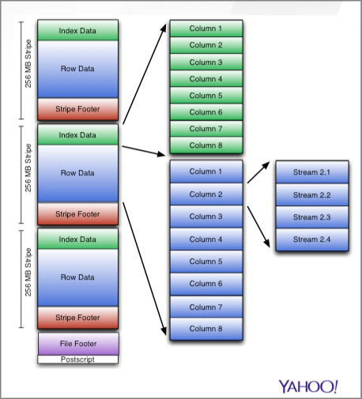

=======================
File and Record Formats
=======================

This chapter discusses the file, record, and compressions supported by Hadoop at Yahoo. 
 

Supported File Formats
======================

The following are the supported file formats at Yahoo. We'll go into more details about
each of the formats in sections below.

- Delimited text (we do not support JSON)
- `Row Columnar file (RCFile) <http://en.wikipedia.org/wiki/RCFile>`_
- `Optimized Row Columnar (ORC) file <https://cwiki.apache.org/confluence/display/Hive/LanguageManual%20ORC#LanguageManualORC-ORCFiles>`_ (Hive 0.11 and beyond)
- `Avro IDL <http://avro.apache.org/docs/1.7.5/idl.html>`_ (end of Q2’14)

Hive also allows mixed formats:

- Ingest data in write optimized format such as delimited text
- Run a batch (nightly) job to convert to read-optimized ORCFile

Supported Compression Formats
=============================

The compression format is defined in ``io.compression.codecs``.

The following are the supported formats:

- **bzip2** - ``org.apache.hadoop.io.compress.BZip2Codec``
- **LZO** - ``com.hadoop.compression.lzo.LzoCodec``
- **zlib** - ``org.apache.hadoop.io.compress.DefaultCodec``

.. note:: The compression codec Snappy (``org.apache.hadoop.io.compress.SnappyCodec``) 
          is currently not supported. 

Setting Compression
--------------------

To set the intermediate compressions::

    SET hive.exec.compress.intermediate = true;
    SET mapreduce.map.output.compress.codec = <...>;

For output compressions::

    SET hive.exec.compress.output = true;
    SET mapreduce.output.fileoutputformat.compress.codec = <...>;

Text Files
==========

You can load data from text files or store data into text files that are delimited. 

When you create a table, you specify the row delimiters and that the table should be stored as a text file.
In the example below, you create a table from a text file that is delimited by a comma::

    CREATE TABLE u_data (
        id INT,
        fname STRING,
        lname STRING,
        gender STRING)
    ROW FORMAT DELIMITED
    FIELDS TERMINATED BY ','
    STORED AS TEXTFILE;

Given the comma-delimited data in the CSV file ``actors_input.csv`` below::

    1, Kevin, Bacon, male
    2, Billy, Crystal, male
    3, Sandra, Bullock, female
    4, Demi, Moore, female

You could load into the table ``u_data`` with the following::

    LOAD DATA LOCAL INPATH './actors_input.csv'
    OVERWRITE INTO TABLE u_data; 

For text files that are not delimited, you can use regular expressions with ``SERDEPROPERTIES`` 
and the Java class ``org.apache.hadoop.hive.serde2.RegexSerDe``. A typical use case for using
regular expressions would be to load data from a Web log.

The example below parses information from an Apache Web log so that the text file can be loaded into
a Hive table::

    CREATE TABLE serde_regex(
        host STRING,
        identity STRING,
        user STRING,
        time STRING,
        request STRING,
        status STRING,
        size STRING,
        referer STRING,
        agent STRING)
    ROW FORMAT SERDE 'org.apache.hadoop.hive.contrib.serde2.RegexSerDe'
    WITH SERDEPROPERTIES (
        "input.regex" = "([^ ]*) ([^ ]*) ([^ ]*) (-|\\[[^\\]]*\\]) ([^ \"]*|\"[^\"]*\") (-|[0-9]*) (-|[0-9]*)(?: ([^ \"]*|\"[^\"]*\") ([^ \"]*|\"[^\"]*\"))?",
        "output.format.string" = "%1$s %2$s %3$s %4$s %5$s %6$s %7$s %8$s %9$s"
    )
    STORED AS TEXTFILE;

Optimized Row Columnar (ORC) File 
=================================

What is ORC?
------------

`ORC <https://cwiki.apache.org/confluence/display/Hive/LanguageManual%20ORC#LanguageManualORC-ORCFiles>`_ is a file format 
first introduced in Hive 0.11 and designed specifically to improve the efficiency 
of storing Hive data. Using ORC files, Hive's performance improves when reading, 
writing, and processing data. 

Why Use ORC?
------------

The table below compares ORC with other formats, highlighting the advantages of ORC.

.. list-table:: ORC Compared With Other Formats
   :widths: 15 10 30
   :header-rows: 1

   * - Features
     - Hive Integration
     - Active Development
     - Hive Type Model
     - Shared complex columns
     - Splits found quickly
     - Versioned metadata
     - Run length data encoding
     - Store strings in dictionary
     - Store min, max, sum, count
     - Store internal indexes
     - No overhead for non-null
     - Predicate pushdown
   * - RC File
     - Y 
     - N
     - N 
     - N 
     - N 
     - N 
     - N 
     - N 
     - N 
     - N 
     - N 
     - N 
   * - Parquet
     - N 
     - Y 
     - N 
     - Y 
     - Y 
     - Y 
     - Y 
     - Y 
     - N 
     - N 
     - N 
     - N 
   * - ORC
     - Y 
     - Y 
     - Y 
     - Y 
     - Y 
     - Y 
     - Y 
     - Y 
     - Y 
     - Y 
     - Y ≥ 0.12
     - Y ≥ 0.12

File Structure
--------------

ORC files are structured as groups of row data and auxillary information known collectively as stripes. Each stripe contains index data, row data, and a footer. 
The default stripe size is 250 MB. The large size of stripes allow Hive to efficiently read data from HDFS.

At the end of the ORC file is a postscript holding compression parameters and the size of the compressed footer.

The following diagram shows the basic structure. See the description of the **index**, **row data**, and **footer** below the diagram.

- **index** - includes the minimum and maximum values for each column and the row positions within each column. (A bit field or bloom filter could also be included.) 
  The index entries provide offsets that enable seeking to the right compression block and byte within a decompressed block.  
   Also, indexes are only used for the selection of stripes and row groups and **not** for answering queries.
- **data rows** - composed of multiple streams per column and used for table scans. 
  The integer columns are serialized using run-length encoding, and the 
  string columns are serialized using dictionary for column values, and the same run length encoding.
- **footer** - contains a directory of stream locations and the encoding for each column. The footer is also used to find the requested
  column's data streams and adjacent stream reads are merged.

How to Use ORC
--------------

To set the default file format as ORCFile, use the ``SET`` command::

    SET hive.default.fileformat   = orc
    SET hive.exec.orc.memory.pool = 0.50 (ORC writer is allowed 50% of JVM heap size by default)

    ROW FORMAT SERDE 'org.apache.hadoop.hive.ql.io.orc.OrcSerde’
    INPUTFORMAT      'org.apache.hadoop.hive.ql.io.orc.OrcInputFormat’ 
    OUTPUTFORMAT     'org.apache.hadoop.hive.ql.io.orc.OrcOutputFormat';

You can also specity that Hive store data as an ORC file when creating a table::

    CREATE TABLE addresses ( 
    name 	string, 
    street 	string, 
    city 	string, 
    state 	string, 
    zip 	int 
    ) 
    STORED AS orc TBLPROPERTIES ("orc.compress"= "ZLIB");
    LOCATION ‘/users/sumeetsi/orcfile’;

Or, alter a table so that it uses ORCFile::

    
    ALTER TABLE ... [PARTITION partition_spec] SET FILEFORMAT orc
    
ORC File Configurations
-----------------------

There are a number of configurations that you can set in ``TBLEPROPERTIES``.
The table below lists the keys, the defaults, and a short description.

.. list-table:: ORCFile Parameters in ``TBLPROPERTIES``
   :widths: 15 20 30
   :header-rows: 1

   * - **Key**
     - **Default**
     - **Description**
   * - ``orc.compress``
     - ZLIB
     - high-level compression (one of NONE, ZLIB, Snappy–needs evaluation)     
   * - ``orc.compress.size``
     - 262144 (256 KB)
     - number of bytes in each compression chunk
   * - ``orc.stripe.size``
     - 67108864 (64 MB)
     - number of bytes in each stripe. Each ORC stripe is processed in one map 
       task (try 32 MB to cut down on disk I/O)
   * - ``orc.row.index.stride``
     - 10000
     - number of rows between index entries (must be >= 1,000). A larger stride-size 
       increases the probability of not being able to skip the stride, for a predicate.
   * - ``orc.create.index``
     - true
     - whether to create row indexes. This is for predicate push-down (bloom-filters). 
       If data is frequently accessed/filtered on a certain column, then sorting on 
       the column and using index-filters makes column filters work faster

To set a ORC File configuration, you use ``TBLPROPERTIES`` when creating or altering a table
as shown below, which sets the compression format to ``bzip2``.

::

    create table Addresses (
        name string,
        street string,
        city string,
        state string,
        zip int
    ) stored as orc tblproperties ("orc.compress"="bzip2");
