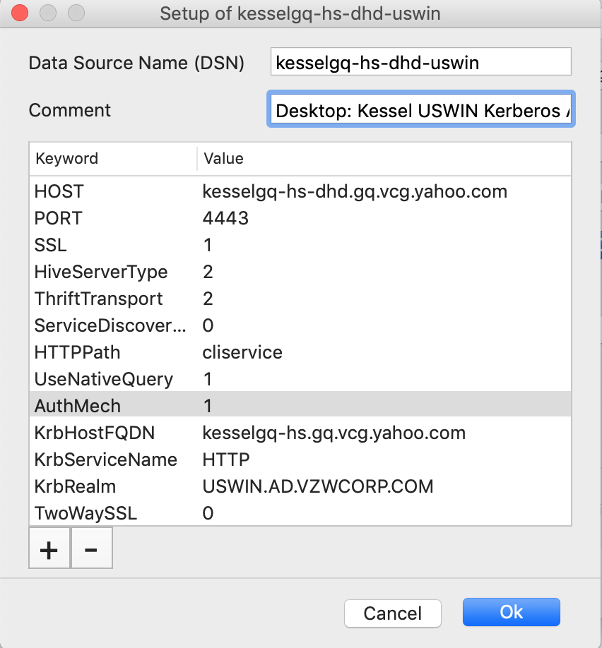
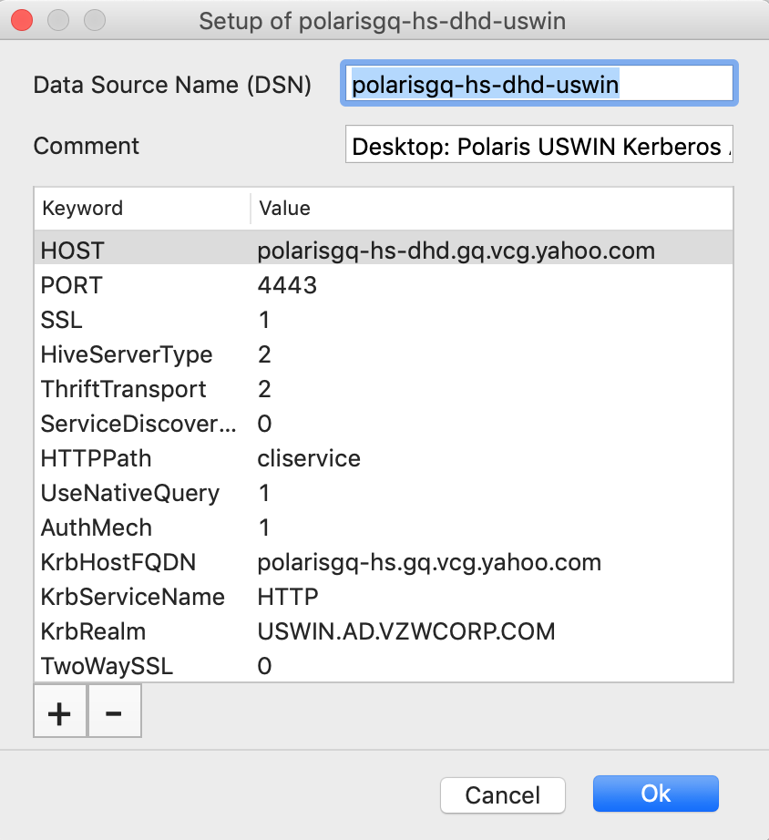
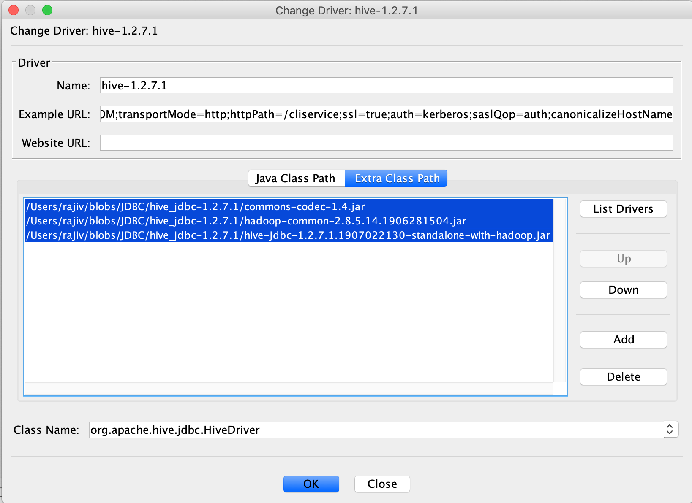
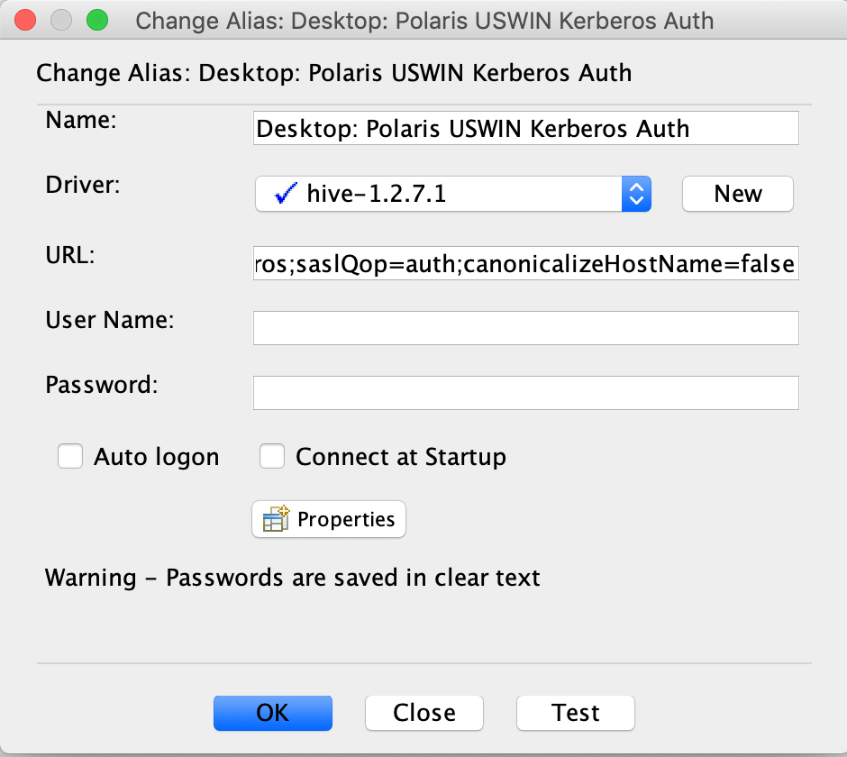
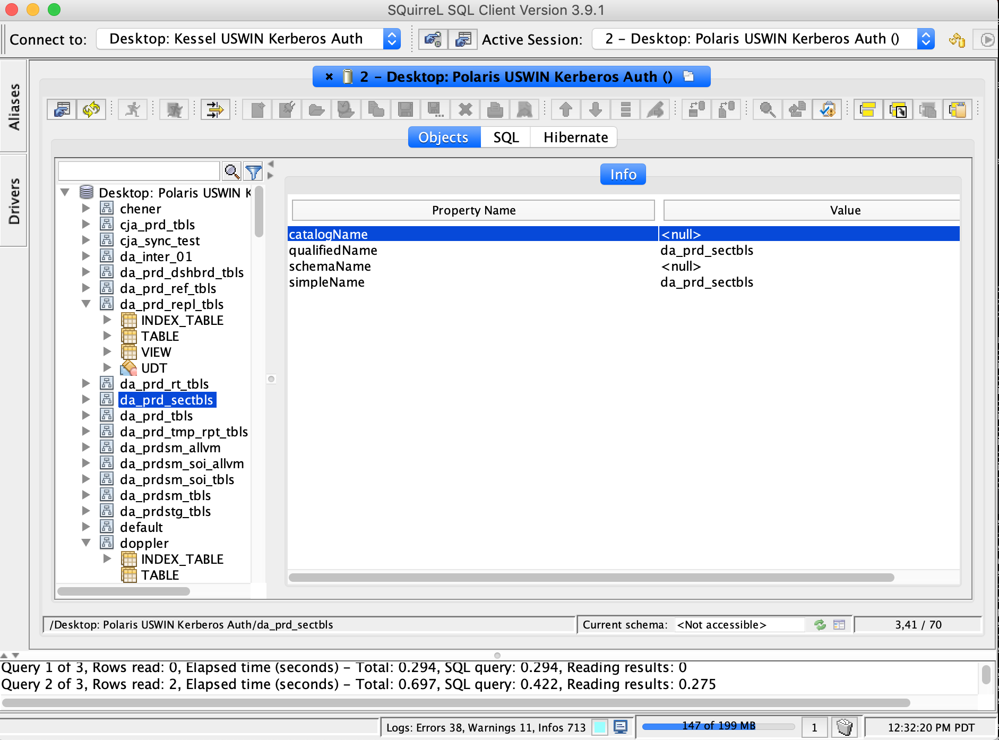

======================================
 Hive from Verizon Network
======================================

Hive Thrift interfaces are configured to use `HTTPS <https://thrift.apache.org/docs/concepts#transport>`__ Transport. A client can choose, depending on security required,  either of the two federated access paths, TUNATS and `DHD <https://drive.google.com/open?id=1-IZ1KtEPYgp1867PHpHDgASevSVxv74BGgR2n6b5X5s>`__.

Authentication
==============

Kerberos
--------

Kerberos authentication is available for only individual accounts. Users can use either USWIN.AD.VZWCORP.COM (IT) or *WIN.ENG.VZWNET.COM (EDN) *kerberos principals. The Verizon user id will be remapped to the user's Okta user identity in vGrid.

Athenz `x509 <https://tools.ietf.org/html/rfc5246#section-7.4.6>`__ role certificates
-----------------------------

VCG Services support mTLS authentication with `Athenz x509 role certificates <https://git.ouroath.com/pages/athens/athenz-guide/concepts/#role-x509-certificates>`__. These are available for both individual and functional accounts.

Role has to be uid.<username> in `vcg.user <https://ui.athenz.ouroath.com/athenz/domain/vcg.user/role>`__ domain.

Acquiring VCG UID role certificates for individuals
###################################################

**Note : Wherever relevant, instructions for Mac and Windows are separately mentioned**

There are two steps involved in fetching Athenz X509 role certificates:

#. Fetch the Athenz User Certificate

   * Acquire `user <https://git.ouroath.com/pages/athens/athenz-guide/concepts/#users>`__ principal certificate using `athenz-user-cert <https://git.ouroath.com/pages/athens/athenz-guide/user_x509_credentials/>`__ utility

    Run the command as below.

    **Windows Users** : Please use double quotes

    .. code-block:: text

        $ athenz-user-cert -t 10 -r  -J "OktaID@dhd.vcg.yahoo.com:2222,OktaID@jump.vcg.yahoo.com:22" -i OktaID</td>

    Sample command with Okta Id = rajive

    .. code-block:: text

        athenz-user-cert  -t 10 -r -J “rajive@dhd.vcg.yahoo.com:2222,rajive@jump.vcg.yahoo.com:22” -i rajive
        Touch Yubikey if flashing
        2019/07/07 20:43:05 Successfully retrieved user Athenz x.509 certificate
        2019/07/07 20:43:05   Private Key File: /home/rajive/.athenz/key
        2019/07/07 20:43:05   Certificate File: /home/rajive/.athenz/cert

    #contents of cert

    .. code-block:: text

       $ openssl x509 -noout -subject -in /home/rajive/.athenz/cert
       subject= /C=US/O=Oath/OU=Athenz/CN=user.rajive
       $

#. Use the above to fetch vcg.user:role.uid.<username> certificates

    * Acquire vcg.user:role.uid.<username> role certificate using `zts-rolecert <https://git.ouroath.com/pages/athens/athenz-guide/zts_rolecert/>`__

    * Export the HTTPS_PROXY variable
    
    **Windows Users** :
    
    .. code-block:: text
    
       setx HTTPS_PROXY https://dhd.vcg.yahoo.com:8443
    
    
    setx.exe does not set the environment variable in the current command prompt, but it will be available in subsequent command prompts. So please open a new command prompt to run the below commands
    
    **Mac Users** :
    
    .. code-block:: text
    
       export HTTPS_PROXY=https://dhd.vcg.yahoo.com:8443</td>
    
    * Run zts-rolecert
    
    **Windows Users:**  Please update path in the below command to reflect the path of certs and keys. The path of certs and keys can be found in the output of athenz-user-cert command in step 1.
    
    .. code-block:: text
    
       $ zts-rolecert -zts https://zts.athens.yahoo.com:4443/zts/v1 \
        -dns-domain zts.yahoo.cloud \
        -role-domain vcg.user -role-name uid.rajive \
        -svc-key-file /home/rajive/.athenz/key \
        -svc-cert-file /home/rajive/.athenz/cert \
        -role-cert-file /home/rajive/.athenz/vcg.user.role.uid.rajive.pem
    
    
    **Viewing the subject of the cert**
    
    .. code-block:: text
    
       openssl x509 -noout -subject -in /home/rajive/.athenz/vcg.user.role.uid.rajive.pem
    
    **Importing into Keystore**
    
    .. code-block:: text
    
        $ openssl pkcs12 -export -inkey /home/rajive/.athenz/key \
        -in vcg.user.role.uid.rajive.pem \
        -out /home/rajive/.athenz/vcg.user.role.uid.rajive.p12 \
        -password pass:changeit
        $ keytool -importkeystore -noprompt \
        -srcstoretype PKCS12 \
        -srckeystore /home/rajive/.athenz/vcg.user.role.uid.rajive.p12 \
        -srcstorepass changeit \
        -destkeystore /home/rajive/.athenz/vcg.user.role.uid.rajive.jks \
        -deststorepass changeit
    

Acquiring VCG UID role certificates for functional accounts
###########################################################

* If not done, associate VCG functional account to your athenz domain

* Acquire `service <https://git.ouroath.com/pages/athens/athenz-guide/concepts/#services>`__ principal certificate using `zts-svccert <https://git.ouroath.com/pages/athens/athenz-guide/zts_svccert/>`__ utility

    * When using openstack managed host see `Calypso: Bootstrapping Openstack instances with Athenz Service Identity <https://git.ouroath.com/pages/athens/calypso-guide/onboard_tls/>`__

* Acquire vcg.user:role.uid.<username> role certificate using `zts-rolecert <https://git.ouroath.com/pages/athens/athenz-guide/zts_rolecert/>`__

    * When using openstack managed host see `Calypso: How to obtain Role Certificates automatically on the box <https://git.ouroath.com/pages/athens/calypso-guide/role_certs/>`__

Athenz utilities generate certificates and corresponding keys in `PEM <https://tools.ietf.org/html/rfc7468>`__ format. For Java applications these would need to be converted to `PKCS#12 <https://www.rfc-editor.org/rfc/rfc7292.html>`__ or `JKS <https://en.wikipedia.org/wiki/Java_KeyStore>`__ format

.. code-block:: text

   $ openssl pkcs12 -export -inkey ${key} -in $pem \
    -out ${p12} -password pass:changeit
   $ keytool -importkeystore -srcstorepass changeit -noprompt \
    -deststorepass changeit -srckeystore ${p12} \
    -srcstoretype PKCS12 -destkeystore ${jks}

ODBC Drivers
============

Simba is one of the primary ODBC Driver vendors for Hive. Hortonworks/Cloudera provides a rebranded version of Simba Drivers.

Verizon Media has acquired a site license of Simba ODBC Drivers. Packages and corresponding licenses are available at `artifactory <https://edge.artifactory.ouroath.com:4443/artifactory/ygrid/SimbaODBCDriver/>`__

Simba ODBC Driver License Installation:

•       on Windows: Save the license file with the driver .dll in the installation folder.

•       on Linux: Save the license file with the driver .so in the installation folder or in your HOME folder (~/).

•       on Mac: Save the license file with the driver .dylib in the installation folder (/Library/simba/<product_name>/lib) or in your HOME folder (~/).

Configuring ODBC in mac using `iODBC Administrator64 <http://www.iodbc.org/dataspace/doc/iodbc/wiki/iodbcWiki/Downloads>`__
---------------------------------------------------

Configuring Kessel Hive Data Source
###################################

Configuring Polaris Hive Data Source
####################################

Kerberos Authentication from Desktop
------------------------------------

Example odbc.ini settings for Simba Hive ODBC Driver with USWIN Authentication
##############################################################################

   ODBC Data Sources

.. code-block:: text

   kesselgq-hs-dhd-uswin = Simba Hive ODBC Driver
   polarisgq-hs-dhd-uswin = Simba Hive ODBC Driver

kesselgq-hs-dhd-uswin

.. code-block:: text

	Driver               = /Library/simba/hiveodbc/lib/libhiveodbc_sbu.dylib
	Description          = Desktop: Kessel USWIN Kerberos Auth
	HOST                 = kesselgq-hs-dhd.gq.vcg.yahoo.com
	PORT                 = 4443
	SSL                  = 1
	HiveServerType       = 2
	ThriftTransport      = 2
	ServiceDiscoveryMode = 0
	HTTPPath             = cliservice
	UseNativeQuery       = 1
	AuthMech             = 1
	KrbHostFQDN          = kesselgq-hs.gq.vcg.yahoo.com
	KrbServiceName       = HTTP
	KrbRealm             = USWIN.AD.VZWCORP.COM
	TwoWaySSL            = 0

polarisgq-hs-dhd-uswin

.. code-block:: text

    Driver               = /Library/simba/hiveodbc/lib/libhiveodbc_sbu.dylib
    Description          = Desktop: Polaris USWIN Kerberos Auth
    HOST                 = polarisgq-hs-dhd.gq.vcg.yahoo.com
    PORT                 = 4443
    SSL                  = 1
    HiveServerType       = 2
    ThriftTransport      = 2
    ServiceDiscoveryMode = 0
    HTTPPath             = cliservice
    UseNativeQuery       = 1
    AuthMech             = 1
    KrbHostFQDN          = polarisgq-hs.gq.vcg.yahoo.com
    KrbServiceName       = HTTP
    KrbRealm             = USWIN.AD.VZWCORP.COM
    TwoWaySSL            = 0

Example odbc.ini settings for Simba Hive ODBC Driver with WIN-VZWNET Authentication
###################################################################################

ODBC Data Sources

.. code-block:: text

    kesselgq-hs-dhd-uswin = Simba Hive ODBC Driver
    polarisgq-hs-dhd-uswin = Simba Hive ODBC Driver

kesselgq-hs-dhd-uswin

.. code-block:: text

    Driver               = /Library/simba/hiveodbc/lib/libhiveodbc_sbu.dylib
    Description          = Desktop: Kessel WIN-VZWNET Kerberos Auth
    HOST                 = kesselgq-hs-dhd.gq.vcg.yahoo.com
    PORT                 = 4443
    SSL                  = 1
    HiveServerType       = 2
    ThriftTransport      = 2
    ServiceDiscoveryMode = 0
    HTTPPath             = cliservice
    UseNativeQuery       = 1
    AuthMech             = 1
    KrbHostFQDN          = kesselgq-hs.gq.vcg.yahoo.com
    KrbServiceName       = HTTP
    KrbRealm             = WIN.ENG.VZWNET.COM
    TwoWaySSL            = 0

polarisgq-hs-dhd-uswin

.. code-block:: text

    Driver               = /Library/simba/hiveodbc/lib/libhiveodbc_sbu.dylib
    Description          = Desktop: Polaris WIN-VZWNET Kerberos Auth
    HOST                 = polarisgq-hs-dhd.gq.vcg.yahoo.com
    PORT                 = 4443
    SSL                  = 1
    HiveServerType       = 2
    ThriftTransport      = 2
    ServiceDiscoveryMode = 0
    HTTPPath             = cliservice
    UseNativeQuery       = 1
    AuthMech             = 1
    KrbHostFQDN          = polarisgq-hs.gq.vcg.yahsoo.com
    KrbServiceName       = HTTP
    KrbRealm             = WIN.ENG.VZWNET.COM
    TwoWaySSL            = 0

Athens x509 Authentication from Desktop
---------------------------------------

Example odbc.ini settings for Simba Hive ODBC Driver with Athens Authentication
###############################################################################

ODBC Data Sources

.. code-block:: text

    kesselgq-hs-dhd-athenz = Simba Hive ODBC Driver
    polarisgq-hs-dhd-athenz = Simba Hive ODBC Driver

kesselgq-hs-dhd-athenz

.. code-block:: text

    Driver               = /Library/simba/hiveodbc/lib/libhiveodbc_sbu.dylib
    Description          = Desktop: Kessel Athenz User auth
    HOST                 = kesselgq-hs-dhd.gq.vcg.yahoo.com
    PORT                 = 4443
    SSL                  = 1
    HiveServerType       = 2
    ThriftTransport      = 2
    ServiceDiscoveryMode = 0
    HTTPPath             = cliservice
    UseNativeQuery       = 1
    AuthMech             = 0
    TwoWaySSL            = 1
    ClientCert           = /Users/rajive/.athenz/vcg.user.role.uid.rajive
    ClientPrivateKey     = /Users/rajive/.athenz/key

polarisgq-hs-dhd-athenz

.. code-block:: text

    Driver               = /Library/simba/hiveodbc/lib/libhiveodbc_sbu.dylib
    Description          = Desktop: Polaris Athenz User auth
    HOST                 = polarisgq-hs-dhd.gq.vcg.yahoo.com
    PORT                 = 4443
    SSL                  = 1
    HiveServerType       = 2
    ThriftTransport      = 2
    ServiceDiscoveryMode = 0
    HTTPPath             = cliservice
    UseNativeQuery       = 1
    AuthMech             = 0
    TwoWaySSL            = 1
    ClientCert           = /Users/rajive/.athenz/vcg.user.role.uid.rajive
    ClientPrivateKey     = /Users/rajive/.athenz/key

Hive JDBC Drivers
=================

Hive JDBC Drivers can be downloaded from `drive <https://drive.google.com/drive/folders/1jMp9CdInvIbbPb3Zk7o7iyZhEYWcIrXS>`__

Apache Hive JDBC URI Options for Kerberos Authentication From Desktop.

.. code-block:: text

    Host                    = <CLUSTER>-hs-dhd.gq.vcg.yahoo.com
    Port                    = 4443
    principal               = HTTP/<CLUSTER>-hs.gq.vcg.yahoo.com@<REALM>
    transportMode           = http
    httpPath                = /cliservice
    ssl                     = true
    auth                    = kerberos
    saslQop                 = auth
    canonicalizeHostName    = false

Note: Option names for Simba JDBC drivers could be different from

Kerberos Authentication from Desktop
------------------------------------

JDBC URI for connecting to Kessel from Verizon IT Desktop/Laptop
################################################################

.. code-block:: text

    jdbc:hive2://kesselgq-hs-dhd.gq.vcg.yahoo.com:4443/hivetestdb;principal=HTTP/kesselgq-hs.gq.vcg.yahoo.com@USWIN.AD.VZWCORP.COM;transportMode=http;httpPath=/cliservice;ssl=true;auth=kerberos;saslQop=auth;canonicalizeHostName=false

JDBC URI for connecting to Polaris from Verizon IT Desktop/Laptop
#################################################################

.. code-block:: text

    jdbc:hive2://polarisgq-hs-dhd.gq.vcg.yahoo.com:4443/hivetestdb;principal=HTTP/polarisgq-hs.gq.vcg.yahoo.com@USWIN.AD.VZWCORP.COM;transportMode=http;httpPath=/cliservice;ssl=true;auth=kerberos;saslQop=auth;canonicalizeHostName=false

JDBC URI for connecting to Kessel from Verizon EDN Desktop/Laptop (WIN.ENG.VZWNET.COM)
######################################################################################

.. code-block:: text

    jdbc:hive2://kesselgq-hs-dhd.gq.vcg.yahoo.com:4443/hivetestdb;principal=HTTP/kesselgq-hs.gq.vcg.yahoo.com@WIN.ENG.VZWNET.COM;transportMode=http;httpPath=/cliservice;ssl=true;auth=kerberos;saslQop=auth;canonicalizeHostName=false

JDBC URI for connecting to Polaris from Verizon EDN Desktop/Laptop (WIN.ENG.VZWNET.COM)
#######################################################################################

.. code-block:: text

    jdbc:hive2://polarisgq-hs-dhd.gq.vcg.yahoo.com:4443/hivetestdb;principal=HTTP/polarisgq-hs.gq.vcg.yahoo.com@WIN.ENG.VZWNET.COM;transportMode=http;httpPath=/cliservice;ssl=true;auth=kerberos;saslQop=auth;canonicalizeHostName=false

Example JDBC Usage
-------------------

SquirreLSQL
###########

*Note: Squirrel SQL client ships with a version of commons codec that has conflict with one in hadoop. Make sure its 1.4 or use one from Hive.*

Create Driver for Hive

Creating a Hive Connection for Polaris Hive using USWIN Credentials

*URL is **jdbc:hive2://**polarisgq-hs-dhd.gq.vcg.yahoo.com**:4443/hivetestdb;principal=HTTP/**polarisgq-hs.gq.vcg.yahoo.com**@**USWIN.AD.VZWCORP.COM**;transportMode=http;httpPath=/cliservice;ssl=true;auth=kerberos;saslQop=auth;canonicalizeHostName=false*

Example JDBC Usage Beeline with Kerberos
########################################

.. code-block:: text

    $ hostname
    sclomgdn54adv-hdp.sdc.vzwcorp.com

    $ kinit chitra6@USWIN.AD.VZWCORP.COM
    Password for chitra6@USWIN.AD.VZWCORP.COM:
    $ klist
    Ticket cache: FILE:/tmp/krb5cc_8645183
    Default principal: chitra6@USWIN.AD.VZWCORP.COM

    Valid starting       Expires              Service principal
    07/07/2019 14:18:02  07/08/2019 00:18:02  krbtgt/USWIN.AD.VZWCORP.COM@USWIN.AD.VZWCORP.COM
        renew until 07/08/2019 14:17:59
    $ hive --service beeline -u “jdbc:hive2://kesselgq-hs-dhd.gq.vcg.yahoo.com:4443/hivetestdb;principal=HTTP/kesselgq-hs.gq.vcg.yahoo.com@USWIN.AD.VZWCORP.COM;transportMode=http;httpPath=/cliservice;ssl=true;auth=kerberos;saslQop=auth;canonicalizeHostName=false”

    Connecting to jdbc:hive2://kesselgq-hs-dhd.gq.vcg.yahoo.com:4443/hivetestdb;principal=HTTP/kesselgq-hs.gq.vcg.yahoo.com@USWIN.AD.VZWCORP.COM;transportMode=http;httpPath=/cliservice;ssl=true;auth=kerberos;saslQop=auth;canonicalizeHostName=false
    Connected to: Apache Hive (version 1.2.7.1.1905312233)
    Driver: Hive JDBC (version 1.2.7.1.1905312233)
    Transaction isolation: TRANSACTION_REPEATABLE_READ
    Beeline version 1.2.7.1.1905312233 by Apache Hive
    0: jdbc:hive2://kesselgq-hs-dhd.gq.vcg.yahoo.> use hivetestdb;
    No rows affected (0.512 seconds)
    0: jdbc:hive2://kesselgq-hs-dhd.gq.vcg.yahoo.> select count(*) from user_orcfile;
    +-------+--+
    |  _c0  |
    +-------+--+
    | 1000  |
    +-------+--+
    1 row selected (14.009 seconds)
    0: jdbc:hive2://kesselgq-hs-dhd.gq.vcg.yahoo.>

Example JDBC Usage Beeline with Athenz x509 Role certs
######################################################

Apache Hive JDBC URI Options for Kerberos Authentication From Desktop.

.. code-block:: text

    Host                    = <CLUSTER>-hs[-dhd,vz].gq.vcg.yahoo.com
    Port                    = 4443
    transportMode           = http
    httpPath                = /cliservice
    ssl                     = true
    auth                    = nosasl
    twoWay                  = true
    sslKeyStore             = <path to role JKS>
    keyStorePassword        = <store password>
    sslTrustStore           = <CA bundle with DigiCert Certs>
    canonicalizeHostName    = false

Via beeline and connecting via TUNATS endpoint in IT network.

.. code-block:: text

    $ hive --service beeline -u "jdbc:hive2://kesselgq-hs-vz.gq.vcg.yahoo.com:4443/hivetestdb;transportMode=http;httpPath=/cliservice;auth=nosasl;sslKeyStore=vcg.user.role.uid.rajive.jks;keyStorePassword=changeit;sslTrustStore=yahoo_certificate_bundle.jks;ssl=true;twoWay=true;canonicalizeHostName=false"
    SLF4J: Class path contains multiple SLF4J bindings.
    …
    …
    jdbc:hive2://kesselgq-hs-vz.gq.vcg.yahoo.com:4443/hivetestdb;transportMode=http;httpPath=/cliservice;auth=nosasl;sslKeyStore=vcg.user.role.uid.rajive.jks;keyStorePassword=changeit;sslTrustStore=yahoo_certificate_bundle.jks;ssl=true;twoWay=true;canonicalizeHostName=false
    Connected to: Apache Hive (version 1.2.7.1.1905312233)
    Driver: Hive JDBC (version 1.2.7.1.1905312233)
    Transaction isolation: TRANSACTION_REPEATABLE_READ
    Beeline version 1.2.7.1.1905312233 by Apache Hive
    0: jdbc:hive2://kesselgq-hs-vz.gq.vcg.yahoo.com:4443/h>
    …
    …
