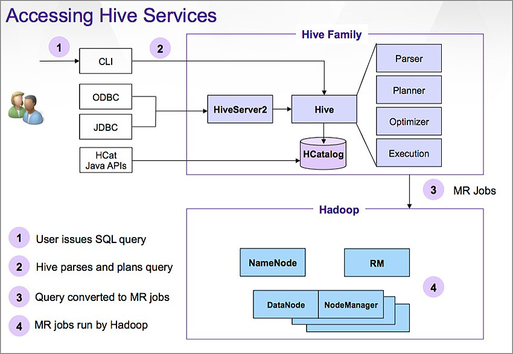
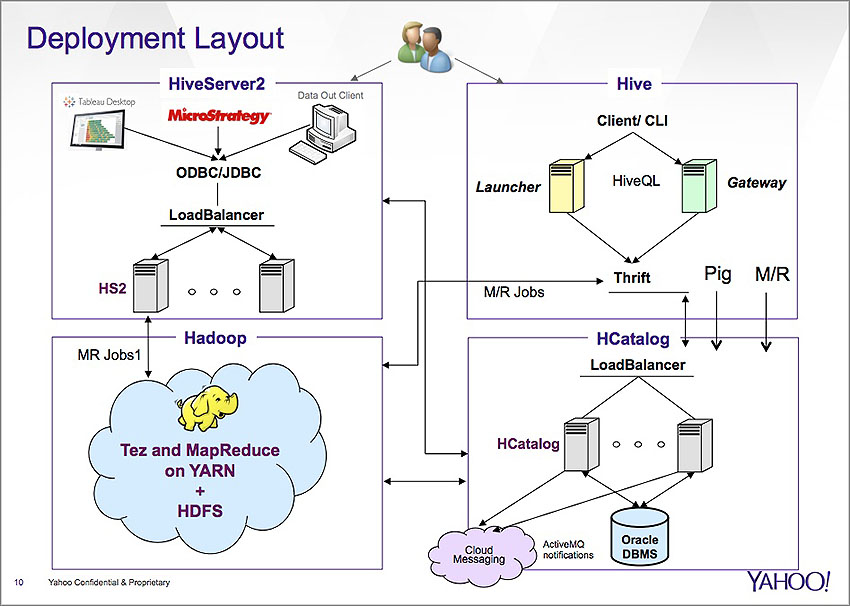
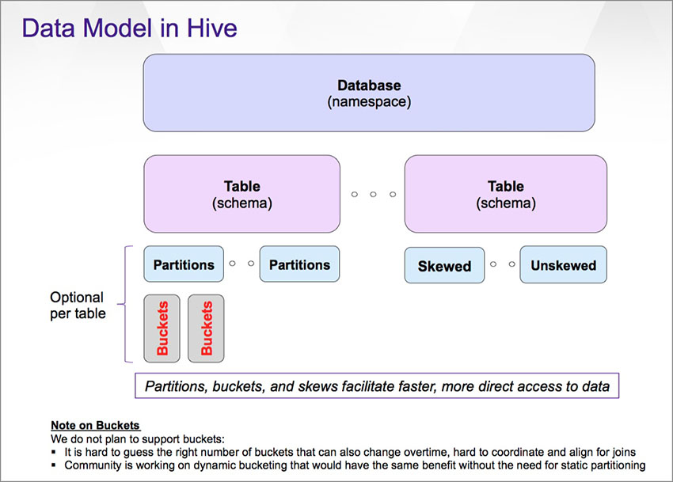
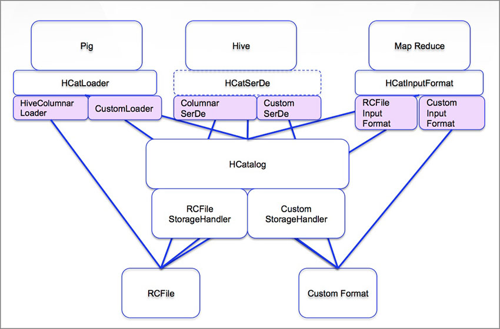
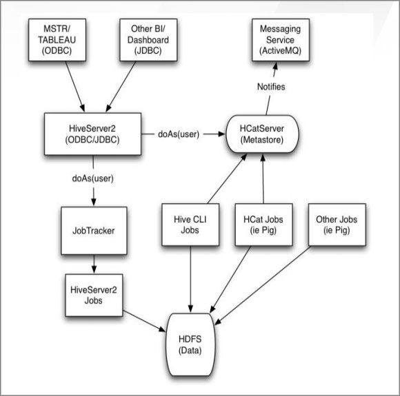

========
Overview
========

.. _hive_getting_started-overview:

What is Hive?
=============

Apache Hive is an application that abstracts Hadoop data so that it can be accessed using an 
SQL-like language called HiveQL. Using HiveQL, you can use a familiar procedural language to query
large amounts of data on the grid as if you were working with a relational database. 

Hive offers a broad range of SQL semantics and integrates with both ODBC and JDBC interfaces,
making it ideal for analyzing data. 

Why Hive?
=========

Hive is one of the fastest growing products on the grid for many reasons.
The following highlight some of reasons that Yahoo has chosen
to use Hive.

- **Battle-Tested Standard** - Hive is the SQL standard for Hadoop that has been 
  around for more than seven years. In addition to Yahoo, it has been tested on a large scale 
  at companies such as Facebook and Netflix.
- **Single Solution** - Hive works across a broad spectrum of data volumes and 
  allows you to load, store, read, analyze, and combine data. 
- **Interoperability** - HCatalog is a metastore that is part of Hive project. 
  It allows Hive to work with Pig and HBase. Hive is also one of the few SQL 
  solutions on Hadoop that has been widely certified by business intelligence (BI) 
  vendors (10+ major vendors and growing).
- **Strong Support** - Hive is a top-level project (TLP) with the Apache Software 
  Foundation (ASF). Yahoo has been deeply involved with ASF and made many 
  contributions that allows us to influence the Hive community and the project to 
  meet our users' needs. The Hive community is comprised of top-notch engineers 
  and architects from well-known IT companies.
- **Improving Performance** - With each release, Hive's performance improves and 
  is closing the gap with Pig. This performance increase is due to the changes in 
  Hive and the underlying execution engine that Hive 0.13 and 0.14 run on: :ref:`Tez <hive_intro-tez>`. 
  There is even more reason to be optimistic for improved performance
  due to the `Stinger initiative <http://hortonworks.com/labs/stinger/>`_, which 
  is a broad, community-based effort to improve future versions of Hive.

.. _hive_getting_started-using_hive:

Accessing Hive
==============

The diagram shows how a query made from the Hive CLI is transmitted to Hive, where it
is translated into a MapReduce job that is run by Hadoop. Client applications use the
ODBC/JDBC drivers to communicate with HiveServer2 to relay queries that like the queries
from the CLI are converted into a MapReduce job that is executed on Hadoop.

   

Hive Deployment
===============

As in the :ref:`Accessing Hive diagram <hive_getting_started-using_hive>`, you
can see in the deployment layout that there are two entryways to getting
Hive queries executed in Hadoop. This diagram provides a more detailed 
view of the stack, showing how HCatalog stores metadata on an Oracle DBMS
that allows Pig, MapReduce, and Hive work together. Also, we can see that
the converted Hive queries are run as MapReduce jobs on either `Tez <../tej>`_
or the MapReduce frameworks. 

Hive vs. Pig
============

The table below shows the difference between Hive and Pig, highlighting when and where each should be used,
respective features, and available support.

.. csv-table:: Hive vs. Pig
   :header: "", "Hive", "Pig"
   :widths: 20, 30, 30

   "**Where to Use**", "Ad-hoc analytics and reporting", "ETL and pipeline data processing"
   "**Language**", "SQL (declarative)", "PigLatin (procedural)"
   "**Schema/Types**", "Mandatory (implicit)", "Optional (explicit)"
   "**Partitions**", "Yes", "No, partition pruning with HCatalog"
   "**Complex Processing**", "Not a good fit for complex processing", "Well suited where multi-query works with thousands of lines of Pig script"
   "**Developer Support**", "- Limited to SQL 
   - Java UDFs and StorageHandler", "- Feature rich and easy to add new operators and constructs. For example: Nested Foreach, Switch case, Macros, Scalars 
   - Java and non-Java UDFs" 
   "**Client/Server**", "Requires metastore server (HCatalog) and data registered with it", "Client only. Works with HCatalog metastore"
   "**ODBC/JDBC**", "Yes, through HiveServer2", "No"
   "**Tez Support**", "Present and stable from Hive 0.13", "Tez support under development (Pig 0.14)"
   "**ORC/Vectorization**", "ORC and vectorization available", "ORC available with Pig 0.14, no vectorization yet"
   "**Transactions**", "Yes (coming soon)", "No"
   "**Cost-Based Optimization**", "Yes (coming soon)", "No"

When to Use Hive vs. HBase 
==========================

While it is reasonable to compare Pig and Hive, HBase and Hive serve very different purposes in the Hadoop ecosystem.
The table below highlights the differences and when you would consider using each.

.. list-table:: When to Use Hive and HBase
   :widths: 10 40 30 40 40
   :header-rows: 1

   * - 
     - Where to Use
     - Access
     - SQL
     - Integration
   * - Hive
     - 
       - Data warehousing and analytics on top of Hadoop/HDFS
       - Does not fit frequent and/or record-level updates (although support is getting added for ACID transactions)
       - Query and analyze large volumes of data
     - Primarily through Hive SQL
     - Getting close to SQL standards
     - 
       - Integrated with Pig through HCatalog
       - Integrated with Oozie through support for Hive action and HCatalog partition notifications
    
   * - HBase
     -
       - Distributed key-value store for persistence and random access on HDFS
       - Build to support ten’s of thousands of reads/ writes per second at record level
       - Store and access values using keys
     - Java and REST APIs
     - Through Hive or Phoenix (SQL Skin on HBase) (not supported)
     - 
       - Integrated with Hive for SQL support – Planned in Q2/3
       - Integrated with Pig (HBaseStorage) and Oozie (credential support)

Data Model
==========

Hive data is organized into databases, tables, partitions, and buckets. Those familiar with SQL will
be familiar with databases that use a namespace to organize a group of tables and tables that have
a schema defining column data. Partitions allow you to create virtual columns based on
keys that determine how data is stored. Users can identify rows of data with partitions to run queries
on instead of running the queries across an entire data set. Buckets allow you to split partitions, allowing
even more focused queries, but will not be supported for the reasons mentioned in the diagram below.
Skewed tables, like partitions, allow you to focus queries on a subset of the data set by splitting
the data into separate files so that certain files can be skipped when executing a query.

The diagram below gives the general hierarchy of the data model and a general characteristic of each level.
See `Data Units <https://cwiki.apache.org/confluence/display/Hive/Tutorial#Tutorial-DataUnits>`_ for more detailed
information.

Hive and HCatalog
=================

`HCatalog <https://cwiki.apache.org/confluence/display/Hive/HCatalog>`_, part of 
Hive project, is the central metastore for facilitating interoperability among 
various Hadoop tools. It not only acts as the
table and storage management layer, so Pig, MapReduce, and Hive can share data, 
but also presents a relational view of the data in HDFS,
abstracts where or in what format data is stored, and enables notifications of 
data availability.

HiveServer2
===========

`HiveServer2 <https://cwiki.apache.org/confluence/display/Hive/Setting%20Up%20HiveServer2#SettingUpHiveServer2-HiveServer2>`_ is the 
JDBC/ODBC endpoint that Hive clients can use to communicate with Hive.

It supports the following:

- concurrent clients
- secure clusters and encryption
- user/global/session configuration
- DoAs support allowing Hive queries to run as the requester

