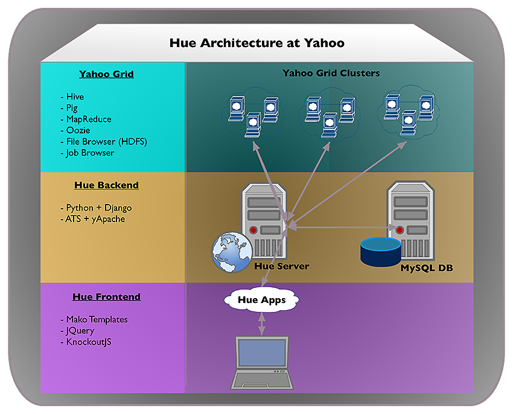
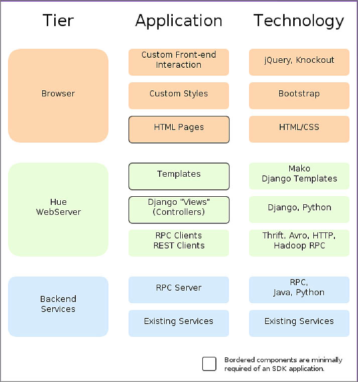
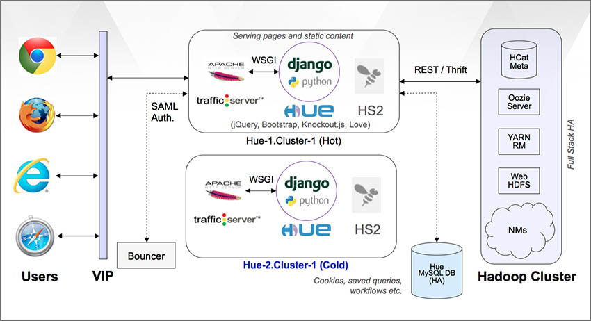

Architecture
============

Overview
--------

The Yahoo implementation of Hue shown below is slightly different than
that of `Cloudera's Hue <http://cloudera.github.io/hue/docs-3.7.0/user-guide/introducing.html>`_. On the back end, we replace `Spawning <https://pypi.python.org/pypi/Spawning>`_ 
and `CherryPy <http://cherrypy.org/>`_ with `yApache <http://developer.corp.yahoo.com/product/yApache>`_, 
and use `ATS <http://developer.corp.yahoo.com/product/ATS>`_ for proxying requests. 

Our Hue front end is the same, and as of yet, we do not offer the SDK to create your own
Hue applications.

Tiers of Hue
------------

It's perhaps easier to understand Hue if you think
of Hue as tiers (abstraction layers), application
components, and the technology that the application
uses as shown in the diagram below.

Deployment
----------

The diagram below shows how Hue acts as a intermediary between
users from the browser to the grid on the back end.
Yahoo's Hue instances use Bouncer for authorization
and store user information in a MySQL database.

Hue Applications and Their Dependencies
#######################################

The table below shows the technology that each component 
relies upon.

.. csv-table:: Hue Applications and Dependencies
   :header: "Applications", "Dependencies"
   :widths: 15, 30

   "Query Editor->Pig", "Oozie server to submit Pig scripts"
   "Query Editor->Hive", "HiveServer2 to submit Hive queries"
   "Query Editors->Job Designer", "Oozie access through REST APIs"
   "Data Browsers->Metastore Tables", "HiveServer2 to access HCatalog metastore"
   "Workflows->Dashboards", "Oozie access through REST APIs"
   "Workflows->Editors", "Oozie access through REST APIs"
   "File Browser", "WebHDFS or HttpFS (similar to HDFSProxy)"
   "Job Browser", "ResourceManager (RM) access through ``hue-plugins``"

