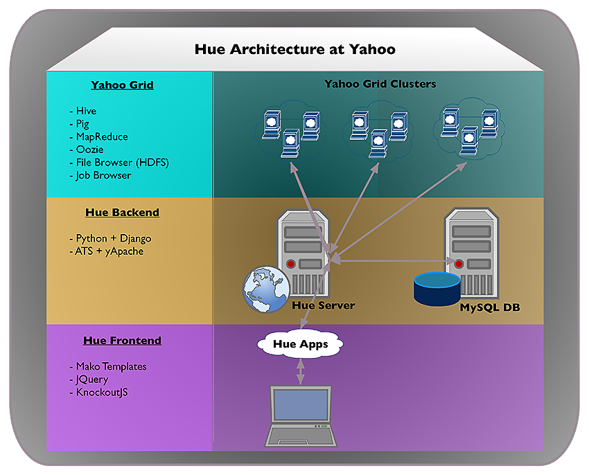

========
Overview
========

What is Hue?
============

Hue (Hadoop User Experience) is a set of Web applications that run in a hosted environment that allow you to interact with a Hadoop cluster
through a Web UI. The Yahoo implementation of Hue allows you to browse HDFS files and jobs, run Hive queries, 
execute Pig scripts, use Oozie workflows, and submit MapReduce programs. Hue is extensible, so you
can expect new applications that give you access to other Hadoop components in the future.

..
.. Hue is a set of web applications that enable you to interact with a Hadoop cluster. Hue applications 
.. let you browse HDFS and jobs, manage a Hive metastore, run Hive, Cloudera Impala 
.. queries and Pig scripts, browse HBase, export data with Sqoop, submit MapReduce 
.. programs, build custom search engines with Solr, and schedule repetitive workflows with Oozie.

Why Use Hue?
============

Hue gives you an simple interface to work with grid data even if you know little to nothing about Hadoop.
You also do not need to on-board with the Grid team or download/install software. You can simply go to instance of Hue on
any Yahoo cluster. This opens the grid to anyone at Yahoo. As long as you have used
a file browser, you can view and modify data. If you know some SQL, you should be able to
quickly learn how to run Hive queries. 

Who Should Use Hue?
===================

Although Hue can be used by anyone, we anticipate that the primary user will
be **developers**. Hue allows developers to experiment and explore data in
a simpler and quicker way. With the Hue UI, developers don't need
to on-board, log onto a cluster, use command-line tools, or go to
a dashboard to view job status. They can instead view data with the
file browser, upload new data, run Pig scripts or Hive queries, and
the view results, logs, and job statuses from one interface.

Data scientists can also use Hue to explore and analyze data, but they may be
better off using professional tools such as `MicroStrategy <https://www.microstrategy.com/us/>`_ or 
`Tableau <http://www.tableausoftware.com/>`_.

Authentication/Authorization for Hue
====================================

You use your Backyard credentials to access the Hue UI, regardless of the cluster.
What is important to note though is that you can only access data that you
own or have been given permission to use. You can 
request access to data sets through `Support Shop <http://yo/supportshop>`_.

What You Can't Do With Hue
==========================

The Yahoo implementation of Hue has a limited set of features, so
you will not be able to use the following features:

- Impala Query UI
- Sqoop UI
- Solr for searches
- ZooKeeper Browser
- HBase Browser
- User Admin Tool

In addition, although you can use the **File Browser**, you won't be able to
download data. Jira has not been integrated with Yahoo's Hue yet either.
 

How It Works
============

Overview
--------

The Yahoo implementation of Hue shown below is slightly different than
that of `Cloudera's Hue <http://cloudera.github.io/hue/docs-3.7.0/user-guide/introducing.html>`_. On the backend, we replace `Spawning <https://pypi.python.org/pypi/Spawning>`_ 
and `CherryPy <http://cherrypy.org/>`_ with `yApache <http://developer.corp.yahoo.com/product/yApache>`_, 
and use `ATS <http://developer.corp.yahoo.com/product/ATS>`_ for proxying requests. 

Our Hue frontend is the same, and as of yet, we do not offer the SDK to create your own
Hue applications.

