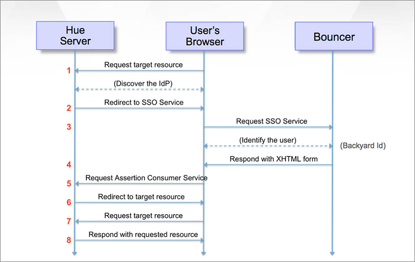

========
Overview
========

What is Hue?
============

Hue (Hadoop User Experience) is a set of Web applications that run in a hosted environment that allow you to interact with a Hadoop cluster
through a Web UI. The Yahoo implementation of Hue allows you to browse HDFS files and jobs, run Hive queries, 
execute Pig scripts, use Oozie workflows, and submit MapReduce programs. Hue is extensible, so you
can expect new applications that give you access to other Hadoop components in the future.

Why Use Hue?
============

Hue gives you an simple interface to work with grid data even if you know little to nothing about Hadoop.
You also do not need to on-board with the Grid team or download/install software. You can simply go to instance of Hue on
any Yahoo cluster. This opens the grid to anyone at Yahoo. As long as you have used
a file browser, you can view and modify data. If you know some SQL, you should be able to
quickly learn how to run Hive queries. 

In short, Hue lets you do the following:

- get started with Hadoop
- explore data, platform features, and capabilities
- set up an analytics workbench and share code among project teams
- monitor applications and jobs
- developing proof of concepts and modules
- running custom Hadoop-based Web applications

Hue Supported Features
----------------------

- HTTP based and stateless (uses async queries)
- Front end and back end separation (e.g. different servers, pagination)
- Resources (e.g., img, js, callbacks, css, json)
- Support multiple browsers and technologies
- Supports multiple DB back end (SQLite, MySQL)
- Supports i18n

Who Should Use Hue?
===================

Although we anticipate that the primary user will
be developers, test and service engineers, product managers,
analysts, and data scientists can also benefit from using Hue. 

Hue allows developers to experiment and explore data in
a simpler and quicker way. With the Hue UI, developers don't need
to on-board, log onto a cluster, use command-line tools, or go to
a dashboard to view job status. They can instead view data with the
file browser, upload new data, run Pig scripts or Hive queries, and
the view results, logs, and job statuses from one interface.

Data scientists and analysts can use Hue to explore and analyze data, but they may be
better off using professional tools such as `MicroStrategy <https://www.microstrategy.com/us/>`_ or 
`Tableau <http://www.tableausoftware.com/>`_.

Test and service engineers can create optimal workflows and debug issues. 
They can use Hue to monitor node metrics and queue capacity.

Authentication/Authorization for Hue
====================================

You use your Backyard credentials to access the Hue UI, regardless of the cluster.
What is important to note though is that you can only access data that you
own or have been given permission to use. You can 
request access to data sets through `Support Shop <http://yo/supportshop>`_.

The diagram below shows the `SAML <http://en.wikipedia.org/wiki/Security_Assertion_Markup_Language>`_ 
authentication flow from the browser to Bouncer to Hue. 

What You Can't Do With Yahoo's Hue
==================================

The Yahoo implementation of Hue has a limited set of features, so
you will not be able to use the following features that
are available in the open source version of Hue:

- **Impala Query UI** - The Impala Query UI allows you to query data 
  stored in Hadoop or HBase. 
- **DB Query** -  Enables viewing and querying data in MySQL, PostgreSQL, Oracle, 
  and SQLite databases/views in a table.
- **Sqoop UI** -  Enables transferring data from a relational database to Hadoop and vice versa.
- **Solr** -  Allows you to perform keyword searches across Hadoop data.
- **ZooKeeper Browser** - Used internally by platforms for HBase, Storm, Oozie.
- **HBase Browser** - Used to browse tables and access content. You can create new tables, 
  add data, modify existing cells, and filter data.
- **Security (Sentry, File ACLs)** -  Let’s you create, edit, delete roles and privileges 
  directly from your browser. 
- **Spark Igniter** -  Let's you submit Scala and Java Spark jobs directly from your Web browser.

In addition, although you can use the **File Browser**, you won't be able to
download data. Jira has not been integrated with Yahoo's Hue yet either.
 

User Accounts
=============

Admin User
----------

As an *admin* user, you have the ability to do the following:

- manage Hue configuration 
- run applications as a super user 
- grant/revoke permissions for user or a group of users
- impersonate as a "super proxy" for and "doAs" user
- use one Hue ticket/principal (no user ticket) to authenticate against Hadoop

General User
------------

General uses are authorized and authenticated to use Hue with their Backyard credentials.

Other
-----

We currently do not support headless users or the ability to add group-based
management or permissions. 

