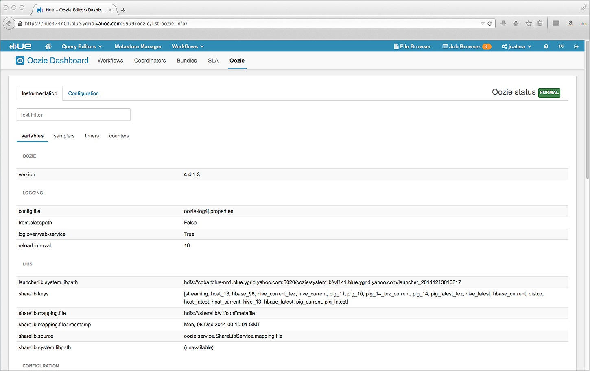

======
Hue UI
======

This chapter will give you an overview of the components of the Yahoo Hue Web interface.
We'll first look at the organization and function of the components on the landing page
before covering each component from left to right in more detail.

.. note:: We recommend using Firefox for reliablity and optimal performance.

Location of Hue UI
==================

To use the Hue Web UI, you will need to know which cluster you are using. 
The URL to each Hue instance has the following syntax: ``https://{cluster_name}-hue.{color}.ygrid.yahoo.com:{port}``

For example, to access the Hue UI on Cobalut Blue, you would go to
``https://cobaltblue-hue.blue.ygrid.yahoo.com:9999/``.

Navigation Overview
===================

The screenshot of the **Hue Web UI** below explains the purpose of the components
of the top navigation bar. You can click the figure to enlarge it.

About Hue
=========

By clicking the **Hue** icon in the top left-hand corner, you can quickly see the Hue version being used
and the link to our documentation.

Home
====

The **Home** icon brings you to **My documents**, where you can view and share your past queries,
create new documents or projects, and view projects that were shared with you.  

Query Editors
=============

The **Query Editors** drop-down menu lets you quickly navigate to one of the following
available editors:

- Hive
- Pig
- Job Designer

We'll give you a high-level overview of each editor in the following sections
to help orient you.

Hive Editor
-----------

The **Hive Editor** has the following components for writing, executing, and saving queries,
viewing the results, logs, and even charts. 

- **Query Editor**
- **My Queries**
- **Saved Queries**
- **History**

We'll look at each component, which is accessed through a tab, in the next
sections.

Query Editor
############

From the screenshot of the **Query Editor** below, you can see there is
a text field for entering queries that you can then execute, save, or even
have Hue give you an explanation.

The default tabs shown in in the left-hand and bottom navigation bars
are **Assist** and **Recent queries**. We'll look at those
and the other tabs next.

Assist
******

The **Assist** shown below is called *assist* because it helps you
find databases and tables quickly. The pull-down menu lets you quickly
select tables you have access to. The available tables in the selected
database will automatically be displayed.

Settings
********

From the **Settings** tab, you can add key-value pairs by clicking **Add** under **Settings** and
entering a key such as ``mapred.reduce.tasks`` with a value. You can also point
to a JAR or other files by adding file resources, or defining a UDSF by providing
a named function from a class such as the function ``myFunction`` in the class ``com.acme.example``.

Recent Queries
**************

Query
*****

Log
***

Columns
*******

Results
*******

Chart
*****

My Queries
##########

The **My Queries** tab shown below lets you view recently saved and run queries. The other features
such as editing, copying, creating new queries, etc., simply take you to the other components.

Recent Saved Queries
********************

The **Recent Saved Queries** tab shown below displays the queries that you saved recently. Again,
you have the option of selecting queries and copying, editing, viewing usage history, which will
take you to a different UI component to complete the task.

Recent Run Queries
******************

The **Recent Run Queries** shown below displays information about recently run queries such as the time, name, query, and
whether it failed or succeeded. 

Saved Queries
#############

The **Saved Queries** tab seen below is like **Recent Saved Queries** from **My Queries**, but it shows all of the queries
you recently saved.

History
#######

The **History** tab seen here simply shows the time, name, user, state, and link to results for a query. You are also
shown the actual query. 

Pig Editor
----------

The **Pig Editor** shown below has a left-hand and top navigation bars to access different components.
The left-hand navigation menu is used mostly to do tasks like saving, submitting, sharing, and copying
scripts. The top navigation components lets you view saved scripts and information about scripts
that have been run.

**Top Navigation Components**

- **Editor**
- **Scripts**
- **Dasbhoard**

**Left-Hand Navigation Components**

- **Pig**
- **Properties**
- **Save**
- **New Script**
- **Submit**
- **Logs**

Properties
##########

The **Properties** menu shown below allows you to do a number of things:

- Name or rename a Pig script
- Add parameters such as input (i.e., a path to a file), configurations such as ``optimizer_off`` or ``verbose``.
- Define configurations for Hadoop such as specifying a queue for running a job or assigning a value to a configuration.
- Provide resources for the Pig script such as a path to a HDFS file.

Save
####

Clicking **Save** simply saves the Pig script so that you can refer to it at a later time.

New Script
##########

The **New Script** menu simply opens a new text field to write a Pig script. The
text field has a sample line to help you get started.

Submit
######

The **Submit** menu allows you to submit your script to be executed. 

Logs
####

From **Logs**, you can view the Oozie workflow information by clicking on the status link.

Help
####

TBD

Scripts
#######

The **Scripts** tab displays your past saved scripts. You can run, copy, or delete your scripts from here.

Dashboard
#########

The **Dashboard** shown below displays the name, status, and creation date of your executed and running Pig scripts.

Metastore Manager
=================

The **Metastore Manager** shown below lets you browse the columns, partitions, sample data, and metadata for tables. 
From the **Database** drop-down menu, select a database to see the available tables in the right panel. 
You can then browse the data for a table by clicking the table name or checking the checkbox next to a table 
and then clicking **View**. Clicking **Browse Data** will open the **Query Editor** and show the results.

.. note:: You may not be able to view data for a table because you don't have permission. 

Workflows
=========

.. Apache™ Oozie is a Java Web application used to schedule Apache Hadoop jobs. Oozie 
.. combines multiple jobs sequentially into one logical unit of work. It is integrated 
.. with the Hadoop stack and supports Hadoop jobs for Apache MapReduce, Apache Pig, 
.. Apache Hive, and Apache Sqoop. It can also be used to schedule jobs specific to a system, like Java programs or shell scripts.

.. Oozie Workflow jobs are Directed Acyclical Graphs (DAGs), specifying a sequence of actions to execute. The Workflow job has to wait
.. Oozie Coordinator jobs are recurrent Oozie Workflow jobs that are triggered by time and data availability.
.. Oozie Bundle provides a way to package multiple coordinator and workflow jobs and to manage the lifecycle of those jobs.

The **Workflows** drop-down menu lets you schedule and view Oozie jobs.

Dashboard
---------

The **Dashboard** lets you view the status of Oozie Workflow, Coordinator, and Bundle jobs. 
The **Dashboard** also displays SLAs for jobs and general information about Oozie, such as the
version, configuration file, timers, and counters. 

Workflows
#########

The **Workflows** tab shown below as you might imagine displays the running and completed `Oozie Workflow jobs <http://oozie.apache.org/docs/4.1.0/WorkflowFunctionalSpec.html>`_.
You can choose how many jobs to display and sort the jobs by status through the **Show only** or the **days
with status**. 

.. image:: images/hue_oozie_dashboard_workflows.jpg
   :height: 912px
   :width: 1450px
   :scale: 55%
   :alt: Hue Oozie Dashboard: Workflows
   :align: left

If you click on a job, you can view the execution details in the **Actions** tab, the application path and start/creation time
in the **Details** tab, the Oozie configuratons used in the **Configuration** tab, the Oozie logs in the **Log** tab,
and the Oozie job configuration file in the **Definition** tab.

.. _oozie_db_wf-details:

Job Details
***********

You can see examples of the **Actions**, **Details**, **Configuration**, **Log**, and **Definition** tabs below for
the Oozie Workflow for the **StarlingProcessor** job.

+-------------------------------------------------------------+------------------------------------------------------------------------+
| **Actions**                                                 | **Details                                                              |
+=============================================================+========================================================================+
| .. image:: images/hue_oozie_dashboard_workflows_actions.jpg | .. image:: images/hue_oozie_dashboard_workflows_details.jpg            |
|    :height: 243px                                           |    :height: 251px                                                      |
|    :width: 800px                                            |    :width: 800px                                                       |
|    :scale: 55%                                              |    :scale: 55%                                                         |
|    :alt: Hue Oozie Dashboard: Workflow Actions              |    :alt: Hue Oozie Dashboard: Workflow Details                         |
|    :align: left                                             |    :align: left                                                        |
+-------------------------------------------------------------+------------------------------------------------------------------------+

+-------------------------------------------------------------+------------------------------------------------------------------------+
| **Configuration**                                           | **Log**                                                                |
+=============================================================+========================================================================+
| .. image:: images/hue_oozie_dashboard_workflows_config.jpg  | .. image:: images/hue_oozie_dashboard_workflows_log.jpg                |
|    :height: 257px                                           |    :height: 254px                                                      |
|    :width: 800px                                            |    :width: 800px                                                       |
|    :scale: 55%                                              |    :scale: 55%                                                         |
|    :alt: Hue Oozie Dashboard: Workflow Actions              |    :alt: Hue Oozie Dashboard: Workflow Details                         |
|    :align: left                                             |    :align: left                                                        |
+-------------------------------------------------------------+------------------------------------------------------------------------+

+-----------------------------------------------------------------+
| **Definition**                                                  |
+=================================================================+
| .. image:: images/hue_oozie_dashboard_workflows_definition.jpg  | 
|    :height: 249px                                               |
|    :width: 800px                                                |    
|    :scale: 55%                                                  |    
|    :alt: Hue Oozie Dashboard: Workflow Actions                  |    
|    :align: left                                                 |   
+-----------------------------------------------------------------+

Coordinators
############

The **Coordinators** tab, like the **Workflows** tab, shows the running, completed, and killed `Oozie
Coordinator jobs <http://oozie.apache.org/docs/4.1.0/CoordinatorFunctionalSpec.html>`_. You can 
also have the option of seleting how many jobs to show per page, sorting the jobs by status, and 
clicking a job to get details (see :ref:`Job Details <Doozie_db_wf-details>` above).

Bundles
#######

The **Bundles** tab shows the running, completed, and killed `Oozie
Bundles jobs <http://oozie.apache.org/docs/4.1.0/BundleFunctionalSpec.html>`_.
 You can also have the option of seleting how many jobs to show per page,
sorting the jobs by status, and clicking a job to get details 
(see :ref:`Job Details <Doozie_db_wf-details>` above).

.. image:: images/hue_oozie_dashboard_bundles.jpg
   :height: 914px
   :width: 1450px
   :scale: 55%
   :alt: Oozie Dashboard: Bundles
   :align: left

SLA
###

The **SLA** tab shown below displays the Oozie jobs that have SLAs. You can search by the job name or ID and then filter by date.

Oozie
#####

The **Oozie** tab is a panel with two of its own tabs: **Instrumentation** and **Configuration**. 
The **Instrumentation** tab shows data used for `Oozie monitoring <http://oozie.apache.org/docs/3.3.0/AG_Monitoring.html>`_
so that runtime, performance, and health metrics can be collected.

Instrumentation
***************

variables
^^^^^^^^^

The default for the **Instrumentation** panel shown below is **variables**. The variables include information
such as the Oozie information, logging settings, libraries being used, JVM memory information, and more.

samplers
^^^^^^^^

The **samplers** tab shown below displays performance statistics based on polls for data. The default
time interval for polling is one minute.

timers
^^^^^^

The **timers** tab shown below displays how much time is spent in different operations.

counters
^^^^^^^^

The **counters** tab shown below displays statistics about the number of times an event has occured.

Configuration
*************

The **Configuration** tab shows the `Oozie configuration <http://oozie.apache.org/docs/3.3.0/AG_Install.html#Oozie_Configuration>`_ 
being used when running jobs.

Editors
-------

The **Oozie Editor** has three tabs for creating, importing, scheduling, exporting, copying, deleting, and submitting Oozie
Workflow, Coordinator, and Bundle jobs.

Workflows
#########

The  **Workflows** tab lets you first create or import an Oozie Workflow. 

.. _oozie_workflow-editor:

Editor
******

To start creating an Oozie Workflow, from the **Workflows** tab, click the **Create** button. This
will open a **Properties** panel seen below that asks for a name and
description of your new workflow and then click **Save**.

Workspace
^^^^^^^^^

From the **Workflow** sidebar menu, you can drag one of the tasks on the workspace, such as **Hive**
to the workspace area between **start** and **end**. 

Edit Node
^^^^^^^^^

After you have dragged a task to the workspace, the **Edit Node:** page shown
below will open. You enter the name of the task, a description, SLA configuration,
credentials, any scripts, as well as parameters, job properties, files, and archives.

Properties
^^^^^^^^^^

The **Properties** menu shows a summary of your workflow: name, description, parameters, job properties, SLA configuration, HDFS deployment directory, and Oozie workflow XML file.

Workspace
^^^^^^^^^

Clicking **Workspace** takes you to the :ref:`File Browser <hue_ui-file_browser>`.

Advanced
********

The **Advanced** menu in the sidebar navigation allows you to import actions, kill a node, and view the history of your workflows.

Import action
^^^^^^^^^^^^^

The **Import action** menu lets you import an action from the **Job Designer** or **Oozie**. 

+-------------------------------------------------------------+------------------------------------------------------------------------+
| **Job Designer Import**                                      | **Oozie Import**                                                       |
+=============================================================+========================================================================+
| .. image:: images/hue_oozie_editor-import_job_designer.jpg  | .. image:: images/hue_oozie_editor-import_oozie.jpg                    |
|    :height: 288px                                           |    :height: 288px                                                      |
|    :width: 800px                                            |    :width: 800px                                                       |
|    :scale: 55%                                              |    :scale: 55%                                                         |
|    :alt: Hue Oozie Dashboard: Import Job Designer           |    :alt: Hue Oozie Dashboard: Oozie Import                             |
|    :align: left                                             |    :align: left                                                        |
+-------------------------------------------------------------+------------------------------------------------------------------------+

Actions
*******

From the **Actions** menu items, you can submit, schedule, copy, or export a workflow.

Submit
^^^^^^

The **Submit** menu option will prompt you to confirm that you want to submit a Workflow and then
submit it to the cluster.

Schedule
^^^^^^^^

The **Schedule** menu option will open the :ref:`Coordinator Editor <>`, where you
can enter basic information, specify a frequency to run the workflow, define outputs,
and make any advanced settings such as Oozie paramters, timeouts, concurrency, etc.

Coordinators
############

Coordinator Manager
*******************

The **Coordinator Manager** shown below lets you create, import, delete, submit, copy, and delete Oozie Coordinators.

By clicking on one of the Oozie Coordinator jobs or the **Create** button, you open the **Coordinator Editor**. 

Coordinator Editor
^^^^^^^^^^^^^^^^^^

The **Coordinator Editor** has a series of UI elements for each step from basic information to advanced settings.

Workflow
^^^^^^^^

The **Workflow** sidebar menu takes you to the :ref:`Oozie Workflows Editor <oozie_workflow-editor>`.

Datasets
^^^^^^^^

Under the **Datasets** menu, you will see two options: **Create new** and **Show existing**.
Clicking the **Create new** option will open the **Create a new dataset** panel below that allows
you to define a dataset.

The **Show existing** menu option will display your existing datasets.

History
^^^^^^^

The **History** menu has the one option **Show history** that shows you
the history of your Oozie Coordinators running.

Actions
^^^^^^^

The **Actions** menu has the two options **Submit** and **Copy**. As with the
**Coordinator Manager**, you can submit an Oozie Coordinator Job by clicking
**Submit**. 

If you want to create another Oozie Coordinator similar to an existing
Oozie Coordinator, you click **Copy**, which creates another Coordinator
with the same name with the string "-copy" appended to the original
Coordinator name.

Bundles
#######

Bundle Manager
**************

The **Bundle Manager** shown below lets you create, import, delete, submit, copy, and delete `Oozie Bundles <http://oozie.apache.org/docs/3.3.0/BundleFunctionalSpec.html>`_.
Oozie Bundles allow you to define and execute multiple coordinator applications and are often called a data pipelines.

By clicking on one of the Oozie Bundle jobs or clicking the **Create** button, you open the **Bundle Editor**. 

Bundle Editor
^^^^^^^^^^^^^

The **Bundle Editor** has a simpler editor than the **Coordinator Editor**. The main panel
has the tab **Step 1: General** for entering general information about a Bundle and
the tab **Step 2: Advanced setting** for adding Oozie parameters. The two tabs
are shown in the screenshot below.

+-------------------------------------------------------------+------------------------------------------------------------------------+
| **Step 1: General**                                         | **Step 2: Advanced setting**                                           |
+=============================================================+========================================================================+
| .. image:: images/hue_oozie_bundle_editor-general.jpg       | .. image:: images/hue_oozie_bundle_editor-advanced.jpg                 |
|    :height: 347px                                           |    :height: 348px                                                      |
|    :width: 800px                                            |    :width: 800px                                                       |
|    :scale: 55%                                              |    :scale: 55%                                                         |
|    :alt: Hue Oozie Dashboard: Bundle Editor - General       |    :alt: Hue Oozie Dashboard: Bundle Editor - Advanced                 |
|    :align: left                                             |    :align: left                                                        |
+-------------------------------------------------------------+------------------------------------------------------------------------+

Coordinators
^^^^^^^^^^^^

From the **Coordinators** menu, you have the option **+Add** and **Show selected**. Clicking
**+Add** opens the pane **Add coordinator to the Bundle** shown below, where you can add a 
Coordinator with or without parameters to a Bundle.

History
^^^^^^^

The **History** menu has the one option **Show history** that shows you
the history of your Oozie Bundles running.

Actions
^^^^^^^

The **Actions** menu has the two options **Submit** and **Copy**. 
You can submit an Oozie Bundle Job by clicking
**Submit** or create another Oozie Bundle similar to an existing
by clicking **Copy**, which creates another Bundle
with the same name with the string "-copy" appended to the original
Bundle name.

.. _hue_ui-file_browser:

File Browser
============

The **File Browser** allows you to access the HDFS file system. You can upload files, create new files,
or modify existing files by selecting files and selecting an action such as **Rename**, **Move**, **Copy**,
or **Change permissions**.

Job Browser
===========

The **Job Browser** displays the completed and running jobs. You can sort the jobs
by state, such as **Succeeded**, **Running**, **Failed**, and **Killed**. 

If you click one of the job IDs, you open the **Hadoop Application Overview** shown below that
summarizes the job, gives you a tracking URL, the node URL and port, as well as a link
to logs.

 
Documentation
=============

TBD:

.. image:: images/picture.jpeg
   :height: 939px
   :width: 1455px
   :scale: 55%
   :alt: alternate text
   :align: left

Demo Tutorials
==============

.. image:: images/picture.jpeg
   :height: 939px
   :width: 1455px
   :scale: 55%
   :alt: alternate text
   :align: left

Sign Out
========

TBD

