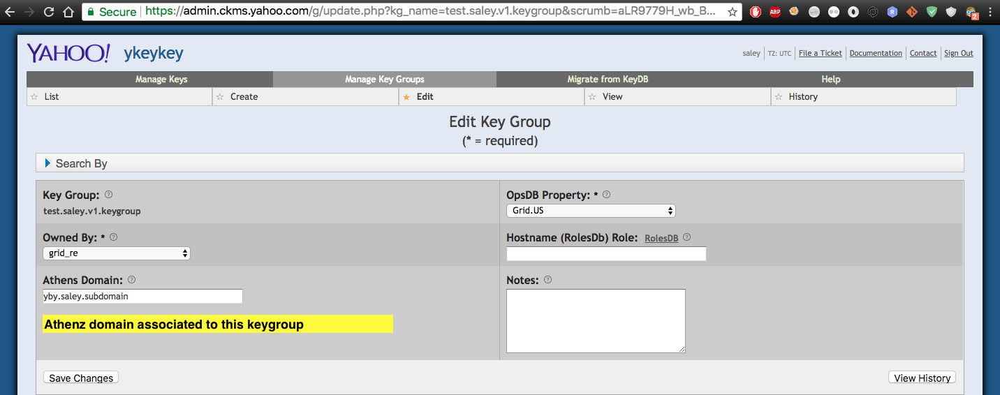
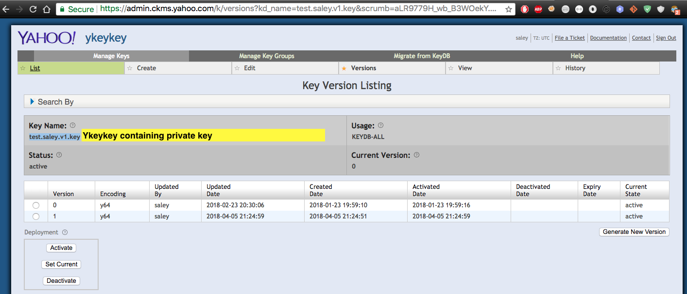
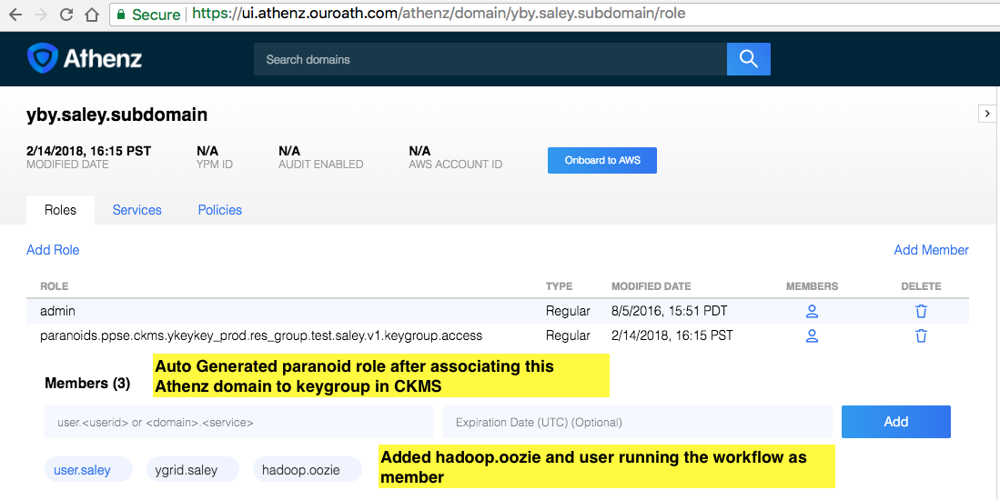
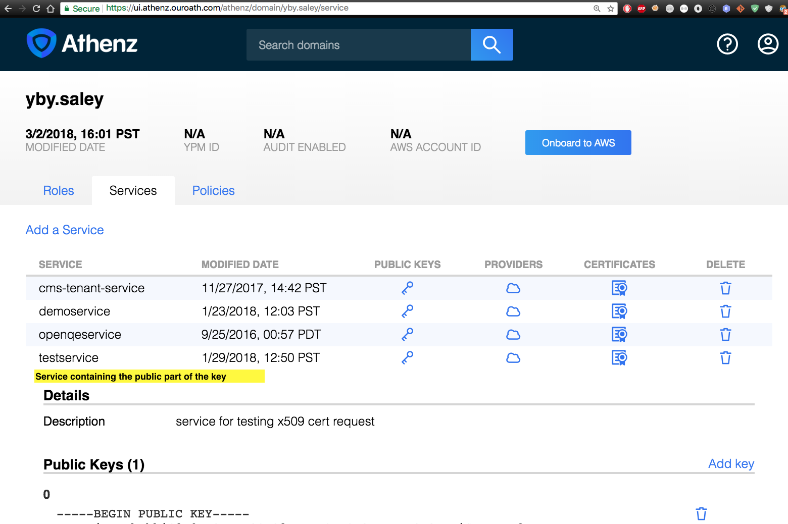
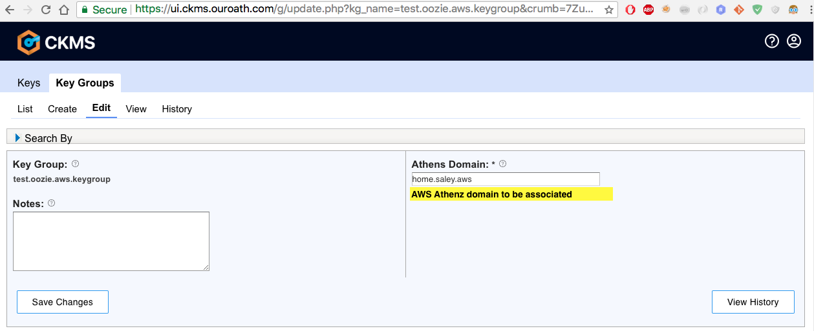
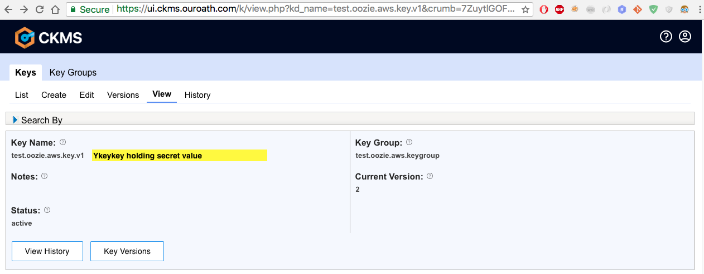
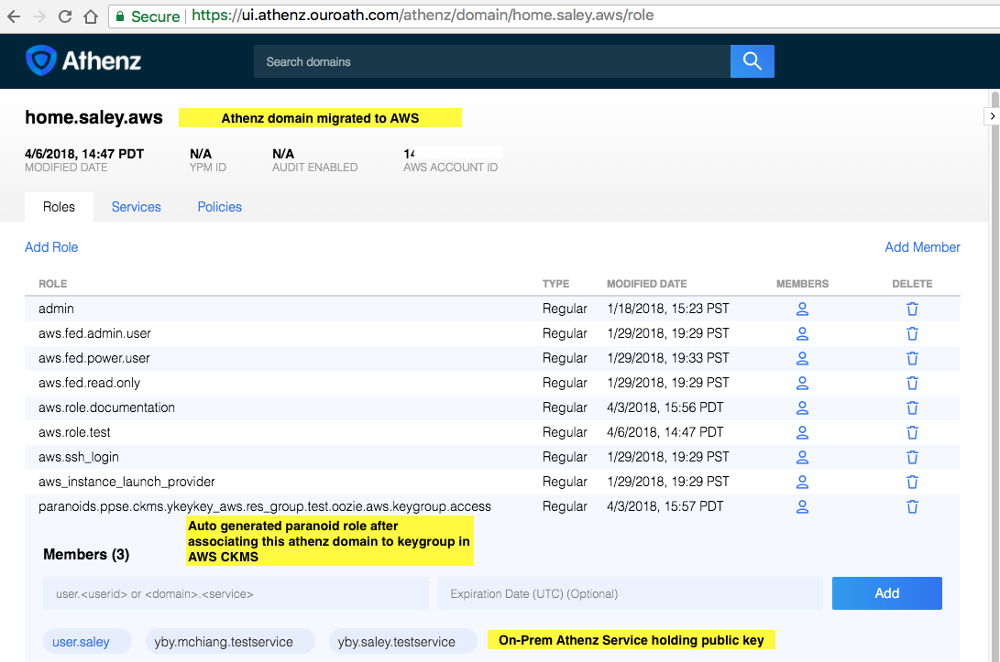
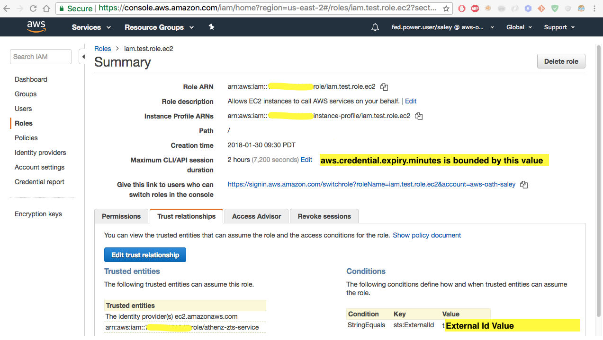

.. _auth:

Authentication/Authorization
============================

.. 04/15/15: Rewrite
.. 05/11/15: Second edit.

Oozie provides two different ways of authentication: Kerberos and YCA.
You need to do some setting up for Kerberos and YCA.

.. _oozie_client:

Oozie Client
------------

.. _auth-kerberos:

Kerberos Authentication
~~~~~~~~~~~~~~~~~~~~~~~

Yahoo Oozie is bundled with a custom Oozie command-line tool that adds Kerberos 
authentication. The ``-auth`` option can take the argument ``kerberos`` to authenticate 
by Kerberos. When submitting a job or any other tasks, the user can only specify 
Kerberos as authentication type if the Oozie server is configured to accept this 
authentication.

#. Before invoking Oozie, obtain and cache the Kerberos ticket-granting ticket::

       $ kinit $USER@Y.CORP.YAHOO.COM

   You can also use the following if you have a keytab file::

       $ kinit -kt ~/`whoami`.dev.headless.keytab `whoami`@DEV.YGRID.YAHOO.COM

#. To invoke Oozie using Kerberos authentication::

       $ oozie job -oozie http://kryptonitered-oozie.red.ygrid.yahoo.com:4080/oozie -run -config job.properties -auth KERBEROS

#. To test Kerberos using cURL:

   - Create a cookie file::

         $ curl -v -c cookie.txt --negotiate -u $USER -k http://kryptonitered-oozie.red.ygrid.yahoo.com:4080/oozie/v1/admin/build-version

   - Reuse the existing cookie::

         $ curl -b cookie.txt --negotiate -u $USER -k http://kryptonitered-oozie.red.ygrid.yahoo.com:4080/oozie/v1/admin/build-version

#. Use the default Kerberos ticket::

       $ curl --negotiate -u $USER -k http://kryptonitered-oozie.red.ygrid.yahoo.com:4080/oozie/v1/admin/build-version

.. note:: The examples above use the Oozie server on Kryptonite Red. To use Oozie servers on other clusters,
          see :ref:`Oozie Serves on Clusters <references-oozie_servers>`.

.. _kerberos-client_API:

Client API Example of Kerberos Authentication
+++++++++++++++++++++++++++++++++++++++++++++

#. Include the JAR ``/home/y/var/yoozieclient/lib/*jar`` in your ``CLASSPATH``.
#. Create the Oozie client ``KerbAPIExample.java`` with the following code:

   .. code-block:: java

      package com.yahoo.oozie.test;
      import org.apache.oozie.client.OozieClientException;
      import org.apache.oozie.client.XOozieClient;
      import org.apache.oozie.client.AuthOozieClient;
      import org.apache.hadoop.security.authentication.client.Authenticator;
      import com.yahoo.oozie.security.authentication.client.KerberosAuthenticator;
      import java.net.URL;
      import java.util.HashMap;
      import java.util.Map;
      
      public class KerbAPIExample {
      
          public static void main(String args[]) {
              String oozieurl="http://kryptonitered-oozie.red.ygrid.yahoo.com:4080/oozie";
              String jobId = args[0];
              KerbOozieClient koc = new KerbOozieClient(oozieurl);
              try {
                  System.out.println(koc.getJobInfo(jobId,0,10));
              } catch (OozieClientException e) {
                  e.printStackTrace();
              }
          }
          static class KerbOozieClient extends AuthOozieClient {
      
              String kerbAuth = "KERBEROS";
              public KerbOozieClient(String oozieUrl) {
                  super(oozieUrl, "KERBEROS");
              }
      
              @Override
              protected Map<String, Class<? extends Authenticator>> getAuthenticators() {
                  Map<String, Class<? extends Authenticator>> authClasses = new HashMap<String, Class<? extends Authenticator>>();
                  authClasses.put(kerbAuth, KerberosAuthenticator.class);
                  return authClasses;
              }
      
          }
      }

#. Compile the code: ``$ javac -cp $CLASSPATH KerbAPIExample.java``
#. Run your example: ``$ java -cp $CLASSPATH KerbAPIExample 00001-1234-W``

.. _kerberos-yca_auth:

YCA Authentication
~~~~~~~~~~~~~~~~~~

Yahoo Oozie is also bundled with a custom command-line tool that adds YCA 
authentication. The ``-auth`` option can take the argument ``yca`` to 
authenticate by YCA. When using Oozie to submit job or any other tasks, you 
can only specify YCA as the authentication type if Oozie server is configured to accept 
this authentication. Also, the allowed YCA namespaces have to be configured in the Oozie server.

.. _yca_auth-creating_role:

Creating an Oozie Role
++++++++++++++++++++++

To create a role in Oozie for a YCA allowed namespace:

#. If Oozie server accepts namespace ``"griduser"``, the user should create a 
   role under it. Refer to `Support YCAProtected Grid Service <http://twiki.corp.yahoo.com/view/Grid/SupportGYCA>`_ 
   for details.
         
   #. File a `Jira issue with OpsDB <https://jira.corp.yahoo.com/servicedesk/customer/portal/89/create/554>`_
      to create a role. Your role name should use the syntax ``<namespace>.<username>``.
   #. Register the list of hosts as members in this role.
   #. Install the ``yca`` and ``yca_client_certs`` packages. 
      The ``yca_client_certs`` package will only install successfully when
      that host is already present in the ``rolesdb``.
   #. Run the command ``/home/y/bin/yca-cert-util --show``. It will list 
      the ``yca`` certificates of the machine.

.. _yca_auth-invoke_oozie:

Invoking Oozie With YCA Authentication
++++++++++++++++++++++++++++++++++++++

To invoke Oozie by YCA authentication as the ``<username>`` at one of the registered hosts::

    $ oozie job -oozie http://localhost:8080/oozie -run -config job.properties -auth YCA

.. _yca_auth-yca_certs:

Verifying YCA Certificates
++++++++++++++++++++++++++

To list the YCA certificates of the machine and their expiration date::

    $ /home/y/bin/yca-cert-util --show --detail

If the certificate has expired, to refresh::

    $ /home/y/bin/yca-cert-util --fetch --refresh

To verify the certificate::

    $ curl -H "Yahoo-App-Auth: {the yca certificate from command yca-cer-util --show; starting from v1=1;a=yahoo.griduser.......}" -k http://{oozie server hostname}:4080/oozie/v1/admin/build-version

.. _yca_auth-yca_proxy:

YCA Authentication With YCA Proxy Server
++++++++++++++++++++++++++++++++++++++++

To use the YCA proxy server for YCA authentication::

    $ oozie -Dhttp.proxyHost=yca-proxy.corp.yahoo.com -Dhttp.proxyPort=3128 jobs -oozie http://{oozieurl} -auth YCA

.. _yca_auth-yca_workflow:

Workflow with YCAV2
-------------------

.. _yca_workflow-namespace:

Creating a Namespace and a Role
~~~~~~~~~~~~~~~~~~~~~~~~~~~~~~~

The role ``oozie.httpproxy`` is created for this purpose. You can create your 
namespace in the roles ``db`` and add a role under the namespace. In our case, the namespace 
is ``oozie``, and the role name is ``httpproxy``. Under the role, you can add the user who 
wants to submit the job with gYCA credential. For example, the user ``strat_ci``
can submit the Workflow with gYCA credential, so we add ``strat_ci.wsca.user.yahoo.com``
to the role ``oozie.httpproxy``. See the example http://roles.corp.yahoo.com:9999/ui/role?action=view&id=217516.

.. _yca_workflow-submit_ycav2:

Submit a Workflow With the YCAv2(gYCA) Certificate
~~~~~~~~~~~~~~~~~~~~~~~~~~~~~~~~~~~~~~~~~~~~~~~~~~

Users have to specify the gYCA credential explicitly in the beginning of a Workflow and
ask Oozie to retrieve certificate whenever an actions needs to call YCA protected web service.
In each credential element, attribute ``name`` is key and attribute ``type`` indicates which credential to use.
The credential ``type`` value for ycav2 is ``yca``. Users can give multiple ``credential`` elements under ``credentials`` and specify a
comma-separated list of credentials to use under each action ``cred`` attribute.
There is only one parameter required for the credential ``type``.

- ``yca-role``: the role name contains the user names for YCA v2 certificates.

There are three optional parameters for the credential type ``yca``:

- ``yca-webserver-url``: the YCA server URL. The default URL is http://ca.yca.platform.yahoo.com:4080.
- ``yca-cert-expiry``: The expiry time of the YCA certificate in seconds. The default is one day (86400). This is available from Oozie 3.3.1.
- ``yca-http-proxy-role``: The role name in the Roles DB that contains the hostnames of 
  the machines in the HTTP proxy VIP. The default value is ``grid.httpproxy`` which contains 
  all HTTP proxy hosts. This parameter depends on the HTTP proxy VIP you will be using to send 
  the obtained YCA v2 certificate to the Web service outside the grid. You can limit 
  the corresponding role name that contains the hosts of the HTTP proxy VIP. The 
  role names containing members of production HTTP proxy VIPs are ``grid.blue.prod.httpproxy``, 
  ``grid.red.prod.httpproxy``, and ``grid.tan.prod.httpproxy``. 
.. _yca-cert_add_to_jobconf:

- ``yca-cert-add-to-jobconf``: This can be *true* or *false*, default being *true* for backward compatibility reasons. If it is set to true, YCA certificate will be added to 
  action configuration. Adding YCA certificate to action configuration is less secure because the certificate is visible in the Configuration page of the Job UI
  and has to be secured by additionally setting ``mapreduce.job.acl-view-job`` to only users or groups with access instead of * (all).
  Instead, YCA certificate is now added as secret key to action configuration. :ref:`This example explains more <yca_cert_secretkey_example>`. 
  Therefore, it is good to set this property to *false* and retrive the YCA certificate from secret keys. 

  For example, the following contains the hosts of the production ``httpproxy``: ``http://roles.corp.yahoo.com:9999/ui/role?action=view&name=grid.blue.prod.httpproxy``
  This role is the parent role containing the staging, research, and production ``httpproxy`` hosts: ``http://roles.corp.yahoo.com:9999/ui/role?action=view&name=grid.blue.httpproxy``
  See the `Http Proxy Node List <http://twiki.corp.yahoo.com/view/Grid/HttpProxyNodeList>`_ for 
  the role name and VIP name of the deployed HTTP proxies for staging, research, and sandbox grids.

.. _yca_workflow-submit_ycav2_example:

Example Workflow XML
~~~~~~~~~~~~~~~~~~~~

The following ``workflow.xml`` snippet shows how to configure your Workflow to use YCA authentication and set the role:

.. code-block:: xml

   <workflow-app>
      <credentials>
         <credential name='myyca' type='yca'>
            <property>
               <name>yca-role</name>
               <value>griduser.actualuser</value>
            </property>
         </credential> 
      </credentials>
      <action cred='myyca'>
         <map-reduce>
            ...
         </map-reduce>
      </action>
   <workflow-app>

.. _submit_ycav2-java_code_ex:

Example with Map-Reduce Action
~~~~~~~~~~~~~~~~~~~~~~~~~~~~~~

YCA Certificate inside Action Configuration
+++++++++++++++++++++++++++++++++++++++++++

We have deprecated the way of adding YCA Certificate to action configuration as 
it was less secure. We advice to disable this as mentioned :ref:`here <yca-cert_add_to_jobconf>` and 
make changes in your code by referring to :ref:`this example <yca_cert_secretkey_example>`

In the :ref:`above example <yca_workflow-submit_ycav2_example>` , Oozie gets the certificate of gYCA and passes it to the action configuration. 
Mapper can then use this certificate by getting it from the action configuration, adding it to 
the HTTP request header when connecting to the YCA-protected Web service through ``HTTPProxy``. 

A certificate or token retrieved in the credential class would set an action configuration
as the name of credential defined in ``workflow.xml``. The following example shows 
how to communicate with the YCAV2-protected Web service from the grid.

.. code-block:: java

   //**proxy setup**

   //blue proxy
   //InetSocketAddress inet = new InetSocketAddress("httpproxy-prod.blue.ygrid.yahoo.com", 4080);
   //tan proxy
   InetSocketAddress inet = new InetSocketAddress("httpproxy-prod.tan.ygrid.yahoo.com", 4080);
   Proxy proxy = new Proxy(Type.HTTP, inet);
   URL server = new URL(fileURL);

   //**web service call**
   String ycaCertificate = conf.get("myyca");
   HttpURLConnection con = (HttpURLConnection) server.openConnection(proxy);
   con.setRequestMethod("GET");
   con.addRequestProperty("Yahoo-App-Auth", ycaCertificate);

.. _yca_cert_secretkey_example:

YCA Certificate as a secret key inside Credentials
++++++++++++++++++++++++++++++++++++++++++++++++++

In the :ref:`above example <yca_workflow-submit_ycav2_example>`, Oozie gets the certificate of gYCA 
and passes it to the Credentials as a secret key.
Mapper can then use this certificate by getting it from the action configuration, adding it to 
the HTTP request header when connecting to the YCA-protected Web service through ``HTTPProxy``. 

A certificate or token retrieved in the credential class would set a secret key in action configuration
as the name of credential defined in ``workflow.xml``. The following example shows 
how to communicate with the YCAV2-protected Web service from the grid.

.. code-block:: java

   //**proxy setup**

   //blue proxy
   //InetSocketAddress inet = new InetSocketAddress("httpproxy-prod.blue.ygrid.yahoo.com", 4080);
   //tan proxy
   InetSocketAddress inet = new InetSocketAddress("httpproxy-prod.tan.ygrid.yahoo.com", 4080);
   Proxy proxy = new Proxy(Type.HTTP, inet);
   URL server = new URL(fileURL);

   //**web service call**
   //Get the secret key by passing the name of credential
   byte[] bytes = conf.getCredentials().getSecretKey(new Text("myyca"));
   //Create certificate string using bytes with UTF-8
   String ycaCertificate = new String(bytes, "UTF-8"); 
   HttpURLConnection con = (HttpURLConnection) server.openConnection(proxy);
   con.setRequestMethod("GET");
   con.addRequestProperty("Yahoo-App-Auth", ycaCertificate);

Example with Java Action
~~~~~~~~~~~~~~~~~~~~~~~~

.. _java_action_ex:

Example workflow xml including Java Action:

.. code-block:: xml

   <credential name="yca.cert" type="yca">
   ......
   <action name="java_gyca" cred="yca.cert">
     <java>
        ......
        <main-class>TestYcaCert</main-class>
        <arg>yca.cert</arg>
        .....
     </java>
     ...
   </action>

.. _java_yca_inside_config:

YCA Certificate inside Action Configuration
+++++++++++++++++++++++++++++++++++++++++++

With respect to :ref:`above workflow snippet:<java_action_ex>`, we can retrieve yca certificate from Configuration as follows-

.. code-block:: java

    public class TestYcaCert {
      // for oozie java action
      public static void main(String[] args) throws Throwable {
        String YCA_CERT = args[0]; // YCA_CERT is the name of yca credential.

        Configuration actionConf = new Configuration(false);
        actionConf.addResource(new Path("file:///", System.getProperty("oozie.action.conf.xml")));
        String ycaCertificate = actionConf.get(YCA_CERT);
        ......

.. _java_yca_inside_sec_key:

YCA Certificate as a secret key inside Credentials
++++++++++++++++++++++++++++++++++++++++++++++++++

With respect to :ref:`above workflow snippet:<java_action_ex>`, we can retrieve yca certificate from Credentials as follows.
YCA certificate is present as Secret Key inside Credentials.

.. code-block:: java

    public class TestYcaCert {
      // for oozie java action
      public static void main(String[] args) throws Throwable {
         String YCA_CERT = args[0]; // YCA_CERT is the name of yca credential.
         Configuration actionConf = new Configuration(false);
         actionConf.addResource(new Path("file:///", System.getProperty("oozie.action.conf.xml")));
         //Get the secret key by passing the name of credential
         byte[] bytes = actionConf.getCredentials().getSecretKey(new Text(YCA_CERT));
         //Create certificate string using bytes with UTF-8
         String ycaCertificate = new String(bytes, "UTF-8"); 
         ......

Following example shows how to retrive YCA certificate in Scala.

.. code-block:: scala

   import org.apache.hadoop.security.{Credentials,UserGroupInformation}
   import org.apache.hadoop.io.Text

   object TestYcaCert {
     def main(args: Array[String]) {
       val YCA_CERT = args(0)
       val creds = UserGroupInformation.getCurrentUser().getCredentials()
       val ycaCertificate = new String(creds.getSecretKey(new Text(YCA_CERT)), "UTF-8")
       println("YCA Cert is " + ycaCertificate)
       .......
       .......
     }
   }

.. _yca_shell_ex:

Example with Shell Action
~~~~~~~~~~~~~~~~~~~~~~~~~

.. code-block:: xml

   <workflow-app>
      <credentials>
         <credential name='myyca' type='yca'>
            <property>
               <name>yca-role</name>
                  <value>griduser.actualuser</value>
            </property>
         </credential> 
      </credentials>
      <action cred='myyca'>
         <shell>
            ...
         </shell>
      </action>
   <workflow-app>

In the above example, Oozie gets the certificate of gYCA and passes it to the action configuration. 
A certificate or token retrieved in the credential class would set an action configuration 
as the name of credential defined in ``workflow.xml``. In the Shell Action, it is accessible 
through environment variable - ``OOZIE_ACTION_CONF_XML``. 

.. code-block:: bash

   CERT=$(cat $OOZIE_ACTION_CONF_XML | perl -lne 'print $1 if /\<property\>\<name\>myyca\<\/name\>\<value\>([^<]+)<\/value>/')
   echo "Certificate = $CERT"

.. _workflow_with_Athens:

Workflow with on-prem Athens role token
---------------------------------------

`Athens <https://git.ouroath.com/pages/athens/athenz-guide/>`_ is a hosted service at Yahoo supporting role-based authorization.
Oozie is a special proxy user of the Athens which supports fetching role tokens for a particular role on behalf of a user. 
To enable that, users will have to add ``hadoop.oozie`` in case of YGRID clusters and ``vcg.prod.oozie`` in case of VCG clusters
as member to the role that they want to give access to in addition to the username under which
the Oozie workflow will be run as. The user can either be user.<Oath user> or ygrid.<headless user>.
`Refer this link <https://supportshop.cloud.corp.yahoo.com:4443/doppler/hadoop>`_ to determine type of cluster.

For eg: If the workflow will be run as user filo on a YGRID cluster, then ``hadoop.oozie`` and ``user.filo`` will have to be added as members
of that role. If the workflow will be run as grid headless user mog_prod, then ``hadoop.oozie`` and ``ygrid.mog_prod`` will 
have to be added as members of that role. 

Similar to other credentials like hcat or YCA, you will have to add a Athens credential section to the workflow with the 
domain and role details. This credential definition can then be referred in individual actions which need it. 

Required properties for an Athens credential

- ``athens.domain`` : Athens domain in which the role is present.
- ``athens.role`` : The role in the domain for which token should be fetched.
  Multiple roles can be specified separated by a comma.

Optional properties

- ``athens.user.domain`` : The domain in which user resides. The default value is ``ygrid``. If you are running as yourself 
  and not a headless user, set value for this to ``user``.
- ``athens.trust.domain`` : Athens will only look for trusted roles in this domain.
- ``athens.min.expiry`` : It specifies that the returned role token must be at least valid (min/lower bound) 
  for specified number of seconds.
- ``athens.max.expiry`` : It specifies that the returned role token must be at most valid (max/upper bound) 
  for specified number of seconds.

  By default Athens will issue a token that is valid for 2 hours. Set the ``athens.min.expiry`` and
  ``athens.max.expiry`` to a higher value if your job is going to run for a longer period of time
  and will be accessing the token after 2 hours of job submission.
.. _athens_auth_wf_ex:

Example Workflow XML
~~~~~~~~~~~~~~~~~~~~

The following ``workflow.xml`` snippet shows how to configure your Workflow to use Athens authentication:

.. code-block:: xml

   <workflow-app>
    <credentials>
       <credential name='athensauth' type='athens'>
           <property>
               <name>athens.domain</name>
               <value>sherpa</value>
           </property>
           <property>
               <name>athens.role</name>
               <value>table1.write.access</value>
           </property>
           <!-- athens.user.domain is not required when running as headless user as the default value is ygrid -->
            <property>
               <name>athens.user.domain</name>
               <value>user</value>
           </property>
           <property>
               <name>athens.min.expiry</name>
               <value>10800</value>
           </property>
       </credential> 
    </credentials>
    <action cred='athensauth'>
       <java>
          ...
       </java>
    </action>
   <workflow-app>

Oozie retrieves the role token based on the provided credential properties and sends it to the job running the java action. 
The ZTS local client cache is populated with the role token, so that the user can get the role token in their java code using 
the Athens ZTSClient.getRoleToken API. This requires having the ``zts_java_client.jar`` from 
http://dist.corp.yahoo.com/by-package/zts_java_client/ in the workflow lib directory. The following example shows how to get 
the role token in the hadoop job and how to authenticate to a Athens protected web service by passing 
the token in the ``Yahoo-Role-Auth`` header. For compiling the code, following dependency should be added.

.. code-block:: xml

   <dependency>
     <!-- Do not shade this dependency.
     If shaded, it will not be possible for Oozie
     to inject the Athens token into ZTSClient cache
     and the job will fail unable to access the token -->
     <groupId>yahoo.yinst.zts_java_client</groupId>
     <artifactId>zts_java_client</artifactId>
     <version>1.5.42</version>
     <scope>compile</scope>
   </dependency>

.. code-block:: java

   // Headless user 'mog_prod' has submitted the Oozie job.
   // Create ZTSClient object by passing domain for the user/service and user/service name
   ZTSClient ztsClient = new ZTSClient("ygrid", "mog_prod");
   // If employee 'filo' had submitted the Oozie job, then it would be
   // ZTSClient ztsClient = new ZTSClient("user", "filo");
   // table1.write.access is the athens.role mentioned in workflow.xml.
   RoleToken roleToken = ztsClient.getRoleToken("sherpa", "table1.write.access");
   roleTokenStr = roleToken.getToken();
   ztsClient.close();
   
   // Web service call to the external web service via proxy. 
   // This example assumes a production cluster in gq1 and uses corresponding proxy.
   // Refer http://twiki.corp.yahoo.com/view/Grid/HttpProxyNodeList for the different proxy urls.
   InetSocketAddress inet = new InetSocketAddress("httpproxy-prod.blue.ygrid.yahoo.com", 4080);
   Proxy proxy = new Proxy(Type.HTTP, inet);
   URL url = new URL(<<external web service url>>);
   HttpURLConnection conn = (HttpURLConnection) url.openConnection(proxy);
   conn.setRequestMethod("GET");
   conn.addRequestProperty("Yahoo-Role-Auth",roleTokenStr);

As an alternate method to the ZTSClient API, tokens can be retrieved from the UGI similar to YCAv2. For eg:

.. code-block:: java

   Credentials creds = UserGroupInformation.getCurrentUser().getCredentials();
   // athensauth is the name of Athens credential provided in workflow.xml
   token = new String(creds.getSecretKey(new Text("athensauth")), "UTF-8");

.. _workflow_with_ykeykey

Workflow with on-prem CKMS secret
---------------------------------

`CKMS <https://git.ouroath.com/pages/ykeykey/ckms-guide/>`_ (http://yo/ckms) which was earlier referred to as YKeyKey is Oath’s centralized secret management and distribution system.
Oozie supports retrieving ykeykey secrets for use in hadoop jobs launched through it. Oozie uses Athens token to authenticate and retrieve the ykeykey secret. The secret is then passed on to the hadoop job and made accessible via Credentials object in UserGroupInformation or JobConf.

Prerequisites:

- An Athens domain needs to be associated with the ykeykey key group. Refer to https://yahoo.jiveon.com/docs/DOC-70338#jive_content_id_Add_Your_Athens_Domain_Using_the_ykeykey_UI for more details on that. This automatically creates a role in the `paranoids.ppse.ckms <https://athens.corp.yahoo.com/athens/domain/paranoids.ppse.ckms/role>`_ Athens domain in the form of ``ykeykey_prod.tenant.<ykeykey-athens-domain>.res_group.<ykeykey-keygroup-name>.access``

- To allow Oozie to fetch Athens token, users will have to add ``hadoop.oozie`` and the username used to run the Oozie workflow as members of the newly created paranoid role ``ykeykey_prod.tenant.<ykeykey-athens-domain>.res_group.<ykeykey-keygroup-name>.access`` under the `paranoids.ppse.ckms <https://athens.corp.yahoo.com/athens/domain/paranoids.ppse.ckms/role>`_ Athens domain. The username will be either be ``user.<Oath user>`` for normal users or ``ygrid.<headless user>`` for headless users.

Similar to other credentials like hcat or YCA, you will have to add a ykeykey credential section to the workflow.

Required properties for a ykeykey credential

- ``ykeykey.group``: Name of the ykeykey key group.
- ``ykeykey.key``: Name of the ykeykey key.
- ``ykeykey.athens.domain``: Name of the athens domain associated with ykeykey key group specified in ``ykeykey.group`` setting.

Optional properties

- ``athens.user.domain``: The domain in which user resides. The default value is ygrid. If you are running as yourself and not a headless user, set value for this as user.
- ``ykeykey.version``: Oozie will fetch secret of all versions, if no version is specified.
- ``ykeykey.env``: By default it is ``prod``. Possible values ``alpha``, ``beta``, ``corp``, ``edge``, ``vault``.

Example Workflow XML
~~~~~~~~~~~~~~~~~~~~

The following ``workflow.xml`` snippet shows how to configure your Workflow to use ykeykey authentication:

.. code-block:: xml

  <workflow-app>
      <credentials>
          <credential name="YKeyKey_test" type="ykeykey">
              <property>
                  <name>ykeykey.group</name>
                  <value>purushah.test.group</value>
              </property>
              <property>
                  <name>ykeykey.key</name>
                  <value>key</value>
              </property>
              <property>
                  <name>ykeykey.version</name>
                  <value>0</value>
              </property>
              <property>
                  <name>ykeykey.athens.domain</name>
                  <value>home.purushah</value>
              </property>
              <property>
                  <name>ykeykey.athens.user.domain</name>
                  <value>user</value>
              </property>
          </credential>
      </credentials>
      <action cred="YKeyKey_test">
          <map-reduce>
          ............
          </map-reduce>
      </action>
  </workflow-app>

.. _retrieving_ykeykey_secret:

Retrieving secret using UGI
~~~~~~~~~~~~~~~~~~~~~~~~~~~
.. code-block:: java

   byte[] secret = UserGroupInformation.getCurrentUser().getCredentials().getSecretKey(new Text("YKeyKey_test"));

UGI will give secret for the current version if no version is specified in the credential section for ykeykey.version.

Retrieving secret using GridYKeyKeyUtil
~~~~~~~~~~~~~~~~~~~~~~~~~~~~~~~~~~~~~~~
GridYKeyKeyUtil can be used to retrieve secret for multiple versions. GridYKeyKeyUtil has very similar API to YCR.

By default, GridYKeyKeyUtil is part of Hadoop job classpath. :ref:`For compilation you can use oozie-client <oozie_maven_artifacts>` with scope as provided. Please do not bundle it with oozie workflow. It can fail due to conflicts.

API details of GridYKeyKeyUtil
++++++++++++++++++++++++++++++

public static byte[] getKeyBytes(String key); //Return secret of the current version.

public static byte[] getKeyBytes(String key, short version); //Return the secret of the specified version.

.. code-block:: java

   byte[] secret_currentVersion = GridYKeyKeyUtil.getKeyBytes(key);
   byte[] secret_version1 = GridYKeyKeyUtil.getKeyBytes(key, version);

Retrieving ykeykey secret using native library
~~~~~~~~~~~~~~~~~~~~~~~~~~~~~~~~~~~~~~~~~~~~~~
To read ykeykey secret using YCR, add `GRID_YKEYDB_PATH = ./keydb' to `mapreduce.map.env` and `mapreduce.reduce.env and call GridYKeyKeyUtil.setupKeyDB() to setup keydb.
Once keydb is setup, users can call YCR native call to retrieve secret. This requires ykeydb >= 2.9.1.

.. code-block:: java

   GridYKeyKeyUtil.setupKeyDB();
   YCR ycr = YCR.createYCR();
   secret = ycr.getKey(key);

Workflow with AWS CKMS secret
-----------------------------

In addition to CKMS hosted in on-prem environment, CKMS is also hosted in AWS (http://yo/ckms-aws). Oozie can fetch secret from AWS CKMS as well.

Prerequisites:

.. _create_private_public_pair:

- Create a PEM encoded private-public key pair.

.. code-block:: bash

    $ openssl genrsa -des3 -out pair.pem 2048
    $ openssl rsa -in pair.pem -pubout -out public.pem -outform PEM
    $ openssl rsa -in pair.pem -out private.pem -outform PEM

.. _create_keygroup_on_prem:

- In on-prem CKMS, associate an athens domain to key group. Refer to `Add athens domain using ykeykey UI <https://yahoo.jiveon.com/docs/DOC-70338#jive_content_id_Add_Your_Athens_Domain_Using_the_ykeykey_UI>`_ .
  This automatically creates a role in the `paranoids.ppse.ckms <https://ui.athenz.ouroath.com/athenz/domain/paranoids.ppse.ckms/role>`_ athens domain in the form of ``ykeykey_prod.tenant.<ykeykey.athens.domain>.res_group.<ykeykey.keygroup>.access``.

.. _create_ykeykey_on_prem:

- Create a ykeykey in that key group. Store private key as secret.

.. _add_oozie_and_user_to_role:

- There will be a corresponding role in associated athens domain of the format ``paranoids.ppse.ckms.ykeykey_prod.res_group.<ykeykey.keygroup>.access`` .
  To allow Oozie to fetch Athens token, users will have to add ``hadoop.oozie`` and the username
  used to run the Oozie workflow as members of the newly created paranoid role ``paranoids.ppse.ckms.ykeykey_prod.res_group.<ykeykey.keygroup>.access``.
  The username will be either be ``user.<Oath user>`` for normal users or ``ygrid.<headless user>`` for headless users.

.. _create_athens_service_on_prem:

- Create a service in on-prem athens using the public key.

- Migrate an athens domain to AWS. Refer `on boarding to AWS <https://thestreet.ouroath.com/docs/DOC-4068>`_
- Create a key group in AWS CKMS. Make sure that AWS Athens domain is associated with the key group.

- Create a key in the key group to hold store secret value.

- There will be a role in the `paranoids.ppse.ckms <https://ui.athenz.ouroath.com/athenz/domain/paranoids.ppse.ckms/role>`_
  athens domain in the form of ``ykeykey_aws.tenant.<aws-ykeykey-athens-domain>.res_group.<aws.ykeykey.group>.access``
- There will be a corresponding role in AWS athens domain in the form of ``paranoids.ppse.ckms.ykeykey_aws.res_group.<aws.ykeykey.group>.access``.
- Users need to add on-prem athens service (specified in ``athens.service`` property) as member to it.

Required Properties:

- ``ykeykey.group``: Name of the ykeykey key group.
- ``ykeykey.key``: Name of the ykeykey key. This should contain PEM encoded private key.
- ``ykeykey.athens.domain``: Name of the athens domain associated with ykeykey key group specified in ``ykeykey.group`` setting.
- ``athens.service``: The Athens service which contains the PEM encoded public key corresponding to the private key.
- ``athens.service.domain``: The domain in which service resides.
- ``athens.service.public.key.id``: The public key id for the athens service specified in ``athens.service``.
- ``aws.ykeykey.group``: Name of the ykeykey key group in AWS.
- ``aws.ykeykey.key``: Name of the ykeykey key in AWS.

Optional properties

- ``athens.user.domain``: The domain in which user resides. The default value is ygrid. If you are running as yourself and not a headless user, set value for this as user.
- ``ykeykey.version``: Oozie will fetch secret of all versions, if no version is specified. Oozie will take private key from
  current version
- ``ykeykey.env``: By default it is ``prod``. Possible values ``alpha``, ``beta``, ``corp``, ``edge``, ``vault``.
- ``aws.ykeykey.version``: Oozie will fetch secret of current version, if no version is specified.
- ``aws.ykeykey.env``: By default it is aws. Use ``aws_stage`` to refer to staging CKMS in AWS.

.. code-block:: xml

    <credential name='ykeykeyauth' type='ykeykey'>

        <!-- Properties for ykeykey which is on-prem CKMS-->
        <property>
            <name>ykeykey.group</name>
            <value>test.saley.v1.keygroup</value>
        </property>
        <property>
            <name>ykeykey.key</name>
            <value>test.saley.v1.key</value>
        </property>
        <property>
            <name>ykeykey.version</name>
            <value>0</value>
        </property>
        <property>
            <name>ykeykey.athens.domain</name>
            <value>yby.saley.subdomain</value>
        </property>

        <!-- Properties for athens service which is on-prem and contains public key corresponding to the private key specified in
        ykeykey.key -->
        <property>
            <name>ykeykey.athens.service</name>
            <value>testservice</value>
        </property>

        <property>
            <name>ykeykey.athens.service.domain</name>
            <value>yby.saley</value>
        </property>

        <property>
            <name>ykeykey.athens.service.public.key.id</name>
            <value>0</value>
        </property>

        <!-- Properties for the ykeykey in AWS CKMS -->
        <property>
            <name>aws.ykeykey.group</name>
            <value>test.oozie.aws.keygroup</value>
        </property>
        <property>
            <name>aws.ykeykey.key</name>
            <value>test.oozie.aws.key.v1</value>
        </property>
        <property>
            <name>aws.ykeykey.version</name>
            <value>1</value>
        </property>
    </credential>

Retrieving secret is explained :ref:`above <retrieving_ykeykey_secret>`

Workflow with AWS Temporary Credentials
---------------------------------------

Oozie can fetch AWS Temporary Credentials.

Prerequisites:

- Migrate an athens domain to AWS. Refer `on-boarding to AWS <https://thestreet.ouroath.com/docs/DOC-4068>`_.
- AWS Configuration must have been done. Refer `Athens Documentation <https://git.ouroath.com/pages/athens/athenz-guide/aws_temp_creds/>`_.
- Create a PEM encoded private-public key pair. :ref:`Refer above <create_private_public_pair>`.
- In on-prem CKMS, associate an athens domain to key group. Refer to `Add athens domain using ykeykey UI <https://yahoo.jiveon.com/docs/DOC-70338#jive_content_id_Add_Your_Athens_Domain_Using_the_ykeykey_UI>`_ .
  This automatically creates a role in the `paranoids.ppse.ckms <https://ui.athenz.ouroath.com/athenz/domain/paranoids.ppse.ckms/role>`_ athens domain in the form of ``ykeykey_prod.tenant.<ykeykey.athens.domain>.res_group.<ykeykey.keygroup>.access``.
  :ref:`Refer above screenshot<create_keygroup_on_prem>`.
- Create a ykeykey in that key group. Store private key as secret. :ref:`Refer above <create_ykeykey_on_prem>`.
- There will be a corresponding role in associated athens domain of the format ``paranoids.ppse.ckms.ykeykey_prod.res_group.<ykeykey.keygroup>.access`` .
  To allow Oozie to fetch Athens token, users will have to add ``hadoop.oozie`` and the username
  used to run the Oozie workflow as members of the newly created paranoid role ``paranoids.ppse.ckms.ykeykey_prod.res_group.<ykeykey.keygroup>.access``.
  The username will be either be ``user.<Oath user>`` for normal users or ``ygrid.<headless user>`` for headless users. :ref:`Refer above screenshot<add_oozie_and_user_to_role>`.
- Create a service in on-prem athens using the public key. :ref:`Refer above screenshot<create_athens_service_on_prem>`.
- The role specified while creating policy (`in this step <https://git.ouroath.com/pages/athens/athenz-guide/aws_temp_creds/#athenz-aws-assume-role-configuration-setup>`_ in AWS athens should contain on-prem
  athens service as member.

Properties:

- ``ykeykey.group``: Name of the ykeykey key group.
- ``ykeykey.key``: Name of the ykeykey key. This should contain PEM encoded private key.
- ``ykeykey.athens.domain``: Name of the athens domain associated with ykeykey key group specified in ``ykeykey.group`` setting.
- ``athens.service``: The Athens service which contains the PEM encoded public key corresponding to the private key.
- ``athens.service.domain``: The domain in which service resides.
- ``athens.service.public.key.id``: The public key id for the athens service specified in ``athens.service``.
- ``aws.athens.domain``: The Athens domain in AWS.
- ``aws.iam.role``: IAM role name for which temporary credentials are required.

Optional properties:

- ``ykeykey.version``: Oozie will fetch secret of all versions, if no version is specified. Oozie will take private key from
  current version.
- ``athens.user.domain``: The domain in which user resides. The default value is ygrid. If you are running as yourself and not a headless user, set value for this as ``user``.
- ``aws.credential.expiry.minutes``: The validity of AWS credentials. Default is 60 minutes. For more than 60 minutes, first you need to update session duration in AWS as specified in `Athenz Document <https://git.ouroath.com/pages/athens/athenz-guide/aws_temp_creds/#expiration-period>`_ and then specify validity accordingly.
- ``aws.external.id.ykeykey.key``: Name of the ykeykey key containing external Id. This ykeykey should be in the same keygroup, mentioned in ``ykeykey.group`` setting. `Refer Athenz Guide for more information on external id. <https://git.ouroath.com/pages/athens/athenz-guide/aws_temp_creds/#external-id-condition>`_. This is a mandatory property if external id is configured for IAM role specified in ``aws.iam.role``.
- ``aws.external.id.ykeykey.version``: The ykeykey version containing value of external id. If not specified, Oozie will consider current version.

.. code-block:: xml

    <credential name='awsauth' type='aws'>
        <!-- Properties for ykeykey which is in on-prem CKMS -->
        <property>
            <name>ykeykey.group</name>
            <value>test.saley.v1.keygroup</value>
        </property>
        <property>
            <name>ykeykey.key</name>
            <value>test.saley.v1.key</value>
        </property>
        <property>
            <name>ykeykey.version</name>
            <value>0</value>
        </property>
        <property>
            <name>ykeykey.athens.domain</name>
            <value>yby.saley.subdomain</value>
        </property>

        <!-- Properties for athens service which is on-prem and contains public key corresponding to the private key specified in
        ykeykey -->
        <property>
            <name>athens.service</name>
            <value>testservice</value>
        </property>
        <property>
            <name>athens.service.domain</name>
            <value>yby.saley</value>
        </property>
        <property>
            <name>athens.service.public.key.id</name>
            <value>0</value>
        </property>

        <!-- Properties for IAM role -->
        <property>
            <name>aws.athens.domain</name>
            <value>home.saley.aws</value>
        </property>
        <property>
            <name>aws.iam.role</name>
            <value>iam.test.role.ec2</value>
        </property>

        <!-- Optional Property -->

        <property>
            <name>aws.credential.expiry.minutes</name>
            <value>70</value>
        </property>

        <!-- Since iam.test.role.ec2 is configured with external id, we need to specify ykeykey containing the external id -->
        <property>
            <name>aws.external.id.ykeykey.key</name>
            <value>test.saley.aws.external.id</value>
        </property>

        <property>
            <name>aws.external.id.ykeykey.version</name>
            <value>0</value>
        </property>
    </credential>

Oozie retrieves the AWS temporary credentials and sends it to the launcher job.

Retrieving AWS temporary credentials using UGI
~~~~~~~~~~~~~~~~~~~~~~~~~~~~~~~~~~~~~~~~~~~~~~

The fields for AWS Temporary credential are stored in JSON format inside ``UserGroupInformation``.

.. code-block:: java

    import org.json.simple.JSONObject;
    import org.json.simple.parser.JSONParser;
    import org.json.simple.parser.ParseException;

    Credentials creds = UserGroupInformation.getCurrentUser().getCredentials();
    // awsauth is the name of AWS credential provided in workflow.xml
    secret = new String(creds.getSecretKey(new Text("awsauth")), "UTF-8");

    JSONObject jsonObject = (JSONObject) new JSONParser().parse(secret);
    String accessKeyId = (String) jsonObject.get("accessKeyId");
    String secretAccessKey = (String) jsonObject.get("secretAccessKey");
    String sessionToken = (String) jsonObject.get("sessionToken");
    String expiration = (String) jsonObject.get("expiration");

Dependency for parsing JSON -

.. code-block:: xml

    <!-- https://mvnrepository.com/artifact/com.googlecode.json-simple/json-simple -->
    <dependency>
        <groupId>com.googlecode.json-simple</groupId>
        <artifactId>json-simple</artifactId>
        <version>1.1.1</version>
    </dependency>

