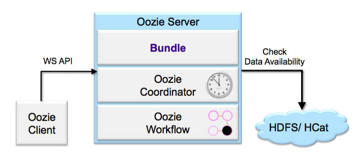
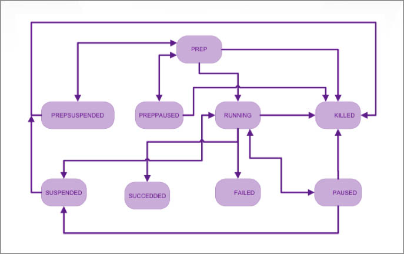

Bundles
=======

.. 04/16/15: Rewrote.
.. TBD: Provide annotations for diagrams.

Overview
--------

Bundle is a higher-level Oozie abstraction that batches a set of Coordinator 
applications. The user can start, stop, suspend, resume, and rerun in the 
Bundle-level, making it easier to control the operation. 

More specifically, the Oozie Bundle system allows the user to define and execute 
a bunch of Coordinator applications often called a data pipeline. No explicit 
dependency exists among the Coordinator applications in a Bundle. A user, however, could 
use the data dependency of Coordinator applications to create an implicit data 
application pipeline.

TBD: Need to annotate diagram below.

State Transitions
-----------------

TBD: Need to annotate the diagram below.

