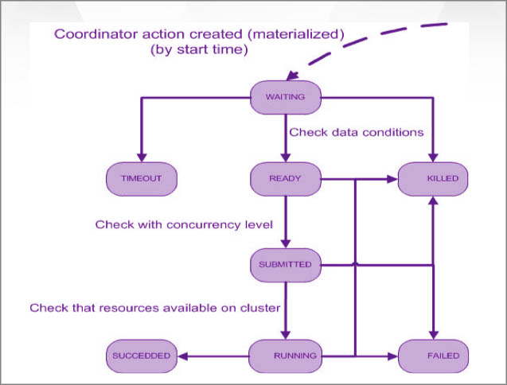

============
Coordinators
============

Overview
--------

Oozie is the workflow management solution for the Grid. It is provided as a service on the Yahoo! Grids.
Oozie is comprised of two components:

**Workflow Engine**

Executes workflow actions that are arranged in a control dependency acyclic graph (DAG)
Supports the following actions: Map-Reduce, Pig, Streaming, Pipes, Java, File system operations

**Coordinator Engine**

Triggers workflow execution based on time (like cron)
Triggers workflow execution based on input data availability

The following document will describe common use cases for both Oozie components. 
You will learn when you should use the Oozie Workflow Engine, and when you should 
use the Oozie Coordinator.

Architecture Overview
---------------------

.. image:: images/coord_overview.jpg
   :height: 316px
   :width: 753 px
   :scale: 95 %
   :alt: Oozie Technology Stack
   :align: right

Coordinator Schema
------------------

http://www.google.com/url?q=http%3A%2F%2Fkryptonitered-oozie.red.ygrid.yahoo.com%3A4080%2Foozie%2Fdocs%2FCoordinatorFunctionalSpec.html%23Oozie_Coordinator_Schema_0.4&sa=D&sntz=1&usg=AFQjCNFJPfF_GnDDApd_K3Lpj-6Y4z3LFg

Use Cases
---------

Overview
~~~~~~~~

Here is a typical use case for the Oozie Workflow Engine:

- You have a workflow (that may consist of several actions), and you want to run the workflow in an adhoc manner.
  These actions can be: map-reduce, PIG, streaming, pipes, etc...
- The input data to your workflow is already available on the Grid, before you start your workflow.

Here are some typical use cases for the Oozie Coordinator Engine.

- You want to run your workflow once a day at 2PM (similar to a CRON).
- You want to run your workflow every hour and you also want to wait for specific data feeds to be available on HDFS
- You want to run a workflow that depends on other workflows.

Benefits
********

Easily define all your requirements for triggering your workflow in an XML file.
Avoid running multiple crontabs to trigger your workflows.
Avoid writing custom scripts that poll HDFS to check for input data and trigger workflows.
Oozie is provided as a service by the Grid Operations Team. You do not need to install software to start using Oozie on the Grid.

Coordinator
~~~~~~~~~~~

Basic Coordinator Job
*********************

If you want to trigger workflows based on time or availability of data, then you should use the Oozie Coordinator Engine.
The input to the Oozie Coordinator Engine is a Coordinator App.

A Coordinator App consists of 2 files.

- coordinator.xml: Contains the definition for your Coordinator Job
- coordinator.properties: Contains properties that you want to pass to your Coordinator Job

These files are used to create a Coordinator Job. A Coordinator Job is an instance 
of your Coordinator App. The Coordinator App is a template that is used to create 
Coordinator Jobs.

#. The coordinator app definition is defined in a file named coordinator.xml.

   .. code-block:: xml

      <coordinator-app name="MY_APP" frequency="60" start="2009-01-01T05:00Z" end="2009-01-01T06:00Z" timezone="UTC" 
                 xmlns="uri:oozie:coordinator:0.1">
          <action>
              <workflow>
                  <app-path>hdfs://localhost:9000/tmp/workflows</app-path>
              </workflow>
          </action>     
      </coordinator-app>

   This Coordinator Job is assigned the name MY_APP.
   It will run every 60 minutes.
   It will start at 2009-01-01T05:00Z and end at 2009-01-01T06:00Z. (Refer here for more info on Data/Time Formatting).
   Since the start and end times are 60 minutes apart, this job will run only once.
   When this job is triggered, it will run this workflow: hdfs://localhost:9000/tmp/workflows/workflow.xml
   Refer to the Oozie Workflow Spec for details on how to create an Oozie workflow.

#. The ``coordinator.properties`` file must contain a property that specifies the location of your coordinator.xml:
   In this example, the file is located in this HDFS location: ``/tmp/coord/coordinator.xml``::

       oozie.coord.application.path=hdfs://localhost:9000/tmp/coord

Triggering Coordinator Jobs Based on Time
*****************************************

An example of a Coordinator Job that uses variable parameters.

.. code-block:: xml

   <coordinator-app name="MY_APP" frequency="${freq}" start="${startTime}" end="${endTime}" timezone="UTC" 
                    xmlns="uri:oozie:coordinator:0.1">
   
      <action>
         <workflow>
            <app-path>${workflowPath}</app-path>
            <configuration>
               <property>
                 <name>start_date</name>
                 <value>${startTime}</value>
               </property>
            </configuration>
         </workflow>
      </action>     
   </coordinator-app>

You may want to use variable parameters in your Coordinator Job. A variable parameter is defined as follows: ``${variable_name}``

You can define the variable values in the coordinator.properties file. For example:

.. code-block:: bash

   oozie.coord.application.path=hdfs://localhost:9000/tmp/coord
   freq=60
   startTime=2009-01-01T05:00Z
   endTime=2009-01-01T06:00Z
   workflowPath=hdfs://localhost:9000/tmp/workflows

Triggering Coordinator Jobs When Data Directory is Available
************************************************************

You can define input data dependencies for your Coordinator Job. Your Job will not run until the input directory is created.
For example: ``hdfs://localhost:9000/tmp/revenue_feed/2010/06/01/03/``

Coordinator
+++++++++++

.. code-block:: xml

   <coordinator-app name="MY_APP" frequency="1440" start="2009-02-01T00:00Z" end="2009-02-07T00:00Z" timezone="UTC" 
                    xmlns="uri:oozie:coordinator:0.1">
   
      <datasets>
         <dataset name="input1" frequency="60" initial-instance="2009-01-01T00:00Z" timezone="UTC">
            <uri-template>hdfs://localhost:9000/tmp/revenue_feed/${YEAR}/${MONTH}/${DAY}/${HOUR}</uri-template>
         </dataset>
      </datasets>
   
      <input-events>
         <data-in name="coordInput1" dataset="input1">
             <start-instance>${coord:current(-23)}</start-instance>
             <end-instance>${coord:current(0)}</end-instance>
         </data-in>
      </input-events>
   
      <action>
         <workflow>
            <app-path>hdfs://localhost:9000/tmp/workflows</app-path>
         </workflow>
      </action>     
   </coordinator-app>

Explanation of Coordinator
++++++++++++++++++++++++++

This Coordinator Job runs every 1440 minutes (24 hours).
It will start on 2009-02-01T00:00Z and end on 2009-02-07T00:00Z (7 days). The Coordinator jobs will be materialized at these times:
2009-02-01T00:00Z
2009-02-02T00:00Z
2009-02-03T00:00Z
2009-02-04T00:00Z
2009-02-05T00:00Z
2009-02-06T00:00Z
However, these jobs may not run at the specified times because we added input data dependencies for each job. When each job is materialized, Oozie will check if the specified input data is available.
If the data is available, the job will run.
If the data is not available, the job will wait in the Oozie queue until the input data is created.
Each of these daily jobs is dependent on the last 24 hours of hourly data from the input1 feed. Within the input-events section, you will notice that the data-in block specifies the start and end instances for the input data dependencies.
*${coord:current(0)} is a function that returns the current instance of the input1 dataset
*${coord:current(-23)} is a function that returns the 23rd oldest instance of the input1 dataset
For the Coordinator Job that is materialized on 2009-02-01T00:00Z, the start-instance will be 2009-01-31T01:00Z (23 hours earlier) and the end-instance will be 2009-02-01T00:00Z
   <input-events>
      <data-in name="coordInput1" dataset="input1">
          <start-instance>${coord:current(-23)}</start-instance>
          <end-instance>${coord:current(0)}</end-instance>
      </data-in>
   </input-events>
The datasets section defines metadata for all of the input datasets
name = logical name for the dataset
frequency = how often data is written to this dataset
initial-instance = timestamp for the first instance of this dataset. Older instances will be ignored.
uri-template = HDFS directory structure for the dataset
In this example, the HDFS directory structure for the input1 dataset is as follows:
/tmp/revenue_feed/2009/01/01/00/
/tmp/revenue_feed/2009/01/01/01/
/tmp/revenue_feed/2009/01/01/02/
etc...
   <datasets>
      <dataset name="input1" frequency="60" initial-instance="2009-01-01T00:00Z" timezone="UTC">
         <uri-template>hdfs://localhost:9000/tmp/revenue_feed/${YEAR}/${MONTH}/${DAY}/${HOUR}</uri-template>
      </dataset>
   </datasets>

Triggering Coordinator Jobs When Data File is Available      
*******************************************************

You can define input data dependencies for your Coordinator Job. Your Job will not run until the input file is created.
For example: ``hdfs://localhost:9000/tmp/revenue_feed/2010/06/01/03/trigger.dat``

Coordinator XML File
++++++++++++++++++++

.. code-block:: xml

   <coordinator-app name="MY_APP" frequency="1440" start="2009-02-01T00:00Z" end="2009-02-07T00:00Z" timezone="UTC" 
                    xmlns="uri:oozie:coordinator:0.1">
   
      <datasets>
         <dataset name="input1" frequency="60" initial-instance="2009-01-01T00:00Z" timezone="UTC">
            <uri-template>hdfs://localhost:9000/tmp/revenue_feed/${YEAR}/${MONTH}/${DAY}/${HOUR}</uri-template>
            <done-flag>trigger.dat</done-flag>
         </dataset>
      </datasets>
   
      <input-events>
         <data-in name="coordInput1" dataset="input1">
             <start-instance>${coord:current(-23)}</start-instance>
             <end-instance>${coord:current(0)}</end-instance>
         </data-in>
      </input-events>
   
      <action>
         <workflow>
            <app-path>hdfs://localhost:9000/tmp/workflows</app-path>
         </workflow>
      </action>     
   </coordinator-app>

Coordinator Jobs That Use Rollups
*********************************

You may have a Coordinator Job that will run once a day, and will 
trigger a workflow that aggregates 24 instances of hourly data.

Coordinator XML File
++++++++++++++++++++

.. code-block:: xml

   <coordinator-app name="MY_APP" frequency="1440" start="2009-02-01T00:00Z" end="2009-02-02T00:00Z" timezone="UTC" 
                    xmlns="uri:oozie:coordinator:0.1">
   
      <datasets>
         <dataset name="input1" frequency="60" initial-instance="2009-01-01T00:00Z" timezone="UTC">
            <uri-template>hdfs://localhost:9000/tmp/revenue_feed/${YEAR}/${MONTH}/${DAY}/${HOUR}</uri-template>
         </dataset>
      </datasets>
   
      <input-events>
         <data-in name="coordInput1" dataset="input1">
             <start-instance>${coord:current(-23)}</start-instance>
             <end-instance>${coord:current(0)}</end-instance>
         </data-in>
      </input-events>
   
      <action>
         <workflow>
            <app-path>hdfs://localhost:9000/tmp/workflows</app-path>
            <!-- You can define properties that you want to pass to your workflow here -->
            <!-- The input_files variable will contain the hdfs path for the 24 input files -->
            <configuration>
              <property>
                 <name>input_files</name>
                 <value>${coord:dataIn('coordInput1')}</value>
              </property>
            </configuration>
         </workflow>
      </action>     
   </coordinator-app>

Coordinator Jobs That Use Sliding Windows
*****************************************

You may have a Coordinator Job that will run every 5 minutes, and will trigger a 
workflow that does a lookup on the last 60mins of data.

Since the Job frequency is less than the Input frequency, the data seems to slide 
with the job (i.e., input files are used across multiple runs).

Coordinator XML File
++++++++++++++++++++

.. code-block:: xml

   <coordinator-app name="MY_APP" frequency="5" start="2009-02-01T00:00Z" end="2009-02-02T00:00Z" timezone="UTC" 
                    xmlns="uri:oozie:coordinator:0.1">
   
      <datasets>
         <dataset name="input1" frequency="15" initial-instance="2009-01-01T00:00Z" timezone="UTC">
            <uri-template>hdfs://localhost:9000/tmp/revenue_feed/${YEAR}/${MONTH}/${DAY}/${HOUR}/${MINUTE}</uri-template>
         </dataset>
      </datasets>
   
      <input-events>
         <data-in name="coordInput1" dataset="input1">
             <start-instance>${coord:current(-3)}</start-instance>
             <end-instance>${coord:current(0)}</end-instance>
         </data-in>
      </input-events>
   
      <action>
         <workflow>
            <app-path>hdfs://localhost:9000/tmp/workflows</app-path>
            <!-- You can define properties that you want to pass to your workflow here -->
            <!-- The input_files variable will contain the hdfs path for the most recent 4 input files -->
            <configuration>
              <property>
                 <name>input_files</name>
                 <value>${coord:dataIn('coordInput1')}</value>
              </property>
            </configuration>
         </workflow>
      </action>     
   </coordinator-app>

Coordinator Job to Create SLA events
************************************

A coordinator action could be configured to record the events required to evaluate SLA compliance.

Coordinator XML File
++++++++++++++++++++

.. code-block:: xml

   <coordinator-app xmlns="uri:oozie:coordinator:0.1" xmlns:sla="uri:oozie:sla:0.1" name="sla_coord" frequency="60" start="2009-03-06T010:00Z" end="2009-03-06T11:00Z" timezone="America/Los_Angeles">
     <controls>
       <timeout>10</timeout>
       <concurrency>2</concurrency>
       <execution>LIFO</execution>
     </controls>
     <datasets> </datasets>
     <action>
       <workflow>
         <app-path>hdfs://localhost:9000/tmp/kamrul/workflows/sla-map-reduce</app-path>
         <configuration>
       <property>
         <name>TEST </name>
         <value> ${coord:nominalTime()} </value>
            </property>
         </configuration>
       </workflow>
       <sla:info>
         <sla:app-name>test-app</sla:app-name>
         <sla:nominal-time>${coord:nominalTime()}</sla:nominal-time>
         <sla:should-start>${5 * MINUTES}</sla:should-start>
         <sla:should-end>${2 * HOURS}</sla:should-end>
         <sla:notification-msg>Notifying User for ${coord:nominalTime()} nominal time</sla:notification-msg>
         <sla:alert-contact>www@yahoo.com</sla:alert-contact>
         <sla:dev-contact>abc@yahoo.com</sla:dev-contact>
         <sla:qa-contact>abc@yahoo.com</sla:qa-contact>
         <sla:se-contact>abc@yahoo.com</sla:se-contact>
         <sla:alert-frequency>LAST_HOUR</sla:alert-frequency>
         <sla:alert-percentage>80</sla:alert-percentage>
       </sla:info>
     </action>
   </coordinator-app>

Explanation of Coordinator
++++++++++++++++++++++++++

Each coordinator action will create at least three events for normal processing.

- The event CREATED specifies that the coordinator action is registered for SLA tracking.
- When the action starts executing, an event record of type STARTED is inserted into sla_event table..
- Finally when an action finishes, event of type either SUCCEEDED/KILLED/FAILED is generated.

Coordinator Job With Timeouts
*****************************

A coordinator job will timeout if it has not run within the specified amount of time.
Refer to the timeout tag.

Coordinator XML File
++++++++++++++++++++

.. code-block:: xml

   <coordinator-app name="END2END-20" frequency="${coord:days(1)}" 
                 start="${start}" end="${end}" timezone="${timezone}" 
                 xmlns="uri:oozie:coordinator:0.1">
      <controls>
        <timeout>10</timeout>    <!-- timeout if job is not run after 10 minutes -->
        <concurrency>4</concurrency>
      </controls>  

      <datasets>
       <dataset name="din" frequency="${coord:hours(10)}"
                initial-instance="${ds_start}" timezone="${timezone}">
         <uri-template>${baseFsURI}/${YEAR}/${MONTH}/${DAY}/${HOUR}/${MINUTE}</uri-template>
          <done-flag>HELLO</done-flag>
        </dataset>
       <dataset name="dout" frequency="${coord:minutes(300)}"
                initial-instance="${ds_start}" timezone="${timezone}">
         <uri-template>${baseFsURI}/${YEAR}/${MONTH}/${DAY}/${HOUR}/${MINUTE}</uri-template>
        </dataset>
      </datasets>

      <input-events>
         <data-in name="IN1" dataset="din">
      <instance>${coord:current(-1)}</instance>
         </data-in> 
      </input-events>

      <output-events>
         <data-out name="OUT" dataset="dout">
           <instance>${coord:current(1)}</instance>
         </data-out> 
      </output-events>

      <action>
        <workflow>
          <app-path>${wf_app_path}</app-path>
          <configuration>
            <property>
                <name>jobTracker</name>
                <value>${jobTracker}</value>
            </property>
            <property>
                <name>nameNode</name>
                <value>${nameNode}</value>
            </property>
            <property>
              <name>queueName</name>
              <value>${queueName}</value>
            </property>
            <property>
                <name>inputDir</name>
                <value>${coord:dataIn('IN1')}</value>
            </property>
            <property>
              <name>outputDir</name>
              <value>${coord:dataOut('OUT')}</value>
            </property>

         </configuration>
       </workflow>
      </action>     
   </coordinator-app>

Coordinator Job With Specific Input File Dependency
***************************************************

A coordinator action can be triggered when a specific file exists in HDFS.
Refer to the done-flag tag.

If the done-flag tag is not specified, then Oozie configures Hadoop to create a 
_SUCCESS file in the output directory.

Coordinator XML File
++++++++++++++++++++

.. code-block:: xml

   <coordinator-app name="END2END-20" frequency="${coord:days(1)}" 
                 start="${start}" end="${end}" timezone="${timezone}" 
                 xmlns="uri:oozie:coordinator:0.1">
      <controls>
        <timeout>10</timeout>
        <concurrency>6</concurrency>
        <execution>FIFO</execution>
      </controls>  

      <datasets>
       <dataset name="din" frequency="${coord:hours(10)}"
                initial-instance="${ds_start}" timezone="${timezone}">
         <uri-template>${baseFsURI}/${YEAR}/${MONTH}/${DAY}/${HOUR}/${MINUTE}</uri-template>
          <done-flag>HELLO</done-flag>
        </dataset>
       <dataset name="dout" frequency="${coord:minutes(300)}"
                initial-instance="${ds_start}" timezone="${timezone}">
         <uri-template>${baseFsURI}/${YEAR}/${MONTH}/${DAY}/${HOUR}/${MINUTE}</uri-template>
        </dataset>
      </datasets>

      <input-events>
         <data-in name="IN1" dataset="din">
      <instance>${coord:current(-1)}</instance>
         </data-in> 
      </input-events>

      <output-events>
         <data-out name="OUT" dataset="dout">
           <instance>${coord:current(1)}</instance>
         </data-out> 
      </output-events>

      <action>
        <workflow>
          <app-path>${wf_app_path}</app-path>
          <configuration>
            <property>
                <name>inputDir</name>
                <value>${coord:dataIn('IN1')}</value>
            </property>

            <property>
              <name>outputDir</name>
              <value>${coord:dataOut('OUT')}</value>
            </property>

         </configuration>
       </workflow>
      </action>     
   </coordinator-app>

Coordinator Job With EL Functions
*********************************

A complex example with many EL functions:

- latest function
- current function
- coord:days function
- coord:hours function
- coord:hoursInDay function

Coordinator XML File
++++++++++++++++++++

.. code-block:: xml

   <coordinator-app xmlns="uri:oozie:coordinator:0.1" xmlns:sla="uri:oozie:sla:0.1" 
                    name="ABF1_region_session_base_coord" frequency="${coord:days(1)}" 
                    start="${start}" end="${end}" timezone="America/New_York">
   
      <datasets>
           <include>${include_ds_files}</include>
           <dataset name="ABF1_regular" frequency="${coord:hours(1)}" 
                    initial-instance="${ds_start1}"  timezone="America/New_York">
             <uri-template>${baseFsURI}/${YEAR}${MONTH}${DAY}${HOUR}${MINUTE}/regular</uri-template>
           </dataset>
           <dataset name="ABF1_late" frequency="${coord:hours(1)}" 
                    initial-instance="${ds_start1}"  timezone="America/New_York">
             <uri-template>${baseFsURI}/${YEAR}${MONTH}${DAY}${HOUR}${MINUTE}/late</uri-template>
           </dataset>
           <dataset name="region_session_base" frequency="${coord:days(1)}" 
                    initial-instance="${ds_start1}"  timezone="America/New_York">
             <uri-template>${baseFsURI}/${YEAR}${MONTH}${DAY}/5/</uri-template>
           </dataset>
      </datasets>
   
         <input-events>
           <data-in name="input_regular" dataset="ABF1_regular">
             <start-instance>${coord:current(-(coord:hoursInDay(0) - 23)-3)}</start-instance>
             <end-instance>${coord:current(-3)}</end-instance>
           </data-in>
   
           <data-in name="input_late" dataset="ABF1_late">
             <start-instance>${coord:current(-(coord:hoursInDay(0) - 23)-3)}</start-instance>
             <end-instance>${coord:current(-3)}</end-instance>
           </data-in>
   
           <data-in name="input_metadata_tz" dataset="metadata_tz">
             <instance>${coord:latest(0)}</instance>
           </data-in>
   
           <data-in name="input_metadata_domain_property" dataset="metadata_domain_property">
             <instance>${coord:latest(0)}</instance>
           </data-in>
   
           <data-in name="input_metadata_property" dataset="metadata_property">
             <instance>${coord:latest(0)}</instance>
           </data-in>
   
           <data-in name="input_metadata_dim_page" dataset="metadata_dim_page">
             <instance>${coord:latest(0)}</instance>
           </data-in>
   
         </input-events>
   
         <output-events>
            <data-out name="OUT" dataset="region_session_base">
              <instance>${coord:current(0)}</instance>
            </data-out>
         </output-events>
   
         <action>
           <workflow>
             <app-path>${wf_app_path}</app-path>
             <configuration>
               <property>
                   <name>jobTracker</name>
                   <value>${jobTracker}</value>
               </property>
               <property>
                   <name>nameNode</name>
                   <value>${nameNode}</value>
               </property>
               <property>
                 <name>queueName</name>
                 <value>${queueName}</value>
               </property>
               <property>
                   <name>inputDir</name>
                   <value>${coord:dataIn('input_regular')},${coord:dataIn('input_late')},${coord:dataIn('input_metadata_tz')},${coord:dataIn('input_metadata_domain_property')},${coord:dataIn('input_metadata_property')}</value>
               </property>
   
               <property>
                 <name>outputDir</name>
                 <value>${coord:dataOut('OUT')}</value>
               </property>
   
            </configuration>
          </workflow>
         </action>
   </coordinator-app>

Use Sync Mode to Simulate Async Datasets
****************************************

Users can use sync mode to simulate async datasets. Those actions whose input data 
are available will run. In contrast, those actions whose input data are not available 
will be waiting till time out (Note catch up mode has infinity time out). To use 
this approach, users have to specify the minimum frequency of data instance generation. 
The following example shows how to simulate an async dataset where data instances 
are generated for every at minimum 5 minutes. Actions will time out after 10 minutes 
under current mode if they do not have data instances to run on.

Obviously, a downside of this approach is that there will be too many actions created 
doing nothing but waiting. This is particularly true when there exist big time gaps 
between any two consecutive data instances.

Coordinator XML File
++++++++++++++++++++

.. code-block:: xml

   <coordinator-app name="MY_APP" frequency="${frequency}" start="${start}" end="${end}" timezone="${timezone}"
                    xmlns="uri:oozie:coordinator:0.1">
   
     <controls>
       <timeout>10</timeout>
     </controls> 
     
      <datasets>
         <dataset name="din1" frequency="${min_frequency}" initial-instance="${start}" timezone="${timezone}">
            <uri-template>hdfs://localhost:9000/tmp/oozie/${YEAR}/${MONTH}/${DAY}/${HOUR}/${MINUTE}</uri-template>
         </dataset>
      </datasets>
   
      <input-events>
              <data-in name="din1" dataset="din1">
                 <instance>${coord:current(0)}</instance>
              </data-in> 
            </input-events>
   
      <action>
         <workflow>
            <app-path>hdfs://localhost:9000/user/oozie/examples/workflows/map-reduce</app-path>
         </workflow>
      </action>
   </coordinator-app>

Coordinator Job Properties
++++++++++++++++++++++++++

.. code-block:: bash

   oozie.coord.application.path=hdfs://localhost:9000/user/oozie/examples/coordinator
   frequency=5
   min_frequency=5
   start=2010-07-30T23:00Z
   end=2010-07-30T23:25Z
   timezone=UTC

Coordinator Commands
--------------------

Submit a Job
~~~~~~~~~~~~

Use the following command to submit this Coordinator Job on the Axonite Blue Grid.
On success, a Oozie ID will be returned to you.

In this example, the Oozie ID is: ``0000004-091209145813488-oozie-dani-C``   

.. code-block:: bash

   $ export OOZIE_URL=http://axoniteblue-wf.blue.ygrid.yahoo.com:9999/oozie/
   $ oozie job -run -config coordinator.properties
   job: 0000004-091209145813488-oozie-dani-C

Check Status of a Job
~~~~~~~~~~~~~~~~~~~~~

You can check the status of your Job by using the Oozie ID (which is returned at submission time).

.. code-block:: bash

   $ oozie job -info 0000004-091209145813488-oozie-dani-C
   Job Id: 0000004-091209145813488-oozie-dani-C
   --------------------------------------------------------------------------------------------------------------
   Job Name      :  NAME                                                                    
   App Path      :  hdfs://localhost:9000/user/danielwo/coord/test1                         
   Status        :  PREP                                                                    
   --------------------------------------------------------------------------------------------------------------
   Action Number   Status      ID                                       created            
   1               RUNNING    0000004-091209145813488-oozie-dani-C   2009-12-09 22:58 +0000                      
   --------------------------------------------------------------------------------------------------------------

List All Jobs
~~~~~~~~~~~~~

You can check the status of all your Coordinator Jobs.

.. code-block:: bash

   $ oozie jobs
   Job Id                               Name     Status     Run  User      Group     Created                 
   --------------------------------------------------------------------------------------------------------------
   0000006-091209145813488-oozie-dani-W MY_APP1  KILLED     0    danielwo  users     2009-12-09 22:58 +0000  
   0000002-091209145813488-oozie-dani-W MY_APP2  SUCCEEDED  0    danielwo  users     2009-12-09 22:58 +0000 
   0000003-091209145813488-oozie-dani-W MY_APP3  SUCCEEDED  0    danielwo  users     2009-12-09 22:58 +0000 
   0000001-091209115438814-oozie-dani-W MY_APP4  FAILED     0    kamrul    other     2009-12-09 19:54 +0000
   --------------------------------------------------------------------------------------------------------------

Stop/Kill A Job
~~~~~~~~~~~~~~~

.. code-block:: bash

   $ oozie job -kill <oozie ID>
~~~~~~~~~~~~~~~

State Transitions
-----------------

