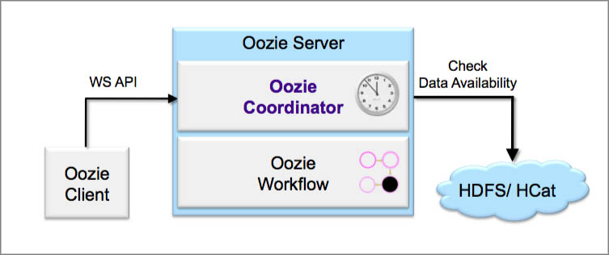

Coordinators
============

.. 04/20/15: Rewrote.
.. 05/15/15: Edited.

Overview
--------

You often need to run a series of jobs on the grid at certain intervals or when data is available. 
Oozie Coordinators allow you to specify regular time intervals and data dependencies to run
Workflows. For example, you may need to run one Workflow at intervals, but the running of that
Workflow depends on the availability of output from another Workflow. 

Benefits
~~~~~~~~

Coordinators allow you to do the following:

- easily define all your requirements for triggering your Workflow in an XML file.
- avoid running multiple crontabs to trigger your workflows.
- trigger Workflows based on changes to input data, so you don't need to write custom scripts that poll HDFS. 

How Oozie Runs Coordinators
~~~~~~~~~~~~~~~~~~~~~~~~~~~

To better understand Oozie Coordinators, we need to understand that Oozie has separate engines for
executing Workflows and Coordinators:

- **Workflow Engine** - Executes the Workflow actions that are arranged in a control dependency acyclic graph (DAG)
  The Workflow Engine supports the following actions: Map-Reduce, Pig, Streaming, Pipes, Java, File system operations:w

- **Coordinator Engine** - Triggers the Workflow execution based on time (like cron)
  or on the input data availability.

In addition to the underlying engines,the Oozie client plays the important role of communicating with 
the Oozie Web Service to create Coordinators as shown in the below diagram.

Coordinator Schema
~~~~~~~~~~~~~~~~~~

See `Appendix A, Oozie Coordinator XML-Schema <http://kryptonitered-oozie.red.ygrid.yahoo.com%3A4080%2Foozie%2Fdocs%2FCoordinatorFunctionalSpec.html%23Oozie_Coordinator_Schema_0.4&sa=D&sntz=1&usg=AFQjCNFJPfF_GnDDApd_K3Lpj-6Y4z3LFg>`_ for the Oozie Coordinator schemas for v0.1, v0.2, and v0.4.

Use Cases
---------

The typical use case for the Oozie Workflow Engine meets the following conditions:

- You have a Workflow (that may consist of several actions), and you want to run the Workflow in an ad hoc manner.
  These actions can be: Map-Reduce, Pig, Streaming, Pipes, etc.
- The input data to your Workflow is already available on the Grid.

You would use the Oozie Coordinator Engine if you want to run your Workflow:

- once per day at 2 p.m. (similar to a cron).
- every hour and you also want to wait for specific data feeds to be available on HDFS.
- that depends on other Workflows.

Basic Coordinator Job
~~~~~~~~~~~~~~~~~~~~~

If you want to trigger Workflows based on time or availability of data, then you should use the Oozie Coordinator Engine.
The input to the Oozie Coordinator Engine is a Coordinator application.

A Coordinator application consists of the following two files.

- ``coordinator.xml``: Contains the definition for your Coordinator job.
- ``coordinator.properties``: Contains properties that you want to pass to your Coordinator job.

These files are used to create a Coordinator job. A Coordinator job is an instance 
of your Coordinator application. The Coordinator application, in turn, is a template that is 
used to create Coordinator jobs.

#. The Coordinator application definition is defined in a file named ``coordinator.xml``.

   .. code-block:: xml

      <coordinator-app name="MY_APP" frequency="60" start="2009-01-01T05:00Z" end="2009-01-01T06:00Z" timezone="UTC" 
        xmlns="uri:oozie:coordinator:0.1">
        <action>
          <workflow>
            <app-path>hdfs://localhost:9000/tmp/workflows</app-path>
          </workflow>
        </action>     
      </coordinator-app>

   From the ``coordinatory.xml``, we can derive the following information about the Coordinator job:

   - It is assigned the name MY_APP.
   - It will run every 60 minutes.
   - It will start at 2009-01-01T05:00Z and end at 2009-01-01T06:00Z. 
   - Because the start and end times are 60 minutes apart, this job will run only once.
   - When this job is triggered, it will run this Workflow: ``hdfs://localhost:9000/tmp/workflows/workflow.xml``

   Refer to the Oozie Workflow Spec for details on how to create an Oozie workflow.

#. The ``coordinator.properties`` file must contain a property that specifies the location of your ``coordinator.xml``.
   In this example, the file is located in this HDFS location: ``/tmp/coord/coordinator.xml``::

       oozie.coord.application.path=hdfs://localhost:9000/tmp/coord

Triggering Coordinator Jobs Based on Time
~~~~~~~~~~~~~~~~~~~~~~~~~~~~~~~~~~~~~~~~~

This example demonstrates how a Coordinator job can use variable parameters.

Coordinator
***********

From the ``coordinator.xml`` file below, you can see the variable parameters ``${freq}``,
``${startTime}``, and ``${endTime}``. 

.. code-block:: xml

   <coordinator-app name="MY_APP" frequency="${freq}" start="${startTime}" end="${endTime}" timezone="UTC" 
     xmlns="uri:oozie:coordinator:0.1">
     <action>
       <workflow>
         <app-path>${workflowPath}</app-path>
         <configuration>
           <property>
             <name>start_date</name>
             <value>${startTime}</value>
           </property>
         </configuration>
       </workflow>
     </action>     
   </coordinator-app>

.. note:: Variable parameters in Coordinator jobs are defined in the 
          following way: ``${variable_name}``

Coordinator Properties
**********************

The variable values are given in the ``coordinator.properties`` file as 
shown in the example below.

.. code-block:: bash

   oozie.coord.application.path=hdfs://localhost:9000/tmp/coord
   freq=60
   startTime=2009-01-01T05:00Z
   endTime=2009-01-01T06:00Z
   workflowPath=hdfs://localhost:9000/tmp/workflows

Triggering Coordinator Jobs When Data Directory is Available
~~~~~~~~~~~~~~~~~~~~~~~~~~~~~~~~~~~~~~~~~~~~~~~~~~~~~~~~~~~~

You can define input data dependencies for your Coordinator job. Your job will not run until the input directory is created.
For example, a Coordinator job might wait for the input directory ``hdfs://localhost:9000/tmp/revenue_feed/2010/06/01/03/``
before running.

Coordinator
***********

.. code-block:: xml

   <coordinator-app name="MY_APP" frequency="1440" start="2009-02-01T00:00Z" end="2009-02-07T00:00Z" timezone="UTC" 
     xmlns="uri:oozie:coordinator:0.1">
   
     <datasets>
       <dataset name="input1" frequency="60" initial-instance="2009-01-01T00:00Z" timezone="UTC">
         <uri-template>hdfs://localhost:9000/tmp/revenue_feed/${YEAR}/${MONTH}/${DAY}/${HOUR}</uri-template>
       </dataset>
     </datasets>
     <input-events>
       <data-in name="coordInput1" dataset="input1">
         <start-instance>${coord:current(-23)}</start-instance>
         <end-instance>${coord:current(0)}</end-instance>
       </data-in>
     </input-events>
     <action>
       <workflow>
         <app-path>hdfs://localhost:9000/tmp/workflows</app-path>
       </workflow>
     </action>     
   </coordinator-app>

Notes About the Coordinator
***************************

This Coordinator job runs every 1440 minutes (24 hours).
It will start on 2009-02-01T00:00Z and end on 2009-02-07T00:00Z (seven days). The Coordinator jobs 
will be executed at these times:

- 2009-02-01T00:00Z
- 2009-02-02T00:00Z
- 2009-02-03T00:00Z
- 2009-02-04T00:00Z
- 2009-02-05T00:00Z
- 2009-02-06T00:00Z

These jobs, however, may not run at the specified times because we added input data 
dependencies for each job. When each job is ready, Oozie will check if the 
specified input data is available. If the data is available, the job will run.
If the data is not available, the job will wait in the Oozie queue until the 
input data is created.

Each of these daily jobs is dependent on the last 24 hours of hourly data from the 
``input1`` feed. Within the ``input-events`` element, you will notice that the ``data-in`` 
block specifies the start and end instances for the input data dependencies.
The EL function ``${coord:current(0)}`` returns the current instance of the ``input1`` dataset
and ``${coord:current(-23)}`` returns the 23rd oldest instance of the ``input1`` dataset.

For the Coordinator job that is materialized on 2009-02-01T00:00Z, the start-instance will be 2009-01-31T01:00Z (23 hours earlier) 
and the end-instance will be 2009-02-01T00:00Z.

   <input-events>
      <data-in name="coordInput1" dataset="input1">
          <start-instance>${coord:current(-23)}</start-instance>
          <end-instance>${coord:current(0)}</end-instance>
      </data-in>
   </input-events>

The ``datasets`` element defines the metadata for all of the input datasets:

- ``name`` - the logical name for the dataset.
- ``frequency`` - how often the data is written to this dataset.
- ``initial-instance`` - the timestamp for the first instance of this dataset. Older instances will be ignored.
- ``uri-template`` - the HDFS directory structure for the dataset.

In this example, the HDFS directory structure for the ``input1`` dataset is as follows:

- ``/tmp/revenue_feed/2009/01/01/01/``
- ``/tmp/revenue_feed/2009/01/01/02/``
- ...

.. code-block:: xml

   <datasets>
     <dataset name="input1" frequency="60" initial-instance="2009-01-01T00:00Z" timezone="UTC">
       <uri-template>hdfs://localhost:9000/tmp/revenue_feed/${YEAR}/${MONTH}/${DAY}/${HOUR}</uri-template>
     </dataset>
   </datasets>

.. _trigger_coord-data_available:

Triggering Coordinator Jobs When Data File is Available      
~~~~~~~~~~~~~~~~~~~~~~~~~~~~~~~~~~~~~~~~~~~~~~~~~~~~~~~

You can define input data dependencies for your Coordinator job. Your job will not run until the input file is created.
For example, the Coordinator job could wait for the input file ``hdfs://localhost:9000/tmp/revenue_feed/2010/06/01/03/trigger.dat``
to be created before running.

Coordinator XML File
********************

The ``done-flag`` element specifies the data dependency that triggers the Oozie job to run. The default value
for ``done-flag`` is ``_SUCCESS``, so if ``done-flag`` is not specified, the Oozie job will wait for the
a file such as ``/tmp/revenue_feed/2010/06/01/03/_SUCCESS`` before starting. You can also specify the
``done-flag`` element without a value, meaning that the existence of the directory defined
in ``uri-template`` indicates that the dataset is ready. See `Synchronous Datasets <https://kryptonitered-oozie.red.ygrid.yahoo.com:4443/oozie/docs/CoordinatorFunctionalSpec.html#a5.1._Synchronous_Datasets>`_ 
for a further explanation.

.. code-block:: xml

   <coordinator-app name="MY_APP" frequency="1440" start="2009-02-01T00:00Z" end="2009-02-07T00:00Z" timezone="UTC" 
     xmlns="uri:oozie:coordinator:0.1">
     <datasets>
       <dataset name="input1" frequency="60" initial-instance="2009-01-01T00:00Z" timezone="UTC">
         <uri-template>hdfs://localhost:9000/tmp/revenue_feed/${YEAR}/${MONTH}/${DAY}/${HOUR}</uri-template>
         <done-flag>trigger.dat</done-flag>
       </dataset>
     </datasets>
     <input-events>
       <data-in name="coordInput1" dataset="input1">
         <start-instance>${coord:current(-23)}</start-instance>
         <end-instance>${coord:current(0)}</end-instance>
       </data-in>
     </input-events>
     <action>
       <workflow>
         <app-path>hdfs://localhost:9000/tmp/workflows</app-path>
       </workflow>
     </action>     
   </coordinator-app>

.. Left off here on 04/20/15.

Coordinator Jobs That Use Rollups
~~~~~~~~~~~~~~~~~~~~~~~~~~~~~~~~~

In this use case, the Coordinator is invoked over a lengthy interval while data is aggregated 
over multiple previous instances from the last time the Coordinator was invoked. 
For example, you may have a Coordinator job that runs once per day, but it triggers
a Workflow that aggregates 24 instances of hourly data.

Coordinator XML File
********************

The key distinction of Coordinator XML files that use rollups is that the Coordinator runs more frequently 
than the dataset is aggregated. In the example below, the ``frequency`` 
attribute for the ``coordinator-app`` is ``1440``, and the ``frequency`` attribute for the 
``dataset`` is ``60``. 

.. code-block:: xml

   <coordinator-app name="MY_APP" frequency="1440" start="2009-02-01T00:00Z" end="2009-02-02T00:00Z" timezone="UTC" 
     xmlns="uri:oozie:coordinator:0.1">
     <datasets>
       <dataset name="input1" frequency="60" initial-instance="2009-01-01T00:00Z" timezone="UTC">
         <uri-template>hdfs://localhost:9000/tmp/revenue_feed/${YEAR}/${MONTH}/${DAY}/${HOUR}</uri-template>
       </dataset>
     </datasets>
     <input-events>
       <data-in name="coordInput1" dataset="input1">
         <start-instance>${coord:current(-23)}</start-instance>
         <end-instance>${coord:current(0)}</end-instance>
       </data-in>
     </input-events>
     <action>
       <workflow>
         <app-path>hdfs://localhost:9000/tmp/workflows</app-path>
         <!-- You can define properties that you want to pass to your workflow here -->
         <!-- The input_files variable will contain the hdfs path for the 24 input files -->
         <configuration>
           <property>
             <name>input_files</name>
             <value>${coord:dataIn('coordInput1')}</value>
           </property>
         </configuration>
       </workflow>
     </action>     
   </coordinator-app>

Coordinator Jobs That Use Sliding Windows
~~~~~~~~~~~~~~~~~~~~~~~~~~~~~~~~~~~~~~~~~

This is a specific use case where the Coordinator is invoked frequently 
and data is aggregated over multiple overlapping previous instances.
For example, you may have a Coordinator job that runs every five minutes and triggers a 
Workflow that looks up the last 60 minutes of data. 
Because the job frequency is less than the input frequency, the window
of time for taking input file overlaps (i.e., input files are
used across multiple instances).

Coordinator XML File
********************

The key distinction of Coordinator XML files that use sliding windows is that the frequency of the
Coordinator is less than the frequency of the dataset. In the example below, the ``frequency`` 
attribute for the ``coordinator-app`` is ``5``, and the ``frequency`` attribute for the ``dataset``
is ``15``. 

.. code-block:: xml

   <coordinator-app name="MY_APP" frequency="5" start="2009-02-01T00:00Z" end="2009-02-02T00:00Z" timezone="UTC" 
     xmlns="uri:oozie:coordinator:0.1">
     <datasets>
       <dataset name="input1" frequency="15" initial-instance="2009-01-01T00:00Z" timezone="UTC">
         <uri-template>hdfs://localhost:9000/tmp/revenue_feed/${YEAR}/${MONTH}/${DAY}/${HOUR}/${MINUTE}</uri-template>
       </dataset>
     </datasets>
     <input-events>
       <data-in name="coordInput1" dataset="input1">
         <start-instance>${coord:current(-3)}</start-instance>
         <end-instance>${coord:current(0)}</end-instance>
       </data-in>
     </input-events>
     <action>
       <workflow>
         <app-path>hdfs://localhost:9000/tmp/workflows</app-path>
         <!-- You can define properties that you want to pass to your workflow here -->
         <!-- The input_files variable will contain the hdfs path for the most recent 4 input files -->
         <configuration>
           <property>
             <name>input_files</name>
             <value>${coord:dataIn('coordInput1')}</value>
           </property>
         </configuration>
       </workflow>
     </action>     
   </coordinator-app>

Coordinator Job to Create SLA Events
~~~~~~~~~~~~~~~~~~~~~~~~~~~~~~~~~~~~

You can configure Coordinator actions to record the events required to evaluate SLA compliance.
See `SLA Definition in Coordinator Action <https://kryptonitered-oozie.red.ygrid.yahoo.com:4443/oozie/docs/DG_SLAMonitoring.html#SLA_Definition_in_Coordinator_Action>`_ 
for more information.

Coordinator XML File
********************

For SLA compliance, your Coordinator XML should have specify the attribute ``xmlns:sla`` to define the ``sla`` namespace and then
include the ``<sla:info>`` element to record events and information as shown below.

.. code-block:: xml

   <coordinator-app xmlns="uri:oozie:coordinator:0.4" xmlns:sla="uri:oozie:sla:0.2" name="sla_coord" frequency="60" start="2009-03-06T010:00Z" end="2009-03-06T11:00Z" timezone="America/Los_Angeles">
     <controls>
       <timeout>10</timeout>
       <concurrency>2</concurrency>
       <execution>LIFO</execution>
     </controls>
     <datasets> </datasets>
     <action>
       <workflow>
         <app-path>hdfs://localhost:9000/tmp/kamrul/workflows/sla-map-reduce</app-path>
         <configuration>
           <property>
             <name>TEST </name>
             <value> ${coord:nominalTime()} </value>
           </property>
         </configuration>
       </workflow>
       <sla:info>
         <sla:app-name>test-app</sla:app-name>
         <sla:nominal-time>${coord:nominalTime()}</sla:nominal-time>
         <sla:should-start>${5 * MINUTES}</sla:should-start>
         <sla:should-end>${2 * HOURS}</sla:should-end>
         <sla:notification-msg>Notifying User for ${coord:nominalTime()} nominal time</sla:notification-msg>
         <sla:alert-contact>www@yahoo.com</sla:alert-contact>
         <sla:dev-contact>abc@yahoo.com</sla:dev-contact>
         <sla:qa-contact>abc@yahoo.com</sla:qa-contact>
         <sla:se-contact>abc@yahoo.com</sla:se-contact>
         <sla:alert-frequency>LAST_HOUR</sla:alert-frequency>
         <sla:alert-percentage>80</sla:alert-percentage>
       </sla:info>
     </action>
   </coordinator-app>

.. _coord_explanation:

Explanation of Coordinator
**************************

Each Coordinator action will create at least three events for normal processing.

- The event ``CREATED`` specifies that the Coordinator action is registered for SLA tracking.
- When the action starts executing, an event record of type ``STARTED`` is inserted into ``sla_event`` table..
- Finally when an action finishes, event of type either ``SUCCEEDED/KILLED/FAILED`` is generated.

See SLA Tracking:Event Status <https://kryptonitered-oozie.red.ygrid.yahoo.com:4443/oozie/docs/DG_SLAMonitoring.html#Event_Status>`_ 
and `SLA Tracking: SLA Status <https://kryptonitered-oozie.red.ygrid.yahoo.com:4443/oozie/docs/DG_SLAMonitoring.html#SLA_Status>`_ 
for more details.

Coordinator Job With Timeouts
~~~~~~~~~~~~~~~~~~~~~~~~~~~~~

A Coordinator job will timeout if it has not run within the specified amount of time.
Refer to the ``timeout`` element.

Coordinator XML File
********************

The ``timeout`` element is used to specify how many minutes to wait until the
the Coordinator times out.

.. code-block:: xml

   <coordinator-app name="END2END-20" frequency="${coord:days(1)}" 
     start="${start}" end="${end}" timezone="${timezone}" 
     xmlns="uri:oozie:coordinator:0.1">
     <controls>
       <timeout>10</timeout> <!-- timeout if Coordinator action is not run after 10 minutes --!>
       <concurrency>4</concurrency>
     </controls>  
     <datasets>
       <dataset name="din" frequency="${coord:hours(10)}"
         initial-instance="${ds_start}" timezone="${timezone}">
         <uri-template>${baseFsURI}/${YEAR}/${MONTH}/${DAY}/${HOUR}/${MINUTE}</uri-template>
         <done-flag>HELLO</done-flag>
       </dataset>
       <dataset name="dout" frequency="${coord:minutes(300)}"
         initial-instance="${ds_start}" timezone="${timezone}">
         <uri-template>${baseFsURI}/${YEAR}/${MONTH}/${DAY}/${HOUR}/${MINUTE}</uri-template>
       </dataset>
     </datasets>
     <input-events>
       <data-in name="IN1" dataset="din">
         <instance>${coord:current(-1)}</instance>
       </data-in> 
     </input-events>
     <output-events>
       <data-out name="OUT" dataset="dout">
         <instance>${coord:current(1)}</instance>
       </data-out> 
     </output-events>
     <action>
       <workflow>
         <app-path>${wf_app_path}</app-path>
         <configuration>
           <property>
             <name>jobTracker</name>
             <value>${jobTracker}</value>
           </property>
           <property>
             <name>nameNode</name>
             <value>${nameNode}</value>
           </property>
           <property>
             <name>queueName</name>
             <value>${queueName}</value>
           </property>
           <property>
             <name>inputDir</name>
             <value>${coord:dataIn('IN1')}</value>
           </property>
           <property>
             <name>outputDir</name>
             <value>${coord:dataOut('OUT')}</value>
           </property>
         </configuration>
       </workflow>
     </action>     
   </coordinator-app>

Coordinator Job With Specific Input File Dependency
~~~~~~~~~~~~~~~~~~~~~~~~~~~~~~~~~~~~~~~~~~~~~~~~~~~

A Coordinator action can be triggered when a specific file exists in HDFS.
The file dependency is specified by the ``done-flag`` element.

If the ``done-flag`` element is not used or has an empty value, then Oozie configures 
Hadoop to create a  ``_SUCCESS`` file in the output directory.

Coordinator XML File
********************

Based on the Coordinator XML below, the Coordinator executes the application 
``END2END-20`` when the directory specified by ``<uri-template>``
has the file ``HELLO`` (value given for ``<done-flag>``).

.. code-block:: xml

   <coordinator-app name="END2END-20" frequency="${coord:days(1)}" 
     start="${start}" end="${end}" timezone="${timezone}" 
     xmlns="uri:oozie:coordinator:0.1">
     <controls>
       <timeout>10</timeout>
       <concurrency>6</concurrency>
       <execution>FIFO</execution>
     </controls>  
     <datasets>
       <dataset name="din" frequency="${coord:hours(10)}"
         initial-instance="${ds_start}" timezone="${timezone}">
         <uri-template>${baseFsURI}/${YEAR}/${MONTH}/${DAY}/${HOUR}/${MINUTE}</uri-template>
         <done-flag>HELLO</done-flag>
       </dataset>
       <dataset name="dout" frequency="${coord:minutes(300)}"
         initial-instance="${ds_start}" timezone="${timezone}">
         <uri-template>${baseFsURI}/${YEAR}/${MONTH}/${DAY}/${HOUR}/${MINUTE}</uri-template>
       </dataset>
     </datasets>
     <input-events>
       <data-in name="IN1" dataset="din">
         <instance>${coord:current(-1)}</instance>
       </data-in> 
     </input-events>
     <output-events>
       <data-out name="OUT" dataset="dout">
         <instance>${coord:current(1)}</instance>
       </data-out> 
     </output-events>
     <action>
       <workflow>
         <app-path>${wf_app_path}</app-path>
         <configuration>
           <property>
             <name>inputDir</name>
             <value>${coord:dataIn('IN1')}</value>
           </property>
           <property>
             <name>outputDir</name>
             <value>${coord:dataOut('OUT')}</value>
           </property>
         </configuration>
       </workflow>
     </action>     
   </coordinator-app>

Coordinator Job With Expression Language (EL) Functions
~~~~~~~~~~~~~~~~~~~~~~~~~~~~~~~~~~~~~~~~~~~~~~~~~~~~~~~

The following example uses the following EL functions:

- `coord:latest <http://oozie.apache.org/docs/3.3.2/CoordinatorFunctionalSpec.html#a6.6.6._coord:latestint_n_EL_Function_for_Synchronous_Datasets>`_
- `coord:current <http://oozie.apache.org/docs/3.3.2/CoordinatorFunctionalSpec.html#a6.6.1._coord:currentint_n_EL_Function_for_Synchronous_Datasets>`_
- `coord:days <http://oozie.apache.org/docs/3.3.2/CoordinatorFunctionalSpec.html#a4.4.1._The_coord:daysint_n_and_coord:endOfDaysint_n_EL_functions>`_
- `coord:hours <http://oozie.apache.org/docs/3.3.2/CoordinatorFunctionalSpec.html#a6.6.3._coord:hoursInDayint_n_EL_Function_for_Synchronous_Datasets>`_
- `coord:hoursInDay <http://oozie.apache.org/docs/3.3.2/CoordinatorFunctionalSpec.html#a6.6.3._coord:hoursInDayint_n_EL_Function_for_Synchronous_Datasets>`_

Coordinator XML File
********************

.. code-block:: xml

   <coordinator-app xmlns="uri:oozie:coordinator:0.4" xmlns:sla="uri:oozie:sla:0.2" 
     name="ABF1_region_session_base_coord" frequency="${coord:days(1)}" 
     start="${start}" end="${end}" timezone="America/New_York">
   
     <datasets>
       <include>${include_ds_files}</include>
       <dataset name="ABF1_regular" frequency="${coord:hours(1)}" 
         initial-instance="${ds_start1}"  timezone="America/New_York">
         <uri-template>${baseFsURI}/${YEAR}${MONTH}${DAY}${HOUR}${MINUTE}/regular</uri-template>
       </dataset>
       <dataset name="ABF1_late" frequency="${coord:hours(1)}" 
         initial-instance="${ds_start1}"  timezone="America/New_York">
         <uri-template>${baseFsURI}/${YEAR}${MONTH}${DAY}${HOUR}${MINUTE}/late</uri-template>
       </dataset>
       <dataset name="region_session_base" frequency="${coord:days(1)}" 
         initial-instance="${ds_start1}"  timezone="America/New_York">
         <uri-template>${baseFsURI}/${YEAR}${MONTH}${DAY}/5/</uri-template>
       </dataset>
     </datasets>
     <input-events>
       <data-in name="input_regular" dataset="ABF1_regular">
         <start-instance>${coord:current(-(coord:hoursInDay(0) - 23)-3)}</start-instance>
         <end-instance>${coord:current(-3)}</end-instance>
       </data-in>
       <data-in name="input_late" dataset="ABF1_late">
         <start-instance>${coord:current(-(coord:hoursInDay(0) - 23)-3)}</start-instance>
         <end-instance>${coord:current(-3)}</end-instance>
       </data-in>
       <data-in name="input_metadata_tz" dataset="metadata_tz">
         <instance>${coord:latest(0)}</instance>
       </data-in>
       <data-in name="input_metadata_domain_property" dataset="metadata_domain_property">
         <instance>${coord:latest(0)}</instance>
       </data-in>
       <data-in name="input_metadata_property" dataset="metadata_property">
         <instance>${coord:latest(0)}</instance>
       </data-in>
       <data-in name="input_metadata_dim_page" dataset="metadata_dim_page">
         <instance>${coord:latest(0)}</instance>
       </data-in>
     </input-events>
     <output-events>
       <data-out name="OUT" dataset="region_session_base">
         <instance>${coord:current(0)}</instance>
       </data-out>
     </output-events>
     <action>
       <workflow>
         <app-path>${wf_app_path}</app-path>
         <configuration>
           <property>
             <name>jobTracker</name>
             <value>${jobTracker}</value>
           </property>
           <property>
             <name>nameNode</name>
             <value>${nameNode}</value>
           </property>
           <property>
             <name>queueName</name>
             <value>${queueName}</value>
           </property>
           <property>
             <name>inputDir</name>
             <value>${coord:dataIn('input_regular')},${coord:dataIn('input_late')},${coord:dataIn('input_metadata_tz')},${coord:dataIn('input_metadata_domain_property')},${coord:dataIn('input_metadata_property')}</value>
           </property>
           <property>
             <name>outputDir</name>
             <value>${coord:dataOut('OUT')}</value>
           </property>
         </configuration>
       </workflow>
     </action>
   </coordinator-app>

Use Sync Mode to Simulate Async Datasets
~~~~~~~~~~~~~~~~~~~~~~~~~~~~~~~~~~~~~~~~ 

Users can use sync mode to simulate async datasets: actions run when input data 
is available. In contrast, actions wait until they time out if the input data is not available. 
(Note, in catch-up mode, actions never time out). 

To use this approach, users must specify the minimum frequency of generating data instances. 
The following example shows how to simulate an async dataset where data instances 
are generated every five minutes at the minimum. Actions time out after 10 minutes 
under the current mode if they do not have data instances to run on.

.. note:: The downside is there will be too many actions created 
          doing nothing but waiting. This is particularly true when large time gaps exist 
          between any two consecutive data instances.

Coordinator XML File
********************

The sync mode is configured by setting ``${min_frequency}`` for the ``frequency`` attribute of
the dataset. 

.. code-block:: xml

   <coordinator-app name="MY_APP" frequency="${frequency}" start="${start}" end="${end}" timezone="${timezone}"
                    xmlns="uri:oozie:coordinator:0.1">
     <controls>
       <timeout>10</timeout>
     </controls> 
     <datasets>
       <dataset name="din1" frequency="${min_frequency}" initial-instance="${start}" timezone="${timezone}">
         <uri-template>hdfs://localhost:9000/tmp/oozie/${YEAR}/${MONTH}/${DAY}/${HOUR}/${MINUTE}</uri-template>
       </dataset>
     </datasets>
     <input-events>
       <data-in name="din1" dataset="din1">
         <instance>${coord:current(0)}</instance>
       </data-in> 
     </input-events>
     <action>
       <workflow>
         <app-path>hdfs://localhost:9000/user/oozie/examples/workflows/map-reduce</app-path>
       </workflow>
     </action>
   </coordinator-app>

Coordinator Job Properties
**************************

You define the parameterized variables in ``coodinator.properties`` that can be referenced from ``coordinator.xml``.

.. code-block:: properties

   oozie.coord.application.path=hdfs://localhost:9000/user/oozie/examples/coordinator
   frequency=5
   min_frequency=5
   start=2010-07-30T23:00Z
   end=2010-07-30T23:25Z
   timezone=UTC

Coordinator Commands
--------------------

The following sections describe the basic Oozie client commands for running Coordinators.
See also :ref:`Oozie Client <oozie_client>` and the  
`Command Line Interface Utilities documentation <http://kryptonitered-oozie.red.ygrid.yahoo.com:4080/oozie/docs/DG_CommandLineTool.html>`_.

Submit a Job
~~~~~~~~~~~~

The Oozie command below submits a Coordinator job on the Axonite Blue Grid.
On success, an Oozie ID is returned. In this example, the Oozie ID is ``0000004-091209145813488-oozie-dani-C``.

.. code-block:: bash

   $ export OOZIE_URL=https://kryptonitered-oozie.red.ygrid.yahoo.com:4443/oozie/
   $ oozie job -run -config coordinator.properties -auth kerberos
   job: 0000004-091209145813488-oozie-dani-C

Check Status of a Job
~~~~~~~~~~~~~~~~~~~~~

To check the status of your job, use the Oozie ID (which is returned at submission time)
as shown below.

.. code-block:: bash

   $ oozie job -info 0000004-091209145813488-oozie-dani-C -auth kerberos

   Job Id: 0000004-091209145813488-oozie-dani-C
   --------------------------------------------------------------------------------------------------------------
   Job Name      :  NAME                                                                    
   App Path      :  hdfs://localhost:9000/user/danielwo/coord/test1                         
   Status        :  PREP                                                                    
   --------------------------------------------------------------------------------------------------------------
   Action Number   Status      ID                                       created            
   1               RUNNING    0000004-091209145813488-oozie-dani-C   2009-12-09 22:58 +0000                      
   --------------------------------------------------------------------------------------------------------------

List All Jobs
~~~~~~~~~~~~~

You can check the status of all your Coordinator jobs
with the following command.

.. code-block:: bash

   $ oozie jobs -jobtype coord -auth kerberos

   Job ID                                   App Name       Status    Freq Unit         Started                 Next Materialized
   ------------------------------------------------------------------------------------------------------------------------------------
   0081769-150302094004234-oozie_KR-C       URSDemoToProfileServer-1.0.1.94-daily-dev-coordSUCCEEDED    1 DAY  2015-04-01 00:00 GMT    2015-04-02 00:00 GMT
   ------------------------------------------------------------------------------------------------------------------------------------
   0081766-150302094004234-oozie_KR-C       URSDemoToProfileServer-1.0.1.94-daily-dev-coordSUCCEEDED    1 DAY  2015-04-01 00:00 GMT    2015-04-02 00:00 GMT
   ------------------------------------------------------------------------------------------------------------------------------------
   0081741-150302094004234-oozie_KR-C       upstats_15-1.0.1.83-daily-dev-coordSUCCEEDED                1 DAY  2015-01-01 00:00 GMT    2015-01-02 00:00 GMT
   ------------------------------------------------------------------------------------------------------------------------------------
   0081691-150302104108145-oozie_KR-C       URSDemoToProfileServer-1.0.1.92-daily-dev-coordSUCCEEDED    1 DAY  2015-04-01 00:00 GMT    2015-04-02 00:00 GMT
   ------------------------------------------------------------------------------------------------------------------------------------
   0081686-150302094004234-oozie_KR-C       URSDemoToProfileServer-1.0.1.92-daily-dev-coordSUCCEEDED    1 DAY  2015-04-01 00:00 GMT    2015-04-02 00:00 GMT
   ------------------------------------------------------------------------------------------------------------------------------------
   0080497-150302104108145-oozie_KR-C       upstats_15-1.0.1.82-daily-dev-coordSUCCEEDED                1 DAY  2015-01-01 00:00 GMT    2015-01-02 00:00 GMT
   ------------------------------------------------------------------------------------------------------------------------------------
   0080237-150302104108145-oozie_KR-C       urs_user_metadata_extractor_daily-dev-coordSUCCEEDED        1 DAY  2015-03-08 00:00 GMT    2015-03-10 00:00 GMT
   ------------------------------------------------------------------------------------------------------------------------------------
   0080223-150302094004234-oozie_KR-C       urs_user_metadata_extractor_daily-dev-coordSUCCEEDED        1 DAY  2015-03-08 00:00 GMT    2015-03-10 00:00 GMT
   ------------------------------------------------------------------------------------------------------------------------------------
   0080212-150302094004234-oozie_KR-C       urs_user_metadata_extractor_daily-dev-coordSUCCEEDED        1 DAY  2015-03-08 00:00 GMT    2015-03-10 00:00 GMT
   ------------------------------------------------------------------------------------------------------------------------------------
   0080208-150302104108145-oozie_KR-C       upstats_15-1.0.1.81-daily-dev-coordSUCCEEDED                1 DAY  2015-01-01 00:00 GMT    2015-01-02 00:00 GMT
   ------------------------------------------------------------------------------------------------------------------------------------

Stop/Kill A Job
~~~~~~~~~~~~~~~

Killing a Coordinator job is the same as killing any Oozie job::

    $ oozie job -kill <oozie ID> -auth kerberos

