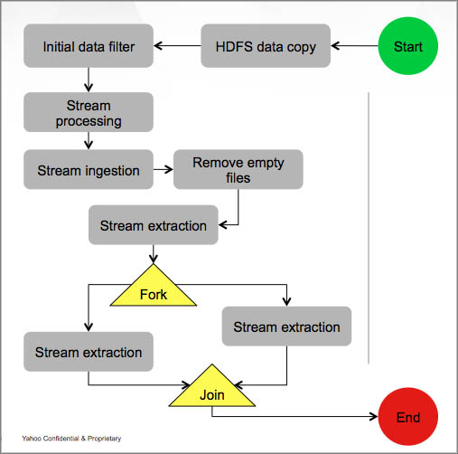

Overview
========

.. 04/23/15: Rewrote

What is Oozie?
--------------

Oozie is a Java Web application running in a Java servlet-container
that executes workflow jobs consisting of one or more actions. 
It is an extensible, scalable, and reliable system that allows you to 
define, manage, schedule, and execute complex Hadoop workloads 
through Web services. 

Why Use Oozie?
--------------

Most work on the grid requires executing many actions in
a series of steps. For example, you may need to
execute the following actions in the given order:

- MapReduce
- Pig
- Streaming
- HDFS operation such as ``mkdir``, ``chmod``

With a workflow system such as Oozie, you would have to use
your own custom system based on shell scripts and cron jobs.
Building and running custom systems is expensive, 
and you don't have the operations, development, and hardware support.

Oozie Features
--------------

Oozie provides the following  the following:

- An XML-based declarative framework to specify a job or a complex workflow of dependent jobs.
- Support for different types of jobs such as Hadoop Map-Reduce, Pipe, Streaming, Pig, Hive and custom java applications.
- Workflow scheduling based on frequency and/or data availability.
- Monitoring capability, automatic retry, and failure handling of jobs.
- Extensible and pluggable architecture to allow arbitrary grid programming paradigms.
- Authentication, authorization, and capacity-aware load throttling to allow multi-tenant software as a service.
- HBase access through Oozie with credentials
- HCatalog access through Oozie with credentials
- Email action
- DistCP action (intra as well as inter-cluster copy)
- Shell action (run any script, e.g., Perl, Python, Hadoop CLI)
- Workflow dry-run & fork-Join validation
- Bulk monitoring (REST API)
- Coordinator Expression Language (EL) functions for parameterized Workflows
- Job DAG

.. Left off here on 04/23/15.

Use Cases 
---------

Time Triggers
~~~~~~~~~~~~~

One of the most common uses for Oozie is to execute a Workflow 
at certain intervals. For example, the Workflow XML (``workflow.xml``)
below gives a start time, an end time, and the frequecy to
run the applications.

.. code-block:: xml

   <coordinator-app name=“my_coord” start="2009-01-07T23:59Z" end="2010-01-01T00:00Z" 
     frequency=${coord:minutes(15)} 
     xmlns="uri:oozie:coordinator:0.4">
     <action>
       <workflow>
         <app-path>hdfs://bar:9000/usr/abc/logsprocessor-wf</app-path>
         <configuration>
           <property> <name>key</name><value>val</value></property>
         </configuration>
       </workflow>
     </action>      
   </coordinator-app>

Time and Data Triggers
~~~~~~~~~~~~~~~~~~~~~~

Sometimes you may only want to run Workflows when input data is available.
Oozie lets you *materialize* (create but not run) a Workflow at a specified
interval, but only run the Workflow when input data is ready.

The ``workflow.xml`` below defines input events and then uses
the built-in expression language (EL) function ``dataIn`` to
check if the input data (``inputLogs``) is available.

.. code-block:: xml

   <coordinator-app name=“coord1” frequency=“${1*HOURS}”…> 
     <datasets>
       <dataset name="logs" frequency=“${1*HOURS}” initial-instance="2009-01-01T23:59Z">
         <uri-template>hdfs://bar:9000/app/logs/${YEAR}/${MONTH}/${DAY}/${HOUR}</uri-template>
       </dataset>
     </datasets>
     <input-events>
       <data-in name=“inputLogs” dataset="logs">
         <instance>${current(0)}</instance>
       </data-in>
     </input-events>
     <action>
       <workflow>
         <app-path>hdfs://bar:9000/usr/abc/logsprocessor-wf</app-path>
         <configuration>
           <property> <name>inputData</name><value>${dataIn(‘inputLogs’)}</value> </property>
         </configuration>
       </workflow>
     </action>
     ...
   ...

Rolling Window
~~~~~~~~~~~~~~

You can also access datasets at a smaller interval and then roll them
up at a larger frequency. 

For example, in the ``workflow.xml`` below, but the Coordinator itself runs
every hour, so you can roll the 15-minute datasets into hourly datasets.

.. code-block:: xml

   <coordinator-app name=“coord1” frequency=“${1*HOURS}”…> 
     <datasets>
       <dataset name="logs" frequency=“15” initial-instance="2009-01-01T00:00Z">
         <uri-template>hdfs://bar:9000/app/logs/${YEAR}/${MONTH}/${DAY}/${HOUR}/${MINUTE}</uri-template>
       </dataset>
     </datasets>
     <input-events>
       <data-in name=“inputLogs” dataset="logs">
         <start-instance>${current(-3)}</start-instance>
         <end-instance>${current(0)}</end-instance>
       </data-in>
     </input-events>
     <action>
       <workflow>
         <app-path>hdfs://bar:9000/usr/abc/logsprocessor-wf</app-path>
         <configuration>
           <property> <name>inputData</name><value>${dataIn(‘inputLogs’)}</value> </property>
         </configuration>
       </workflow>
     </action>      
   </coordinator-app>

Sliding Window
~~~~~~~~~~~~~~

Another less common use case is when you need to frequently access past data and
then roll it up. 

For example, the ``workflow.xml`` below every hour accesses the past 24 hours of data and rolls 
that data up. You can see that the frequecy for the Coordinator is every hour but that the input 
event is for 24 hours (``${current(0)} to ``${current(-23)}``).

.. code-block:: xml

   <coordinator-app name=“coord1” frequency=“${1*HOURS}”…> 
     <datasets>
       <dataset name="logs" frequency=“${1*HOURS}” initial-instance="2009-01-01T00:00Z">
         <uri-template>hdfs://bar:9000/app/logs/${YEAR}/${MONTH}/${DAY}/${HOUR}</uri-template>
       </dataset>
     </datasets>
     <input-events>
       <data-in name=“inputLogs” dataset="logs">
         <start-instance>${current(-23)}</start-instance>
         <end-instance>${current(0)}</end-instance>
       </data-in>
     </input-events>
     <action>
       <workflow>
         <app-path>hdfs://bar:9000/usr/abc/logsprocessor-wf</app-path>
         <configuration>
           <property> <name>inputData</name><value>${dataIn(‘inputLogs’)}</value> </property>
         </configuration>
       </workflow>
     </action>      
   </coordinator-app>

Basic Concepts
--------------

Before you get started, you should be familiar with some basic concepts
that will help you understand the documentation and better use Oozie.

Oozie Workflows
~~~~~~~~~~~~~~~

Oozie Workflows are blueprints for executing jobs. More specifically, these
blueprints are `directed acyclic graphs <http://en.wikipedia.org/wiki/Directed_acyclic_graph>`_
that structure execution of Hadoop actions such as MapReduce, Pig, Hive, shell script, 
custom Java code, etc.

Coordinators
~~~~~~~~~~~~

Oozie Coordinator jobs are recurring Oozie Workflow jobs 
triggered by time (frequency) and data availabilty.

Bundles
~~~~~~~

Bundles are a set of Coordinator applications and often known has data pipelines. Users can start, stop, suspend, resume, and rerun Bundles.
Although there is no explicit dependency among Coordinators of a Bundle, one of the primary reasons for using Bundles is
to execute Coordinator applications that have share a data dependency. For example, one Coordinator may need to wait for data created by
another Coordinator before running, and Bundles allow users to define and control this data dependency between the Coordinators.

Use Patterns 
------------

We discussed the common use cases, which typically deal with time and data dependencies.
In this section, we'll look at Workflows from the perspective of data: management, modeling, and
flow. 

Simple Data Management
~~~~~~~~~~~~~~~~~~~~~~

The following are some of the basic data management tasks
that you might use Oozie for:

- Data transformation/filtering/Ybeacon
- Data metrics
- Directory management
- Copying input data 
- Data replication
- Clean up feed/data cleanup
- Generate data

For example, you might have a Oozie workflow that
copies an input feed, transforms the data, writes
the resulting data to HDFS, and then deletes
the copied input feed.

Data Modeling
~~~~~~~~~~~~~

You can also use Oozie to process and analyze multiple
streams of data. The following are examples
of how you might perform data modeling with Oozie:

- Process logs in parallel
- Parse ad events and train data (Moneyball)
- Consolidate Tweets
- Moneyball bid processor
- Process user engagement
- Check retention rate

As you can see from the list above, many uses
of Oozie for data modeling are useful for user
and ad data. For example, you could create 
a Workflow/Coordinator to extract ad events, join
them, compute derived features, and then send
out email notifications containing these features. 

Complete Data Pipeline 
~~~~~~~~~~~~~~~~~~~~~~

The data pipeline is a complex set of actions and interdependencies. As you
know, in Oozie, Bundles are also known as data pipelines. In other words,
your data pipeline will generally involve a set of Coordinators, each
Coordinator with a set of Workflows. Often data dependencies
will exist between Coordinators and at the Workflow level. 
Thus, you might need use a complete data pipeline for
the following:

- Stream video pipeline
- Complete data transformation pipeline
- Data ingestion

Example
+++++++

The following diagram shows a simplified 
flow of streamed data. Keep in mind that
each task represented by a gray box
could involve multiple Coordinators and Workflows.

End-to-End Data Processing
~~~~~~~~~~~~~~~~~~~~~~~~~~

The end-to-end data processing 
involves a pipeline but also 
closes the process by generally
writing or storing results.

For example, you may need end-to-end data
processing for the following:

- Data Ingestion
- Slingstone Processing links

The diagram below shows how data is analyzed
based on conditions and later joined before 
being ultimately written, in this case, to HBase.

.. image:: images/end-to-end-processing.jpg
   :height: 513px
   :width: 506 px
   :scale: 95 %
   :alt: End-to-end processing.
   :align: left

Architecture Overview
---------------------

As you can see from the diagram below, Oozie is a Java Web application
that has a Web service and internally uses a DAG engine to process
Workflows, Coordinators, and Bundles.  Oozie also stores
state in an Oracle database (submitted jobs, workflow definitions, etc.)
  

.. image:: images/architecture_overview.jpg
   :height: 462px
   :width: 760 px
   :scale: 95 %
   :alt: Oozie Architectural Diagram
   :align: left

The diagram does fail to show two important aspects of the architecture:

- instead of a failover model, many Oozie servers access the same database
- ZooKeeper handles the coordination of Hadoop jobs

Technology Stack
~~~~~~~~~~~~~~~~

Oozie relies on the following technologies:

- **Apache Tomcat** - used for the REST Web service and for communicating
  with HDFS, Hive, and Pig.
- **Workflow Lite Library** - parses Oozie configuration files, creating instances, 
  controlling logic and execution of Workflows
- **HDFS** - used to store deployed applications (Hadoop distributed cache)
- **Oracle DB** - used for persisting Workflow jobs state 

Abstraction Layer
~~~~~~~~~~~~~~~~~

The abstraction layer represents the structure of how Hadoop actions
are organized and the execution flow.

Accessing Oozie
~~~~~~~~~~~~~~~

To access Oozie, users and client programs need one URL to
connect to the following:

- Web UI,
- REST/Java API
- JobTracker/ResourceManager callbacks

You can also use the load balancer, VIP/DNS round-robin 
to provide one entry point to the Oozie servers

See the **oozie-server** column in the `Grid Versions <http://twiki.corp.yahoo.com/view/Grid/GridVersions>`_ table
for the Oozie UIs for the different clusters.

Log Streaming
~~~~~~~~~~~~~

Oozie log files are not stored in a database. Each Oozie server only has access 
to its own logs

- Jobs are not assigned to a specific Oozie server
- If a user asks an Oozie server for the logs of another Server, the asked server
  can ask the second server for the user.
- Caveat: if an Oozie server goes down, any logs from it will be unavailable

Limitations/Restrictions
------------------------

TBD

