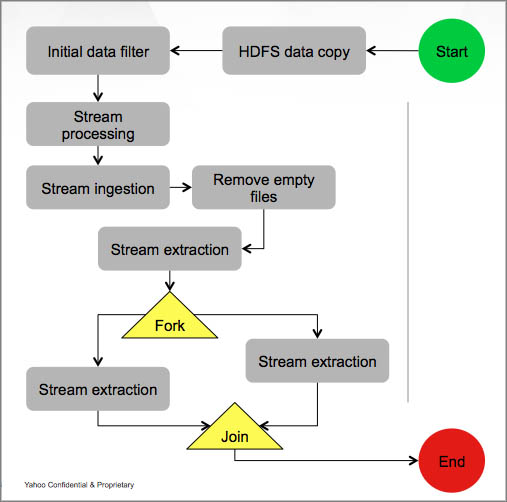
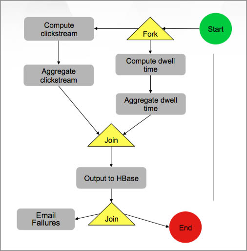

.. _use_cases:

Use Cases and Patterns
======================

In the :ref:`Overview <overview>`, we explained what Oozie does,
its features, important concepts, and how to 
access Oozie. In this chapter, we're going to focus on how
you might use Oozie by looking at common use cases and patterns.
The use patterns are related to how Workflows are used in respect to data.

If you don't see your use case or pattern below, don't hesitate to write
to the iList oozie-users@yahoo-inc.com and ask if 
Oozie is a viable solution for your use case.

.. _use_cases-use:

Use Cases 
---------

.. _use_cases-time:

Time Triggers
~~~~~~~~~~~~~

One of the most common uses for Oozie is to execute a Workflow 
at certain intervals. To do this, you would define a :ref:`Coordinator <concepts-coordinators>` 
through a Coordinator XML file. In the  
Coordinator XML (``coordinator.xml``) below, the start time, end time, 
and the frequency to run the applications is defined as attributes
in the ``<coordinator-app>`` element.

.. code-block:: xml

   <coordinator-app name=“my_coord” start="2009-01-07T23:59Z" end="2010-01-01T00:00Z" 
     frequency=${coord:minutes(15)} 
     xmlns="uri:oozie:coordinator:0.4">
     <action>
       <workflow>
         <app-path>hdfs://bar:9000/usr/abc/logsprocessor-wf</app-path>
         <configuration>
           <property> <name>key</name><value>val</value></property>
         </configuration>
       </workflow>
     </action>      
   </coordinator-app>

.. _use_cases-time_data:

Time and Data Triggers
~~~~~~~~~~~~~~~~~~~~~~

Sometimes you may only want to run Workflows when input data is available.
Oozie lets you *materialize* (create but not run) a Workflow at a specified
interval, but only run the Workflow when input data is ready.

The ``coordinator.xml`` below defines input events and then uses
the built-in expression language (EL) function ``dataIn`` to
check if the input data (``inputLogs``) is available.

.. code-block:: xml

   <coordinator-app name=“coord1” frequency=“${coord:hours(1)}”…> 
     <datasets>
       <dataset name="logs" frequency=“${coord:hours(1)}” initial-instance="2009-01-01T23:59Z">
         <uri-template>hdfs://bar:9000/app/logs/${YEAR}/${MONTH}/${DAY}/${HOUR}</uri-template>
       </dataset>
     </datasets>
     <input-events>
       <data-in name=“inputLogs” dataset="logs">
         <instance>${coord:current(0)}</instance>
       </data-in>
     </input-events>
     <action>
       <workflow>
         <app-path>hdfs://bar:9000/usr/abc/logsprocessor-wf</app-path>
         <configuration>
           <property> <name>inputData</name><value>${dataIn(‘inputLogs’)}</value> </property>
         </configuration>
       </workflow>
     </action>
     ...
   ...

.. _use_cases-rolling:

Rolling Window
~~~~~~~~~~~~~~

You can also access datasets at a smaller interval and then roll them
up at a larger frequency. 

For example, in the ``coordinator.xml`` below, but the Coordinator itself runs
every hour, so you can roll the 15-minute datasets into hourly datasets.

.. code-block:: xml

   <coordinator-app name=“coord1” frequency=“${coord:hours(1)}”…> 
     <datasets>
       <dataset name="logs" frequency=“${coord:minutes(15)}” initial-instance="2009-01-01T00:00Z">
         <uri-template>hdfs://bar:9000/app/logs/${YEAR}/${MONTH}/${DAY}/${HOUR}/${MINUTE}</uri-template>
       </dataset>
     </datasets>
     <input-events>
       <data-in name=“inputLogs” dataset="logs">
         <start-instance>${coord:current(-3)}</start-instance>
         <end-instance>${coord:current(0)}</end-instance>
       </data-in>
     </input-events>
     <action>
       <workflow>
         <app-path>hdfs://bar:9000/usr/abc/logsprocessor-wf</app-path>
         <configuration>
           <property><name>inputData</name><value>${coord:dataIn(‘inputLogs’)}</value>/property>
         </configuration>
       </workflow>
     </action>      
   </coordinator-app>

.. _use_cases-sliding:

Sliding Window
~~~~~~~~~~~~~~

Another less common use case is when you need to frequently access past data and
then roll it up. 

For example, the ``coordinator.xml`` below every hour accesses the past 24 hours of data and rolls 
that data up. You can see that the frequency for the Coordinator is every hour but that the input 
event is for 24 hours (``${coord:current(0)}`` to ``${coord:current(-23)}``).

.. code-block:: xml

   <coordinator-app name=“coord1” frequency=“${coord:hours(1)}”…> 
     <datasets>
       <dataset name="logs" frequency=“${coord:hours(1)}” initial-instance="2009-01-01T00:00Z">
         <uri-template>hdfs://bar:9000/app/logs/${YEAR}/${MONTH}/${DAY}/${HOUR}</uri-template>
       </dataset>
     </datasets>
     <input-events>
       <data-in name=“inputLogs” dataset="logs">
         <start-instance>${coord:current(-23)}</start-instance>
         <end-instance>${coord:current(0)}</end-instance>
       </data-in>
     </input-events>
     <action>
       <workflow>
         <app-path>hdfs://bar:9000/usr/abc/logsprocessor-wf</app-path>
         <configuration>
           <property> <name>inputData</name><value>${dataIn(‘inputLogs’)}</value> </property>
         </configuration>
       </workflow>
     </action>      
   </coordinator-app>

.. _overview-use_patterns:

Use Patterns 
------------

We discussed the common use cases, which typically deal with time and data dependencies.
In this section, we'll look at Workflows from the perspective of data: management, modeling, and
flow. 

.. _use_patterns-data_management:

Simple Data Management
~~~~~~~~~~~~~~~~~~~~~~

The following are some of the basic data management tasks
that you might use Oozie for:

- data transformation/filtering/Ybeacon
- data metrics
- directory management
- copying input data 
- data replication
- clean up feed/data cleanup
- generate data

For example, you might have a Oozie workflow that
copies an input feed, transforms the data, writes
the resulting data to HDFS, and then deletes
the copied input feed.

.. _use_patterns-data_modeling:

Data Modeling
~~~~~~~~~~~~~

You can also use Oozie to process and analyze multiple
streams of data. The following are examples
of how you might perform data modeling with Oozie:

- process logs in parallel
- parse ad events and train data (Moneyball)
- consolidate Tweets
- process Moneyball bids
- process user engagement
- check retention rate

As you can see from the list above, many uses
of Oozie for data modeling are useful for user
and ad data. For example, you could create 
a Workflow/Coordinator to extract ad events, join
them, compute derived features, and then send
out email notifications containing these features. 

.. _use_patterns-data_pipeline:

Complete Data Pipeline 
~~~~~~~~~~~~~~~~~~~~~~

The data pipeline is a complex set of actions and interdependencies. As we
said earlier, in Oozie, Bundles are also known as data pipelines. Thus,
your data pipeline will generally involve a set of Coordinators, each
Coordinator with one Workflow job that may contain multiple actions.
Often data dependencies will exist between Coordinators and at the Workflow level. 
Thus, you might need use a complete data pipeline for
the following:

- stream video pipeline
- complete data transformation pipeline
- data ingestion

The following diagram shows a simplified 
flow of streamed data. Keep in mind that
each task represented by a gray box
could involve multiple Coordinators and Workflows.

.. _use_patterns-end_data_processing:

End-to-End Data Processing
~~~~~~~~~~~~~~~~~~~~~~~~~~

The end-to-end data processing 
involves a pipeline but also 
closes the process by generally
writing or storing results.

For example, you may need end-to-end data
processing for the following:

- ingesting data
- processing links with Slingstone 

The diagram below shows how data is analyzed
based on conditions and later joined before 
being ultimately written, in this case, to HBase.

