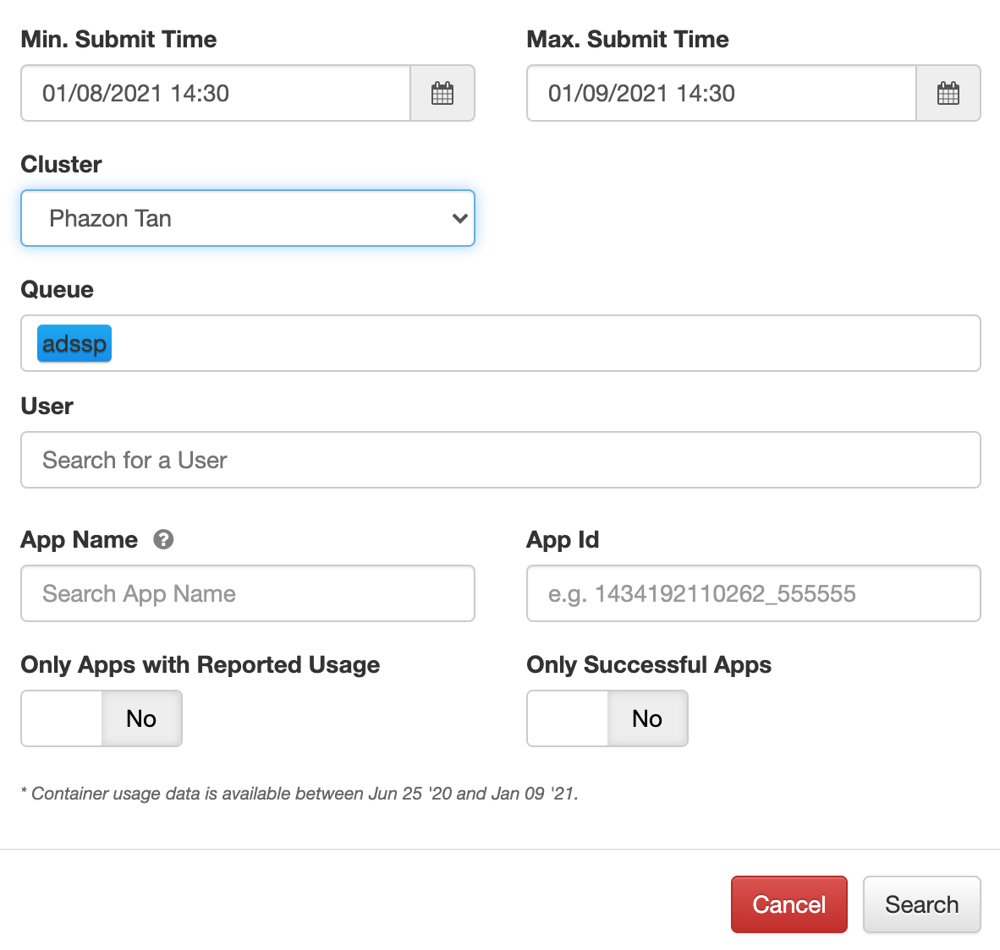
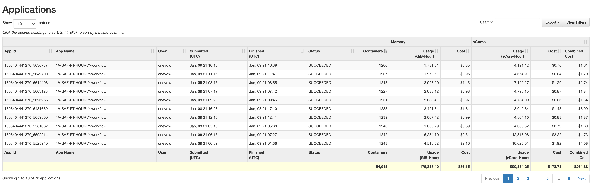
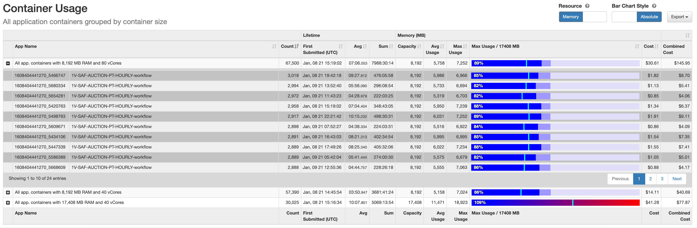

.. _spark_downsizer:

Spark Downsizer
===============

Spark Downsizer is an app resource usage monitoring tool, aiming to help spark users increase resource utilization.

.. note:: Spark Downsizer relies on the data of the Starling database. Starling will skip parsing apps whose event log size exceeds 500 MB. Hence, apps with large event logs won't show up in Spark Downsizer.

Usage
-----

To use spark downsizer, you can go to http://yo/downsizer and click the "Downsizer for Spark" button, then query the apps to be analyzed by selecting the search criteria. The returning result contains two tables: the applications table and the container usage table. The applications table shows per-app resource usage and various other information. The container usage table shows the aggregated container usage (executor container only for now, driver container's usage will be added in the next release) of all selected apps, grouped by the container size (the assigned size of memory / CPU). The container usage table also shows the maximum and average resource usage for the selecting type of resource. You can click the "+" sign on the left to unfold a list of per-app aggregated container usage. **To avoid resource waste, increase the overall grid resource utilization and for consistent and predictable runtime characteristics across different clusters - we recommend tuning your spark apps' memory/CPU settings to keep the ratio of maximum usage and capacity above 70%.**

   Applications search criteria

   
   Applications table

   
   Container usage table

Mechanism the downsizer uses
----------------------------

For a specific spark app and a specific type of resource, the maximum and average resource usage are always calculated based on the peak usage of all executors in their life cycle. For example, if a spark app has 3 executors, e1, e2, and e3, and they all have the same memory/CPU settings. e1 has a peak memory usage of 1GB (i.e., e1 never occupy more than 1GB physical memory throughout its life cycle), e2 has a peak memory usage of 2GB, and e3 has a peak memory usage of 3GB, the downsizer would return a maximum container memory usage of 3GB and average container memory usage of 2GB for that app.

CPU vCores
----------

vCore is an abstraction of CPU resource in the YARN cluster. In our grid, 10 vCores maps to 1 physical CPU core. Similar to the memory, the maximum and average container CPU usage are calculated based on the peak usage of every executor during its life cycle. Please note that an executor's vCores count is the combined vCores count of all running tasks in that executor. If you are seeing the containers' vCores count notably higher than its capacity, you may want to tune the spark app's CPU settings. For example, if you have spark.executor.cores=2 (i.e., the vCores capacity per executor is 20), spark.task.cpus=1, and you are seeing the average vCores count at 80, then you may want to set spark.task.cpus=4 to reserve more CPU resource for the CPU-intensive tasks, and spark.executor.cores=8 if you want to keep each executor running 2 tasks in parallel. This scenario is quite common in machine learning jobs or user programs that have multi-thread in nature.
