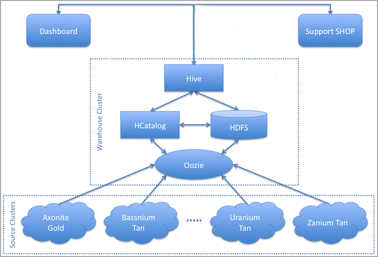

============
Architecture
============  

Overview
========

Starling uses an Oozie coordinator job and work-flows running on a central warehouse cluster to 
periodically pull logs from various source clusters, process these logs, and store 
the processed logs as tables in a central data-warehouse backed by HCatalog. 
These tables can then be queried by developers, performance analysts, etc., using Hive or Pig. 

Starling does not have a separate stand-alone server: all the collection and processing 
happens as a part of Oozie work-flows and an Oozie coordinator job executes these 
work-flows at an appropriate frequency.

Starling has an extensible architecture that allows it to handle different services and their logs. 
It allows easy configuration to handle different source clusters or frequencies of 
log-collection without requiring any modification or addition of code.

The diagram below shows high-level overview of the architecture of Starling: 

Life Cycle of Logs
==================

A typical log collected by Starling goes through the following states in its life-cycle:

#. **Created** - the log is created by the corresponding service (e.g., audit logs by a Name Node). 
   It might reside on a local file-system or on HDFS.
#. **Remotely Available** - the log is made available for collection by Starling on the source cluster. 
   This might involve some pre-processing and storage into HDFS.
#. **Locally Available** - the log is acquired by Starling and kept in a local staging area on the 
   warehouse cluster. This involves transferring the log from the source cluster to the warehouse cluster.
#. **Processed** - the log is processed by Starling and stored with HCatalog, ready to be queried 
   by applications using Hive or Pig.
#. **Purged** - the log has exceeded its retention period and is purged from the system.

          

Error Handling and Recovery
===========================

For each source cluster, Starling maintains a small state-file on the warehouse 
cluster that records the next instance of each log to be collected from the cluster 
or waiting to be processed after collection. For each such log, it also records 
the number of unsuccessful attempts at collecting or processing logs thus far. If this 
file is not present or is corrupt, Starling will recreate it by determining which 
logs of a given type have been processed so far, starting from its epoch.

During the regular operation of Starling, the following
errors are often encountered:

- **Warehouse Cluster Goes Down** - Oozie will not be able to submit Starling 
  work flows. For a given work-flow, it will keep trying at periodic intervals and 
  give up after some time if the cluster still doesn't come up. After the cluster 
  comes up, the next successful work-flow will pick up the processing of logs from 
  where it started failing.
- **Source Cluster Goes Down** - Oozie will not be able to get delegation tokens 
  for the Starling work-flows from the Name Node for the source cluster. For a given 
  work flow, it will keep trying at periodic intervals and give up after some time 
  if the cluster still doesn't come up. After the cluster comes up, the next successful 
  work flow will pick up the processing of logs from where it started failing.
- **Oozie Goes Down** - When Oozie comes back up, it will resubmit the pending 
  Starling work flows. Only one such work flow will run at a given time due to the 
  way the coordinator job is configured.
- **HCatalog Goes Down** - Oozie will not be able to get delegation tokens for the 
  Starling work flows from HCatalog. For a given work flow, it will keep trying at 
  periodic intervals and give up after some time if HCatalog still doesn't come up. 
  After HCatalog comes up, the next successful work flow will pick up the processing 
  of logs from where it started failing.
- **Logs Are Unavailable** - If the log for a given time are due, but are not yet 
  available, Starling will not complain until a configurable grace-period has elapsed; 
  if the log is still not available, it will consider each unsuccessful attempt on 
  a given run as an error. After a configurable maximum number of retry attempts, 
  it will give up on the log and move on to the next log in the series. (If the log 
  somehow becomes available after this, the administrator can use a separate ad 
  hoc tool to process that log.)
- **Logs Are Corrupt** - If a collected log is incomplete or corrupt, Starling 
  will consider it as an error. After a configurable maximum number of retry attempts, 
  it will give up on the log and move on to the next log in the series. (If the log 
  somehow becomes available after this, the administrator can use a separate ad hoc 
  tool to process that log.)
