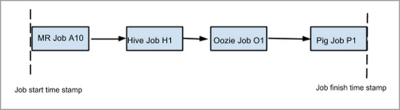

==========
Query Bank
==========

This chapter contains commonly used queries and some advanced use cases for
your reference. We'll be adding more queries and possibly categorize 
the queries to help you better use Starling.

Setting Up 
==========

Before you can run the Hive queries or Pig scripts in the sections below,
you will need to do the 

- Get a Kerberos ticket: `$ `kinit {user_name}@Y.CORP.YAHOO.COM``
- Set the job queue to ``default``: ``$ set mapreduce.job.queuename=default``

Starling Permissions
--------------------

To execute many of the Starling queries and Pig scripts in this chapter, you need to be able to access the
Starling table ``starling_jobs_confs``. Only members of the group ``ygrid_group_gpd`` group, however,
have access to this table. If you do not have permission to the table, you will get the following error::

   Permission denied: user={your_user_name}, access=EXECUTE,


Unfortunately, we currently do not have a way to request membership to 
``ygrid_group_gpd``, but we are hoping to allow users to request membership
in the near future. 

Hive
====

Because some of the Hive queries will require more time to complete execution, we recommend that you
increase the timeout by following command: ``hive –hiveconf hive.metastore.client.socket.timeout=200``


Total Number of Jobs And Distribution Within a Month 
----------------------------------------------------


All Jobs
########


.. code-block:: sql

   select count(1) jobs_count from starling_jobs where dt between '2014_01_01' and '2014_01_31';

**Example Output** 

::

    19,538,923

All Pig Jobs
############

.. code-block:: sql

   select count(1) jobs_count from starling_job_confs where dt between '2014_01_01' and '2014_01_31' and params['pig.script.id'] is not null;


**Example Output** 

::

    10,124,557 (51.8% of all Jobs)

All Hive Jobs
#############

.. code-block:: sql

   select count(1) jobs_count  from starling_job_confs where dt between '2014_01_01' and '2014_01_31' and params['hive.query.id'] is not null;

**Example Output** 

::

    192,293 


All GDM Jobs
############

.. code-block:: sql

   select count(1) jobs_count from starling_jobs where dt between '2014_01_01' and '2014_01_31’ and user=’dfsload’;


**Example Output** 

::

    1,648,036 

All Streaming Jobs
##################

.. code-block:: sql

   select count(1) jobs_count from starling_jobs where dt between '2014_01_01' and '2014_01_31' and (lower(job_name) like '%jar%');

**Example Output**

::

    141,869 

All Java MapReduce Jobs
#######################

.. code-block:: sql

   select count(1) jobs_count from starling_jobs where dt between '2014_01_01' and '2014_01_31' 
      and not(job_name like 'PigLatin%') and not(job_name like '%oozie-wrkf%') 
      and not(lower(job_name) like 'select %') and not(lower(job_name) like 'update %') 
      and not(lower(job_name) like 'insert %')
      and not(user ='dfsload') and not(job_name like '%jar%');

**Example Output**

::

    3260192


Total Number of Jobs From Oozie Within a Month 
----------------------------------------------

All Oozie Jobs 
##############

.. code-block:: sql

   select count(1) jobs_count from starling_job_confs  where dt between '2014_01_01' and '2014_01_31' and params['oozie.action.id'] is not null;

**Example Output**

::

    8,280,107 

All Pig Jobs from Oozie
#######################

.. code-block:: sql

   select count(1) jobs_count from starling_job_confs where dt between '2014_01_01' and '2014_01_31' and params['pig.script.id'] is not null and params['oozie.action.id'] is not null;

**Example Output**

::

   3,446,409

All Hive Jobs from Oozie
########################

.. code-block:: sql

   select count(1) jobs_count from starling_job_confs where dt between '2014_01_01' and '2014_01_31' and params['hive.query.id'] is not null and params['oozie.action.id'] is not null;

**Example Output**

::

    179,255

All Oozie Jobs 
##############

.. code-block:: sql

   select count(1) jobs_count from starling_job_confs sjc join starling_jobs sj 
       on (sjc.job_id=sj.job_id and sjc.grid=sj.grid and sjc.dt=sj.dt) where sjc.dt 
       between '2014_01_01' and '2014_01_07' and sj.dt between '2014_01_01' and '2014_01_07' 
       and params['oozie.action.id'] is not null;

**Example Output**

::

    238585

Percentage of Jobs Initiated By Oozie Per Month 
###############################################

.. code-block:: sql

   select count(1), task.type from starling_job_summary jobs join starling_tasks task 
       on (jobs.job_id=task.job_id) where task.dt between '2014_01_01' and '2014_01_31' 
       and jobs.dt between '2014_01_01' and '2014_01_31' and jobs.job_name like 'oozie:launcher%' 
       group by task.type;

**Example Output**

::

    3899630 


Number of Unique Oozie (Backyard ID / Headless) Users on Grid
#############################################################

.. code-block:: sql

   select distinct user from starling_jobs where dt between '2013_11_01' and '2013_11_30' and job_name like 'oozie:launcher%';


**Example Output**

::

    abychay
    ac_pv
    adwprd
    ahmedf
    ajeetps
    akagian
    alles
    amd_dev
    amdgrd_1
    amitgupt
    amitjain
    amitkuma
    amulay
    anejar
    anithar
    apodev
    apollog
    apollost
    asd_head
    ashishg
    autosgrd
    baiyi
    bgopalan
    bhardwaj
    bhaskar
    bishan
    boliu1
    boomuser
    btdb
    ...

    
Number of Oozie Applications on the Grid 
########################################


.. code-block:: sql

   select conf.params['oozie.wf.application.path'] from starling_job_summary jobs 
       join starling_job_confs conf on (jobs.job_id=conf.job_id) where jobs.dt between '2013_08_01' 
       and '2013_08_30' and jobs.job_name like 'oozie:launcher%';

**Example Output**

::

    N/A

Total Number of Monthly Jobs From Oozie Within a Year
-----------------------------------------------------

Hive Jobs Per Month
###################

.. code-block:: sql

   select jobs.dt_month, count(1) from (select substr(dt,1,7) as dt_month from starling.starling_job_confs 
       where dt between '2013_02_01' and '2014_03_31' and params['hive.query.id'] is not null) jobs group by jobs.dt_month;

**Example Output**

::

    2014_02    485527
    2014_03    637235 

Oozie Jobs Per Month
####################

.. code-block:: sql

   select jobs.dt_month, count(1) from (select substr(dt,1,7) as dt_month from starling.starling_job_confs 
       where dt between '2013_01_01' and '2014_03_31' and params['oozie.action.id'] is not null) jobs group by jobs.dt_month;

**Example Output**

::

    2014_01    7150412
    2014_02    10450893
    2014_03    12354540

Pig Jobs Per Month
##################

.. code-block:: sql

   select jobs.dt_month, count(1) from (select substr(dt,1,7) as dt_month from starling.starling_job_confs 
       where dt between '2013_01_01' and '2014_03_31' and params['pig.script.id'] is not null) jobs group by jobs.dt_month;

**Example Output**

::

    2014_01    8733348
    2014_02    10941493
    2014_03    11998364 


Number of Jobs Run by a User
----------------------------

.. code-block:: sql

   SELECT COUNT(job_id) FROM starling_jobs WHERE user-'dfsload' and grid-'MG' and dt-'2011_12_03';

**Example Output**

::

    16003

Number of Jobs Run Each Day
---------------------------

.. code-block:: sql

   SELECT COUNT(1), dt FROM starling_jobs WHERE grid-'MB' and dt>-'2011_07_11' and dt <- '2011_07_13' GROUP BY dt;

**Example Output** 

::

    12178       2011_07_11
    8816        2011_07_12
    8983        2011_07_13

Wait Times for Jobs in a Date Range
-----------------------------------

.. code-block:: sql

   SELECT COUNT(1) AS job_count, t.wait_time
   FROM (SELECT ROUND(wait_time/1000)
   AS wait_time, job_id FROM starling_jobs WHERE grid-'MB'
   AND (UNIX_TIMESTAMP(dt,'yyyy_MM_dd') >- UNIX_TIMESTAMP('2011_07_11','yyyy_MM_dd'))
   AND (UNIX_TIMESTAMP(dt,'yyyy_MM_dd') <- UNIX_TIMESTAMP('2011_07_13','yyyy_MM_dd'))) t
   GROUP BY t.wait_time;


**Example Output** 

::

    74      0
    1001    1
    2112    2
    3321    3
    4402    4
    5503    5
    [...]
    1       2781
    1       2832
    1       3563
    1       4058
    1       7604

Total HDFS Bytes Read (in GB) by Non-dfsload Jobs in a Date Range
-----------------------------------------------------------------

.. code-block:: sql

   SELECT ROUND((SUM(total_counters['HDFS_BYTES_READ']))/1073741824) AS bytes_read_in_gb, starling_job_counters.dt
   FROM starling_job_counters
   JOIN (SELECT job_id FROM starling_jobs WHERE user <> 'dfsload') t ON (starling_job_counters.job_id-t.job_id)
   WHERE starling_job_counters.grid-'MB'
   AND (UNIX_TIMESTAMP(dt,'yyyy_MM_dd') >- UNIX_TIMESTAMP('2011_07_11','yyyy_MM_dd'))
   AND (UNIX_TIMESTAMP(dt,'yyyy_MM_dd') <- UNIX_TIMESTAMP('2011_07_13','yyyy_MM_dd'))
   GROUP BY starling_job_counters.dt;

**Example Output** 

::

    190532      2011_07_11
    336164      2011_07_12
    219601      2011_07_13


Data Locality
-------------

How much data is being read local to a rack (from a data node in the same rack) vs. data read from off rack.


.. code-block:: sql

   select  T.grid, T.dt, round(avg(T.datalocal)), round(avg(T.racklocal)), round(avg(T.others))
   from (
           select
                   J.grid grid, J.dt dt, J.job_id,
                   (J.datalocal * 100)/J.total datalocal,
                   (J.rack * 100)/J.total racklocal,
                   ((J.total - J.datalocal - J.rack) * 100)/J.total others
           from (
               select
                   grid, dt, job_id,
                   cast(total_counters['Job Counters/Launched map tasks'] as bigint)  total,
                   cast(total_counters['Job Counters/Data-local map tasks'] as bigint) datalocal,
                   cast(total_counters['Job Counters/Rack-local map tasks'] as bigint) rack
               from starling_job_counters
       ) J 
       where J.total is not null and J.datalocal is not null and J.rack is not null and
         J.total > 0 and J.datalocal > 0 and J.rack > 0
   ) T
   group by T.grid, T.dt;

**Example Output** 

::

    N/A

.. Instances Read on Dilithium Gold
.. --------------------------------
.. 
.. For the directories ``/data/SDS/data`` and ``/data/FETL/*``, what were the oldest, newest 
.. instances read and how many times were individual pieces read on Dilithium Gold.
.. 
.. If you want to save these results to import into excel or other program, 
.. save this query in a file and execute: ``/home/y/bin/hive #f foobar.file >results.csv``. 
.. You can then import the results.csv file into excel using tab as the delimiter.
.. 
.. .. note:: ``INSERT OVERWRITE LOCAL DIRECTORY 'test.csv'`` won't do what you think it might do. 
..           The ```test.csv`` directory will contain a single hadoop compressed file that isn't human readable.
.. 
.. .. code-block:: sql
.. 
..    select F.grid as GRID, F.dt as DT, F.ugi as USER,
..        regexp_extract(F.src_path,'/([^/]*)/([^/]*)/([^/]*)/([^/]*)', 4) as DATASET,
..        min(regexp_extract(F.src_path,'/([^/]*)/([^/]*)/([^/]*)/([^/]*)/([^/]*)', 5)) as FIRST_INSTANCE,
..        max(regexp_extract(F.src_path,'/([^/]*)/([^/]*)/([^/]*)/([^/]*)/([^/]*)', 5)) as LAST_INSTANCE,
..        count(1) as COUNT
..    from (
..         select src.grid as grid,
..           src.dt as dt,
..           src.ugi as ugi,
..           src.src_path as src_path
..         from  starling_fs_audit src 
..    where 
..        src.grid-'DG' and src.dt-'2011_11_08'
..        and regexp_extract(src.src_path,'(/data/SDS/data)/([^/]*)/([^/]*)', 1) -- '/data/SDS/data'
..    union all 
..    select dest.grid as grid,
..        dest.dt as dt,
..        dest.ugi as ugi,
..        dest.dest_path as src_path
..    from  starling_fs_audit dest 
..    where 
..        dest.grid-'DG' and dest.dt-'2011_11_08'
..        and regexp_extract(dest.dest_path,'(/data/SDS/data)/([^/]*)', 1) -- '/data/SDS/data'
..        ) F
..    group by F.grid, F.dt, F.ugi, 
..        regexp_extract(F.src_path,'/([^/]*)/([^/]*)/([^/]*)/([^/]*)', 4)
..    order by GRID, DT,
..        DATASET, USER;
.. 
.. Now do the same for ``/data/FETL/{ABF,LL_Web}/``:
.. 
.. .. code-block:: sql
.. 
..    INSERT OVERWRITE LOCAL DIRECTORY 'DGabfusage20111108.csv'
..       select F.grid as GRID, F.dt as DT, F.ugi as USER,
..       regexp_extract(F.src_path,'/([^/]*)/([^/]*)/([^/]*)/([^/]*)', 4) as DATASET,
..       min(regexp_extract(F.src_path,'/([^/]*)/([^/]*)/([^/]*)/([^/]*)/([^/]*)', 5)) as FIRST_INSTANCE,
..       max(regexp_extract(F.src_path,'/([^/]*)/([^/]*)/([^/]*)/([^/]*)/([^/]*)', 5)) as LAST_INSTANCE,
..       count(1) as COUNT
..    from (
..        select src.grid as grid,
..          src.dt as dt,
..          src.ugi as ugi,
..          src.src_path as src_path
..    from starling_fs_audit src 
..    where 
..        src.grid-'DG' and src.dt-'2011_11_08'
..        and regexp_extract(src.src_path,'(/data/FETL/[^/]*)/([^/]*)/([^/]*)', 1) -- '/data/SDS/data'
..    union all 
..        select dest.grid as grid,
..        dest.dt as dt,
..        dest.ugi as ugi,
..        dest.dest_path as src_path
..    from  starling_fs_audit dest 
..    where 
..        dest.grid-'DG' and dest.dt-'2011_11_08'
..        and regexp_extract(dest.dest_path,'(/data/FETL/[^/]*)/([^/]*)', 1) -- '/data/SDS/data'
..        ) F
..    group by F.grid, F.dt, F.ugi, 
..        regexp_extract(F.src_path,'/([^/]*)/([^/]*)/([^/]*)/([^/]*)', 4),
..    order by GRID, DT,
..        DATASET, USER;
.. 
.. **Example Output** 
.. 
.. TBD


Find the Number of Jobs Using Compressed Output Files
-----------------------------------------------------

.. code-block:: sql

   select count(1) jobs_count, params['mapreduce.output.fileoutputformat.compress'],
       params['mapreduce.output.fileoutputformat.compress.codec']
   from starling_job_confs
   where grid='BR' and dt='2013_06_01'
   group by params['mapreduce.output.fileoutputformat.compress'],
       params['mapreduce.output.fileoutputformat.compress.codec'];

**Example Output**

::

    85	false	org.apache.hadoop.io.compress.BZip2Codec
    4314	false	org.apache.hadoop.io.compress.DefaultCodec
    16	false	org.apache.hadoop.io.compress.GzipCodec
    3	true	org.apache.hadoop.io.compress.BZip2Codec
    57	true	org.apache.hadoop.io.compress.GzipCodec
    1	yes	org.apache.hadoop.io.compress.GzipCodec

Find Non-Pig Jobs Using Compressed Output Files
-----------------------------------------------

.. No permission to execute.

.. code-block:: sql

   select count(1) jobs_count,
       params['mapreduce.output.fileoutputformat.compress'],
       params['mapreduce.output.fileoutputformat.compress.codec']
   from starling_job_confs
   where dt between '2013_06_10' and '2013_06_16'
       and params['pig.script.id'] is null
   group by
       params['mapreduce.output.fileoutputformat.compress'],
       params['mapreduce.output.fileoutputformat.compress.codec'];

**Example Output**

::


Find MapReduce Jobs Reading/Writing to /tmp
-------------------------------------------

.. No permission to execute.

.. code-block:: sql

   select count(1) jobs_count
   from starling_job_confs
   where dt between '2013_05_01' and '2013_06_01'
       and (params['mapreduce.input.fileinputformat.inputdir'] like './tmp/%'
       or params['mapreduce.output.fileoutputformat.outputdir'] like './tmp/%');

**Example Output** 


Pig
===

To use Pig with Starling, you need to access the Starling Hive tables through HCatalog.
Thus, you will need to start Pig with the option `` -useHCatalog``.

All Jobs
--------

Pig Statement
#############

::

   A = load 'starling.starling_jobs' using org.apache.hive.hcatalog.pig.HCatLoader();
   B = filter A by (dt >= '2014_01_01' AND  dt <= '2014_01_31');
   C = group B all;
   D = foreach C generate COUNT_STAR(B);
   dump D;

Sample Result
#############

::

    19,538,923

 
All Pig Jobs
------------

Pig Statement
#############

::

   A = load 'starling.starling_job_confs' using org.apache.hive.hcatalog.pig.HCatLoader();
   B = filter A by dt >= '2014_01_01' AND  dt <= '2014_01_31' AND params#'pig.script.id' is not null ;
   C = group B all;
   D = foreach C generate COUNT_STAR(B);
   dump D;

 

Sample Result
#############

::

    10,124,557 (51.8% of all Jobs)


All Pig Jobs From Oozie
-----------------------

Pig Statement
#############

::

   A = load 'starling.starling_job_confs' using org.apache.hive.hcatalog.pig.HCatLoader();
   B = filter A by dt >= '2014_01_01' AND  dt <= '2014_01_31' AND params#'pig.script.id' is not null AND params#'oozie.action.id' is not null;
   C = group B all;
   D = foreach C generate COUNT_STAR(B);
   dump D;

**Example Output**

::

   3,446,409

All Hive Jobs From Oozie
------------------------

Pig Statement
#############

::

    A = load 'starling.starling_job_confs' using org.apache.hive.hcatalog.pig.HCatLoader();
    B = filter A by dt >= '2014_01_01' AND  dt <= '2014_01_31' AND params#'hive.query.id' is not null AND params#'oozie.action.id' is not null;
    C = group B all;
    D = foreach C generate COUNT(B);
    dump D;

**Example Output**


::

    179,255

Number of Jobs Run by a User
----------------------------

Pig Statement
#############

::

    A = load 'starling.starling_jobs' using org.apache.hive.hcatalog.pig.HCatLoader();
    B = filter A by dt == '2014_12_01' AND  grid  == 'MR' AND user == 'dfsload';
    C = group B all;
    D = foreach C generate COUNT_STAR(B.job_id);
    dump D;

**Example Output**

::

    16003

Number of Jobs Run Each Day
---------------------------

Pig Statement
#############

::

    A = load 'starling.starling_jobs' using org.apache.hive.hcatalog.pig.HCatLoader();
    B = filter A by dt >= '2014_12_11' AND  dt <= '2014_12_13' AND grid  == 'MB';
    C = group B by dt;
    D = foreach C generate COUNT_STAR(B), group;
    dump D;

**Example Output**

::

    12178       2011_12_11
    8816        2011_12_12
    8983        2011_12_13


MapReduce
=========

We currently do not have examples for MapReduce, but needed,
write to yahoo#hcatalog#dev@yahoo#inc.com.


Advanced Examples
=================

Calculating the Total Job Completion Time
-----------------------------------------

Business owners of data pipelines, lead data SEs, segment owners,
capacity managers, and program managers all require different
completion times for grid activity that may involve a complex
set of jobs, data pipeplines, segments, applications, and 
products. A business owner of a data pipeline
might need data move through a pipeline on the grid in
under 3.5 hours, whereas, a lead data SE instead focuses
on the total time needed to execute an application.

Calculating the total job completion time may be complex because
it might involve tracing a job elonging to a segment that is part of a larger pipeline.
This pipeline could be part of an application that is, in turn,
part of a larger product. The L2 of the business unit will have
a SLA and utilization metrics for this product along with others. 

Given an start and end time in the simple figure below, how would you calculate the total actual 
time to compare with your expected time (SLA/required time)? 
The answers is with **tags**, which we'll look at next before 
showing how to use them.




Tags
#### 

Starling allows you to set different tags for different types
of information. Once tags have been set, YARN starts 
to log the tag values in the Job Tracker configurations.
You can then then estimate the total time for SLAs, 
capacity consumption for any product, intitiative, or BU
through the rolled-up tag values.

.. csv-table:: Data Pipeline Modeling and Tag Values
   :header: "Tag Type", "Tag Name", "Hive Default", "Pig Default", "Oozie Default", MapReduce Default"
   :widths: 30, 30, 30, 30, 30, 30

   "Identifier", "``tagx_identifier_projectId``", "377", "378", "379", "380"
   "Identifier", "``tagx_identifier_pipelineName``", "Test Hive app","Test pig app","Test oozie app","Test MR app"
   "Identifier", "``tagx_identifier_pipelineInstanceID``","1001", "1002", "1003", "1004"
   "Identifier", "``tagx_identifier_jobID``","10001","10002","10003", "1004"
   "Identifier", "``tagx_identifier_jobInstanceId``", "1001", "1001", "1001", "1001"
   "Identifier", "``tagx_identifier_firstJob``", "FALSE", "FALSE", "FALSE", "TRUE"
   "Identifier", "``tagx_identifier_lastJob``", "TRUE", "FALSE", "FALSE", "FALSE"
   "Capacity Requirement", "``tagx_capacityRequirement_frequencyMins``", "30", "30", "30", "30"
   "SLA", "``set tagx_sla_timeToCompleteMins=20;``", "2", "8", "6", "2"


Using Tags With Hive
********************

By running the following script from the Hive CLI, you can
follow the MapReduce jobs that are spawned through
the ID ``10001``.

.. code-block:: sql

   set tagx_identifier_pipelineInstanceID=10001;

   set hive.metastore.client.socket.timeout = 20000;
   set mapred.job.queue.name=unfunded;

   use starling;

   desc starling_fs_blocks;

   select count(grid)
   from starling_fs_blocks 
   where grid = 'CB' 
   and dt = '2014_07_01';

You can also run a Hive script and specify the tag with the CLI::

    hive -hiveconf tagx_identifier_pipelineInstanceID=10001 -f test.sql

Using Tags With Pig/MapReduce
*****************************


For MapReduce, you need to specify the tag from the command line. 
For example, the option ``-D`` is used to specify the tag ID ``10001`` below::

    yarn jar X.jar pi -Dmapred.job.queue.name=unfunded -Dtagx_identifier_pipelineInstanceID=10001 16 1000

Pig, like Hive, allows you to specifiy the tag in a script or from the command line::

    pig -P param_file params.txt script1-hadoop.pig

You can also set the tag in Oozie through ``workflow.xml``:

.. code-block:: xml

   <property><name>tagx_identifier_jobInstanceId</name><value>100001</value></property>


Estimating Capacity Cost 
------------------------

In this example, we'll be using Starling queries to calculate the capacity 
cost per month for both storage and computation. In this example,
we'll be calculating the `total cost of ownership (TCO) <http://en.wikipedia.org/wiki/Total_cost_of_ownership>`_ that factors in the following elements:

- **network bandwidth** - data transferred into and out of clusters for all colos, 
  including cross-colo transfers.
- **operations engineering** - head count for service engineering and data operations
  teams responsible for day-to-day operations and support.
- **acquisition/install (one time)** - labor, POs, transportation, space, support, upgrades,
  decommisions, shipping, receiving, etc.
- **network hardware** - aggregated network component costs, including switches, wiring,
  terminal servers, power strips, etc.
- **active use and operations (recurring)** - recurring datacenter operation costs (power, 
  space, labor support, and facility maintenance).
- **R&D head count** - the head count for platform software development, quality, and
  release engineering.
- **cluster hardware** - data nodes, name nodes, job trackers, gateways, load proxies,
  monitoring, aggregator, and Web servers.


Storage Consumption
###################

Storage is generally priced as the TCO for a GB per month and can be measured as data stored or raw HDFS
used. For Hadoop as a Service at Yahoo, the storage cost is $0.0087  for each GB per month for raw
HDFS (accounts for three times your data stored on HDFS for replication factor at Yahoo). 

The query below will return the monthly average consumption of data and raw HDFS in GB.
(Replace values in ``<>`` with your own values.)

.. code-block:: mysql

   SELECT Avg(data_gb), 
          Avg(hdfs_gb) 
   FROM   (SELECT dt, 
                  Sum(size) / 1024 / 1024 / 1024     data_GB, 
                  Sum(size) * 3 / 1024 / 1024 / 1024 HDFS_GB 
           FROM   starling_fs_entries 
           WHERE  path LIKE '/projects/<project_name>/%' 
                  AND grid = '<grid_name>' 
                  AND dt BETWEEN '<YYYY_MM_01>' AND '<YYYY_MM_30>' 
           GROUP  BY dt) daily_GB; 


Compute Consumption
###################

The computation is priced in dollars for each GB-Hour within a month and can be measured as the
number of map and reduce memory containers consumed and the time those containers were
running. For Hadoop as a Service at Yahoo, the compute TCO is $0.0067 per GB-Hour per month.


In the starling query below, the field ``jobmemory.gb_hr`` can be directly multiplied with our unit compute TCO to arrive at total
compute cost for a given user and queue combination. 


.. code-block:: sql

   SELECT
      starling_job_summary.user,
      starling_job_summary.queue,
      SUM  (jobmemory.gb_hr)  
   FROM
      (  SELECT
         job_id,
         SUM(memory_mb_sec)/1024/60/60  gb_hr  
      FROM
         (  SELECT
            starling_job_confs.job_id,
            starling_tasks.task_id,
            IF(starling_tasks.type='MAP',
            (starling_job_confs.params['mapreduce.map.memory.mb']*(  starling_tasks.run_time/1000)),
            (starling_job_confs.params['mapreduce.reduce.memory.mb']*(starling_tasks.run_time/10  00)))  AS  memory_mb_sec  
         FROM
            starling_job_confs  
         JOIN
            starling_tasks  
               on  starling_job_confs.job_id  =  starling_tasks.job_id  
         WHERE
            starling_job_confs.dt  BETWEEN  '<YYYY_MM_01>'  and  '<YYYY_MM_30>'  
            AND  starling_job_confs.grid  IN  (
               '<grid_name>'
            )  
            AND  starling_tasks.dt  BETWEEN  '<YYYY_MM_01>'  and  '<YYYY_MM_30>'  
            AND  starling_tasks.grid  IN  (
               '<grid_name>'
            ))  all_tasks  
      GROUP  BY
         job_id  )  jobmemory  
      JOIN
         starling_job_summary  
            ON  jobmemory.job_id  =  starling_job_summary.job_id  
      WHERE
         starling_job_summary.dt  BETWEEN  '<YYYY_MM_01>'  and  '<YYYY_MM_30>'  
         AND  starling_job_summary.grid  ='<grid_name>'  
         AND  starling_job_summary.user  =  '<user_name>'  
      GROUP  BY
         starling_job_summary.user,
         starling_job_summary.queue;


