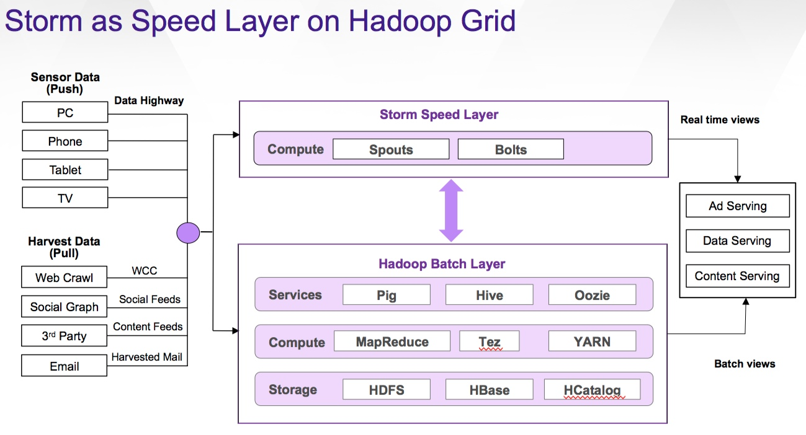
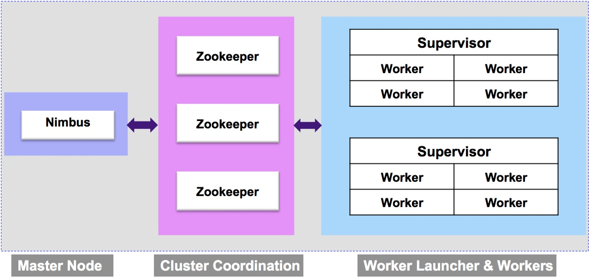

============
Architecture
============

.. Status: Finished first draft. Could use another copy edit and possible a section on topology.

In this chapter, we'll look at how Storm fits in the big Hadoop picture and then the components of a Storm cluster.

Storm in the Hadoop Ecosystem
=============================

The diagram below shows a bird's-eye view of Storm in the Hadoop ecosystem. 
It's called the *speed layer* here, but that simply is a way to compare it
with the *batch layer* that consists of the Hadoop services, engines (MapReduce, Tez, and YARN),
and storage systems (HDFS, HBase, and HCatalog). The main difference between Storm and
the batch layer though is that Storm is processing data in real-time (RAM), whereas, the
batch layer is generally reading and writing data from the storage mechanisms as it's processing
data.

Storm Cluster
=============

Within a Storm cluster, you'll find three types of nodes shown in the diagram below.
The master node is a Nimbus node, which is what the Hadoop JobTracker uses as well.
The Nimbus node is responsible for uploading computations for execution, distributing
code across the cluster, and launching workers. It also monitors computations and
reallocates workers when needed.

The Supervisor nodes listens for signals from Nimbus to start and stop workers that execute parts of the topology. The
Zookeeper nodes coordinate the communication between Nimbus and the Supervisors.

