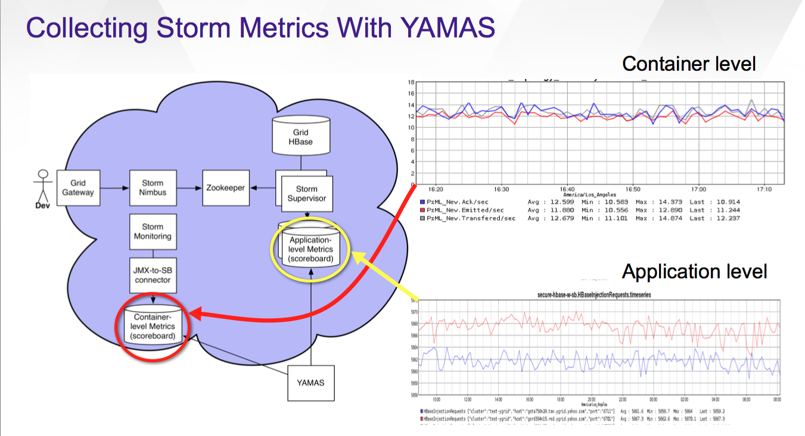

========================
YAMAS Metrics/Monitoring
========================

.. Status: Second draft on 09/22/14.

As of ``ystorm_contrib-0.1.0.37``, the HTTP spout exports metrics through the Storm 
metrics system. The ``ystorm_contrib`` package also includes with it a metrics 
collector that you can include with your topology to place these metrics 
in YAMAS.

Overview of YAMAS in Storm
==========================

You can use YAMAS to monitor Storm at the container and 
application level as shown in the figure below. At the container
level, YAMAS is communicating with Nimbus through a connector, allowing
you to monitor the performance and find issues in the Storm cluster.
At the application level, YAMAS is communicating with the Supervisor, so
you can monitor the performance of your topology.

Yamas Metrics Consumer Basics
=============================

Before you collect YAMAS metrics in your code, you should review the following
sections to learn how to include dependencies, import the ``yamas`` package,
and understand what metrics are supported.

Adding Dependencies
-------------------

Add the following XML to your ``pom.xml`` to include the ``yamas_metrics_consumer`` package::

.. code-block:: xml

   <dependency>
       <groupId>yahoo.yinst.ystorm_contrib</groupId>
       <artifactId>yamas_metrics_consumer</artifactId>
       <version>0.1.0.37</version>
   </dependency>

Configuring Storm to Use YAMAS
------------------------------

In your driver file,  add the following when submitting your topology:

.. code-block:: java

   import com.yahoo.storm.metrics.yamas.YamasMetricsConsumer; 
   ...
   conf.registerMetricsConsumer(YamasMetricsConsumer.class, "yamas-app", 1);

Supported Metrics
-----------------

In addition to the metrics below, YAMAS also supports user-defined metrics from your topology. 
The name of the metric in your topology will be preserved when sent to YAMAS. 
Any named metric that is a ``com.yahoo.storm.metrics.yamas.AbsoluteNumber`` will be set. 
Any named metric that is any other ``Number`` will be incremented by the value. 
More complex objects are ignored.

.. csv-table:: Supported Metrics for Storm
   :header: "Name/Pattern", "Description"
   :widths: 15, 45

   "``uptimeSecs``", "The uptime in seconds for the worker."
   "``startTimeSecs``", "The UNIX time when the worker came up."
   "``GC/ParNew/ConcurrentMarkSweep_count``", The number of garbage collections that have happened."
   "``GC/ParNew/ConcurrentMarkSweep_timeMs``", "The time spent doing those garbage collections."	
   "``Memory/heap/nonHeap_unusedBytes``", "The unused bytes."	
   "``Memory/heap/nonHeap_usedBytes``", "The bytes currently used."	
   "``Memory/heap/nonHeap_maxBytes``", "The maximum bytes for this memory type."	
   "``Memory/``heap/nonHeap_initBytes``", "The initial bytes for this memory type."
   "``Memory/heap/nonHeap_virtualFreeBytes``", "The initial bytes for this memory type."
   "``Memory/heap/nonHeap_virtualFreeBytes``", "The maximum of used bytes."
   "``Memory/heap/nonHeap_committedBytes``", "The bytes committed to be used."
   "``__ack-count``", "The number of tuples acked on non-system streams."
   "``__ack-count_system``", "The number of tuples acked on system streams."
   "``__fail-count``", "The number of failed tuples on non-system streams."
   "``__fail-count_system``", "The number of failed tuples on system streams."
   "``__emit-count``", "The number of tuples emitted on non-system streams."
   "``__emit-count_system``", "The number of tuples emitted on system streams."
   "``__execute-count``", "The number of tuples executed on non-system streams."
   "``__execute-count_system``", "The number of tuples executed on system streams."

Each of these metrics shown below also have several dimensions with them, 
so that you can get more details of what is happening.

- ``worker-host``
- ``worker-port``
- ``component-id`` (``__system`` for worker wide metrics)
- ``task-id`` (``-1`` for worker wide metrics)

Customizing Metrics
-------------------

Storm metrics do not distinguish between an increment and a set once they get to 
the Collector. They also are very generic and could return complex objects like 
``Maps``, ``Lists``, etc. To handle set versus increment cases, we create an ``AbsoluteNumber`` 
class, that when a metric returns this YAMAS will call ``set()`` instead of ``increment()``.

For more complex metrics you can subclass the collector and override::

    public boolean handleDataPoint(DataPoint dp, MonMetrics yamas) throws MonMetricsException;

If the data point is something that you have handled yourself, then return ``true``.
If it is something you want default behavior for, then return ``false``. Do 
not send the metrics in your method, and do not change the dimensions: They are 
handled already and may cause problems.

System Metrics YAMAS Collector Already Handles
==============================================

Worker-Level Metrics
--------------------

.. csv-table:: Supported Metrics for Storm
   :header: "Purpose", "Metrics"
   :widths: 20, 45

   "Time", "- ``uptimeSecs``
            - ``startTimeSecs``"
   "Garbage Collection", "- ``GC/(ParNew|ConcurrentMarkSweep)_count``
                          - ``GC/(ParNew|ConcurrentMarkSweeps)_timeMs``"
   "Memory Usage", "- ``Memory/(heap|nonHeap)_unusedBytes``
                    - ``Memory/(heap|nonHeap)_usedBytes``
                    - ``Memory/(heap|nonHeap)_maxBytes``
                    - ``Memory/(heap|nonHeap)_initBytes``
                    - ``Memory/(heap|nonHeap)_virtualFreeBytes``
                    - ``Memory/(heap|nonHeap)_committedBytes``"

Tuple-Level Metrics
-------------------

.. csv-table:: Supported Metrics for Storm
   :header: "Purpose", "Metrics"
   :widths: 20, 45

   "Acknowledge", "- ``__ack-count``
                   - ``__ack-count_system``"
   "Failure", "- ``__fail-count``
               - ``__fail-count_system``"
   "Emit Throughput", "- ``__emit-count``
                       - ``__emit-count_system``"
   "Execute Throughput", "- ``__execute-count``
                          - ``__execute-count_system``"
   "Generic", "- Any named metric that is an ``AbsoluteNumber`` will be set.
               - Any named metric that is any other Number will be incremented by the value."

Dimensions
==========

YAMAS metrics are collected with the following dimensions::

    worker-host
    worker-port
    component-id ("__system" for worker wide metrics)
    task-id ("-1" for worker wide metrics)

Steps for Collecting Metrics
============================

1. Register Metrics
-------------------

.. code-block:: java

   transient CountMetric _countMetric;
   transient ReducedMetric _wordLengthMeanMetric;

   @Override
   public void prepare(Map conf, TopologyContext context, OutputCollector collector) {
       _collector = collector;
       _countMetric = new CountMetric();
       _wordLengthMeanMetric = new ReducedMetric(new MeanReducer());
    
       context.registerMetric("execute_count", _countMetric, 5);
       context.registerMetric("word_length", _wordLengthMeanMetric, 60);
   }

2. Register a Metrics Consumer Before Launching a Topology
----------------------------------------------------------

.. code-block:: java

   conf.registerMetricsConsumer(LoggingMetricsConsumer.class, 2);

3. Update the Metrics When Something Happens
--------------------------------------------

.. code-block:: java

   @Override
   public void execute(Tuple tuple) { 
       String word = tuple.getString(0);
       _collector.emit(tuple, new Values(word + "!!!"));
       _collector.ack(tuple); 
       _countMetric.incr();
       _wordLengthMeanMetric.update(word.length());
   } 

YAMAS Metrics Consumer
======================

Make sure to include ``yamas_metrics_consumer`` in your dependency tree.

.. code-block:: xml

   <dependency>
       <groupId>yahoo.yinst.ystorm_contrib</groupId>
       <artifactId>yamas_metrics_consumer</artifactId>
       <version>0.1.0</version>
   </dependency>

Please use YAMAS instead of Logging for metrics.

.. code-block:: java

   import com.yahoo.storm.metrics.yamas.YamasMetricsConsumer; 
   conf.registerMetricsConsumer(YamasMetricsConsumer.class, "yamas-app", 1);
   
