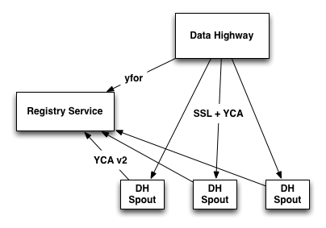

=================
Programming Storm
=================

.. Status: First Draft. Probably needs more content and copy editing.

The following sections are intended to help those who have already on-boarded, completed
one or more tutorials, and are ready to solve real-world problems.

Overview
========

Before we get to code snippets, we're going to look at the types of available grouping and then 
Yahoo spouts that you can use to tap into data. Grouping allows you to
define how that stream should be partitioned among the bolt’s tasks.

Types of Available Grouping
---------------------------

Storm has seven built-in stream groupings listed below, and 
you can also create a custom stream grouping 
with the ``CustomStreamGrouping`` interface.

- **Shuffle grouping:** Streams are randomly distributed across the bolt's task and each bolt is
  guaranteed an equal number of tuples.
- **Fields grouping:** Streams are partitioned based on specified fields, so that the streamed data 
  goes to the same tasks.
- **All grouping:** A stream is replicated across all the bolt's tasks.
- **Global grouping:** An entire stream is assigned to one of the bolt's tasks (goes to the task with lowest ID). 
- **Shuffle or Local grouping:** If there is a local bolt (in the same worker process) use it otherwise use shuffle.
- **None grouping:** This grouping specifies that you don’t care how the stream is grouped. Currently, 
  *none groupings* are equivalent to shuffle groupings. Eventually though, Storm will 
  push down bolts with none groupings to execute in the same thread as the bolt or 
  spout they subscribe from (when possible).
- **Direct grouping:** The producer of the tuple determines which task the consumer will receive the tuple. Direct 
  groupings can only be declared on streams that have been declared as direct streams. 
- **Local or shuffle grouping:** If the target bolt has one or more tasks in the 
  same worker process, tuples will be shuffled to just those in-process tasks. Otherwise, this acts like a normal shuffle grouping.

Yahoo Spouts
------------

Because of common use cases, the following spouts were created to help Yahoos use Storm. 

- **DH Rainbow Spout** - The `Data Highway (DH) Rainbow <http://developer.corp.yahoo.com/product/Data%20Highway%20Rainbow>`_
  spout allows Storm to ingest Data Highway Rainbow events. 
  DH Rainbow pushes events directly to customers over HTTP. This model is different from most 
  pub-sub systems that Storm normally interacts with, as such setting up and using 
  the DH Rainbow spout is a bit more involved then a typical Storm spout.

- **CMS Spout** - The CMS spout allows your topology to integrate with the 
  `Yahoo Cloud Messaging Service Queue <http://developer.corp.yahoo.com/product/Cloud%20Messaging%20Service>`_.

- **Redis Spout** - The Redis spout allows your topology to integrate with the 
  `Redis <http://developer.corp.yahoo.com/product/Redis>`_ database.

Sending Data Directly to Spouts
###############################

Often you will want to do a sanity test of your spout, without fully hooking up 
to the data source. The DH Rainbow Spout comes with a simple data highway simulator 
that you can modify for your own needs, but often you will just want to 
test spouts with curl.

::

    curl -v --data-binary @stream.prism http://<host>:<port>

Be aware that cURL does not support ``SL_RSA_WITH_NULL_MD5`` so if you are using 
the registry service and HTTPS be sure to use encryption when testing with cURL.

Yahoo Bolts
-----------

As with the spouts, certain bolts are often needed at Yahoo, so the following were 
developed to assist Yahoos using Storm.

- **HBase Bolt** - This bolt helps you write your data/results to HBase.
- **HDFS Bolt** -  Write data/results to the HDFS storage.
- **Sherpa Bolt** -  Write data/results to the Sherpa for serving.

Using Yahoo Spouts
==================

Rainbow Spout
-------------

Find the Data Highway (DH) Rainbow Spout
########################################

Because DH uses a push model it needs a way to find the HTTP servers (spouts) that 
should receive the data. To allow DH to find the spouts we have developed a 
`Registry Service <../registry_service_api/>`_ as a bridge. The spouts tell the 
service where they are and DH, through ``yfor``, queries it to know where they are 
and to know how to authenticate with them.

Getting the Rainbow Spout
#########################

#. Install the yinst package `ystorm_contrib <http://dist.corp.yahoo.com/by-package/ystorm_contrib/>`_. 
   (It is still a bit of a work in progress so please check back regularly to be 
   sure you get all of the latest updates.)
#. Add the following dependencies to your ``pom.xml`` to pull in the DH Rainbow spout::

       <dependency>
           <groupId>yahoo.yinst.ystorm_contrib</groupId>
           <artifactId>http_spout</artifactId>
           <version>${ystorm_contrib.version}</version>
       </dependency>
       <dependency>
           <groupId>yahoo.yinst.ystorm</groupId>
           <artifactId>storm</artifactId>
           <version>${ystorm.version}</version>
           <exclusions>
               <exclusion>
                   <groupId>javax.servlet</groupId>
                   <artifactId>servlet-api</artifactId>
               </exclusion>
               <exclusion>
                   <groupId>ring</groupId>
                   <artifactId>ring-core</artifactId>
               </exclusion>
               <exclusion>
                   <groupId>ring</groupId>
                   <artifactId>ring-jetty-adapter</artifactId>
               </exclusion>
               <exclusion>
                   <groupId>org.mortbay.jetty</groupId>
                   <artifactId>jetty</artifactId>
               </exclusion>
           </exclusions>
           <!-- keep Storm out of the jar-with-dependencies -->
           <scope>provided</scope>
       </dependency>

Notes
*****

The exclusions in the ``ystorm`` package are important for the spout to run properly. 
Storm uses a very old version of Jetty for the Web UI. It is not needed when 
running the worker process, but still remains as a dependency in Maven. The 
DH Rainbow Spout uses a much newer and more improved version of Jetty, which can 
have a few conflicts with the older version of Jetty when running tests through maven.

Another thing to be aware of is that many dependencies, the Data Highway APIs in 
particular, use ``slf4j`` as their logging API, but also include the back-end bridge 
to write the logs out through ``log4j``. Storm 0.9.0 and above has replaced ``log4j`` 
with ``logback`` and included a ``log4j`` compatibility layer so calls to ``log4j`` go 
through ``slf4j`` and on to logback (log4j-over-slf4j). If any of your dependencies 
include ``log4j`` or ``slf4j-logj`` as dependencies please be sure to exclude these, too.

DH Rainbow Spout Location
#########################

The Rainbow Spout is located at ``com.yahoo.spout.http.rainbow.RainbowSpout``, but 
is really just a wrapper around ``com.yahoo.spout.http.HttpSpout`` with some 
defaults that are particular to Data Highway Rainbow. These include a plug-in to 
de-serialize the Data Highway payload and a default list YCA roles that Data Highway 
uses to authenticate itself with the spout. All of these are pluggable and we 
encourage you to look at potentially using the ``HttpSpout`` for other situations 
where you may want to push data to a Storm topology.

Configuring DH Rainbow Spout
############################

The DH Rainbow spout tries to use a builder like model for most optional configuration. 
The required configuration is passed to the constructor, or if it is a cluster 
wide value, as in the case of the registry service, or it may come from the Storm configuration.

.. csv-table:: DH Rainbow Spout Configuration
   :header: "Configuration", "Required?", "Default", "Description", "How to Configure"
   :widths: 25, 10, 20, 40

   "Registry Service Location", "Yes", "None", "This should be set by the cluster you are running on
   and is required when using YCA v2 for authenticating with the registry service, so any production topology should have this set.", "To set the
   configuration, set ``http.registry.uri`` in the configuration or use the method ``setRegistryProxy`` on the spout."
   "HTTP Proxy for Accessing Registry", "Yes", "None", "The HTTP proxy to use to access the registry. This should be set by the cluster you're running on
   and is required when using YCA v2 for authenticating with the registry with the registry service, so any production topology should
   have this set.", "To set this configuration, set ``http.registry.proxy`` in the configuration file or use the method ``setRegistryProxy`` on the spout."
   "Service URI of Spout", "Yes", "None", "This tells the spout three pieces of information. The scheme to run the web server with ``http`` or ``https``. 
   The virtual host that the spout should add itself to in the registry, and the port number that it should listen on. The rest of the URL is ignored, 
   but may be used in the future.", "You pass this information to the constructor of the spout."
   "YCA Application IDs", "No", "``NULL`` for ``HttpSpout`` and ``yahoo.dh.prod.backend``, ``yahoo.dh.staging.backend``, ``yahoo.dh.sandbox.backend`` for
   ``RainbowSpout``."
   "Deserialize Byte Blobs / Use Scheme Cache for Avro Schema", "No", "``false``", "The configuration to deserialize byte blobs or use the schema cache for the Avro schema. (This is specific to the Rainbow Spout).", "Pass the value to the constructor of the spout (Or to the constructor of the RainbowEnqueuer if using a custom ``Enqueuer``)."	
   "``Enqueuer`` for HTTP Payload and Queue it for Spout", "No", "``SimpleEnqueuer`` for ``HttpSpout`` (The payload is 
   enqueued as a byte array), and ``RainbowEnqueuer`` for the ``RainbowSpout``."
   "Heartbeat Frequency", "No", "30 seconds", "The frequency in milliseconds how often to ping the registry service to confirm that the spout is alive (minimum of 10 seconds).", "Use the ``setRegHbFreq`` method on the spout to define the heartbeat frequency."
   "Queue Size", "No", "50", "The number of items that the spout can have queued before it pushes back.", "Use the method ``setEventQueueSize`` on the spout to set the queue size."
   "SSL Data Encryption", "No", "true", "Determines whether the spout uses SSL encryption for data. In general, ``https`` is encouraged for everyone using spouts, so the client can validate it is communicating to the correct server, but for
  that only occur within the colo, the ``SL_RSA_WITH_NULL_MD5`` cipher can be used to provide authentication although no
  data encryption.", "Use the ``setUseSSLEncryption`` method from the spout to set or unset SSL encryption."
  "Set Registry Role", "No", "``NULL`` (disabled)", "If you are running on a Storm cluster that is not multi-tenant you may want to avoid the hassle of pushing new YCA v2 creds periodically. In this case you can use YCA v1 to authenticate with the registry service and have the credentials pulled from each of the compute nodes. Be aware this requires you to trust anyone with access to those compute nodes.", "Use the ``setV1RegistryRole`` method with the role to use."

HTTP Interface
##############

The HTTP Spout/Rainbow Spout provides an interface that conforms to the data highway 
rainbow requirements but with a few clarifications/extensions.

The spout will process the body of a PUT or a POST as a payload. The content length 
must be set or it will return a 411 length required status code. It also supports 
posting events through a GET; this is much more difficult to use for binary data, 
but could be used very successfully for something similar to DRPC that wants to 
push data directly to a spout. In the case of a GET call, the value of the query parameter 
``"data"`` is processed as the payload.

If the spout has been deactivated, which happens when the topology is about to 
shut down or is being resized, the spout will return ``503 Service Unavailable``.

Flow control and deserialization results are handled by the ``Enqueuer`` implementation. 
Both ``SimpleEnqueuer`` and ``RainbowEnqueuer`` handle these similarly. If these events 
will not fit in the queue, a 429 status code is returned. If the batch of events 
are too large to ever fit in the queue fully, the message ``400 Bad Request`` 
is returned. If there is a problem deserializing the batch, a ``400 Bad Request`` is returned, but if an 
individual event has problems deserializing the event is ignored and an error is logged.

Compatibility With Storm Versions
#################################

The ``HttpSpout`` and ``RainbowSpout`` are not currently compatible with open 
source Storm or releases of ``ystorm`` prior to ``0.9.0_wip21.155``. This is because we 
added in a feature to Storm that allows for credentials to be pushed to the bolts 
and spouts periodically. For the time being, we offer versions of these spouts that 
do not depend on this feature, but should only be run on a cluster that is not 
multi-tenant because you will need to use YCA v1 for the spouts to authenticate 
to the registry service. This compatibility will be removed in the future once 
everyone has had time to migrate to newer releases of ``ystorm``.

The following are code snippets showing how to use ``RainbowSpout``. You can
also view the `entire example <http://tiny.corp.yahoo.com/tG2SFQ>`_ on Git.

.. code-block:: java

   RainbowSpout s = new RainbowSpout();
   s.setEventQueueSize(1000);
   builder.setSpout("rainbow", s, 5);
   ... 
   conf.registerSerialization(AvroEventRecord.class, KryoEventRecord.class);
   conf.registerSerialization(ByteBlobEventRecord.class, KryoEventRecord.class);   
   conf.put(backtype.storm.Config.TOPOLOGY_SPREAD_COMPONENTS, Arrays.asList("rainbow"));
   conf.setNumWorkers(5);
   conf.put("yahoo.autoyca.appids",”my.ycav2.appid”);

Kyro Serialization
##################

By default the Data Highway Rainbow events are sent unmodified out of the spout. 
To send them to other worker processes, they need to be serialized through 
`Kryo <https://github.com/EsotericSoftware/kryo>`_.  We have written some Kryo 
serializes to accomplish this, but you must configure them on in your topology 
with something like the following:

.. code-block:: java

   conf.registerSerialization(com.yahoo.dhrainbow.dhapi.AvroEventRecord.class, com.yahoo.spout.http.rainbow.KryoEventRecord.class);
   conf.registerSerialization(com.yahoo.dhrainbow.dhapi.ByteBlobEventRecord.class, com.yahoo.spout.http.rainbow.KryoEventRecord.class);

Avoiding Port Conflicts
#######################

Storm by default does not try to place spouts or bolts on specific hosts, or try 
to limit the how many of one spout or bolt are placed on a given host. 
For ``RainbowSpout``, however, we need to do this, because the port the spout uses 
cannot be an ephemeral port. As part of multi-tenant Storm, we added in a new 
scheduler that supports trying to spread the spout on multiple different nodes. 

To enable this functionality, you need to set ``topology.spread.components`` to be a 
list of strings with one of them being the name of the spout.

.. code-block:: java

   TopologyBuilder builder = new TopologyBuilder();
   builder.setSpout("rainbow", new RainbowSpout(serviceURI)), _spoutParallel);
   conf.put(Config.TOPOLOGY_SPREAD_COMPONENTS, Arrays.asList("rainbow"));

This also requires running the topology in an isolated pool of machines 
and that the topology has enough machines for all of the spouts.

Security
########

Multi-tenant Storm tries to be much more like Hadoop, and does not pre-install packages, 
or credentials on compute nodes for users. It is up to the users to ship those 
credentials to the topology. To help, we have added in some new APIs that 
allow users to push new credentials to a topology asynchronously and for bolts 
and spouts to be informed when these credentials change. The full documentation 
of this feature is beyond the scope of this document, but 
the DH spout was written with this in mind.

The only credentials that it needs is a YCA v2 certificate to communicate with the registry 
service. Please look at the example topology about how it is pushing those credentials 
to the topology. Specifically look at the ``pushCreds`` method and how initial credentials 
are pushed in ``runTopology``. Be aware that a YCA v2 cert is valid for about one week, 
as such you should push a new cert to the topology probably about twice a week. 
Ideally, this should be controlled through ``cron`` and monitored to be sure that it 
is happening. If you fail to push new credentials, the topology will stop working in about one week.

CMS (JMS) Spout
---------------

No official generic spout yet, but you can look at this example 
`CMSSpout.java <https://git.corp.yahoo.com/slingstone/dataquality_metrics_pipeline/blob/master/src/main/java/com/yahoo/slingstone/dataquality/pipeline/storm/CMSSpout.java>`_. 

.. code-block:: java

   String lookupServiceHostPortUrl = "http://" + host + ":" + port;
   String fullyQualifiedNamespace = String.format("%s/%s/%s", property, cluster, namespace);
   ConnectionFactoryBuilder connectionFactoryBuilder = new DefaultConnectionFactoryBuilder(lookupServiceHostPortUrl, principal, fullyQualifiedNamespace);
   CMSSpout s = new CMSSpout(connectionFactoryBuilder, fullyQualifiedNamespace, topic);
   builder.setSpout(”cms", s, 5);

Redis Spout
-----------

In the example code, please don’t sleep if the queue is empty (Storm will do that for you).

.. code-block:: java

   RedisPubSubSpout s = new RedisPubSubSpout (host, port, pattern);
   builder.setSpout(“redis", s, 1);

Multiple Streams, Acking, and Modifying the Output of the Spout
---------------------------------------------------------------

Often you will want to modify the events that are sent out by the spout, or to 
send some events to one stream and others to a different stream. To accomplish 
this, you will want to subclass the ``RainbowSpout`` or ``HttpSpout`` depending on your 
use case, and override the ``nextTuple`` and ``declareOutputFields`` methods. By default 
they look something like the following:

.. code-block:: java

   @Override
   public void nextTuple() {
       Object event = queue.poll();
       if (event != null) {
           collector.emit(new Values(event));
       }
   }

   @Override
   public void declareOutputFields(OutputFieldsDeclarer declarer) {
       declarer.declare(new Fields("event"));
   }

The queue is a blocking queue that has the deserialized events in it. Once you 
get the event feel free to do what you want to with it. You can extract some 
fields from the event and only send those that you care about.

.. code-block:: java

   @Override
   public void nextTuple() {
       AvroEventRecord event = (AvroEventRecord)queue.poll();
       if (event != null) {
           MyObject obj = (MyObject)event.getData();
           collector.emit(new Values(obj.importantData(), obj.moreData()));
       }
   }

   @Override
   public void declareOutputFields(OutputFieldsDeclarer declarer) {
       declarer.declare(new Fields("ImportantData", "MoreData"));
   }

You can filter out events that are not important to you. Please be aware that when 
filtering try to emit one event, unless the queue is empty (meaning it returned null). 
When Storm sees that you didn't emit a tuple after calling nextTuple, it assumes 
that there are no more tuples to emit, and will sleep for 1ms. This can seriously 
impact performance if you in fact did have more to emit.

.. code-block:: java

   @Override
   public void nextTuple() {
       AvroEventRecord event = (AvroEventRecord)queue.poll();
       while (event != null) {
           MyObject obj = (MyObject)event.getData();
           if (obj.isImportant()) {
               collector.emit(new Values(event));
               return;
           }
       }
   }

   @Override
   public void declareOutputFields(OutputFieldsDeclarer declarer) {
       declarer.declare(new Fields("event"));
   }

You can have multiple streams and send different events to different streams.

.. code-block:: java

   @Override
   public void nextTuple() {
       AvroEventRecord event = (AvroEventRecord)queue.poll();
       if (event != null) {
           if (event.getData() instanceof A) {
               collector.emit("A", new Values(event));
           } else {
               collector.emit("B", new Values(event));
           }
       }
   }

   @Override
   public void declareOutputFields(OutputFieldsDeclarer declarer) {
       declarer.declare("A", new Fields("event"));
       declarer.declare("B", new Fields("event"));
   }

Or you can enable flow control through acking. By default we do not anchor any tuples 
that the spout emits. This is because we currently make no attempt to replay events 
that have been lost for some reason. If you don't care about replaying events, but 
want some form of flow control in your topology, you can anchor the events before 
emitting them, and ``setMaxSpoutPending`` in the topology configuration.

.. code-block:: java

   @Override
   public void nextTuple() {
       Object event = queue.poll();
       if (event != null) {
           collector.emit(new Values(event), "ignored-but-needed-to-anchor");
       }
   }

   @Override
   public void declareOutputFields(OutputFieldsDeclarer declarer) {
       declarer.declare(new Fields("event"));
   }

In the future, we may try to persist events to disk and do a best effort to replay failed events.

Using Yahoo Bolts
=================

HDFS Bolt
---------

.. code-block:: java

    // use "|" instead of "," for field delimiter
    RecordFormat format = new DelimitedRecordFormat()
    .withFieldDelimiter("|");
    
    // sync the filesystem after every 1k tuples
    SyncPolicy syncPolicy = new CountSyncPolicy(1000);
    
    // rotate files when they reach 5MB
    FileRotationPolicy rotationPolicy = new FileSizeRotationPolicy(5.0f, Units.MB);
    FileNameFormat fileNameFormat = new DefaultFileNameFormat() 
    .withPath("/foo/");
    
    HdfsBolt bolt = new HdfsBolt()
    .withFsUrl("hdfs://localhost:54310”)
    .withFileNameFormat(fileNameFormat)
    .withRecordFormat(format)
    .withRotationPolicy(rotationPolicy)
    .withSyncPolicy(syncPolicy);

HBase Bolt
----------

The ``HBaseInjectionBolt`` class lets you access HBase tables and
then 

.. code-block:: java

   public static class HBaseInjectionBolt extends BaseRichBolt {
       ... 
       @Override
       public void prepare(Map storm_conf, TopologyContext context, OutputCollector collector) {
           this.table = new HTable(hbase_conf, table_name);
       }
        
       @Override
       public void execute(Tuple tuple) {
           String word = (String)tuple.getValue(0);
           Put row = new Put(Bytes.toBytes(word));
           String val = new Date().toString();
           row.add(FAMILY, COLUMN, Bytes.toBytes(val));
           table.put(row);
       }
   }

You can also view the `source code <http://tiny.corp.yahoo.com/3qM6Bg>`_ for the code example.

Using Trident With Storm
========================

With Storm, the in-state memory state in bolts
is not fault tolerant. This means that if
your bolt goes down with three weeks of aggregated data 
that you have not stored any where, you have lost that data.

For this reason, Trident, an abstraction running on top of Storm, batches groups of
tuples and provides an aggregation API. You can maintain the state or write
data to various NoSQL stores like HBase.  

The Trident state is a first class citizen, but the exact implementation of state is up to you.
Trident has a high-level API (similar to cascading for Hadoop) and
provides exactly once semantics like transactional topologies.

Example
-------

This example shows you how to use Trident to aggregate and store values.

.. code-block:: java

   TridentTopology topology =  new TridentTopology();        
   TridentState wordCounts =
     topology.newStream("spout1", spout)
       .each(new Fields("sentence"), new Split(), new Fields("word"))
       .groupBy(new Fields("word"))
       .persistentAggregate(new MemoryMapState.Factory(), new Count(), new Fields("count"))                
       .parallelismHint(6);

Acking not required.

.. code-block:: java

   public class Split extends BaseFunction {

       public void execute(TridentTuple tuple, TridentCollector collector) {
           String sentence = tuple.getString(0);
           for (String word: sentence.split(" ")) {
               collector.emit(new Values(word));                
           }
       }
   }

Distributed Remote Procedural Calls (DRPC)
==========================================

DRPC turns a RPC call into a tuple sent from a spout and
then sends back the result from the spout to the user.
In the following sections, we'll show you how to set up
the DRPC servers and then give you an example of how to
use the DRPC library to use from the client.

Notes
-----

We do not support DRPC on the serving path. In other words, a user
interacting with a Web page **cannot** trigger an event that Storm will process.
Storm is intended for  back-end processing, and although DRPC can be used for 
monitoring your topology, the design and timeouts involved currently make it very difficult 
to give any hard guarantees on SLAs. Scalability is also an issue.  

In addition, we have no plans to expand Storm to more colos, 
which would likely require a cross colo hop if used in 
the serving path.

REST DRPC
---------

HTTP requests to the DRPC (``servers.DRPC``) server will receive GET requests in 
the following format: ``http://<DRPC_host>:<HTTP_port>/drpc/<FunctionName>/<Arguments>;``

.. note:: Not in Apache yet.

You can also make POST requests where the body of the POST is the arguments and the URL is
the following form: ``http://<DRPC_host>:<HTTP_port>/drpc/<FunctionName>``;

The HTTP response will contain the result of your DRPC calls.

Launching DRPC Servers
######################

If you need DRPC, your team will need to operate your own DRPC servers.

Please install a ``ystorm_drpc`` with the latest ``ystorm`` package. 
The earlier version of ``ystorm`` does not support REST style DRPC.

#. From your server, run the following ``yinst`` commands::

       yinst i ystorm_drpc -b test
       yinst set ystorm.drpc_http_port=4080
       yinst set ystorm.drpc_invocations_port=50571
       yinst set ystorm.drpc_port=50570
       yinst set ystorm.drpc_servers=<DRPC_SERVER_HOST1>,<DRPC_SERVER_HOST2>

#. To disable the DRPC Thrift port::

       yinst i ystorm_drpc -b test
       yinst set ystorm.drpc_http_port=4080
       yinst set ystorm.drpc_invocations_port=50571
       yinst set ystorm.drpc_port=0
       yinst set ystorm.drpc_servers=<DRPC_SERVER_HOST1>,<DRPC_SERVER_HOST2>

#. Start the DRPC server: ``yinst start ystorm_drpc``

Integrate DRPC Server With Single-Tenant Storm Clusters
#######################################################

Configure Launch Box
********************

Update your ``storm.yaml`` with appropriate DRPC configuration::

    yinst set ystorm.drpc_port=<DRPC_THRIFT_PORT> (0 or 50570, see above)
    yinst set ystorm.drpc_http_port=4080
    yinst set ystorm.drpc_servers=<DRPRC_SERVER_HOST1>,<DRPRC_SERVER_HOST2>

Submit DRPC requests
####################

You should now ready for submitting DRPC requests using HTTP.
For example, you could use ``cURL`` to call the service with
a URLs similar to the following: 

- ``curl http://<DRPRC_SERVER_HOST1>:4080/drpc/exclamation/hello``
- ``curl http://<DRPRC_SERVER_HOST2>:4080/drpc/exclamation/hello``

You can also use your browser to make calls to the DRPC servers::

    http://<DRPRC_SERVER_HOST1>:4080/drpc/exclamation/hello
    http://<DRPRC_SERVER_HOST2>:4080/drpc/exclamation/hello

Using DRPC From the Client
--------------------------

.. code-block:: java

   DRPCClient client = new DRPCClient("drpc.server.location", 3772);
   System.out.println(client.execute("words", "cat dog the man");
   // prints the JSON-encoded result, e.g.: "[[5078]]"

Topology
########

.. code-block:: java

   topology.newDRPCStream("words")
       .each(new Fields("args"), new Split(), new Fields("word"))
       .groupBy(new Fields("word"))
       .stateQuery(wordCounts, new Fields("word"), new MapGet(), new Fields("count"))
       .each(new Fields("count"), new FilterNull())
       .aggregate(new Fields("count"), new Sum(), new Fields("sum"));

Example Calls with cURL
#######################

HTTP
****

**GET**

::

    $ curl http://my.drpc.server:4080/drpc/exclamation/hello

**POST**

::

    $ curl -X POST http://my.drpc.server:4080/drpc/exclamation --data @/path/to/input/file

**POST JSON**

::

    $ curl -X POST http://my.drpc.server:4080/drpc/exclamation -H "Content-Type: application/json" --data '{ "key1":"value1", "key2": ["list", "of", "values"] }'

HTTPS
*****

**GET**

::

    $ curl --cacert /path/to/certfile https://my.drpc.server:4949/drpc/exclamation/hello

**POST**

::

    $ curl --cacert /path/to/certfile -X POST https://my.drpc.server:4949/drpc/exclamation --data @/path/to/input/file

**POST JSON**

::

    $ curl --cacert /path/to/certfile -X POST https://my.drpc.server:4949/drpc/exclamation -H "Content-Type: application/json" --data '{ "key1":"value1", "key2": ["list", "of", "values"] }'

Using the YCA v1 Certificate for Authentication
***********************************************

**GET**

::

    $ curl --cacert /path/to/certfile https://my.drpc.server:4949/drpc/exclamation/hello -H "Yahoo-App-Auth:(your yca cert from yca-cert-util --show here)"

**POST**

::

    $ curl --cacert /path/to/certfile -X POST https://my.drpc.server:4949/drpc/exclamation --data @/path/to/input/file -H "Yahoo-App-Auth:(your yca cert from yca-cert-util --show here)"

**POST JSON**

::

    $ curl --cacert /path/to/certfile -X POST https://my.drpc.server:4949/drpc/exclamation -H "Content-Type: application/json" --data '{ "key1":"value1", "key2": ["list", "of", "values"] }' -H "Yahoo-App-Auth:(your yca cert from yca-cert-util --show here)"

