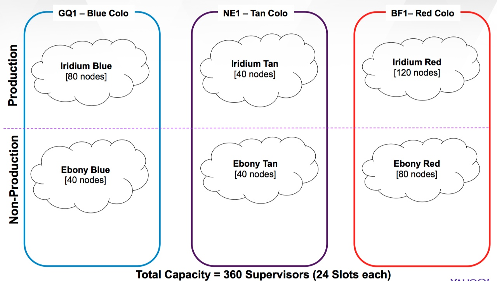

=========
Reference
=========

.. Status: First draft. This chapter might need more sections.

.. include:: ../faq/index.rst
.. include:: ../troubleshooting/index.rst

Environments
============

.. ebony-gw.red.ygrid.yahoo.com

Multi-Tenant Secure Storm
-------------------------

Non-Production
##############

.. raw:: html

   <table>
   	<thead>
   		<tr>
   			<th Cluster</a> </th>
   			<th>Type</th>
   			<th>Endpoint</th>
   			<th>Nodes</a> </th>
   		</tr>
   	</thead>
   	<tbody>
   		<tr>
   			<td rowspan="4"><a href="http://api.igor.corp.yahoo.com:9999/igor/ui/role/members?role=ygrid.app.hgp-mstorm.loc-red.type-nonprod.cluster-ebony" target="_top">Ebony Red</a>   <a href="http://ebonyred-ni.red.ygrid.yahoo.com:9999/" target="_top">Ebony Red UI</a></td>
   			<td>Nimbus</td>
   			<td><code>grid.red.ebony.nimbus</code></td>
   			<td>2</td>
   		</tr>
   		<tr>
   			<td>Supervisor</td>
   			<td><code>grid.red.ebony.supervisor</code></td>
   			<td>80</td>
   		</tr>
   		<tr>
   			<td>Zookeeper</td>
   			<td>zkp42[0-2].red.ygrid</td>
   			<td>3</td>
   		</tr>
   		<tr>
   			<td>gateway</td>
   			<td>ebony-gw.red.ygrid.yahoo.com</td>
   			<td>&nbsp;</td>
   		</tr>
   		<tr>
   			<td rowspan="4"><a href="http://api.igor.corp.yahoo.com:9999/igor/ui/role/members?role=ygrid.app.hgp-mstorm.loc-blue.type-nonprod.cluster-ebony" target="_top">Ebony Blue</a>, <a href="http://ebonyblue-ni.blue.ygrid.yahoo.com:9999/" target="_top">EbonyBlue UI</a></td>
   			<td>Nimbus</td>
   			<td><code>grid.blue.ebony.nimbus</code></td>
   			<td>2</td>
   		</tr>
   		<tr>
   			<td>Supervisor</td>
   			<td><code>grid.blue.ebony.supervisor</code></td>
   			<td>40</td>
   		</tr>
   		<tr>
   			<td>Zookeeper</td>
   			<td>zkp14[0-2].blue.ygrid</td>
   			<td>3</td>
   		</tr>
   		<tr>
   			<td>gateway</td>
   			<td>ebony-gw.blue.ygrid.yahoo.com</td>
   			<td>&nbsp;</td>
   		</tr>
   		<tr>
   			<td rowspan="4"><a href="http://api.igor.corp.yahoo.com:9999/igor/ui/role/members?role=ygrid.app.hgp-mstorm.loc-blue.type-nonprod.cluster-vizorium" target="_top">Vizorium Blue</a>, <a href="http://vizoriumblue-ni.blue.ygrid.yahoo.com:9999/" target="_top">VizoriumBlue UI</a></td>
   			<td>Nimbus</td>
   			<td><code>grid.blue.vizorium.nimbus</code></td>
   			<td>2</td>
   		</tr>
   		<tr>
   			<td>Supervisor</td>
   			<td><code>grid.blue.vizorium.supervisor</code></td>
   			<td>40</td>
   		</tr>
   		<tr>
   			<td>Zookeeper</td>
   			<td>zkp14[0-2].blue.ygrid</td>
   			<td>3</td>
   		</tr>
   		<tr>
   			<td>gateway</td>
   			<td>solium-gw.blue.ygrid.yahoo.com</td>
   			<td>&nbsp;</td>
   		</tr>
   		<tr>
   			<td rowspan="4"><a href="http://api.igor.corp.yahoo.com:9999/igor/ui/role/members?role=ygrid.app.hgp-mstorm.loc-tan.type-nonprod.cluster-ebony" target="_top">Ebony Tan</a>, <a href="http://ebonytan-ni.tan.ygrid.yahoo.com:9999/" target="_top">EbonyTan UI</a></td>
   			<td>Nimbus </td>
   			<td><code>grid.tan.ebony.nimbus</code></td>
   			<td>2</td>
   		</tr>
   		<tr>
   			<td>Supervisor</td>
   			<td><code>grid.tan.ebony.supervisor</code></td>
   			<td>40</td>
   		</tr>
   		<tr>
   			<td>Zookeeper</td>
   			<td>zkp36[0-2].tan.ygrid</td>
   			<td>3</td>
   		</tr>
   		<tr>
   			<td>gateway</td>
   			<td>ebony-gw.tan.ygrid.yahoo.com</td>
   			<td>&nbsp;</td>
   		</tr>
   </tbody></table>

Production
##########

.. raw:: html

   <table>
   	<thead>
   		<tr>
   			<th>Type</th>
   			<th>Cluster</th>
   			<th>Endpoint</th>
   			<th>Nodes</th>
   			<th>Hardware Configuration</th>
   		</tr>
   	</thead>
   	<tbody>
		<tr>
			<td><a href="http://api.igor.corp.yahoo.com:9999/igor/ui/role/members?role=ygrid.app.hgp-mstorm.loc-red.type-nonprod.cluster-iridium" target="_top">Iridium Red</a>, <a href="http://iridiumred-ni.red.ygrid.yahoo.com:9999/" target="_top">IridiumRed UI</a></td>
			<td>Nimbus</td>
			<td><code>grid.red.iridium.nimbus</code></td>
			<td>2</td>
			<td>&nbsp;</td>
		</tr>
   		<tr>
   			<td rowspan="3"><a href="http://api.igor.corp.yahoo.com:9999/igor/ui/role/members?role=ygrid.app.hgp-storm.loc-blue.type-prod.cluster-lux" target="_top">Lux Blue</a>, user - hadoop10, <a href="http://luxblue-ni.blue.ygrid.yahoo.com:9999/" target="_top">LuxBlue UI</a> </td>
   			<td>Nimbus</td>
   			<td><code>grid.blue.lux.nimbus</code></td>
   			<td>2</td>
   			<td>HP DL380p Gen8, 2 x Xeon E5-2630 2.30GHz, 62.9GB / 64GB 1333MHz DDR3, 12 x 3TB SATA</td>
   		</tr>
   		<tr>
   			<td>Supervisor</td>
   			<td><code>grid.blue.lux.supervisor</code></td>
   			<td>116</td>
   			<td>HP DL180 G6, 2 x Xeon E5620 2.40GHz, 47.2GB / 48GB 1333MHz DDR3, 12 x 2TB SATA</td>
   		</tr>
   		<tr>
   			<td>Zookeeper </td>
   			<td><code>ygrid.app.hgp-zookeeper.loc-blue.class-prod</code></td>
   			<td>5 </td>
   			<td>HP DL180 G6, 2 x Xeon E5620 2.40GHz, 47.2GB / 48GB 1333MHz DDR3, 12 x 2TB SATA</td>
   		</tr>
   		<tr>
   			<td rowspan="3"><a href="http://api.igor.corp.yahoo.com:9999/igor/ui/role/members?role=ygrid.app.hgp-storm.loc-red.type-prod.cluster-lux" target="_top">Lux Red</a>, user - hadoop10, <a href="http://luxred-ni.red.ygrid.yahoo.com:9999/" target="_top">LuxRed UI</a></td>
   			<td>Nimbus</td>
   			<td><code>grid.red.lux.nimbus</code></td>
   			<td>2</td>
   			<td>HP DL380p Gen8, 2 x Xeon E5-2630 2.30GHz, 62.9GB / 64GB 1333MHz DDR3, 12 x 3TB SATA</td>
   		</tr>
   		<tr>
   			<td>Supervisor</td>
   			<td><code>grid.red.lux.supervisor</code></td>
   			<td>64</td>
   			<td>HP DL180 G6, 2 x Xeon E5620 2.40GHz, 47.2GB / 48GB 1333MHz DDR3, 12 x 2TB SATA</td>
   		</tr>
   		<tr>
   			<td>Zookeeper</td>
   			<td><code>ygrid.app.hgp-zookeeper.loc-red.class-prod</code></td>
   			<td>3</td>
   			<td>HP DL180 G6, 2 x Xeon E5620 2.40GHz, 47.2GB / 48GB 1333MHz DDR3, 12 x 2TB SATA</td>
   		</tr>
   		<tr>
   			<td rowspan="3"><a href="http://api.igor.corp.yahoo.com:9999/igor/ui/role/members?role=ygrid.app.hgp-storm.loc-red.type-prod.cluster-thaum" target="_top">Thaum Red</a>, user - ngd_ffl, <a href="http://thaumred-ni.red.ygrid.yahoo.com:9999/" target="_top">ThaumRed UI</a> </td>
   			<td>Nimbus</td>
   			<td><code>grid.red.thaum.nimbus</code></td>
   			<td>2</td>
   			<td>&nbsp;</td>
   		</tr>
   		<tr>
   			<td>Supervisor</td>
   			<td><code>grid.red.thaum.supervisor</code></td>
   			<td>56</td>
   			<td>&nbsp;</td>
   		</tr>
   		<tr>
   			<td>Zookeeper</td>
   			<td><code>ygrid.app.hgp-zookeeper.loc-red.class-LuxRedStorm</code></td>
   			<td>3</td>
   			<td>&nbsp;</td>
   		</tr>
   		<tr>
   			<td rowspan="3"><a href="http://thaumblue-ni.blue.ygrid.yahoo.com:9999/" target="_top">ThaumBlue UI</a></td>
   			<td>Nimbus</td>
   			<td><code>grid.blue.thaum.nimbus</code></td>
   			<td bgcolor="#edf4f9" valign="top">2</td>
   			<td bgcolor="#edf4f9" valign="top">&nbsp;</td>
   		</tr>
   		<tr>
   			<td>Supervisor</td>
   			<td><code>grid.blue.thaum.supervisor</code></td>
   			<td>65</td>
   			<td>&nbsp;</td>
   		</tr>
   		<tr>
   			<td>Zookeeper</td>
   			<td><code>ygrid.app.hgp-zookeeper.loc-blue.class-rmx_storm</code></td>
   			<td>3</td>
   			<td>&nbsp;</td>
   		</tr>
   		<tr>
   			<td rowspan="3"><a href="http://api.igor.corp.yahoo.com:9999/igor/ui/role/members?role=ygrid.app.hgp-storm.loc-tan.type-nonprod.cluster-kryptonite" target="_top">Relux Tan</a>, user - hadoop10, <a href="http://reluxtan-ni.tan.ygrid.yahoo.com:9999/" target="_top">ReluxTan UI</a> </td>
   			<td>Nimbus</td>
   			<td><code>grid.tan.relux.nimbus</code></td>
   			<td>2</td>
   			<td>HP DL180 G6, 2 x Xeon E5620 2.40GHz, 47.2GB / 48GB 1333MHz DDR3, 12 x 2TB SATA</td>
   		</tr>
   		<tr>
   			<td>Supervisor</td>
   			<td><code>grid.tan.relux.supervisor</code></td>
   			<td>40</td>
   			<td>HP DL180 G6, 2 x Xeon E5620 2.40GHz, 47.2GB / 48GB 1333MHz DDR3, 12 x 2TB SATA</td>
   		</tr>
   		<tr>
   			<td>Zookeeper</td>
   			<td><code>ygrid.app.hgp-zookeeper.loc-tan.class-research</code></td>
   			<td>3</td>
   			<td>HP DL160 G6, 2 x Xeon E5620 2.40GHz, 15.7GB / 16GB 1333MHz DDR3, 1 x 500GB SATA</td>
   		</tr>
   </tbody></table>

Deployment at Yahoo
===================

Use Case Example
================

In this particular use case, the Search team wants to 
index editorial real-time content that users 
can search. The editorial content needs to be available in Apache HBase. 

Topography Overview
-------------------

Spouts
######

They will need a spout that scans HBase since the last scan 
until the current time to get the editorial content.

Bolts
##### 

They will need two bolts: The first to build the index
and store it back into HBase, and the 
second to push the index for serving.

Throughput
----------

1. Supervisor-Level Information
###############################

.. csv-table:: Configurations for storm.yaml or multitenant-scheduler.yaml 
   :header: "Configuration", "Default", "Description"
   :widths: 30, 20, 45

   "<code>topology.receiver.buffer.size</code>", "<8> messages", "The queue size of the incoming (worker) messages."
   "<code>topology.transfer.buffer.size</code>", "<1024> tuples", "The queue size of outgoing (worker) messages."
   "<code>topology.executor.receive.buffer.size</code>", "<1024> tuples", "The queue size of the incoming (executor) tuple."
   "<code>topology.executor.send.buffer.size</code>", "<1024> tuples", "The queue size of the outgoing (executor) tuple."
   "<code>supervisor.slots.ports</code>", "<24> hyper-threaded cores for dual hex-core machines", "The slots available per supervisor."
   "<code>multitenant.scheduler.user.pools``", "N/A", "The user pools for the multi-tenant scheduler: ``<users>:<#nodes></code>" 
   "<code>topology.isolate.machine</code>", "The number of machines for a topology."

2. Servers Based on Throughput 
##############################

.. csv-table:: Server Requirements for Topology
   :header: "", "Default"
   :widths: 40, 50

   "Events processed with single spout per worker", "1000 messages/second"
   "Target throughput required in next six months", "8000 messages/second"
   "The number of spout executors required.", "8000/1000 = 8"
   "The number of tuples executed across the first bolt (5 executors)", "10000 tuples/second"
   "The total number of executors required across the first bolt", "8 x 5= 40"
   "The number of tuples executed across the second bolt (5 executors)",  "8 x 5= 40"
   "The total number of executors required across second bolt", "8 x 5 = 40"
   "The total number of executors and workers (4 executions per worker slot)", "8 + 40 + 40 = 88 executors (i.e., 88/4 = 22 Slots)"
   "**Number of Supervisors required to process data**", "**22/24 =~ 1 supervisors (24 slots per supervisor)**"

CPU vs. Throughput
------------------

1. Track CPU Usage Either by JVM Debugging (``jmap/jstack``)
############################################################

.. csv-table:: Server Requirements for Topology
   :header: "", "Default"
   :widths: 40, 50

   "Max CPU cores per Supervisor", "C-78U/48/4000 (four 4 TB disks) =  12 Physical cores"
   "CPU Usage for processing 1000 messages/second", "4 Physical core (32.12%) OR 8 Hyper threads
                                                     - Includes 1 Spout, 5 Bolt 1 and 5 Bolt 2 executors
                                                     - Includes CPU Usage for inter-messaging (0mq or Netty)"

   "Assuming equal core division among Spout and Bolt executors", "Each executor’s CPU need = 4 / (1+5+5) = 4/11 Cors"
   "Total Workers (equal to number of executors)", "TOPOLOGY_WORKERS, Config#setNumWorkers"
   "Tasks per component", "TOPOLOGY_TASKS, ComponentConfigurationDeclarer#setNumTasks()"

2. Extrapolate for Target Throughput 
####################################

We're assuming a liner increase of resources in this case.

.. csv-table:: Server Requirements for Topology
   :header: "", "Default"
   :widths: 40, 50

   "Target Spout executors", "TopologyBuilder#setSpout() 8"
   "Target Bolt executors", "TopologyBuilder#setBolt()  40"
   "Total CPU need for Spout executors", "8 x 4/11 Physical core = ~ 3 Physical cores"
   "Total CPU need for Bolt 1 executors", "40 x 4/11 Physical core = ~ 15 Physical cores"
   "Total CPU need for Bolt 2 executors", "40 x 4/11 Physical core = ~ 15 Physical cores"
   "Total CPU need for Topology", "3 + 15 +15 = 33 Physical cores"
   "Total Supervisors needed", "33/12 = ~3 Supervisor"

Memory vs. Throughput
---------------------

1. Supervisor Level-Information 
###############################

.. csv-table:: Configuration Values for storm.yaml/Storm-yarn.yaml
   :header: "", ""
   :widths: 40, 50

   "Max memory available per Supervisor Node", "C-78U/48/4000 (four 4 TB disks) =  48 GB"
   "Memory available to Supervisor container (logical)", "<code>Storm-yarn.yaml</code> > master.container.size-mb 42 GB"

2. Servers Based on Memory Needs
################################

.. csv-table:: Configuration Values for storm.yaml/Storm-yarn.yaml
   :header: "", ""
   :widths: 40, 50

   "Events processed across Spout executors", "8000 messages/second"
   "Avg. event or message size", "3 MB"
   "Data processed per second across spout executors", "8000 x 3 MB = ~ 24 GB/sec"
   "Events processed per second across bolt 1 executors", "10000 x 8 = 80000 tuples/second"
   "Average tuple size", "100 KB"
   "Data processed per second across bolt 1 executors", "80000 tuples/sec x 100 KB = ~8 GB/sec"
   "Events processed per second across bolt 2 executors", "15000 x 8 = 120000 tuples/second"
   "Average tuple size", "100 KB"
   "Data processed per second across bolt 1 executors", "120000 tuples/sec x 100 KB = ~12 GB/sec"
   "Total data processed", "24 GB/second + 8 GB/second + 12 GB/second = 44 GB/second"
   "**Number of Supervisors required to process data**", "**44 / 42 = ~2 Supervisor**"

  

 
Logging
=======

The logs for the Storm daemon are located by default in ``${storm.home}/logs``. 
The <code>ystorm`` daemons (``nimbus``, ``ui``, ``supervisor</code>, etc.) write 
logs to ${YINST_ROOT}/y/lib64/storm/current/logs.

For example::

    /home/y/lib64/storm/current/logs
    /home/y/lib64/storm/current/logs/logviewer.log
    /home/y/lib64/storm/current/logs/nimbus.log
    /home/y/lib64/storm/current/logs/supervisor.log
    /home/y/lib64/storm/current/logs/ui.log
    ...

The <code>ystorm_*</code> launcher scripts have logs as well. If the ystorm daemons 
fail to write logs, check the launcher logs::

    /home/y/logs/ystorm_daemons/nimbus/current
    /home/y/logs/ystorm_daemons/supervisor/current
    /home/y/logs/ystorm_daemons/ui/current
    ...

Nimbus Log
----------

**File:** ``/home/y/lib64/storm/current/logs/nimbus.log``

Startup
#######

The first thing we expect to see when Nimbus starts is some diagnostic output from ZooKeeper/Curator code and then 
the message "Starting nimbus with conf..." as seen below::

    2013-09-21 22:47:04 o.a.z.ZooKeeper [INFO] Client environment:zookeeper.version=3.4.5--1, built on 09/11/2013 20:08 GMT
    2013-09-21 22:47:04 o.a.z.ZooKeeper [INFO] Client environment:host.name=tellingsmelling.corp.gq1.yahoo.com
    2013-09-21 22:47:04 o.a.z.ZooKeeper [INFO] Client environment:java.version=1.7.0_13
    2013-09-21 22:47:04 o.a.z.ZooKeeper [INFO] Client environment:java.vendor=Oracle Corporation
    2013-09-21 22:47:04 o.a.z.ZooKeeper [INFO] Client environment:java.home=/home/y/libexec64/jdk1.7.0/jre
    2013-09-21 22:47:04 o.a.z.ZooKeeper [INFO] Client environment:java.class.path=/home/y/lib64/storm/0.9.0-wip21/storm-netty-0.9.0-wi
    2013-09-21 22:47:04 o.a.z.ZooKeeper [INFO] Client environment:java.library.path=/home/y/lib64:/usr/local/lib64:/usr/lib64:/lib64:
    2013-09-21 22:47:04 o.a.z.ZooKeeper [INFO] Client environment:java.io.tmpdir=/tmp
    2013-09-21 22:47:04 o.a.z.ZooKeeper [INFO] Client environment:java.compiler=<NA>
    2013-09-21 22:47:04 o.a.z.ZooKeeper [INFO] Client environment:os.name=Linux
    2013-09-21 22:47:04 o.a.z.ZooKeeper [INFO] Client environment:os.arch=amd64
    2013-09-21 22:47:04 o.a.z.ZooKeeper [INFO] Client environment:os.version=2.6.32-358.6.2.el6.YAHOO.20130516.x86_64
    2013-09-21 22:47:04 o.a.z.ZooKeeper [INFO] Client environment:user.name=nobody
    2013-09-21 22:47:04 o.a.z.ZooKeeper [INFO] Client environment:user.home=/
    2013-09-21 22:47:04 o.a.z.ZooKeeper [INFO] Client environment:user.dir=/home/y/var/daemontools/ystorm_nimbus
    2013-09-21 22:47:04 o.a.z.s.ZooKeeperServer [INFO] Server environment:zookeeper.version=3.4.5--1, built on 09/11/2013 20:08 GMT
    2013-09-21 22:47:04 o.a.z.s.ZooKeeperServer [INFO] Server environment:host.name=tellingsmelling.corp.gq1.yahoo.com
    2013-09-21 22:47:04 o.a.z.s.ZooKeeperServer [INFO] Server environment:java.version=1.7.0_13
    2013-09-21 22:47:04 o.a.z.s.ZooKeeperServer [INFO] Server environment:java.vendor=Oracle Corporation
    2013-09-21 22:47:04 o.a.z.s.ZooKeeperServer [INFO] Server environment:java.home=/home/y/libexec64/jdk1.7.0/jre
    2013-09-21 22:47:04 o.a.z.s.ZooKeeperServer [INFO] Server environment:java.class.path=/home/y/lib64/storm/0.9.0-wip21/storm-netty-
    2013-09-21 22:47:04 o.a.z.s.ZooKeeperServer [INFO] Server environment:java.library.path=/home/y/lib64:/usr/local/lib64:/usr/lib64:
    2013-09-21 22:47:04 o.a.z.s.ZooKeeperServer [INFO] Server environment:java.io.tmpdir=/tmp
    2013-09-21 22:47:04 o.a.z.s.ZooKeeperServer [INFO] Server environment:java.compiler=<NA>
    2013-09-21 22:47:04 o.a.z.s.ZooKeeperServer [INFO] Server environment:os.name=Linux
    2013-09-21 22:47:04 o.a.z.s.ZooKeeperServer [INFO] Server environment:os.arch=amd64
    2013-09-21 22:47:04 o.a.z.s.ZooKeeperServer [INFO] Server environment:os.version=2.6.32-358.6.2.el6.YAHOO.20130516.x86_64
    2013-09-21 22:47:04 o.a.z.s.ZooKeeperServer [INFO] Server environment:user.name=nobody
    2013-09-21 22:47:04 o.a.z.s.ZooKeeperServer [INFO] Server environment:user.home=/
    2013-09-21 22:47:04 o.a.z.s.ZooKeeperServer [INFO] Server environment:user.dir=/home/y/var/daemontools/ystorm_nimbus
    2013-09-21 22:47:09 b.s.d.nimbus [INFO] Starting Nimbus with conf {"dev.zookeeper.path" "/tmp/dev-storm-zookeeper", "topology.tick

Shutdown
########

Shutdown is similar with the message "Shutting down master" followed by "Shut down master"::

    2013-11-08 18:44:32 b.s.d.nimbus [INFO] Shutting down master
    2013-11-08 18:44:32 o.a.z.ZooKeeper [INFO] Session: 0x142368cbb2f0001 closed
    2013-11-08 18:44:32 o.a.z.ClientCnxn [INFO] EventThread shut down
    2013-11-08 18:44:32 b.s.d.nimbus [INFO] Shut down master

Topology Submission, Assignment, and Killing
--------------------------------------------

When topologies are submitted, the log message will being with "Received topology submission for..."::

    2013-11-08 18:09:21 b.s.d.nimbus [INFO] Received topology submission for test-topo-derekd2 with conf {"storm.id" "test-topo-derekd2-8-1383934161", "topology.users" ("derekd" "derekd@DEREKD.YSTORM.NET"), "topology.acker.executors" nil, "to ...
    2013-11-08 18:09:21 b.s.d.nimbus [INFO] nimbus file location:/home/y/var/storm/nimbus/stormdist/test-topo-derekd2-8-1383934161 ...

This is following by "Activating ..."::

    2013-11-08 18:09:21 b.s.d.nimbus [INFO] Activating test-topo-derekd2: test-topo-derekd2-8-1383934161 ...

Assignments are the result of scheduling, so when a topology has successfully 
been scheduled, or has been re-balanced, etc., you'll see the message "Setting new assignment for topology id..."::

    2013-11-08 18:09:21 b.s.d.nimbus [INFO] Setting new assignment for topology id test-topo-derekd2-8-1383934161: #backtype.storm.daemon.common.Assignment{:master-code-dir "/home/y/var/storm/nimbus/stormdist/test-topo-derekd2-8-1383934161", ...

When topologies are killed, you'll see the following log messages:

- Delaying event :remove for X secs for ...
- Updated ... with status {:type :killed, :kill-time-secs X}
- Killing topology: ...
- Cleaning up ...

For example::

    2013-11-08 18:13:40 b.s.d.nimbus [INFO] Delaying event :remove for 30 secs for test-topo-derekd2-9-1383934302
    2013-11-08 18:13:40 b.s.d.nimbus [INFO] Updated test-topo-derekd2-9-1383934302 with status {:type :killed, :kill-time-secs 30}
    2013-11-08 18:14:10 b.s.d.nimbus [INFO] Killing topology: test-topo-derekd2-9-1383934302
    2013-11-08 18:14:15 b.s.d.nimbus [INFO] Cleaning up test-topo-derekd2-9-1383934302

Supervisors can be seen in the Nimbus log by looking for their IDs, which look 
like UUIDs. For example: <code>7c024f9d-673d-49e7-aa7f-56d9e535f994</code>

Supervisor Log 
--------------

**File:** /home/y/lib64/storm/current/logs/supervisor.log

    
Startup/Shutdown
################

Supervisors start with a log message similar to "Starting supervisor with id ....". 
The supervisor does not log a message when it is stopped manually.

Launching & Killing Workers
###########################

The Supervisor's job is to start workers. When the supervisor launches a worker, 
we expect a pair of log messages beginning with "Launching worker ..."
as shown below::

    2013-11-08 18:11:43 b.s.d.supervisor [INFO] Launching worker with assignment #backtype.storm.daemon.supervisor.LocalAssignment{:st
    2013-11-08 18:11:43 b.s.d.supervisor [INFO] Launching worker with command: java -server -Xmx768m  -Djava.library.path=/home/y/var/

:timed-out versus :disallowed
*****************************

There could be several reasons a worker shuts down. 

- If the worker has been "un-scheduled", there will be a log message that includes 
  "Shutting down and clearing state for id ... State: :disallowed".
- If a worker hangs such that it does not heartbeat to the supervisor within the 
  expected interval (5s default), you should see a log message like "Shutting down 
  and clearing state for id ... State: :timed-out".
- If a worker crashes, you should see a log message involving an exit code
  such as "Worker process ... exited with code: X".

For example::

    2013-11-08 06:04:19 b.s.d.supervisor [INFO] Shutting down and clearing state for id 0c8439c6-a4fe-47c4-9c62-b8d06e44aa98. Current supervisor time: 1383890658. State: :timed-out, Heartbeat: #backtype.storm.daemon.common.WorkerHeartbeat{:ti ...
    ...
    2013-11-08 18:22:13 b.s.d.supervisor [INFO] Shutting down and clearing state for id e7846155-3656-424f-84bf-f133e5891c81. Current supervisor time: 1383934933. State: :disallowed, Heartbeat: #backtype.storm.daemon.common.WorkerHeartbeat{:t ...
    2013-11-08 18:22:13 b.s.d.supervisor [INFO] Worker Process e7846155-3656-424f-84bf-f133e5891c81 exited with code: 137

.. tip:: If a log message indicates that a worker is :timed-out, then it means the heartbeat 
         thread was starved from being scheduled to run. This can happen because the garbage 
         collection takes over the JVM. If this happens repeatedly with a worker, try 
         submitting the topology with an increased worker JVM heap size: <code>append -Xmx${SIZE_MB}m</code> 
         to <code>topology.worker.childopts</code>.

Worker Log
----------

**File:**  ``/home/y/var/storm/workers-artifacts/${YOUR-TOPOLOGY-ID}/${PORT-NUMBER}/worker.log``
    
Startup/Shutdown
################

When a worker starts, you should see similar ZooKeeper/Curator diagnostic logs, followed by a 
log message similar to "Launching worker for ${TOPOLOGY_NAME} on ${SUPERVISOR_ID}:${WORKER_PORT} with id ${WORKER_ID}".

For example::

    Launching worker for test-topo-derekd-1-1383340860 on 04fa4628-2ab9-468b-b457-c36079921b80:6701 with id 7737e1f4-eec4-4975-87ef-81541496009e

Normally, a worker is not shut down. When it is, the current storm implementation 
kills the process (``kill -9``), so we do not expect the logs to show anything as the 
worker does not know what is happening.

Cleanup configuration
################

For limiting the disk usage of workers' logs and dump files, two parameters are defined to restrict all workers' total usage and each worker's usage: logviewer.max.sum.worker.logs.size.mb, logviewer.max.per.worker.logs.size.mb. Cluster admins may customize their thresholds as needed.

Other Resources
===============

- `Multi-Tenant Storm Tech Talk <http://video.corp.yahoo.com/video_detail.php?vid=8497>`_
- `Apache Storm Documentation <http://storm.incubator.apache.org/documentation.html>`_
- `Hortonworks: Apache Storm <http://hortonworks.com/hadoop/storm/>`_

