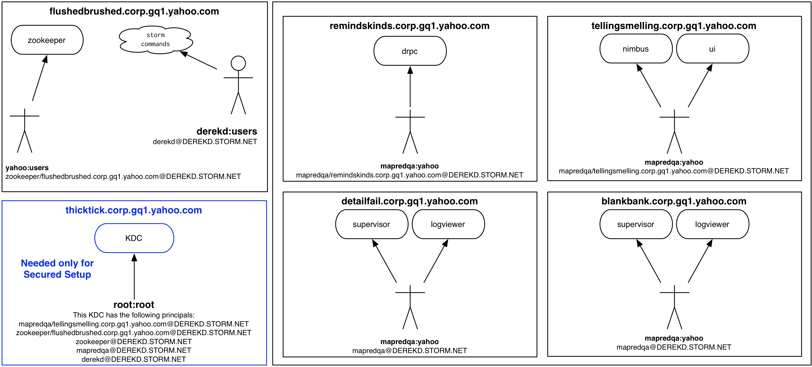

================================
Multitenant Storm Cluster Setup
================================

Storm @ Oath
=============

Throughout this page, we have embedded examples of this setup on a small openstack cluster. Expand the links for details.
Here is an overview of how the different pieces of storm interact from a security perspective.

.. image:: images/securestorm.png
   :height: 459 px
   :width: 850 px
   :scale: 90 %
   :alt: Diagram showing how Storm is set up
   :align: left

Yinst Packages
---------------

We have wrapped storm in a number of yinst packages:

* `ystorm <https://dist.corp.yahoo.com//by-package/ystorm/>`_ Holds storm itself. It is installed under ``/home/y/lib64/storm/current/``
* `ystorm_nimbus <https://dist.corp.yahoo.com//by-package/ystorm_nimbus/>`_ is a launcher script for the nimbus server.
* `ystorm_ui <https://dist.corp.yahoo.com//by-package/ystorm_ui/>`_ is a launcher script for the ui web server.
* `ystorm_supervisor <https://dist.corp.yahoo.com//by-package/ystorm_supervisor/>`_ is a launcher script for the supervisor daemon (launches worker processes).
* `ystorm_logviewer <https://dist.corp.yahoo.com//by-package/ystorm_logviewer/>`_ is a launcher script for the logviewer web server (serves up user logs).
* `ystorm_drpc <https://dist.corp.yahoo.com//by-package/ystorm_drpc/>`_ is a launcher script for the drpc daemon (Distributed Remote Procedure Call).
* `ystorm_pacemaker <https://dist.corp.yahoo.com//by-package/ystorm_pacemaker/>`_ is a launcher script for the pacemaker daemon.

In general nimbus and the ui run on the same node, but don't have to. But each compute node does need to have a supervisor and log viewer running on it. Every node needs the ystorm package.

Yinst Configuration
--------------------

Unless otherwise stated, configuration defaults should work well enough to get the cluster deployed.

This is the list of relevant configuration files to control storm:

+------------------------+----------------------------------------------------------+--------------------------------------------------------------------------------------------------------------------------------------------------------------------------------------------------------------------+
| File Name              |  Location                                                | Purpose                                                                                                                                                                                                            | 
+========================+==========================================================+====================================================================================================================================================================================================================+ 
| storm.yaml             | /home/y/lib64/storm/current/conf/storm.yaml              | General, public configuration of storm daemons (nimbus, supervisor, ui, and logviewer)                                                                                                                             | 
+------------------------+----------------------------------------------------------+--------------------------------------------------------------------------------------------------------------------------------------------------------------------------------------------------------------------+
|storm-cluster-auth.yaml | /home/y/lib64/storm/current/conf/storm-cluster-auth.yaml | Holds non-public configuration of storm daemons. (e.g., MD5-digest secret for ZooKeeper authentication, an optional setting) This is not used in the current recommended deployment, and it can be safely ignored. |
+------------------------+----------------------------------------------------------+--------------------------------------------------------------------------------------------------------------------------------------------------------------------------------------------------------------------+

The ystorm package has a script that will translate yinst settings into settings that storm can understand and places them in the appropriate yaml file. It is not perfect, but for most settings it should get them right. To set a storm setting through yinst you replace all of the '.' characters in the setting name with '_' characters and put "ystorm." at the beginning. So if you wanted to set ``java.library.path`` through yinst you would run something like:

.. code-block:: java

   yinst set ystorm.java_library_path="foo"
   
Yaml supports lists and maps. If the config is known to be a list you can make the value comma separated and yinst will translate it for you. Similarly with a map, except every other item in the list is a key, and the item directly following it is a value.

Each of the launcher packages also support similar configurations, so if you want to set java.library.path just for nimbus you can run

.. code-block:: java

   yinst set ystorm_nimbus.java_library_path="nimbus/foo"
   
But these are much more limited. They do not support lists or maps, and there may be issues if you try to set a config that is not a string type config.

In this document we try to stick with the yinst setting, instead of the yaml config name.

Deploy Normal Storm Cluster
============================

The following is a guide to deploying the standard storm cluster using OpenStack. The "Example Deployment" links show details and commands run at the time of writing. Modify these commands to suit your environment.

My target setup looks like this:

Provision Nodes
----------------

See `OpenStack Command Line Quickstart <https://git.ouroath.com/pages/openstack/userguide/openhouse_cmd_quickstart.html#set-up-your-environment>`_ 

Install OpenStack CLI Tools
----------------------------

Set up environment variables (bash syntax):

.. code-block:: bash

   export OS_AUTH_URL='http://keystoneservice.ostk.dv1.vip.corp.gq1.yahoo.com:5000/v2.0'
   export OS_USERNAME="$(whoami)"
   export OS_TENANT_NAME="$(whoami)"
   
Install the cli tools package:

.. code-block:: bash

   yinst i ypython26_python_novaclient -br test
  

Create OpenStack Instances
----------------------------

For each node in your setup, provision an OpenStack instance using a "flavor" (configuration of memory, virtual CPU, disk, etc.), one of the YLinux images provided, and a descriptive name.

.. code-block:: bash

nova boot --flavor $FLAVOR --image $IMAGE $DESCRIPTIVE_NAME

For example:

.. code-block:: bash

   nova boot --flavor micro --image ylinux-6.4.1-1 kerberos
   nova boot --flavor small --image ylinux-6.4.1-1 zookeeper
   nova boot --flavor small --image ylinux-6.4.1-1 nimbus-ui
   nova boot --flavor small --image ylinux-6.4.1-1 compute0
   nova boot --flavor small --image ylinux-6.4.1-1 compute1
   
Once the nodes are provisioned (should be complete in well under a minute), query for the hostnames that have been assigned to the nodes with nova show ``$DESCRIPTIVE_NAME``. The output of this command will list the hostname of the instance.

.. code-block:: bash

   for i in kerberos nimbus-ui zookeeper compute{0,1}
   do
       # Unfortunately, this prompts you every time.
       h="$(nova show $i | grep hostname| cut -d'|' -f3|sed 's;  *;;g';)";
      echo "$i: $h";
   done

   # The results for me:
   # kerberos: thicktick.corp.gq1.yahoo.com
   # nimbus-ui: tellingsmelling.corp.gq1.yahoo.com
   # zookeeper: flushedbrushed.corp.gq1.yahoo.com
   # stormcompute0: blankbank.corp.gq1.yahoo.com
   # stormcompute1: detailfail.corp.gq1.yahoo.com

   # Note that thicktick was not really necessary until the security features were enabled.

Install Packages
------------------

ZooKeeper
~~~~~~~~~~~~~~~~~~~~~~

Storm uses Apache ZooKeeper to faciliate communication between daemons as well as to provide somewhat reliable persistence.

ZooKeeper servers are typically configured in odd numbers: one for a simple development environment, three for a grid environment, and 5 if redundancy becomes absolulety critical. Beware of performance trade-offs when increasing the number of ZooKeeper Servers.

Install the following package on each node you have designated for hosting ZK.

.. code-block:: bash

   yinst i -os rhel-6.x -br test zookeeper_server -h $HOST
   
For example:

.. code-block:: bash

   # Installing ZooKeeper
   yinst i -os rhel-6.x -br test zookeeper_server -h flushedbrushed.corp.gq1.yahoo.com

nimbus & ui
~~~~~~~~~~~~~~~~~~~~~~

The nimbus daemon should run on one node, and the ui daemon should run on one node. They may both be run from the same node. Install the ystorm package on the node(s) that run these daemons, and install the corresponding launcher packages. During installing ystorm, though you may encounter the error of ``"Error received from RolesDB ... Could not retrieve certificates from CA server ... yinst start failed: exit code 3"``, that will not affect your installation and it is safe to ignore.

.. code-block:: bash

   yinst i -os rhel-6.x -br $BRANCH ystorm -h $NIMBUS_HOST
   yinst i -os rhel-6.x -br $BRANCH ystorm -h $UI_HOST # only if hosts are different
   yinst i -os rhel-6.x -br $BRANCH ystorm_nimbus -h $NIMBUS_HOST
   yinst i -os rhel-6.x -br $BRANCH ystorm_ui -h $UI_HOST

For example:

.. code-block:: bash

   # Installing nimbus and the ui on the same node
   yinst i -os rhel-6.x -br current ystorm{'',_{nimbus,ui}} -h tellingsmelling.corp.gq1.yahoo.com

supervisors & logviewers
~~~~~~~~~~~~~~~~~~~~~~~~~

The supervisor and logviewer daemons should run on each node in the storm cluster that is designated to process data with user's code. These are the compute/worker nodes. Install the ystorm package on the nodes that run these daemons, and install both of the corresponding launcher packages.

.. code-block:: bash

   yinst i -os rhel-6.x -br $BRANCH ystorm -h "$HOST0,$HOST1,$HOST2" # comma-separated list of hosts
   yinst i -os rhel-6.x -br $BRANCH ystorm_supervisor -h "$HOST0,$HOST1,$HOST2"
   yinst i -os rhel-6.x -br $BRANCH ystorm_logviewer -h "$HOST0,$HOST1,$HOST2"

For example:

.. code-block:: bash

   # Installing supervisors and the logviewers
   yinst i -os rhel-6.x -br current ystorm{'',_{supervisor,logviewer}} -h 'blankbank.corp.gq1.yahoo.com,detailfail.corp.gq1.yahoo.com'
   
   
DRPC servers (Optional)
~~~~~~~~~~~~~~~~~~~~~~~~~

.. code-block:: bash

   yinst i -os rhel-6.x -br $BRANCH ystorm_drpc -h "$DRPC_HOST" # comma-separated list of hosts
   
For example:

.. code-block:: bash

   # Installing DRPC service
   yinst i -os rhel-6.x -br current ystorm_drpc -h 'remindskinds.corp.gq1.yahoo.com'
   
   
Configure Storm Nodes
----------------------

All storm nodes that run nimbus, supervisor, and ui daemons must be told the hostnames of the node running nimbus and the nodes running ZK. If you only have one ZK node, then just specify this hostname by itself.

.. code-block:: bash

   # The value to zookeeper_servers is a comma-separated list of ZK hostnames.
   # The argument to the yinst -h option is a comma-separated list of storm nodes running nimbus, supervisor, or ui.
   yinst set ystorm.nimbus_host="$NIMBUS_HOST" ystorm.storm_zookeeper_servers="$ZK_HOST0,$ZK_HOST1,$ZK_HOST2" ystorm.drpc_servers="$DRPC_HOST" -h "$NIMBUS_HOST,$HOST0,HOST1,HOST2,$DRPC_HOST"

If setting up a single node for security (SASL+Kerberos authentication to ZooKeeper), then it is a good idea to set the zookeeper hosts to the hostname.FQDN. Otherwise you may get ``"Server not found in Kerberos database"`` errors when the ZK client code tries to connect using localhost/127.0.0.1.

For example:

.. code-block:: bash

   # Sets nimbus_host and storm_zookeeper_servers on all storm nodes.
   yinst set ystorm.nimbus_host='tellingsmelling.corp.gq1.yahoo.com' \
   ystorm.storm_zookeeper_servers='flushedbrushed.corp.gq1.yahoo.com' \
   ystorm.drpc_servers='remindskinds.corp.gq1.yahoo.com' \
   -h '{tellingsmelling,blankbank,detailfail,remindskinds}.corp.gq1.yahoo.com'
   # Set up the "gateway" to talk to nimbus.
   # I am re-using the kerberos host as a gateway.
   # Note that for using as a gateway, you need to have ystorm package installed on the node, e.g., thicktick.corp.gq1.yahoo.com.
   yinst set ystorm.nimbus_host='tellingsmelling.corp.gq1.yahoo.com' -h 'thicktick.corp.gq1.yahoo.com'
   

Worker GC Options
----------------------

Storm is a real time processing system with rather short timeouts. A full GC on a large heap can cause a worker process to be shot. All default GC options should be placed in ystorm.worker_gc_childopts. The topology owner can override this in their topology conf by setting topology.worker.gc.childopts.

Setup supervisor health check
----------------------

Health check scripts are executed in two cases: 
* 1 when you start the supervisor; 
* 2 periodically run inside the supervisor.

In case 1, when supervisor starts, health check scripts will be run on the node. If any of the scripts fail, "storm kill_workers" and "yinst stop ystorm_supervisor" will be called to terminate the workers and the supervisor.

In case 2, the supervisor launches a health check thread that periodically runs health check scripts in the specified directory. If any scripts fail, the supervisor will shut down all the workers and throw a RuntimeException to exit itself.

By "fail", we mean that at least one of the output lines of the script start with the word "ERROR". Returning with non-zero exit codes is OK. Similar to Hadoop's health checks, we treat non-zero exit codes as indicators that the scripts failed to execute properly, not that the system is unhealthy, in which case we don't want to start killing things.

The admin can install the health script package on the supervisor nodes by:

.. code-block:: bash

   yinst i ystorm_health_scripts -h "$HOST0,$HOST1,$HOST2"

The two major configurations to set are the health check directory and checking interval:

.. code-block:: bash

   yinst set ystorm.storm_health_check_dir "healthchecks"
   yinst set ystorm.storm_health_check_timeout_ms 5000

Start Services
----------------------

.. code-block:: bash

   yinst start ystorm_nimbus -h "$NIMBUS_HOST"
   yinst start ystorm_ui -h "$UI_HOST"
   # HOST0 ... HOSTN are compute/worker nodes.
   yinst start ystorm_{supervisor,logviewer} -h "$HOST0,$HOST1,$HOST2,"
   # DRPC_HOST are DRPC nodes.
   yinst start ystorm_drpc -h "$DRPC_HOST"

For example:

.. code-block:: bash

   # Start nimbus and ui daemons
   yinst start ystorm_{nimbus,ui} -h tellingsmelling.corp.gq1.yahoo.com
   # Start supervisors and logviewers
   yinst start ystorm_{supervisor,logviewer} -h '{blankbank,detailfail}.corp.gq1.yahoo.com'
   # Start drpc daemons
   yinst start ystorm_drpc -h remindskinds.corp.gq1.yahoo.com

Check Web UI
----------------------
Navigate to HTTP port 8080 of your ui node with a browser.

Try a Test Topology
----------------------

Sample topologies are provided with the ystorm_starter package.

.. code-block:: bash

   yinst i -br current ystorm_starter
   
Run a sample "word_count" topology on the cluster.

.. code-block:: bash

   storm jar /home/y/lib/storm-starter/current/storm-starter-jar-with-dependencies.jar storm.starter.clj.word_count "$TOPO_NAME"
   
After the topology is submitted, refresh the UI, and the topology $TOPO_NAME should appear there. Click on the name of the topology to open the topology's page. Confirm that the spout is emitting/transferring tuples.

.. code-block:: bash

   # Install storm and storm starter on some launcher box.  In this case, I used thicktick.
   # You should be able to do this in any yroot on a machine that has access to the nimbus node.
   yinst i -os rhel-6.x -br current ystorm ystorm_starter -h thicktick.corp.gq1.yahoo.com
   # This installed ystorm-0.9.0_wip21.133 and ystorm_starter-0.0.1_SNAPSHOT.1

   # On thicktick, I ran:
   storm jar \
      /home/y/lib/storm-starter/current/storm-starter-jar-with-dependencies.jar \
      storm.starter.clj.word_count test-topo
   #
   # Eventually, I saw the following after about 10s.
   # 13656 [main] INFO  backtype.storm.StormSubmitter - Finished submitting topology: test-topo
   # Check the UI again, and test-topo should appear under Topology summary

Now check the logs. Click the ID for one of the spouts or bolts. This will open the storm component's page. Under Executors, you will see a list of the threads that are running on various nodes. Click on the Port link for one of them to open the logviewer page for that node.

Clean Up (Prep. For Security)
===============================
