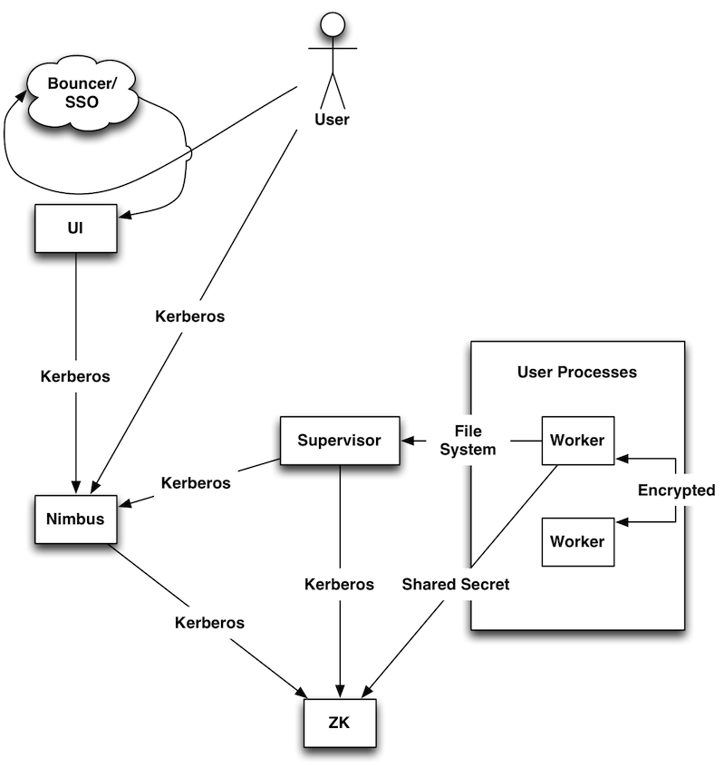

================================
Multitenant Storm Cluster Setup
================================

Storm @ Oath
=============

Throughout this page, we have embedded examples of this setup on a small openstack cluster. Expand the links for details.
Here is an overview of how the different pieces of storm interact from a security perspective.

Yinst Packages
---------------

We have wrapped storm in a number of yinst packages:

* `ystorm <https://dist.corp.yahoo.com//by-package/ystorm/>`_ Holds storm itself. It is installed under ``/home/y/lib64/storm/current/``
* `ystorm_nimbus <https://dist.corp.yahoo.com//by-package/ystorm_nimbus/>`_ is a launcher script for the nimbus server.
* `ystorm_ui <https://dist.corp.yahoo.com//by-package/ystorm_ui/>`_ is a launcher script for the ui web server.
* `ystorm_supervisor <https://dist.corp.yahoo.com//by-package/ystorm_supervisor/>`_ is a launcher script for the supervisor daemon (launches worker processes).
* `ystorm_logviewer <https://dist.corp.yahoo.com//by-package/ystorm_logviewer/>`_ is a launcher script for the logviewer web server (serves up user logs).
* `ystorm_drpc <https://dist.corp.yahoo.com//by-package/ystorm_drpc/>`_ is a launcher script for the drpc daemon (Distributed Remote Procedure Call).
* `ystorm_pacemaker <https://dist.corp.yahoo.com//by-package/ystorm_pacemaker/>`_ is a launcher script for the pacemaker daemon.

In general nimbus and the ui run on the same node, but don't have to. But each compute node does need to have a supervisor and log viewer running on it. Every node needs the ystorm package.

Yinst Configuration
--------------------

Unless otherwise stated, configuration defaults should work well enough to get the cluster deployed.

This is the list of relevant configuration files to control storm:

+------------------------+----------------------------------------------------------+--------------------------------------------------------------------------------------------------------------------------------------------------------------------------------------------------------------------+
| File Name              |  Location                                                | Purpose                                                                                                                                                                                                            | 
+========================+==========================================================+====================================================================================================================================================================================================================+ 
| storm.yaml             | /home/y/lib64/storm/current/conf/storm.yaml              | General, public configuration of storm daemons (nimbus, supervisor, ui, and logviewer)                                                                                                                             | 
+------------------------+----------------------------------------------------------+--------------------------------------------------------------------------------------------------------------------------------------------------------------------------------------------------------------------+
|storm-cluster-auth.yaml | /home/y/lib64/storm/current/conf/storm-cluster-auth.yaml | Holds non-public configuration of storm daemons. (e.g., MD5-digest secret for ZooKeeper authentication, an optional setting) This is not used in the current recommended deployment, and it can be safely ignored. |
+------------------------+----------------------------------------------------------+--------------------------------------------------------------------------------------------------------------------------------------------------------------------------------------------------------------------+

The ystorm package has a script that will translate yinst settings into settings that storm can understand and places them in the appropriate yaml file. It is not perfect, but for most settings it should get them right. To set a storm setting through yinst you replace all of the '.' characters in the setting name with '_' characters and put "ystorm." at the beginning. So if you wanted to set ``java.library.path`` through yinst you would run something like:

.. code-block:: java

   yinst set ystorm.java_library_path="foo"
   
Yaml supports lists and maps. If the config is known to be a list you can make the value comma separated and yinst will translate it for you. Similarly with a map, except every other item in the list is a key, and the item directly following it is a value.

Each of the launcher packages also support similar configurations, so if you want to set java.library.path just for nimbus you can run

.. code-block:: java

   yinst set ystorm_nimbus.java_library_path="nimbus/foo"
   
But these are much more limited. They do not support lists or maps, and there may be issues if you try to set a config that is not a string type config.

In this document we try to stick with the yinst setting, instead of the yaml config name.

Deploy Normal Storm Cluster
============================

The following is a guide to deploying the standard storm cluster using OpenStack. The "Example Deployment" links show details and commands run at the time of writing. Modify these commands to suit your environment.

My target setup looks like this:

Provision Nodes
----------------

See `OpenStack Command Line Quickstart <https://git.ouroath.com/pages/openstack/userguide/openhouse_cmd_quickstart.html#set-up-your-environment>`_ 

Install OpenStack CLI Tools
----------------------------

Set up environment variables (bash syntax):

.. code-block:: bash

   export OS_AUTH_URL='http://keystoneservice.ostk.dv1.vip.corp.gq1.yahoo.com:5000/v2.0'
   export OS_USERNAME="$(whoami)"
   export OS_TENANT_NAME="$(whoami)"
   
Install the cli tools package:

.. code-block:: bash

   yinst i ypython26_python_novaclient -br test
  

Create OpenStack Instances
----------------------------

For each node in your setup, provision an OpenStack instance using a "flavor" (configuration of memory, virtual CPU, disk, etc.), one of the YLinux images provided, and a descriptive name.

.. code-block:: bash

   nova boot --flavor $FLAVOR --image $IMAGE $DESCRIPTIVE_NAME

For example:

.. code-block:: bash

   nova boot --flavor micro --image ylinux-6.4.1-1 kerberos
   nova boot --flavor small --image ylinux-6.4.1-1 zookeeper
   nova boot --flavor small --image ylinux-6.4.1-1 nimbus-ui
   nova boot --flavor small --image ylinux-6.4.1-1 compute0
   nova boot --flavor small --image ylinux-6.4.1-1 compute1
   
Once the nodes are provisioned (should be complete in well under a minute), query for the hostnames that have been assigned to the nodes with nova show ``$DESCRIPTIVE_NAME``. The output of this command will list the hostname of the instance.

.. code-block:: bash

   for i in kerberos nimbus-ui zookeeper compute{0,1}
   do
       # Unfortunately, this prompts you every time.
       h="$(nova show $i | grep hostname| cut -d'|' -f3|sed 's;  *;;g';)";
      echo "$i: $h";
   done

   # The results for me:
   # kerberos: thicktick.corp.gq1.yahoo.com
   # nimbus-ui: tellingsmelling.corp.gq1.yahoo.com
   # zookeeper: flushedbrushed.corp.gq1.yahoo.com
   # stormcompute0: blankbank.corp.gq1.yahoo.com
   # stormcompute1: detailfail.corp.gq1.yahoo.com

   # Note that thicktick was not really necessary until the security features were enabled.

Install Packages
------------------

ZooKeeper
~~~~~~~~~~~~~~~~~~~~~~

Storm uses Apache ZooKeeper to faciliate communication between daemons as well as to provide somewhat reliable persistence.

ZooKeeper servers are typically configured in odd numbers: one for a simple development environment, three for a grid environment, and 5 if redundancy becomes absolulety critical. Beware of performance trade-offs when increasing the number of ZooKeeper Servers.

Install the following package on each node you have designated for hosting ZK.

.. code-block:: bash

   yinst i -os rhel-6.x -br test zookeeper_server -h $HOST
   
For example:

.. code-block:: bash

   # Installing ZooKeeper
   yinst i -os rhel-6.x -br test zookeeper_server -h flushedbrushed.corp.gq1.yahoo.com

nimbus & ui
~~~~~~~~~~~~~~~~~~~~~~

The nimbus daemon should run on one node, and the ui daemon should run on one node. They may both be run from the same node. Install the ystorm package on the node(s) that run these daemons, and install the corresponding launcher packages. During installing ystorm, though you may encounter the error of ``"Error received from RolesDB ... Could not retrieve certificates from CA server ... yinst start failed: exit code 3"``, that will not affect your installation and it is safe to ignore.

.. code-block:: bash

   yinst i -os rhel-6.x -br $BRANCH ystorm -h $NIMBUS_HOST
   yinst i -os rhel-6.x -br $BRANCH ystorm -h $UI_HOST # only if hosts are different
   yinst i -os rhel-6.x -br $BRANCH ystorm_nimbus -h $NIMBUS_HOST
   yinst i -os rhel-6.x -br $BRANCH ystorm_ui -h $UI_HOST

For example:

.. code-block:: bash

   # Installing nimbus and the ui on the same node
   yinst i -os rhel-6.x -br current ystorm{'',_{nimbus,ui}} -h tellingsmelling.corp.gq1.yahoo.com

supervisors & logviewers
~~~~~~~~~~~~~~~~~~~~~~~~~

The supervisor and logviewer daemons should run on each node in the storm cluster that is designated to process data with user's code. These are the compute/worker nodes. Install the ystorm package on the nodes that run these daemons, and install both of the corresponding launcher packages.

.. code-block:: bash

   yinst i -os rhel-6.x -br $BRANCH ystorm -h "$HOST0,$HOST1,$HOST2" # comma-separated list of hosts
   yinst i -os rhel-6.x -br $BRANCH ystorm_supervisor -h "$HOST0,$HOST1,$HOST2"
   yinst i -os rhel-6.x -br $BRANCH ystorm_logviewer -h "$HOST0,$HOST1,$HOST2"

For example:

.. code-block:: bash

   # Installing supervisors and the logviewers
   yinst i -os rhel-6.x -br current ystorm{'',_{supervisor,logviewer}} -h 'blankbank.corp.gq1.yahoo.com,detailfail.corp.gq1.yahoo.com'
   
   
DRPC servers (Optional)
~~~~~~~~~~~~~~~~~~~~~~~~~

.. code-block:: bash

   yinst i -os rhel-6.x -br $BRANCH ystorm_drpc -h "$DRPC_HOST" # comma-separated list of hosts
   
For example:

.. code-block:: bash

   # Installing DRPC service
   yinst i -os rhel-6.x -br current ystorm_drpc -h 'remindskinds.corp.gq1.yahoo.com'
   
   
Configure Storm Nodes
----------------------

All storm nodes that run nimbus, supervisor, and ui daemons must be told the hostnames of the node running nimbus and the nodes running ZK. If you only have one ZK node, then just specify this hostname by itself.

.. code-block:: bash

   # The value to zookeeper_servers is a comma-separated list of ZK hostnames.
   # The argument to the yinst -h option is a comma-separated list of storm nodes running nimbus, supervisor, or ui.
   yinst set ystorm.nimbus_host="$NIMBUS_HOST" ystorm.storm_zookeeper_servers="$ZK_HOST0,$ZK_HOST1,$ZK_HOST2" ystorm.drpc_servers="$DRPC_HOST" -h "$NIMBUS_HOST,$HOST0,HOST1,HOST2,$DRPC_HOST"

If setting up a single node for security (SASL+Kerberos authentication to ZooKeeper), then it is a good idea to set the zookeeper hosts to the hostname.FQDN. Otherwise you may get ``"Server not found in Kerberos database"`` errors when the ZK client code tries to connect using localhost/127.0.0.1.

For example:

.. code-block:: bash

   # Sets nimbus_host and storm_zookeeper_servers on all storm nodes.
   yinst set ystorm.nimbus_host='tellingsmelling.corp.gq1.yahoo.com' \
   ystorm.storm_zookeeper_servers='flushedbrushed.corp.gq1.yahoo.com' \
   ystorm.drpc_servers='remindskinds.corp.gq1.yahoo.com' \
   -h '{tellingsmelling,blankbank,detailfail,remindskinds}.corp.gq1.yahoo.com'
   # Set up the "gateway" to talk to nimbus.
   # I am re-using the kerberos host as a gateway.
   # Note that for using as a gateway, you need to have ystorm package installed on the node, e.g., thicktick.corp.gq1.yahoo.com.
   yinst set ystorm.nimbus_host='tellingsmelling.corp.gq1.yahoo.com' -h 'thicktick.corp.gq1.yahoo.com'
   

Worker GC Options
----------------------

Storm is a real time processing system with rather short timeouts. A full GC on a large heap can cause a worker process to be shot. All default GC options should be placed in ystorm.worker_gc_childopts. The topology owner can override this in their topology conf by setting topology.worker.gc.childopts.

Setup supervisor health check
----------------------

Health check scripts are executed in two cases: 
* 1 when you start the supervisor; 
* 2 periodically run inside the supervisor.

In case 1, when supervisor starts, health check scripts will be run on the node. If any of the scripts fail, "storm kill_workers" and "yinst stop ystorm_supervisor" will be called to terminate the workers and the supervisor.

In case 2, the supervisor launches a health check thread that periodically runs health check scripts in the specified directory. If any scripts fail, the supervisor will shut down all the workers and throw a RuntimeException to exit itself.

By "fail", we mean that at least one of the output lines of the script start with the word "ERROR". Returning with non-zero exit codes is OK. Similar to Hadoop's health checks, we treat non-zero exit codes as indicators that the scripts failed to execute properly, not that the system is unhealthy, in which case we don't want to start killing things.

The admin can install the health script package on the supervisor nodes by:

.. code-block:: bash

   yinst i ystorm_health_scripts -h "$HOST0,$HOST1,$HOST2"

The two major configurations to set are the health check directory and checking interval:

.. code-block:: bash

   yinst set ystorm.storm_health_check_dir "healthchecks"
   yinst set ystorm.storm_health_check_timeout_ms 5000

Start Services
----------------------

.. code-block:: bash

   yinst start ystorm_nimbus -h "$NIMBUS_HOST"
   yinst start ystorm_ui -h "$UI_HOST"
   # HOST0 ... HOSTN are compute/worker nodes.
   yinst start ystorm_{supervisor,logviewer} -h "$HOST0,$HOST1,$HOST2,"
   # DRPC_HOST are DRPC nodes.
   yinst start ystorm_drpc -h "$DRPC_HOST"

For example:

.. code-block:: bash

   # Start nimbus and ui daemons
   yinst start ystorm_{nimbus,ui} -h tellingsmelling.corp.gq1.yahoo.com
   # Start supervisors and logviewers
   yinst start ystorm_{supervisor,logviewer} -h '{blankbank,detailfail}.corp.gq1.yahoo.com'
   # Start drpc daemons
   yinst start ystorm_drpc -h remindskinds.corp.gq1.yahoo.com

Check Web UI
----------------------
Navigate to HTTP port 8080 of your ui node with a browser.

Try a Test Topology
----------------------

Sample topologies are provided with the ystorm_starter package.

.. code-block:: bash

   yinst i -br current ystorm_starter
   
Run a sample "word_count" topology on the cluster.

.. code-block:: bash

   storm jar /home/y/lib/storm-starter/current/storm-starter-jar-with-dependencies.jar storm.starter.clj.word_count "$TOPO_NAME"
   
After the topology is submitted, refresh the UI, and the topology $TOPO_NAME should appear there. Click on the name of the topology to open the topology's page. Confirm that the spout is emitting/transferring tuples.

.. code-block:: bash

   # Install storm and storm starter on some launcher box.  In this case, I used thicktick.
   # You should be able to do this in any yroot on a machine that has access to the nimbus node.
   yinst i -os rhel-6.x -br current ystorm ystorm_starter -h thicktick.corp.gq1.yahoo.com
   # This installed ystorm-0.9.0_wip21.133 and ystorm_starter-0.0.1_SNAPSHOT.1

   # On thicktick, I ran:
   storm jar \
      /home/y/lib/storm-starter/current/storm-starter-jar-with-dependencies.jar \
      storm.starter.clj.word_count test-topo
   #
   # Eventually, I saw the following after about 10s.
   # 13656 [main] INFO  backtype.storm.StormSubmitter - Finished submitting topology: test-topo
   # Check the UI again, and test-topo should appear under Topology summary

Now check the logs. Click the ID for one of the spouts or bolts. This will open the storm component's page. Under Executors, you will see a list of the threads that are running on various nodes. Click on the Port link for one of them to open the logviewer page for that node.

Clean Up (Prep. For Security)
===============================

If you had started a non-security topology, perhaps by following the instructions for deploying a normal storm cluster, there are some important steps to prepare for enabling ystorm's security features.

Kill Topologies
----------------

.. code-block:: bash

   # For all topologies...
   storm kill "$TOPO_NAME"

Stop services
----------------

.. code-block:: bash

   # HOST0 ... HOSTN are storm compute nodes
   yinst stop ystorm_logviewer -h "$HOST0,$HOST1,$HOST2" # For all hosts
   yinst stop ystorm_supervisor -h "$HOST0,$HOST1,$HOST2" # For all hosts
   yinst stop ystorm_ui -h "$UI_HOST"
   yinst stop ystorm_nimbus -h "$NIMBUS_HOST"
   yinst stop zookeeper_server -h "$ZOOKEEPER_HOST"
   yinst stop ystorm_drpc -h "$DRPC_HOST"
   
 
Clear Storm Daemons' States
----------------------------
 
On each node, clear any state for nimbus, supervisors, workers, etc. This prevents permission errors when running the various storm daemons as a different user later.
 
.. code-block:: bash
 
   rm -rf /home/y/var/storm/*
   
Also, from zookeeper nodes clear state using:
   
.. code-block:: bash

   rm -rf /home/y/var/zookeeper/version-2
   
Note, on some grid installations, I have had to completely reset ZK on the node with the following procedure

.. code-block:: bash

   yinst set zookeeper_server.dataDir
   yinst set zookeeper_server.dataLogDir
   
This gives you the locations of the data dir and data long dir, for example:

.. code-block:: bash

   yinst: zookeeper_server.dataDir: /grid/0/zookeeper/
   yinst: zookeeper_server.dataLogDir: /grid/1/zookeeper_data_logs
   
And then do the following:

.. code-block:: bash

   yinst stop zookeeper_server
   yinst deactivate zookeeper_server
   sudo rm -rf /grid/0/zookeeper/*
   sudo rm -rf /grid/1/zookeeper_data_logs/*
   yinst activate zookeeper_server
   yinst start zookeeper_server
   
   
Authentication Setup
====================

Install Packages For Security
-----------------------------

A Kerberos server to provide authentication. We can either use one of the servers that are already set up on the grid, or we can set up our own.

* Install ``krb5-server`` if setting up your own kerberos server, and be sure to configure the server's ``krb5.conf`` and ``kdc.conf``.

   .. code-block:: bash

      # For setting up your own Kerberos Server
      sudo yum install krb5-server
      
* Install yjava_jce if using grid kerberos servers and using yjava_jdk < 1.8.

   .. code-block:: bash
   
      # If using grid kerberos, we must enable stronger encryption that is
      # password-protected due to US export restrictions.
      # Access the password at http://pepe.corp.yahoo.com/JavaJCE
      # (Use the SOCKS proxy socks.yahoo.com:1080)

      # For all hosts, do
      yinst i yjava_jce -h "$HOST"

FOR EXAMPLE

``/var/kerberos/krb5kdc/kdc.conf``:

.. code-block:: bash

   [kdcdefaults]
   v4_mode = nopreauth
   kdc_ports = 0
   kdc_tcp_ports = 88

   [realms]
   DEREKD.YSTORM.NET = {
      acl_file = /var/kerberos/krb5kdc/kadm5.acl
      dict_file = /usr/share/dict/words
      admin_keytab = /var/kerberos/krb5kdc/kadm5.keytab
      supported_enctypes = des3-hmac-sha1:normal arcfour-hmac:normal des-hmac-sha1:normal des-cbc-md5:normal des-cbc-crc:normal des-cbc-crc:v4 des-cbc-crc:afs3
   }

``/etc/krb5.conf``

.. code-block:: bash

   [logging]
   default = FILE:/var/log/krb5libs.log
   kdc = FILE:/var/log/krb5kdc.log
   admin_server = FILE:/var/log/kadmind.log

   [libdefaults]
   default_realm = DEREKD.YSTORM.NET
   dns_lookup_realm = false
   dns_lookup_kdc = false
   ticket_lifetime = 24h
   forwardable = yes
   renew_lifetime = 7d
   udp_preference_limit = 1

   [realms]
   DEREKD.YSTORM.NET = {
      admin_server = thicktick.corp.gq1.yahoo.com
      kdc = thicktick.corp.gq1.yahoo.com:88
      kdc = thicktick.corp.gq1.yahoo.com:88
   }

   [domain_realm]
   .corp.gq1.yahoo.com = DEREKD.YSTORM.NET
   corp.gq1.yahoo.com = DEREKD.YSTORM.NET

   [appdefaults]
   pam = {
      debug = false
      ticket_lifetime = 36000
      renew_lifetime = 36000
      forwardable = true
      krb4_convert = false
   }

.. code-block:: bash

   # Starts the kerberos service.
   sudo service krb5kdc start

   #kerberos service might not start due to below error:
   #Starting Kerberos 5 KDC: krb5kdc: cannot initialize realm DEREKD.YSTORM.NET - see log file for details
                                                           [FAILED]
   cat /var/log/krb5kdc.log 
   #krb5kdc: No such file or directory - while initializing database for realm DEKERD.YSTORM.NET

   #then initialize the db by running below command
   sudo kdb5_util create
   
Add Principals To My Kerberos Server

.. code-block:: bash

   # On thicktick, add the principals that we need.
   # Each time I did this, I was prompted for a password.  I never used
   # these passwords, as I was using keytabs everywhere.  I probably just entered
   # "password".

   # For ZK Server (must have a "service," which, by convention, is the hostname
   # with FQDN).  Also, zookeeper is hardcoded to require a principal called
   # 'zookeeper'.  This means that the service name in the jaas confs also needs
   # to be 'zookeeper'.
   sudo /usr/sbin/kadmin.local -q 'addprinc zookeeper/flushedbrushed.corp.gq1.yahoo.com@DEREKD.YSTORM.NET'
   # For ZK clients (who may be on any hostname)
   sudo /usr/sbin/kadmin.local -q 'addprinc zookeeper@DEREKD.YSTORM.NET'
   # Cluster service principal for nimbus
   sudo /usr/sbin/kadmin.local -q 'addprinc mapredqa/tellingsmelling.corp.gq1.yahoo.com@DEREKD.YSTORM.NET'
   # Cluster service principal for drpc
   sudo /usr/sbin/kadmin.local -q 'addprinc mapredqa/remindskinds.corp.gq1.yahoo.com@DEREKD.YSTORM.NET'
   # Cluster principal for nimbus clients
   sudo /usr/sbin/kadmin.local -q 'addprinc mapredqa@DEREKD.YSTORM.NET'
   # Myself
   sudo /usr/sbin/kadmin.local -q 'addprinc derekd@DEREKD.YSTORM.NET'
   # I am not running a service, so I do not need a principal with the service part.

Generate a Keytab For My Principals: I only generated one keytab file to save work, but this is not a secure way to do things.

.. code-block:: bash

   # On thicktick, generate the keytab.

   for i in {zookeeper{'',/flushedbrushed.corp.gq1.yahoo.com},mapredqa{'',/tellingsmelling.corp.gq1.yahoo.com,/remindskinds.corp.gq1.yahoo.com},derekd}@DEREKD.YSTORM.NET
   do
      sudo /usr/sbin/kadmin.local -q "ktadd -k /tmp/test-storm.keytab $i"
   done

   # Here is a way to do this more verbosely:

   # ZooKeeper
   sudo /usr/sbin/kadmin.local -q 'ktadd -k /tmp/test-storm.keytab zookeeper@DEREKD.YSTORM.NET'
   sudo /usr/sbin/kadmin.local -q 'ktadd -k /tmp/test-storm.keytab zookeeper/flushedbrushed.corp.gq1.yahoo.com@DEREKD.YSTORM.NET'

   # Nimbus
   sudo /usr/sbin/kadmin.local -q 'ktadd -k /tmp/test-storm.keytab mapredqa@DEREKD.YSTORM.NET'
   sudo /usr/sbin/kadmin.local -q 'ktadd -k /tmp/test-storm.keytab mapredqa/tellingsmelling.corp.gq1.yahoo.com@DEREKD.YSTORM.NET'

   # DRPC
   sudo /usr/sbin/kadmin.local -q 'ktadd -k /tmp/test-storm.keytab mapredqa/remindskinds.corp.gq1.yahoo.com@DEREKD.YSTORM.NET'

   # Me
   sudo /usr/sbin/kadmin.local -q 'ktadd -k /tmp/test-storm.keytab derekd@DEREKD.YSTORM.NET'

   # Check that the keytab is populated correctly:
   sudo klist -kt /tmp/test-storm.keytab
   # Output:
   #Keytab name: FILE:/tmp/test-storm.keytab
   #KVNO Timestamp         Principal
   #---- ----------------- --------------------------------------------------------
   #   4 09/26/13 21:43:35 zookeeper@DEREKD.YSTORM.NET
   #   4 09/26/13 21:43:35 zookeeper@DEREKD.YSTORM.NET
   #   4 09/26/13 21:43:35 zookeeper@DEREKD.YSTORM.NET
   #   4 09/26/13 21:43:35 zookeeper@DEREKD.YSTORM.NET
   #   4 09/26/13 21:43:35 zookeeper/flushedbrushed.corp.gq1.yahoo.com@DEREKD.YSTORM.NET
   #   4 09/26/13 21:43:35 zookeeper/flushedbrushed.corp.gq1.yahoo.com@DEREKD.YSTORM.NET
   #   4 09/26/13 21:43:35 zookeeper/flushedbrushed.corp.gq1.yahoo.com@DEREKD.YSTORM.NET
   #   4 09/26/13 21:43:35 zookeeper/flushedbrushed.corp.gq1.yahoo.com@DEREKD.YSTORM.NET
   #   4 09/26/13 21:43:35 mapredqa@DEREKD.YSTORM.NET
   #   4 09/26/13 21:43:35 mapredqa@DEREKD.YSTORM.NET
   #   4 09/26/13 21:43:35 mapredqa@DEREKD.YSTORM.NET
   #   4 09/26/13 21:43:35 mapredqa@DEREKD.YSTORM.NET
   #   3 09/26/13 21:43:36 mapredqa/tellingsmelling.corp.gq1.yahoo.com@DEREKD.YSTORM.NET
   #   3 09/26/13 21:43:36 mapredqa/tellingsmelling.corp.gq1.yahoo.com@DEREKD.YSTORM.NET
   #   3 09/26/13 21:43:36 mapredqa/tellingsmelling.corp.gq1.yahoo.com@DEREKD.YSTORM.NET
   #   3 09/26/13 21:43:36 mapredqa/tellingsmelling.corp.gq1.yahoo.com@DEREKD.YSTORM.NET
   #   3 09/26/13 21:43:36 mapredqa/remindskinds.corp.gq1.yahoo.com@DEREKD.YSTORM.NET
   #   3 09/26/13 21:43:36 mapredqa/remindskinds.corp.gq1.yahoo.com@DEREKD.YSTORM.NET
   #   3 09/26/13 21:43:36 mapredqa/remindskinds.corp.gq1.yahoo.com@DEREKD.YSTORM.NET
   #   3 09/26/13 21:43:36 mapredqa/remindskinds.corp.gq1.yahoo.com@DEREKD.YSTORM.NET
   #   4 09/26/13 21:43:36 derekd@DEREKD.YSTORM.NET
   #   4 09/26/13 21:43:36 derekd@DEREKD.YSTORM.NET
   #   4 09/26/13 21:43:36 derekd@DEREKD.YSTORM.NET
   #   4 09/26/13 21:43:36 derekd@DEREKD.YSTORM.NET

Distribute the Keytab

.. code-block:: bash

   sudo chown $(whoami) /tmp/test-storm.keytab

   for i in tellingsmelling blankbank detailfail flushedbrushed,remindskinds
   do
      scp /tmp/test-storm.keytab "$i.corp.gq1.yahoo.com:/tmp/"
   done

   # Put keytabs in a place where we can read them.  This is not secure either.
   yinst ssh \
      -h '{tellingsmelling,blankbank,detailfail,flushedbrushed,remindskinds}.corp.gq1.yahoo.com' \
      "sudo mkdir -m 755 -p /keytabs && sudo mv -v /tmp/test-storm.keytab /keytabs/"
      
      
Kerberos JAAS Configuration of Storm Cluster Nodes
---------------------------------------------------

To enable Kerberos, each storm process needs to have a Kerberos principal and corresponding keytab. These processes include:

* nimbus
* ui
* supervisor
* logviewer
* drpc

For ZK authentication, to avoid a lot of complexity in code that will go away in the future (Heartbeating through ZK is going away), each of these processes needs to authenticate as a ZK super user. ZK only supports one super user, but can strip off host and realm. So nimbus and the supervisors need to run as the same user name when authenticating with ZK, but should have different hosts.

Make sure that the "instance" string in the kerberos principal for nimbus has the host name of the nimbus node with the Fully-Qualified Domain Name (FQDN). For example, ``derekd/arbitrarystring@DEREKD.YSTORM.NET`` is not valid, while ``derekd/tellingsmelling.corp.gq1.yahoo.com@DEREKD.YSTORM.NET`` is OK.

Additionally, the service name for zookeeper is required to be "zookeeper". This is hardcoded in the zookeeper in its source code. This means the principal you create for each of the ZK nodes needs to be ``zookeeper/f.q.d.n@realm``.

Storm and ZK use the Java ``jaas.conf`` to know how to log the user in. Nimbus uses the ``StormServer`` section to authenticate incoming connections and the storm clients use the ``StormClient`` section when trying to connect to nimbus. The ui, supervisor and logviewer technically do not need a ``StormServer`` section, but it will not hurt anything if they do have it. ZK uses the ``Client`` section for clients connecting to ZK. A jaas.conf for each of these processes needs to be generated, similar to:

.. code-block:: bash

   StormServer {
      com.sun.security.auth.module.Krb5LoginModule required
      useKeyTab=true
      keyTab="$keytab"
      storeKey=true
      useTicketCache=false
      principal="$principal";
   };
   StormClient {
      com.sun.security.auth.module.Krb5LoginModule required
      useKeyTab=true
      keyTab="$keytab"
      storeKey=true
      useTicketCache=false
      serviceName="$nimbus_user"
      principal="$principal";
   };
   Client {
      com.sun.security.auth.module.Krb5LoginModule required
      useKeyTab=true
      keyTab="$keytab"
      storeKey=true
      useTicketCache=false
      serviceName="zookeeper"
      principal="$principal";
   };
  
Example

My JAAS configuration file comprised these three sections plus the ZK Server section, again to save work.

.. code-block:: bash

	StormServer {
	   com.sun.security.auth.module.Krb5LoginModule required
	   useKeyTab=true
	   keyTab="/keytabs/test-storm.keytab"
	   storeKey=true
	   useTicketCache=false
	   principal="mapredqa/tellingsmelling.corp.gq1.yahoo.com@DEREKD.YSTORM.NET";
	};
	StormClient {
	   com.sun.security.auth.module.Krb5LoginModule required
	   useKeyTab=true
	   keyTab="/keytabs/test-storm.keytab"
	   storeKey=true
	   useTicketCache=false
	   serviceName="mapredqa"
	   principal="mapredqa@DEREKD.YSTORM.NET";
	};
	Client {
	   com.sun.security.auth.module.Krb5LoginModule required
	   useKeyTab=true
	   keyTab="/keytabs/test-storm.keytab"
	   storeKey=true
	   useTicketCache=false
	   serviceName="zookeeper"
	   principal="zookeeper@DEREKD.YSTORM.NET";
	};
	Server {
	   com.sun.security.auth.module.Krb5LoginModule required
	   useKeyTab=true
	   keyTab="/keytabs/test-storm.keytab"
	   storeKey=true
	   useTicketCache=false
	   serviceName="zookeeper"
	   principal="zookeeper/flushedbrushed.corp.gq1.yahoo.com@DEREKD.YSTORM.NET";
	};
   
.. code-block:: bash

   # Copy jaas.conf to needed machines.
   for i in tellingsmelling blankbank detailfail flushedbrushed 
   do 
      scp /tmp/jaas.conf "$i.corp.gq1.yahoo.com:/tmp/"
   done
   
   # Move jaas.conf to correct spot on all machines.
   yinst ssh -h '{tellingsmelling,blankbank,detailfail,flushedbrushed}.corp.gq1.yahoo.com' \
      "sudo mkdir -m 755 -p /jaas && sudo mv -v /tmp/jaas.conf /jaas/"

DRPC
~~~~~

DRPC nodes will need principal to specify respective host it is running drpc service on.

My DRPC JAAS configuration file comprised of below sections.

.. code-block:: bash
  
   StormServer {
      com.sun.security.auth.module.Krb5LoginModule required
      useKeyTab=true
      keyTab="/keytabs/test-storm.keytab"
      storeKey=true
      useTicketCache=false
      principal="mapredqa/remindskinds.corp.gq1.yahoo.com@DEREKD.YSTORM.NET";
   };
   
.. code-block:: bash

   # Copy drpc jaas.conf to DRPC machines.
   scp /tmp/drpc_jaas.conf "remindskinds.corp.gq1.yahoo.com:/tmp/jaas.conf"
   
   # Move jaas.conf to correct spot on all machines.
   yinst ssh -h 'remindskinds.corp.gq1.yahoo.com' \
      "sudo mkdir -m 755 -p /jaas && sudo mv -v /tmp/jaas.conf /jaas/"

Nimbus
~~~~~~

Nimbus also will translate the principal into a local user name, so that other services can use this name. To configure this for Kerberos authentication set

.. code-block:: bash

   ystorm.storm_principal_tolocal=backtype.storm.security.auth.KerberosPrincipalToLocal
   
This only needs to be done on nimbus and drpc, but it will not hurt on any node.

.. code-block:: bash

   yinst set \
      ystorm.storm_principal_tolocal='backtype.storm.security.auth.KerberosPrincipalToLocal' \
      -h '{tellingsmelling,remindskinds}.corp.gq1.yahoo.com'

Supervisor
~~~~~~~~~~

We also need to inform the supervisor daemon and the nimbus daemon who the topology is running as from a ZooKeeper perspective. So we need to set the following variables on nimbus and supervisors.

.. code-block:: bash

   yinst set ystorm.storm_zookeeper_superACL="sasl:${nimbus-user}" -h {$HOST0,$HOST1,$HOST2}

Here ``${nimbus-user}`` is Kerberos user that nimbus uses to authenticate with ZooKeeper. If ZooKeeeper is stripping host and realm then this needs to have host and realm stripped too.

.. code-block:: bash

   # By default, zookeeper_server installs configured to strip the host and realm
   # from kerberos principals, so we do the same for our superACL user here.
   yinst set ystorm.storm_zookeeper_superACL='sasl:mapredqa' \
      -h '{tellingsmelling,blankbank,detailfail}.corp.gq1.yahoo.com'

For Supervisor nodes, create worker-jaas.conf that will be set-up to look like below. Where serviceName is same as headless user name. This is to facilitate authentication to DRPC servers from workers. It will use the same kerberos credentials that are distributed via the AutoTGT plugin.

.. code-block:: bash

   StormClient {
      backtype.storm.security.auth.kerberos.AutoTGTKrb5LoginModule required
      serviceName="mapredqa";
   };
   
.. code-block:: bash

   yinst set yinst.topology_worker_childopts='-Djava.security.auth.login.config=/path/to/worker-jaas.conf' -h "$HOST0,$HOST1,$HOST2"
   
.. code-block:: bash

   # By default, zookeeper_server installs configured to strip the host and realm
   # from kerberos principals, so we do the same for our superACL user here.
   yinst set ystorm.topology_worker_childopts='-Djava.security.auth.login.config=/jaas/worker-jaas.conf' \
      -h '{tellingsmelling,blankbank,detailfail}.corp.gq1.yahoo.com'
      
      
Setting Up Kerberos With JAAS Configurations
---------------------------------------------

To enable Kerberos authentication in storm you need to set the following configs

.. code-block:: bash

	yinst set ystorm.storm_thrift_transport='backtype.storm.security.auth.kerberos.KerberosSaslTransportPlugin'
	yinst set ystorm.java_security_auth_login_config='/path/to/jaas.conf'

Nimbus and the supervisor processes will also connect to ZooKeeper(ZK) and we want to configure them to use Kerberos for authentication with ZK. To do this append -Djava.security.auth.login.config=/path/to/jaas.conf to the childopts of nimbus, ui, and supervisor. Here is an example given the default childopts settings at the time of writing:

.. code-block:: bash

	yinst set ystorm.nimbus_childopts='-Xmx1024m -Djava.security.auth.login.config=/path/to/jaas.conf'
	yinst set ystorm.ui_childopts='-Xmx768m -Djava.security.auth.login.config=/path/to/jaas.conf'
	yinst set ystorm.supervisor_childopts='-Xmx256m -Djava.security.auth.login.config=/path/to/jaas.conf'
	yinst set ystorm.java_security_auth_login_config='/path/to/jaas.conf'
	yinst set ystorm.worker_childopts='-Xmx768m -Djava.security.auth.login.config=/path/to/worker-jaas.conf'
	
	
Separate JAAS Configurations Per Daemon On a Single Node (Optional)
--------------------------------------------------------------------

Only if you want multiple processes on the same box to use different JAAS configuration files you will need to set the ``java_security_auth_login_config`` and ``_childopts`` for ystorm_ui, ystorm_nimbus, ystorm_supervisor, or ystorm_logviewer.

.. code-block:: bash

	# Only if multiple daemons run on a single node and must use different JAAS configuration files:
	# Setting JAAS configuration per daemon
	# Note that these settings are for the daemon launcher packages and not for ystorm itself.
	yinst set ystorm_ui.java_security_auth_login_config='/path/to/ui_jaas.conf'
	yinst set ystorm_nimbus.java_security_auth_login_config='/path/to/nimbus_jaas.conf'
	yinst set ystorm_supervisor.java_security_auth_login_config='/path/to/supervisor_jaas.conf'
	
	# Also set various childopts.
	yinst set ystorm_ui.ui_childopts='-Xmx768m -Djava.security.auth.login.config=/path/to/ui_jaas.conf'
	yinst set ystorm_nimbus.nimbus_childopts='-Xmx1024m -Djava.security.auth.login.config=/path/to/nimbus_jaas.conf'
	yinst set ystorm_supervisor.supervisor_childopts='-Xmx256m -Djava.security.auth.login.config=/path/to/supervisor_jaas.conf'

After setting these values storm will use Kerberos to validate users and processes that connect to Nimbus.

ZooKeeper Ensemble
--------------------

This is tested with ``zookeeper-3.4.5``, installed from dist as ``zookeeper_server-3.4.5_66``. It should work with later versions, but that is what we tested with.

Typically, ZK is set up as a single node, or in clusters of 3 or 5 nodes. Identify the host(s) that will be running ZK, and set the storm configuration on each storm node with the list of servers.

.. code-block:: bash

	# Setting storm zookeeper server list for hosts zk0.myfqdn.net, zk1.myfqdn.net, and zk2.myfqdn.net
	yinst set ystorm.storm_zookeeper_servers="zk0.myfqdn.net,zk1.myfqdn.net,zk2.myfqdn.net"

On the ZK node(s), set up SASL/Kerberos authentication.

.. code-block:: bash

	# Setting ZK to use SASL/Kerberos authentication
	yinst set zookeeper_server.kerberos='true'

On the ZK Server, create a similar jaas.conf with the following:

.. code-block:: bash

   Server {
   	com.sun.security.auth.module.Krb5LoginModule required
   	useKeyTab=true
   	keyTab="$keytab"
   	storeKey=true
   	useTicketCache=false
   	principal="zookeeper/$fqdn@$REALM";
	};

Also, we need to set the identity of the ZK superuser for Kerberos. The ZK superuser can performs all operations in ZK without being checked by any ACLs. We want this user to be the same as the user running nimbus and the supervisor.

Tell the ZK server where to find the JAAS configuration file and whom the superuser is:

.. code-block:: bash

	yinst set zookeeper_server.jvm_args="-Djava.security.auth.login.config=/path/to/jaas.conf"
	yinst ssh  "sudo chmod 600 /path/to/jaas.conf && chown yahoo /path/to/jaas.conf" -h $ZK_HOST

Finally, since the zookeeper_server package starts automatically upon activation, restart the ZK service:

.. code-block:: bash

	yinst restart zookeeper_server

Gateways
---------

Ideally the end user will only need to run kinit before interacting with storm. To make this happen seamlessly we need the default jaas.conf on the gateways to be something like

.. code-block:: bash

	StormClient {
	   com.sun.security.auth.module.Krb5LoginModule required
	   doNotPrompt=false
	   useTicketCache=true
	   serviceName="$nimbus_user";
	};

The end user can override this if they have a headless user that has a keytab.

UI HTTP Authentication with Bouncer
------------------------------------

To enable, set ``ystorm.ui_filter=yjava.servlet.filter.BouncerFilter``. By default, ``ystorm.ui_filter_params`` is already set appropriately.

DRPC HTTP Authentication with YCAv1
------------------------------------

Enable the YCAv1, set ``ystorm.drpc_http_filter=yjava.servlet.filter.YCAFilter``.

Set the recommended filter parameters ``ystorm.drpc_http_filter_params='yca.disabled,false,yca.allowAny,true,yca.optional,true'``, which should be the default.

Set ``ystorm.drpc_http_creds_plugin='com.yahoo.storm.security.yca.YcaHttpCredentialsPlugin'``. The credentials plugin allows us to read the authenticated YCA role from the HTTP request.

Enabling HTTPS (SSL) encryption with DRPC
------------------------------------

You must set up your own keystore on the DRPC server nodes, and you must distribute the proper keys to DRPC clients.

Set ``ystorm.drpc_https_port`` to enable DRPC HTTPS, http will still be enabled. The default keystore type is ``ystorm.drpc_https_keystore_type='JKS'``, but PKCS12 is also supported. The current Jetty implementation we use has a bug such that we are required to use some local password on the keystore. The default password is an empty string and can be set with ``ystorm.drpc_https_keystore_password``. The config to point to the keystore is ``ystorm.drpc_https_keystore_path``. The permissions on the file should be such that only the headless user running the drpc server can access the keystore.

Authorization Setup
====================

Authentication does the job of verifying who the user is, but we also need authorization to do the job of enforcing what each user can do.

Nimbus Authorization
--------------------

The preferred authorization plug-in for nimbus is The SimpleACLAuthorizer. To use the SimpleACLAuthorizer, set the following:

.. code-block:: bash

	# Setting the authorizor plugin.
	yinst set ystorm.nimbus_authorizer="backtype.storm.security.auth.authorizer.SimpleACLAuthorizer"

The ``SimpleACLAuthorizer`` plug-in needs to know who the supervisor users are, and it needs to know about all of the administrator users, including the user running the ui daemon.

These are set through ``ystorm.nimbus_supervisor_users`` and ystorm.nimbus_admins respectively. Each can either be a full Kerberos principal name, or the name of the user with host and realm stripped off.

.. code-block:: bash

	# Example of setting users that nimbus will treat with the authorization of a supervisor
	yinst set ystorm.nimbus_supervisor_users="headlesssupervisoruser0,headlesssupervisoruser1"

	# Example of setting users that nimbus will treat as administrators
	# The user running the ui daemon is required to be in this list.
	yinst set ystorm.nimbus_admins="alice,bob,headlessuiuser"

UI & logviewer Authorization
--------------------

The UI and logviewer servers have their own authorization configurations. These are set through ``ystorm.logs_users`` and ``ystorm.ui_users``. These should be set to the admin users for all of the nodes in the cluster.

When a topology is sumbitted, the sumbitting user can specify users in this list as well. The users specified—in addition to the users in the cluster-wide setting—will be granted access to the submitted topology's details in the ui and/or to the topology's worker logs in the logviewers.

.. code-block:: bash

	# Setting the list of users the ui daemon will authorize to view details of all topologies
	yinst set ystorm.ui_users="alice,bob"
	
	# Settting the list of users the logviewer daemon will authorize to view all logs
	yinst set ystorm.logs_users="alice,bob"

DRPC Authorization
--------------------

DRPC Servers support two kinds of operations:

* Client: This includes the execution of a DRPC function from a DRPC client by the end user.
* Invocation: This includes functions executed by a DRPC Component within a topology running on the cluster.

We provide an ACL implementation to authorize operations. Client operations are authorized based on a whitelist of users. Invocation operations are authorized based on a single user that is the user running the topology.

The Client whitelist and the Invocation user are specified per DRPC function. (A DRPC storm component supports a specific DRPC function.)

Enable DRPC authorization via an ACL by setting ``ystorm.drpc_authorizer=backtype.storm.security.auth.authorizer.DRPCSimpleACLAuthorizer``.

ACL entries are configurable via Yinst. For a particular DRPC function, set the list of clients that can execute the function with: If ystorm.storm_principal_tolocalplugin is used, the client names could be listed without the realm. (e.g. alice). Or you need to the client name with the realm or ``alice@Y.CORP.YAHOO.COM,bob@Y.CORP.YAHOO.COM``)

.. code-block:: bash

	yinst set ystorm.drpc_auth_acl_${functionName}_client_users="alice"
	
Set the invocation user for a function with:

.. code-block:: bash

	yinst set ystorm.drpc_auth_acl_${functionName}_invocation_user="charlie"

In special cases (rare), you can specify an alternate acl file to use, and configure that file manually.

Example: Set the ACL using ``ystorm.drpc_authorizer_acl_filename=/path/to/acl.yaml``.

.. code-block:: bash

	# For the function "jump", alice can perform client operations, and bob can
	# perform invocation operations.
	drpc.authorizer.acl:
	  "jump":
	    "client.users":
	      - "alice"
	      - "bob"
	    "invocation.user": "charlie"

If you use an alternal ACL file, be sure to add its path to the classpath.

One last configuration setting controls authorization of DRPC operations on functions that have no entry in the ACL. In the above example ACL, the function ``"jump"`` is the only function specified. All operations an different functions will be denied by default.

You can change this setting, perhaps to ease development on sandbox clusters, by setting ``ystorm.drpc_authorizer_acl_strict=false``. By default, the value is true.

Supervisors headless User and group Setup
===========================================

To ensure isolation of users in multi-tenancy, there is need to run supervisors and headless user and group unique to execution on the supervisor nodes. To enable this follow below steps. 1. Add headlessuser to all supervisor hosts. 2. Create unique group and make it the primary group for the headless user on the supervisor nodes. 3. The set following properties on storm for these supervisor nodes.

.. code-block:: bash

	# Install the headlesssupervisoruser on all supervisor hosts
	yinst i admin/sudo-mapreqda -h "$HOST0,$HOST1,$HOST2"
	# Create headlesssupervisorgroup group on all worker nodes and make it primary
	yinst ssh  "sudo groupadd headlesssupervisorgroup && sudo usermod -g headlesssupervisorgroup -aG users headlesssupervisoruser" \ 
	-h "$HOST0,$HOST1,$HOST2"
	# Set storm_cluster_user and worker_launcher_group
	yinst set ystorm.storm_cluster_user=headlesssupervisoruser \ 
		ystorm.worker_launcher_group=headlesssupervisorgroup \
	  	-h "$HOST0,$HOST1,$HOST2"

Multi-tenant Scheduler
=============================

To support multi-tenancy better we have written a new scheduler. To enable:

.. code-block:: bash

	yinst set ystorm.storm_scheduler=backtype.storm.scheduler.multitenant.MultitenantScheduler

Be aware that if you are not using a newer version of storm nimbus will not come up properly when this is set.

Also be aware that many of the features of this scheduler rely on storm authentication. Without them the scheduler will not know what the user is and will not isolate topologies properly.

The goal of the multi-tenant scheduler is to provide a way to isolate topologies from one another, but to also limit the resources that an individual user can have in the cluster.

The scheduler currently has one config that can be set either through ``storm.yaml`` or through a separate config file called ``multitenant-scheduler.yaml`` that should be placed in the same directory as ``storm.yaml``. It is preferable to use ``multitenant-scheduler.yaml`` because it can be updated without needing to restart nimbus.

There is currently only one config in ``multitenant-scheduler.yaml, multitenant.scheduler.user.pools`` is a map from the user name, to the maximum number of nodes that user is guaranteed to be able to use for their topologies.

For example:

.. code-block:: bash

	# Example of configuring multitenant scheduler user pools via yinst
	yinst set ystorm.multitenant_scheduler_user_pools="evans,10,derekd,10"

The above would result in this configuration written to the cluster's YAML configuration:

.. code-block:: bash

	multitenant.scheduler.user.pools:
	  evans: 10
	  derekd: 10
	  
This would give 10 nodes to the user evans and 10 to the user derekd.

Run as User
===========

By default storm runs workers as the user that is running the supervisor. This is not ideal for security. To make storm run the topologies as the user that launched them set.

.. code-block:: bash

	ystorm.supervisor_run_worker_as_user=true
	
There are several yinst settings that go along with this that are needed to make storm secure. Many of these are not settings in storm.yaml, but are in other configs.

+-----------------------------------+-------------------+--------------------------------------+------------------------------------------------------------------------------------------------------------------------------------------------------------------------------------------------------------+
| Yinst Setting                     | Suggested Value   | Description                                                                                                                                                                                                                                       | 
+===================================+===================+==================================================+================================================================================================================================================================================================+ 
| ystorm.storm_cluster_user         |                   | The user that will run the storm daemons. This is needed by the daemons to be able to access storm-cluster-auth.yaml while preventing access to worker processes.                                                                                 | 
+-----------------------------------+-------------------+----------------------------------------------------+----------------------------------------------------------------------------------------------------------------------------------------------------------------------------------------------+
|ystorm.worker_launcher_group       |                   | A group that the headless user running the supervisor is a part of, but regular users are not. It allows for the workers to communicate securely with the supervisor, and prevents other users from launching processes as anyone but themselves. |
+-----------------------------------+-------------------+-----------------------------------------------------+---------------------------------------------------------------------------------------------------------------------------------------------------------------------------------------------+
|ystorm.min_user_id	            |  500	        | The minimum user ID that storm can launch a worker as.                                                                                                                                                                                            |
+-----------------------------------+-------------------+-----------------------------------------------------+---------------------------------------------------------------------------------------------------------------------------------------------------------------------------------------------+
|ystorm.supervisor_worker_launcher  |                   | This is the location of the worker-launcher binary. By default storm finds this based off of storm.home, and you should not need to do anything, but it is here in case we do need to change it.                                                  |        
+-----------------------------------+-------------------+-----------------------------------------------------+---------------------------------------------------------------------------------------------------------------------------------------------------------------------------------------------+

Automatic Credentials Push and Renewal
========================================

Individual topologies have the ability to push credentials (tickets and tokens) to workers so that they can access secure services. Exposing this to all of the users can be a pain for them. To hide this from them as of ystorm-0.9.0_wip21.205 plugins can be used to populate the credentials, unpack them on the other side into a java Subject, and also allow Nimbus to renew the credentials if needed. These are controlled by the following configs. topology.auto-credentials is a list of java plugins that populate the credentials and unpack them on the worker side. On a kerberos secure cluster they should be set by default to point to backtype.storm.security.auth.kerberos.AutoTGT. nimbus.credential.renewers.classes should also be set to this value so that nimbus can periodically renew the TGT on behalf of the user. A version for YCAv2 credentials has also been added `com.yahoo.storm.security.yca.AutoYCA`. YCA certificates are not renewed so they are not added to the list of renewers.

.. code-block:: bash

	yinst set ystorm.topology_auto-credentials=backtype.storm.security.auth.kerberos.AutoTGT,com.yahoo.storm.security.yca.AutoYCA ystorm_nimbus_credential_renewers_classes=backtype.storm.security.auth.kerberos.AutoTGT

nimbus.credential.renewers.freq.secs controls how often the renewer will poll to see if anything needs to be renewed, but the default should be fine.

Limits
=========

By default storm allows any sized topology to be submitted. But ZK and others have limitations on how big a topology can actually be. The following configs allow you to limit the maximum size a topology can be.

+------------------------------------+--------------------+-------------------------------------------------------------+ 
| Yinst Setting    	             | Suggested Value	  |  Description                                                | 
+====================================+====================+=============================================================+
|ystorm.nimbus_slots_perTopology     |	                  | The maximum number of slots/workers a topology can use.     |
+------------------------------------+--------------------+-------------------------------------------------------------+ 
|ystorm.nimbus_executors_perTopology |	 	          | The maximum number of executors/threads a topology can use. |
+------------------------------------+--------------------+-------------------------------------------------------------+ 

Other Settings
==============

There are many other settings in storm, this is intended to document many of them needed to administer the cluster. Unless stated otherwise all of these configs should be set on all hosts, including the gateways.

+----------------------------------------------+------------------------------------------------------------------------------------+-------------------------------------------------------------------------------------------------------------------------------------------------------------------------------------------------------------+ 
| Yinst Setting    	                       | Suggested Value	                                                            |  Description                                                                                                                                                                                                | 
+==============================================+====================================================================================+=============================================================================================================================================================================================================+
|ystorm.ui_filter	                       | yjava.servlet.filter.BouncerFilter	                                            | Adds a filter to the UI, in this case Bouncer Login                                                                                                                                                         | 
+----------------------------------------------+------------------------------------------------------------------------------------+-------------------------------------------------------------------------------------------------------------------------------------------------------------------------------------------------------------+ 
|ystorm.ui_filter_params	               | bouncer_cookie_timeout,480,bouncer_url,https://by.bouncer.login.yahoo.com/login/   | A map of parameters to pass to the UI filter, in this case bouncer                                                                                                                                          | 
+----------------------------------------------+------------------------------------------------------------------------------------+-------------------------------------------------------------------------------------------------------------------------------------------------------------------------------------------------------------+ 
|ystorm.ui_port	 	                       |                                                                                    | The HTTP port number the UI should come up on.                                                                                                                                                              | 
+----------------------------------------------+------------------------------------------------------------------------------------+-------------------------------------------------------------------------------------------------------------------------------------------------------------------------------------------------------------+ 
|ystorm.logviewer_port	                       |                                                                                    | The HTTP port the logviewer should come up on.                                                                                                                                                              | 
+----------------------------------------------+------------------------------------------------------------------------------------+-------------------------------------------------------------------------------------------------------------------------------------------------------------------------------------------------------------+ 
|ystorm.storm_zookeeper_port	               |                                                                                    | The port that ZK is listening on.                                                                                                                                                                           | 
+----------------------------------------------+------------------------------------------------------------------------------------+-------------------------------------------------------------------------------------------------------------------------------------------------------------------------------------------------------------+ 
|ystorm.nimbus_host	                       |                                                                                    | The host name that nimbus is running on.                                                                                                                                                                    | 
+----------------------------------------------+------------------------------------------------------------------------------------+-------------------------------------------------------------------------------------------------------------------------------------------------------------------------------------------------------------+ 
|ystorm.nimbus_thrift_port	               |                                                                                    | The port that nimbus should listen on.                                                                                                                                                                      | 
+----------------------------------------------+------------------------------------------------------------------------------------+-------------------------------------------------------------------------------------------------------------------------------------------------------------------------------------------------------------+ 
|ystorm.nimbus_thrift_threads	               |                                                                                    | The number of threads nimbus should use for handling connections.                                                                                                                                           | 
+----------------------------------------------+------------------------------------------------------------------------------------+-------------------------------------------------------------------------------------------------------------------------------------------------------------------------------------------------------------+ 
|ystorm.logviewer_cleanup_age_mins	       |                                                                                    | How old (by last modification time) must a worker's log be before that log is considered for clean-up. (Living workers' logs are never cleaned up by the logviewer: Their logs are rolled via logback.)     |
+----------------------------------------------+------------------------------------------------------------------------------------+-------------------------------------------------------------------------------------------------------------------------------------------------------------------------------------------------------------+ 
|ystorm.logviewer_cleanup_interval_secs	       |   1440                                                                             | Interval of time in seconds that the logviewer cleans up worker logs.                                                                                                                                       | 
+----------------------------------------------+------------------------------------------------------------------------------------+-------------------------------------------------------------------------------------------------------------------------------------------------------------------------------------------------------------+ 
|ystorm.logviewer_max_sum_worker_logs_size_mb  |	                                                                            | The maximum number of bytes all worker log files can take up in MB.                                                                                                                                         | 
+----------------------------------------------+------------------------------------------------------------------------------------+-------------------------------------------------------------------------------------------------------------------------------------------------------------------------------------------------------------+  
|ystorm.logviewer_max_per_worker_logs_size_mb  |	                                                                            | The maximum number of bytes per worker's files can take up in MB.                                                                                                                                           | 
+----------------------------------------------+------------------------------------------------------------------------------------+-------------------------------------------------------------------------------------------------------------------------------------------------------------------------------------------------------------+  

Finalizing and Checking the Deployment
=========================================

* Ensure that all of the ZooKeeper nodes are running.

	.. code-block:: bash

		yinst start zookeeper_server
		
* Start nimbus

	.. code-block:: bash

		yinst start ystorm_nimbus
		
* Start the ui

	.. code-block:: bash

		yinst start ystorm_ui
		
* Start other daemons on their respective nodes.

	.. code-block:: bash

		yinst start ystorm_supervisor
		yinst start ystorm_logviewer
		yinst start ystorm_drpc
	
After the various JVMs spin up, the UI should be available. There should be no running topologies on a fresh deployment, but a list of your supervisors should appear with their IDs.

With proper credentials, ``storm list`` should operate successfully, and launching, e.g., word_count from the storm-starter package, verifying via the UI that events in the topolgy are being emitted/transfered will show a properly running topology.

Should anything not behave as expected, it is best to check the logs, which are located on each node running a storm daemon in ``/home/y/lib64/storm/current/logs``.

Logs can be made verbose by manually editing the logback configuration located at ``/home/y/lib64/storm/current/logback/cluster.xml``.

When debugging Kerberos related issues, it is helpful to insert ``debug=true`` into the appropriate JAAS configuration section to enable more verbose output.

