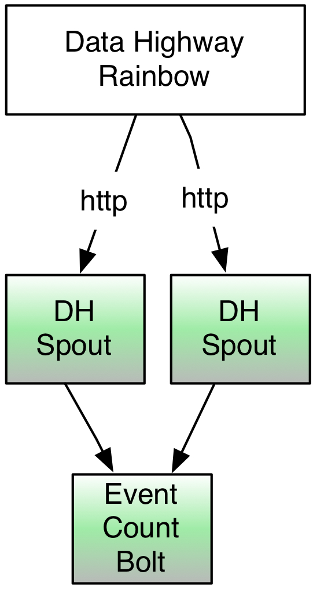

Counting Data Highway Events
============================

.. Status: first draft. Need more examples.

This tutorial shows you how to set up a Storm project on an OpenStack instance, launch it on the Grid cluster Ebony Red, and
then create events to alter the results of your project. You will also be using the Data Highway (DH) Rainbow spout,
a built-in Yahoo spout, to count DH Rainbow events. 

The diagram below shows how the DH Rainbow bolt gets data from the Data Highway and feeds it to the bolt that counts events.

Prerequisites
-------------

You should have completed the following:

- `Quick Start <../quickstart>`_ - You'll need a basic understanding of how Storm topologies are launched, listed, and killed.
- `On-Boarding <../onboarding>`_ - You'll need a topology that you requested when you on-boarded, which provides you with an environment in the Storm cluster.

Setting Up
----------

#. Log onto an OpenHouse instance.
#. Install the following ``yinst`` packages::

       yinst i yjava_jetty_core-9.2.1.v20140609_126
       yinst i yjava_yca-0.23.218 -br test
       yinst i mon_metrics_java -br quarantine

#. Clone the ``storm-contrib`` repository: git@git.corp.yahoo.com:storm/storm-contrib.git
   .. note:: We'll be using ``/src/main/java/com/yahoo/spout/http/rainbow/EventCountBolt.java``.
#. Change to ``storm-contrib``.
#. Build the package with Maven: ``mvn clean package``
#. Copy ``storm-contrib`` to Ebony Red: ``scp -r ../storm_contrib {user_name}@ebony-gw.red.ygrid.yahoo.com:~``

Defining Your Virtual Host
--------------------------

The virtual host URI should have the following syntax: ``http://<virtual_host>:<virtual_port>``
For example, if your topology name is ``mydemo`` and you were using the Ebony Red cluster,
your virtual host URI might be ``mydemo-ebonyred.ygrid.local:50701``.

#. Before you set the name and port of your virtual host, check the `Storm Data Highway Registry <http://twiki.corp.yahoo.com/view/Grid/SupportStormDHRegistry>`_
   to make sure that the  virtual host is not be used.
#. Add your virtual service URI using the following command::

       registry_client addvh  http://{topology_name}-ebonyred.ygrid.local:{unique_port:50600-50700}

Launching Your Storm Topology
-----------------------------

For our example, we will launch our sample topology with 2 machines and 2 spout instances:

#. Log onto the cluster Ebony Red (ebony-gw.red.ygrid.yahoo.com) or another non-production environment that you created a topology for.
#. Authenticate with ``kinit``: ``$ kinit {your_user_name}@Y.CORP.YAHOO.COM``
#. Change to ``storm-contrib/rainbow_spout_example/target/classes``.
#. Launch storm with the two spouts below. Replace ``{your_topology_name}`` with the topology name you requested during on-boarding::

       storm jar /home/y/lib/jars/rainbow_spout_example-jar-with-dependencies.jar com.yahoo.spout.http.rainbow.EventCountTopologyCompat run http://{your_topology_name}-ebonyred.ygrid.local:{port-specified-with-registry_client} -c topology.isolate.machines=2 -n {your_topology_name} -p 2 -c http.registry.uri='http://registry-a.red.ygrid.yahoo.com:4080/registry/v1/'

   The main difference between the topology name in this tutorial from that in the 
   quick start is that the topology here represents an instance on the Storm
   cluster as well as the name of the topology running.

.. Ex: storm jar /home/y/lib/jars/rainbow_spout_example-jar-with-dependencies.jar com.yahoo.spout.http.rainbow.EventCountTopologyCompat run http://RainbowSpoutTest-ebonyred.ygrid.local:50609/ -c topology.isolate.machines=2 -n RainbowSpoutTest -p 2 -c http.registry.uri='http://registry-a.red.ygrid.yahoo.com:4080/registry/v1/'
 
      
#. You can see your job running in the **Storm UI**. 
   The URL to the **Storm UI** depends on your
   environment. The URL syntax is ``http://{environment}-ni.{color}.ygrid.yahoo.com:9999``, so the
   URL to the **Storm UI** for Ebony Red is ``http://ebonyred-ni.red.ygrid.yahoo.com:9999``.

#. Click on your job and take a look at your spouts, bolts, the number of executors, tasks, and the topology
   configuration.

Injecting Sample Rainbow Events
-------------------------------

To inject events, we'll be using ``curl`` to enable communication with multiple spouts that we have launched.

#. The first use of ``curl`` is to get the host that is associated with your virtual host.

       curl http://registry-a.red.ygrid.yahoo.com:4080/registry/v1/virtualHost/{your_topology_name}-ebonyred.ygrid.local/ext/yahoo/yfor_config; echo; 
#. The output should look like the following where the value given to ``host`` is the machine that you will directing HTTP requests to::

       name {your_topology_name}-ebonyred.ygrid.local
       host gsrd453n02.red.ygrid.yahoo.com
       check-type none
       mode all-active
       ttl 30000

#. With the host above, you can then send a DH event to your topology (the ``/homes/afeng/dh_events`` directory has many test files to use for cURL calls):
   
       curl --data-binary @/homes/afeng/dh_events/out.prism.30 http://gsrd453n02.red.ygrid.yahoo.com:{port_specified_with_registry_client}

#. Go back to the `Storm UI <http://ebonyred-ni.red.ygrid.yahoo.com:9999>`_. You should see changes in the topology statistics as 
  

Killing Your Topology
---------------------

We recommend killing the topologies you create in tutorials to save Grid resources for others: ``$ storm kill {topology_name}``

Looking at the Code
-------------------

Spouts
######

This example uses the Rainbow DH spout that gets data from the Data Highway through the Registry Service.
The Registry Service requires YCA v2 authentication.  

In `EventCountTopology.java <https://git.corp.yahoo.com/storm/storm-contrib/blob/master/rainbow_spout_example/src/main/java/com/yahoo/spout/http/rainbow/EventCountTopology.java>`_,
the method ``runTopology`` creates the topology builder, sets the spot, and attaches the bolt before submitting the topology for execution.
Here we are using two workers and set credentials that were pushed by the method ``pushCreds``.

.. code-block:: java

   public void runTopology(URI serviceURI) throws Exception {
        TopologyBuilder builder = new TopologyBuilder();
        RainbowSpout s = new RainbowSpout(serviceURI, _byteBlobs, _allowedAppIds);
        s.setUseSSLEncryption(!_noSslEncryption);
        s.setEventQueueSize(_queueSize);
        s.setAcking(_acked);
        builder.setSpout("rainbow", s, _spoutParallel);
        builder.setBolt("count", new EventCountBolt(), 1).shuffleGrouping("rainbow");

        _conf.registerSerialization(AvroEventRecord.class,  KryoEventRecord.class);
        _conf.registerSerialization(ByteBlobEventRecord.class,  KryoEventRecord.class);

        if (_yamasApp != null) {
            _conf.registerMetricsConsumer(YamasMetricsConsumer.class, _yamasApp, 1);
        }
 
         if (_debug) {
            _conf.setDebug(true);
         }
 
        _conf.put(backtype.storm.Config.TOPOLOGY_SPREAD_COMPONENTS, Arrays.asList("rainbow"));
        _conf.setNumWorkers(2);

        SubmitOptions opts = new SubmitOptions(TopologyInitialStatus.ACTIVE);
        opts.set_creds(new Credentials(_creds));
        StormSubmitter.submitTopology(_topologyName, _conf, builder.createTopology(), opts);
    }

Bolts
#####

The `EventCountBolt.java <https://git.corp.yahoo.com/storm/storm-contrib/blob/master/rainbow_spout_example/src/main/java/com/yahoo/spout/http/rainbow/EventCountBolt.java>`_
extends the class ``BaseBasicBolt``, which is the simplest of the many built-in `Storm classes <http://nathanmarz.github.io/storm/doc-0.8.1/index.html>`_ for bolts. 

The ``execute`` method in our classes counts the number of records it receives from our spout and emits the value.
In a more real-life example, you would probably want to process the data from the spout and have the spout possibly emit results 
that could be further processed or written to an HBase or Hive table.

.. code-block:: java

   public void execute(Tuple tuple, BasicOutputCollector collector) {
        LOG.info("Received tuple " + tuple);
        AvroEventRecord rec = (AvroEventRecord)tuple.getValue(0);
        Object at = rec.getData();
        for (String part : path) {
            if (at instanceof GenericRecord) {
                at = ((GenericRecord)at).get(part);
            } else {
                LOG.error("Could not find "+Arrays.toString(path)+" inside "+rec.getData());
                return;
            }
        }
        if (at == null) {
            LOG.error("Could not find "+Arrays.toString(path)+" inside "+rec.getData());
            return;
        }
        String val = at.toString();
        int count = 0;
        if (counts.get(val) != null) {
            count = counts.get(val);
        }
        count++;
        counts.put(val, count);

        collector.emit(new Values(val, count));
    }

Next Steps
----------

- See `Programming Storm <../programming>`_ for more code examples.
