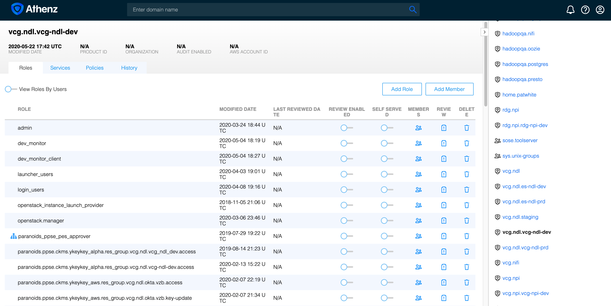
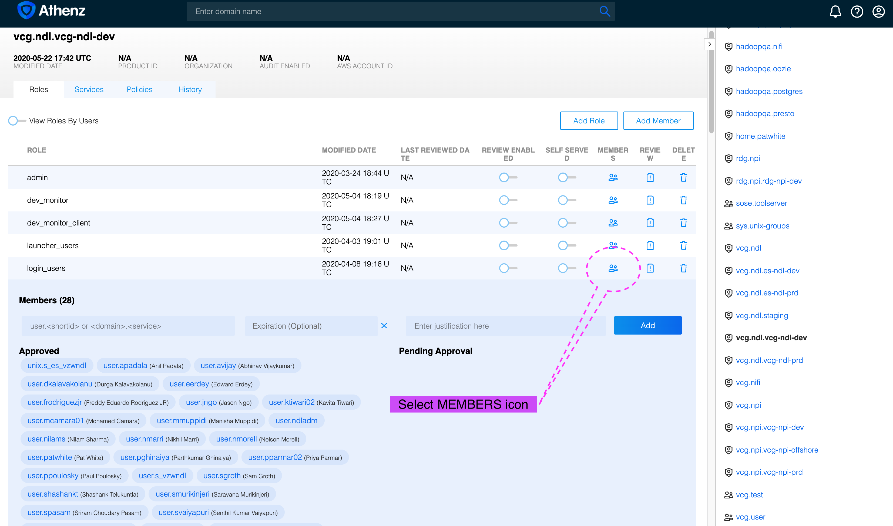
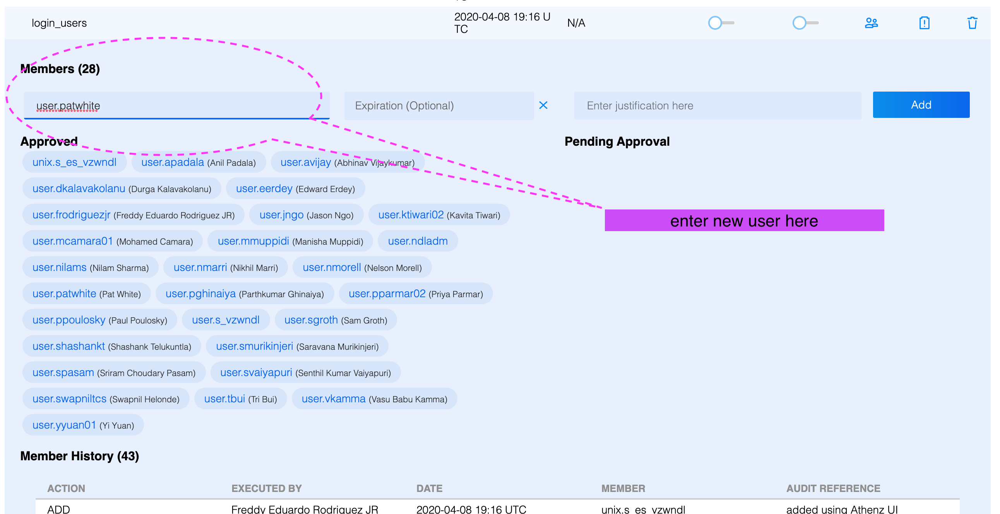
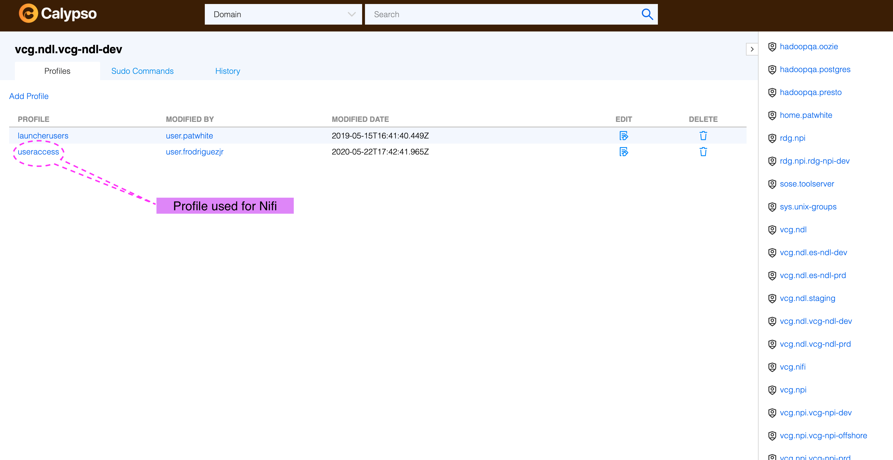
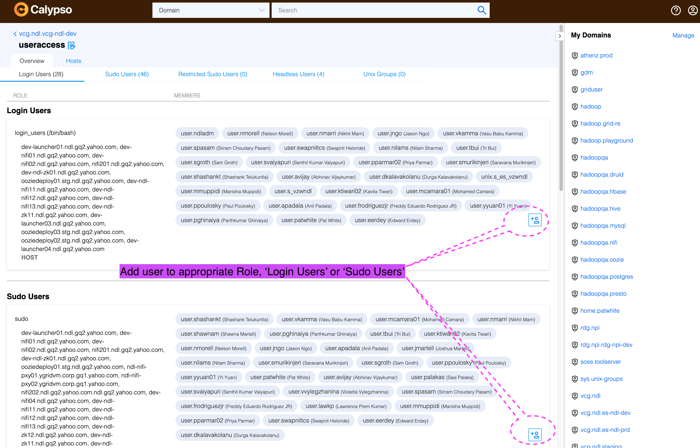
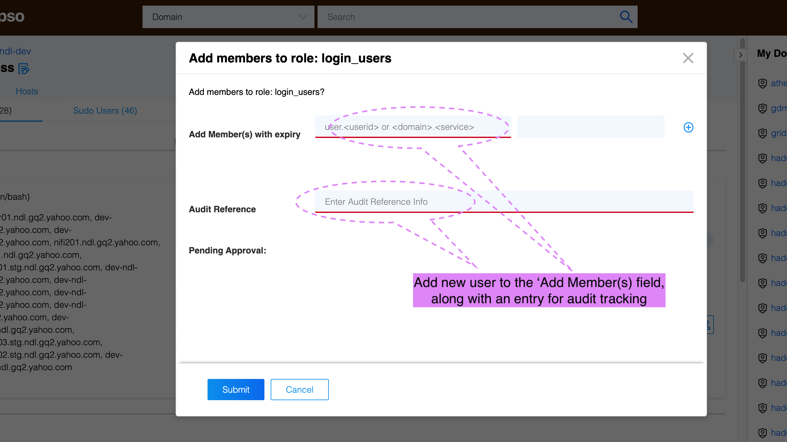

# How to Add Linux Users to the Nifi Project Nodes

This describes a process to add users to Nifi instances in VCG and RDG using Athenz and Calypso. Please note that these are node local system accounts, so they will provide access to the Nifi nodes (for example, ability to ssh into the node) but will not provide access to the Nifi application itself. For Nifi application access, please refer to:

  * [How to Add Nifi Users in the Nifi Application](https://git.ouroath.com/hadoop/docs/blob/master/internal/Nifi/AdminTasks/Add_users_to_nifi.md)

Also note that this process is not specific to Nifi itself, rather this is a general way to add local accounts for any nodes managed through Calypso.

## Create a Jira to track the work

* Have the requester create a jira in [Grid Nifi](https://jira.vzbuilders.com/projects/NIFI)

* In most cases a new user will need to be added here and in the Nifi Okta app, the same jira can be used for both

* Assign the jira to the appropriate project approver
  * Approvals per project are:

    PROJECT | Approvers
    ------- | ---------
    NDL | Tri (tri.bui@verizonmedia.com), Robert (edward.erdey@verizonmedia.com)
    NPI | Vadim (vadim.radzijevskij@verizonmedia.com), Manoj (manoj.kalikodanveetil@verizonmedia.com)
    VES | Don (don.plathottam@verizonwireless.com), Satya (satya.yandra@verizonmedia.com)

* Once approved, use the following steps to add user to the Calypso managed nodes

## Adding user to Athenz 

Athenz (yo/athenz) manages the node local user accounts through Athenz domain Roles. Within a domain, a variety of Roles establish user accounts, which are then pushed by Calypso. For VCG and RDG, the Athenz Role 'ums.useraccess' provides the base for accounts Calypso will use to managing users. Project teams create additional Roles depending on their own needs, however the basic approach used for Nifi is to add users needing priviledged access to either Role 'Admin' or Role 'sudo', and for standard users to another Role, a typical Role is called 'login_users'. 

* Existing Athenz domains, per project, are as follows:

  PROJECT|Environment|Athenz Domain
  -------|-----------|-------------
  NDL|Prd|vcg.ndl.vcg-ndl-prd
  NDL|Dev|vcg.ndl.vcg-ndl-dev
  NPI|Prd|vcg.npi.vcg-npi-prd
  NPI|Dev|vcg.npi.vcg-npi-dev
  VES|Dev|vcg.ves.vcg-ves-dev

* Ensure you have Admin access for the appropriate Athenz Domain, Role 'admin'. If you do not, please contact a Domain Admin.

* Obtain the user's VerizonMedia core ID, this should be searchable in the Employee Directory.

* Go to the Domain, for example NDL Dev [Athenz Nifi VCG for NDL Dev](https://ui.athenz.ouroath.com/domain/vcg.ndl.vcg-ndl-dev/role)

  * You should get something like this
    

* Select **MEMBER** icon from appropriate Role, for example if adding a user to Role 'login_users'
  

* In the expanded field, enter your new user in the field as shown below. For real users, use the format 'user.[USERID]', for example 'user.patwhite'. For headless users, be sure to use the format 'unix.[USERID]'. Then select the 'Add' button to commit the change. 
  

* The new user has been added in Athenz, now we need to add the user in Calypso. 

## Adding user to Calypso

Calypso is the Openstack team's tool that directly manages Openstack, VMs and BareMetal nodes. Calypso works from Athenz Domains as the source of truth, with the Calypso Profile used by Nifi as 'useraccess', this Profile associates with its corresponding Athenz Domain:Role. 

* Extending the previous example for Athenz domain 'vcg.ndl.vcg-ndl-dev', the Calypso UI looks like this: 
  

* Select Profile **useraccess** and you will see the following, similar as with the Athenz entry. Add your new user to the appropriate Role. For users needing standard rights, add the user to 'Login Users', for sudo add them to 'Sudo Users'; 
  

* In the dialog that opens, add your user's ID along with an audit entry, as noted in the following, and click 'Submit'.
  

* You have added the user to Calypso, allow some time for the changes to propogate out to the nodes, usually this takes about 15 minutes but may take longer. 
