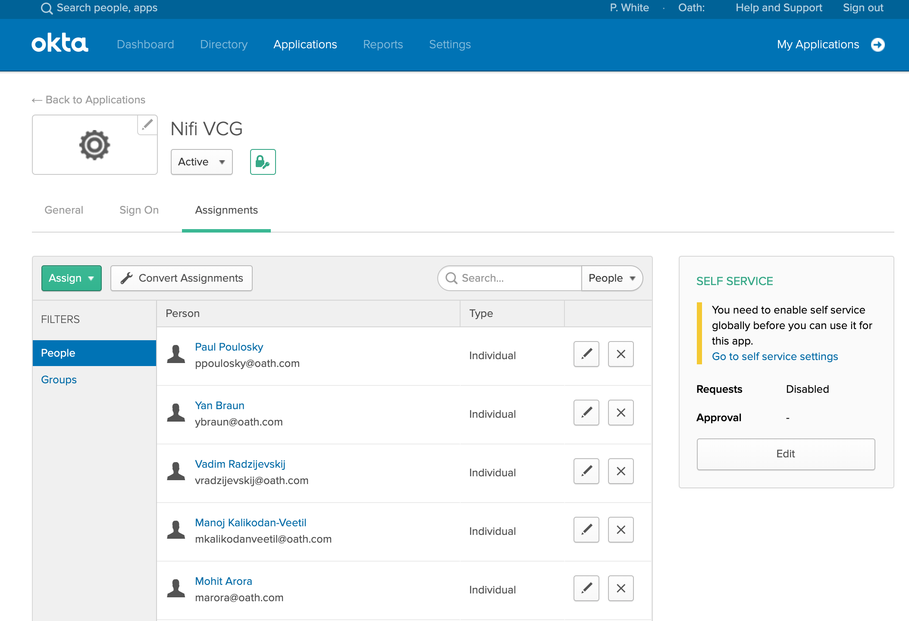
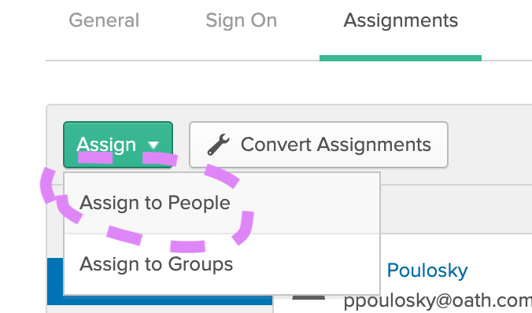
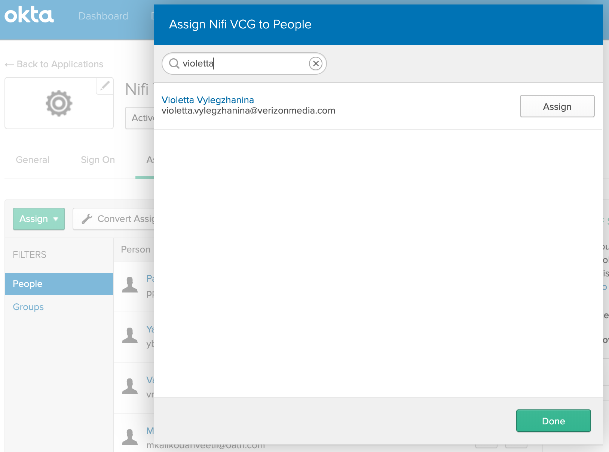
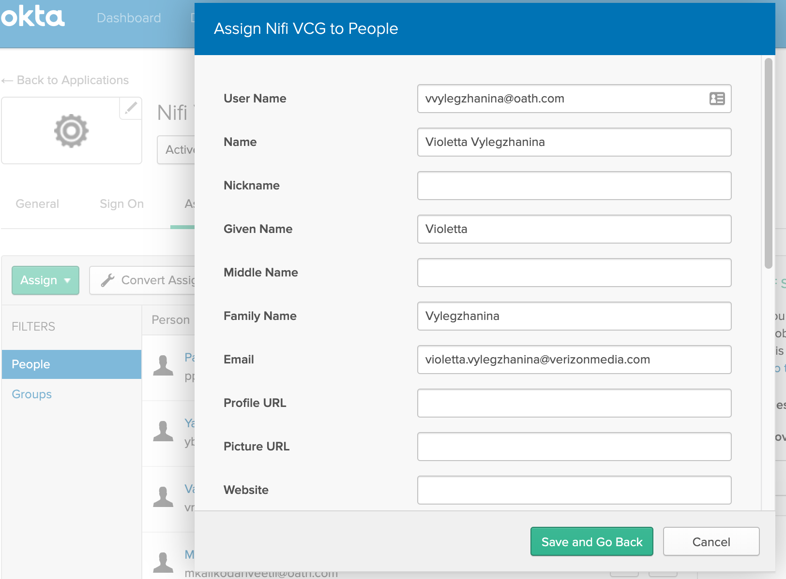
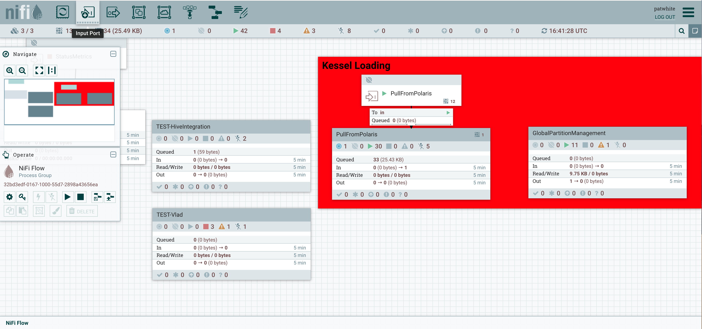
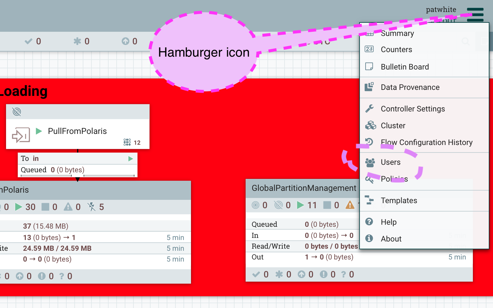
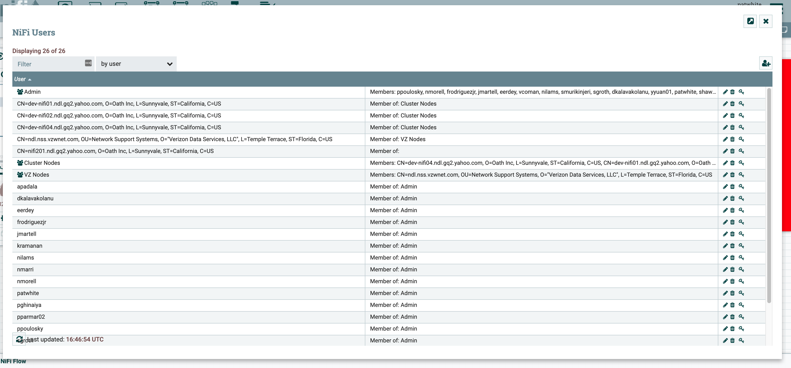
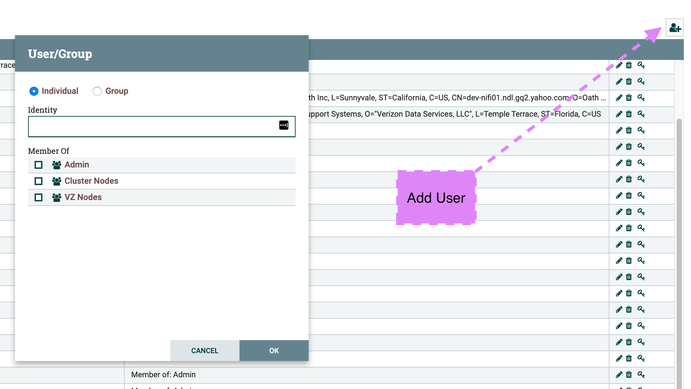
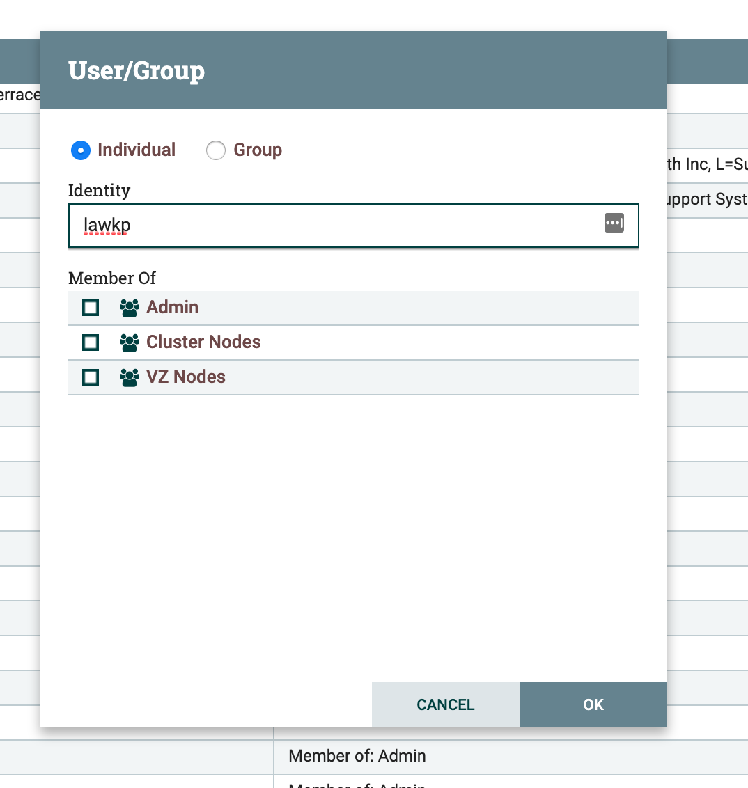
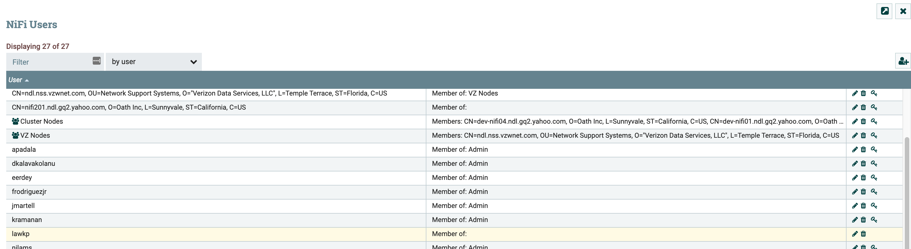

# How to Add Nifi Users in the Nifi Application

Overall process is to find the user's VerizonMedia id, for example mine is 'patwhite', and use that to add a given user to both the Nifi Okta application, as well as a user account in the Nifi service. This two-step process is required since migration to Okta, the user authentication is required to be done by Okta, and we also need the user to be added within Nifi, both are required.

* Please note, these steps give access to the Nifi canvas (GUI), and not to the Nifi system itself. In other words, there is an additional process, this process describes how to add a unix account for a give user:

  * [How to Add Linux Users to the Nifi Project Nodes](https://git.ouroath.com/hadoop/docs/blob/master/internal/Nifi/AdminTasks/Add_users_to_athenz_calypso.md)

* Have the requester create a jira in [Grid Nifi](https://jira.vzbuilders.com/projects/NIFI)
  * Example jiras for reference are [NIFI-145](https://jira.vzbuilders.com/projects/NIFI/issues/NIFI-145) and [NIFI-148](https://jira.vzbuilders.com/projects/NIFI/issues/NIFI-148)

* In some cases a new user will need node access, as described here, as well as access in the Nifi app. In that case the same jira can be used for both actions, as long the jira described the need for both, access to the Nifi nodes and to Nifi itself.

* Assign the jira to the appropriate project approver
  * Approvals per project are:

    PROJECT | Approvers
    ------- | ---------
    NDL | Tri (tri.bui@verizonmedia.com), Robert (edward.erdey@verizonmedia.com)
    NPI | Vadim (vadim.radzijevskij@verizonmedia.com), Manoj (manoj.kalikodanveetil@verizonmedia.com)
    VES | Don (don.plathottam@verizonwireless.com), Satya (satya.yandra@verizonmedia.com)

* Once approved, use the following steps to add user to Okta app and Nifi app

## Adding user to Okta App

* Ensure you have Admin access for the Nifi Okta App 'VCG Nifi'. If you do not, please contact patwhite.

* Obtain the user's VerizonMedia core ID, this should be searchable in the Employee Directory or possibly by lookup in the Okta App itself.

* Open the Nifi Okta app [Nifi VCG](https://oath-admin.okta.com/admin/app/oidc_client/instance/0oabo5cy3mR7rew8S1t7/#tab-assignments)

  * You should get something like this
    

* Select **Assign to People** from the pulldown
  

* In the dialog that opens, search for your user. Example, entering 'violetta' brings up a match
  

* Select **Assign** will bring up the user's info, select **Save and Go Back**
  

* Select **Done** and you will be back at the original screen, where you can verify your user is added by scrolling down the 'Person' column

* You have added the user to the Okta app and can close the browser tab

## Adding user to Nifi App

* Ensure you have Admin access for the Nifi instance the user is requesting
  * Nifi instances and their Okta frontend access links are [listed here](https://docs.google.com/document/d/1pIBkHN7LWe0sNZd-Hl8yEJf21gB4U1YHq9r83-rn8GU)

* Go to the Nifi instance canvas (GUI)
  * Example, NDL team [dev cluster](https://ndl-nifi-pxy01.ygridvm.corp.gq1.yahoo.com:4443/nifi)
    

* Select the 'hamburger' pulldown in the upper right corner
  

* Select **Users** and you should see the user and group listing
  

* Select the **add-user icon** in the upper right area, as seen below, and you will get the 'User/Group' dialog
  

* Enter your user's VerizonMedia id in the 'User/Group' dialog's **Identity** field
  Example, adding Lawrence here
  

* Note, there may be additional qualifiers depending on the project team instances you are working on, for example the user may have 'Admin' accesss, and will require checking the *Admin* box. Cases like this will need to be discussed with the person making the request and the project approvers listed above.

* select **Ok** and you should see your user is now in the list. Note, for a busy cluster, this update may take up to a minute or more.
  

# How to Add Linux Users to the Nifi Project Nodes

* Please refer to the following for adding Linux accounts on Nifi nodes:
  * [How to Add Linux Users to the Nifi Project Nodes](https://git.ouroath.com/hadoop/docs/blob/master/internal/Nifi/AdminTasks/Add_users_to_athenz_calypso.md)
